# チュートリアル:Power BI Desktop での計算列の作成

分析しているデータに、必要とする結果の取得に必要な特定のフィールドが含まれていない場合があります。 ここで、"*計算列*" が登場します。 計算列では、Data Analysis Expressions (DAX) 式を使用して列の値を定義して、異なる 2 つの列のテキスト値をまとめたり、他の値から数値を計算したりできます。 たとえば、データに **[都道府県]** フィールドと **[市区町村]** フィールドがあるときに、その両方 (例: "東京都新宿区") を含む **[場所]** フィールドが必要であるとします。 これこそまさに計算列の目的です。

計算列は、どちらも DAX 式に基づいているという点で[メジャー](desktop-tutorial-create-measures.md)に似ていますが、使用方法は異なります。 多くの場合、メジャーは、グラフの**値**の領域で使用され、他のフィールドに基づいて結果を計算します。 計算列は、グラフの行、軸、凡例、およびグループの領域で、新しい**フィールド**として使用されます。

このチュートリアルでは、計算列とは何かを理解した後、計算列を作成して Power BI Desktop でレポートをグラフ化するために使用する手順を紹介します。 

### 前提条件
- このチュートリアルは、Power BI Desktop を使用して高度なモデルを作成することに既に慣れている Power BI ユーザー向けに書かれています。 **データの取得**方法と、**Power Query エディター**でのデータのインポート、複数の関連テーブルの操作、およびレポート キャンバスへのフィールドの追加方法を既に習熟している必要があります。 Power BI Desktop を新しく使い始めたユーザーの場合は、まず「[Power BI Desktop の概要](desktop-getting-started.md)」をお読みください。
  
- このチュートリアルでは、[Contoso Sales Sample for Power BI Desktop](http://download.microsoft.com/download/4/6/A/46AB5E74-50F6-4761-8EDB-5AE077FD603C/Contoso%20Sales%20Sample%20for%20Power%20BI%20Desktop.zip) を使用します。これは、「[チュートリアル: Power BI Desktop で独自のメジャーを作成する](desktop-tutorial-create-measures.md)」で使用されるのと同じサンプルです。 この Contoso, inc. という架空の会社の売上データはデータベースからインポートされたため、データ ソースに接続したり、Power Query エディターで表示したりすることはできません。 このファイルをコンピューターにダウンロードした後、Power BI Desktop で開いてください。

## 関連するテーブルの値を使用する計算列を作成する

売上レポートに、製品カテゴリと製品サブカテゴリを単一の値として表示するとします ("携帯電話 – アクセサリ"、"携帯電話 – スマートフォンと PDA" など)。 このデータを提供するフィールドは **[フィールド]** の一覧には存在しませんが、**ProductCategory** フィールドと **ProductSubcategory** フィールドは存在し、それぞれが独自のテーブルに含まれています。 これら 2 つの列の値を結合する計算列を作成できます。 DAX 式は既存のモデルのパワーを最大限活用することができます。これには、既に存在する異なるテーブル間のリレーションシップも含まれます。 

 ![[フィールド] の一覧の列](media/desktop-tutorial-create-calculated-columns/create1.png)

1.  **[その他のオプション]** (...) を選択するか、[フィールド] の一覧の **ProductSubcategory** テーブルを右クリックした後、**[新しい列]** を選択します。 これにより、ProductSubcategory テーブル内に新しい列が作成されます。
    
    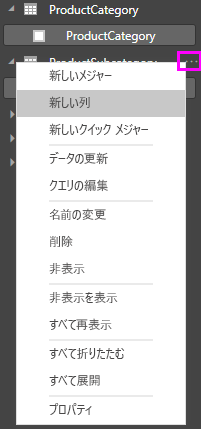
    
    レポート キャンバスの上部に数式バーが表示されます。数式バーで、列の名前を指定し、DAX 式を入力できます。
    
    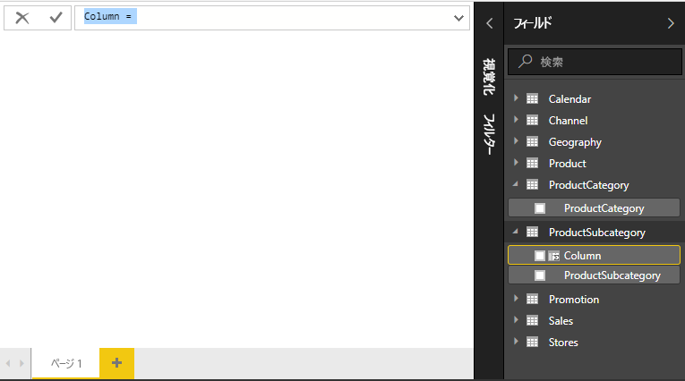
    
2.  既定では、新しい計算列の名前は、単に Column になります。 名前を変更しない場合、追加される新しい列には、Column 2、Column 3 ... のように名前が付けられます。 列を識別しやすくします。**Column** という名前は既に数式バーに強調表示されているため、「**ProductFullCategory**」と入力して名前を変更し、続けて等号(**=**) を入力します。
    
3.  新しい列の値は ProductCategory 名から始まるようにします。 この列は異なる (しかし関連する) テーブルにあるため、[RELATED](https://msdn.microsoft.com/library/ee634202.aspx) 関数を使用して取得できます。
    
    等号の後ろに、「**r**」と入力します。 ドロップダウン表示される候補リストには、R で始まるすべての DAX 関数が含まれています。各関数を選択すると、その効果の説明が表示されます。 入力を続けると、候補リストが絞られ、必要な関数が表示されます。 **RELATED** を選択し、**Enter** キーを押します。
    
    
    
    左丸かっこ、RELATED 関数に渡すことができる関連する列の候補リスト、および必要なパラメーターの説明と詳細が表示されます。 
    
    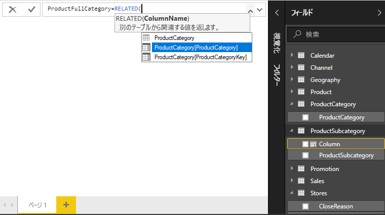
    
4.  必要なのは **ProductCategory** テーブル内の **ProductCategory** 列です。 **ProductCategory[ProductCategory]** を選択し、**Enter**キーを押した後、右丸かっこを入力します。
    
    > [!TIP]
    > 最も多く発生する構文エラーは、右丸かっこの入力漏れか入力位置の間違いですが、Power BI Desktop が右丸かっこを追加してくれる場合があります。
    
4. 新しい値ではダッシュとスペースを使用して ProductCategories と ProductSubcategories を区切るため、最初の式の右丸かっこの後ろに、スペース、アンパサンド (**&**)、二重引用符 (**"**)、スペース、ダッシュ (**-**)、スペース、二重引用符、アンパサンドを続けて入力します。 数式は、次のようになるはずです。
    
    `ProductFullCategory = RELATED(ProductCategory[ProductCategory]) & " - " &`
    
    > [!TIP]
    > 入力領域が狭い場合は、数式バーの右側にある下向きのシェブロンをクリックすると、数式エディターが広がります。 エディターで、**Alt + Enter** キー を押して下の行に移動し、**Tab** キーを押して文字列を移動します。
    
5.  左角かっこ (**[**) を入力し、**[ProductSubcategory]** 列を選択して、数式を完了します。 
    
    
    
    このテーブル内に計算列を作成しているため、2 番目の式では、別の RELATED 関数を使用して ProductSubcategory テーブルを呼び出す 必要はありません。 [ProductCategory] は、テーブル名とともに入力することも (完全修飾)、テーブル名を省略して入力することもできます (非修飾)。
    
6.  **Enter** を押すか、数式バーのチェック マークをクリックして、数式を完成させます。 数式が検証され、[フィールド] の一覧の **ProductSubcategory** テーブル内に 列名 **ProductFullCategory** が表示されます。 
    
    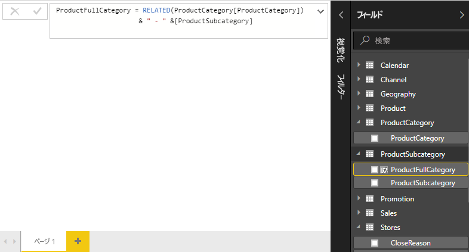
    
    >[!NOTE]
    >Power BI Desktop では、計算列は特殊なアイコン付きで [フィールド] の一覧に表示され、数式が含まれていることが示されます。 Power BI サービス (Power BI サイト) には数式を変更する方法がないため、計算列にアイコンは表示されません。
    
## レポートで新しい列を使用する

これで、ProductFullCategory 列を使用して、ProductFullCategory 別の SalesAmount を調べることができます。

1. **ProductSubcategory** テーブルの **ProductFullCategory** 列を選択するかレポート キャンバスにドラッグして、すべての ProductFullCategory 名を示すテーブルを作成します。
   
   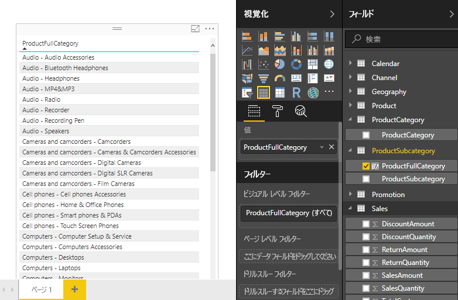
    
2. **Sales** テーブルの **SalesAmount** フィールドを選択するかテーブルにドラッグして、各製品カテゴリの売上金額を表示します。
   
   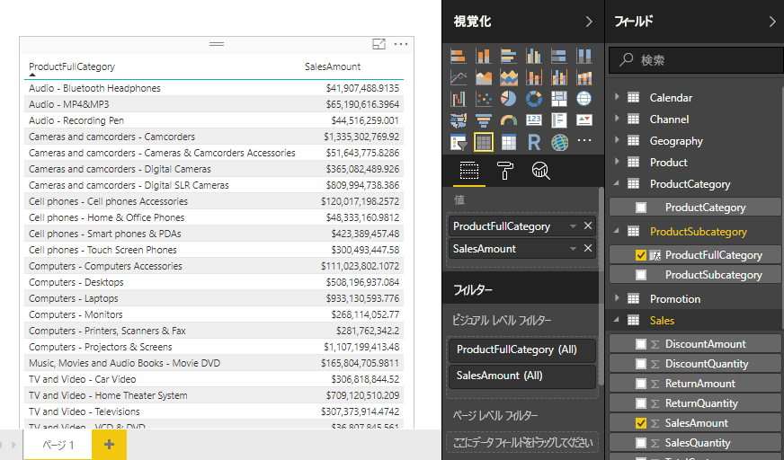
    
## IF 関数を使用する計算列を作成する

Contoso Sales のサンプルには、アクティブな店舗と非アクティブな店舗の両方の販売データが含まれています。 レポート内でアクティブな店舗の売上と非アクティブな店舗の売上を明確に区別するために、Active StoreName フィールドを作成します。 新しい Active StoreName 計算列では、アクティブな店舗は店舗の完全名と共に表示され、非アクティブな店舗は "Inactive" としてグループ化されます。 

さいわい、Stores テーブルには **Status** という名前の列があり、値としてアクティブな店舗には "On" が、非アクティブ な店舗には "Off" が設定されています。この列を使用して、新しい Active StoreName 列の値を作成できます。 DAX 式では、論理関数 [IF](https://msdn.microsoft.com/library/ee634824.aspx) を使用して、各店舗の Staus を調べて、結果に応じて特定の値を返します。 店舗の Status が "On" の場合、数式は店舗の名前を返します。 "Off" の場合、数式は、Active StoreName に "Inactive" を割り当てます。 

1.  **Stores** テーブルに新しい計算列を作成し、数式バーで **Active StoreName** という名前を付けます。
    
2.  **=** の後ろに、**IF**と入力することから始めます。 追加できる項目が候補リストに表示されます。 **[IF]** を選択します。
    
    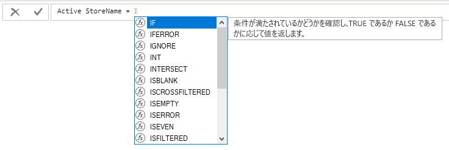
    
3.  IF の最初の引数は、店舗の Status が "On" かどうかを調べる論理テストです。 左角かっこ (**[**) を入力します。これにより、Stores テーブルの列が表示されます。**Status** を選択します。
    
    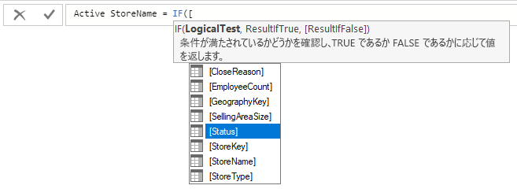
    
4.  **Status** の直後に、**="On"** を入力した後コンマ (**,**) を入力して引数を終了します。 ツールヒントに、結果が TRUE の場合に返される値を追加する必要があることが指示されます。
    
    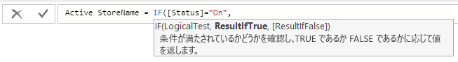
    
5.  店舗の Status が "On" であれば、店舗の名前を表示するように設定します。 左角かっこ (**[**) を入力し、**StoreName** 列を選択した後、コンマを入力します。 ツールヒントに、結果が FALSE の場合に返される値を追加する必要があることが指示されます。 
    
    
    
6.  値を *Inactive* にするため、**"Inactive"** と入力し、**Enter** キーを押すか、数式バーのチェックマークを選択して、数式を完成させます。 数式が検証され、新しい列の名前が **Stores**テーブルの [フィールド] の一覧に表示されます。
    
    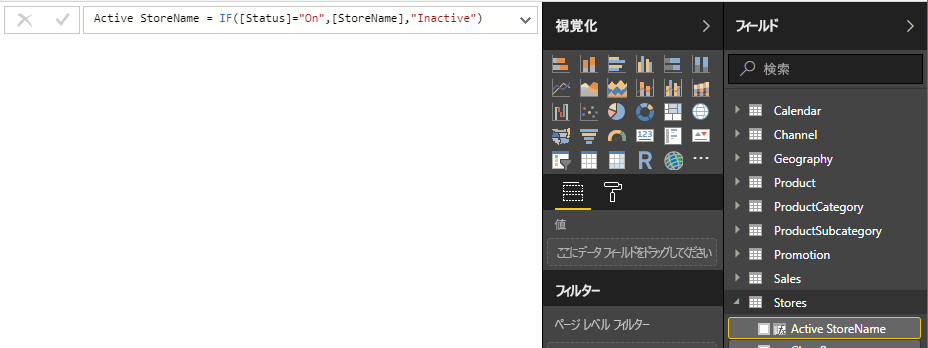
    
8.  新しい Active StoreName 列は、他のフィールドと同じようにグラフ化で使用できます。 SalesAmounts を Active StoreName 別に表示するには、**Active StoreName** フィールドを選択するかキャンバスにドラッグした後、**SalesAmount** フィールドを選択するかテーブルにドラッグします。 この表では、アクティブな店舗は名前によって個別に表示されますが、非アクティブな店舗は最後に *Inactive* としてグループ化されます。 
    
    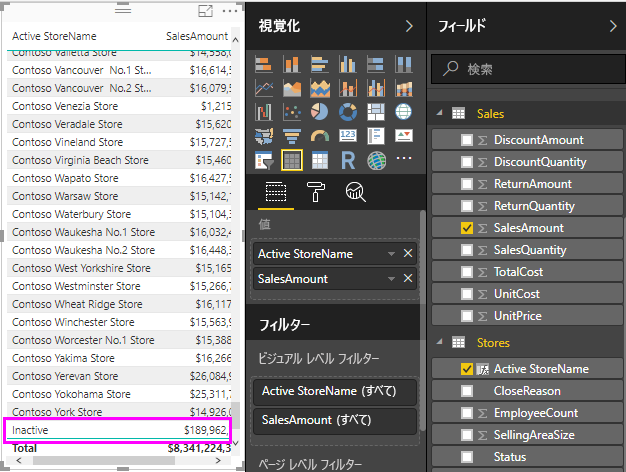
    
## 学習した内容
計算列によって、データを充実させ、より簡単に分析情報が得ることができます。 計算列を [フィールド] の一覧と数式バーを使用して作成する方法、候補リストとツールヒントを使用して数式を作成する方法、RELATED や IF などの DAX 関数を適切な引数を指定して呼び出す方法、およびレポートのグラフ化で計算式を使用する方法について学習しました。

## 次の手順
DAX の数式についてさらに詳しく知りたい場合や、さらに高度な DAX の数式で計算列を作成する場合は、「[Power BI Desktop における DAX の基本事項](desktop-quickstart-learn-dax-basics.md)」をご覧ください。 この記事では、構文、関数、およびコンテキストの詳しい理解など、DAX の基本的な概念について説明します。

また、「[Data Analysis Expressions (DAX) リファレンス](https://msdn.microsoft.com/library/gg413422.aspx)」を、ぜひお気に入りに追加してください。 DAX の構文、演算子、および 200 種類を超える DAX 関数について詳細を調べることができます。

