# チュートリアル: Power BI Desktop で独自のメジャーを作成する
Power BI Desktop でメジャーを使用すると、強力なデータ分析ソリューションを作成できます。 メジャーは、ユーザーがレポートで操作するデータに対して計算を実行するために役立ちます。 このチュートリアルでは、メジャーの基本について説明し、独自のメジャーを Power BI Desktop で作成する手順を紹介します。

### 前提条件
- このチュートリアルは、Power BI Desktop を使用して高度なモデルを作成することに既に慣れている Power BI ユーザー向けに書かれています。 [データの取得] とクエリ エディターを使用してデータをインポートする操作、複数の関連したテーブルを取り扱う操作、およびレポート キャンバスにフィールドを追加する操作に既に習熟している必要があります。 Power BI Desktop を新しく使い始めたユーザーの場合は、まず「[Power BI Desktop の概要](desktop-getting-started.md)」をお読みください。
  
- [Contoso Sales Sample for Power BI Desktop](http://download.microsoft.com/download/4/6/A/46AB5E74-50F6-4761-8EDB-5AE077FD603C/Contoso%20Sales%20Sample%20for%20Power%20BI%20Desktop.zip) ファイルをダウンロードしてください。このファイルには、Contoso, inc. という架空の会社のオンライン売上データが既に含まれています。このデータはデータベースからインポートしたものであるため、データソースに接続したり、クエリ エディターで表示したりすることはできません。 自分のコンピューターに独自のファイルがある場合は、そのファイルを Power BI Desktop で開いてください。

## メジャーの概要

ほとんどの場合、メジャーは自動的に作成されます。 Contoso Sales Sample ファイルで、**Sales** テーブルの [フィールド] ウェルの **SalesAmount** フィールドの横にあるチェックボックスをオンにするか、**SalesAmount** をレポート キャンバスにドラッグします。 新しい縦棒グラフの視覚化が表示され、Sales テーブルの SalesAmount 列のすべての値を合計した値が表示されます。

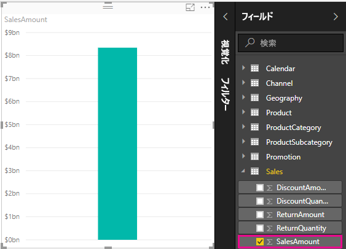

[フィールド] ウェルにシグマ アイコン  が表示されるフィールドは数値であり、その値は集計できます。 Power BI Desktop では 200 万行の SalesAmount 値があるテーブルを表示するのではなく、数値データ型を検出し、メジャーを自動的に作成して計算し、データを集計しました。 合計は数値データ型の既定の集計ですが、平均やカウントなど、異なる集計を簡単に適用できます。 メジャーはすべて何らかの種類の集計を実行するので、集計について理解することは、メジャーについて理解することの土台になります。 

[視覚化] ウィンドウの **[値]** 領域でグラフの集計から平均に変更するには、**SalesAmount** の横にある下矢印をクリックし、**[平均]** を選択します。 視覚化グラフは、SalesAmount フィールド内のすべての売上値の平均に変わります。

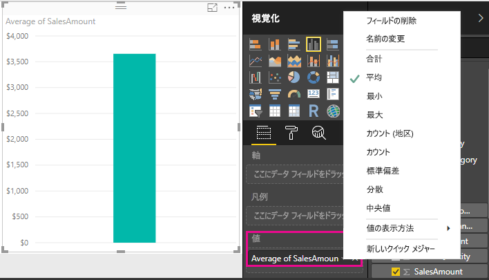

集計の種類は、必要な結果に応じて変更できます。ただし、集計のすべての種類が数値データ型に適しているとは限りません。 たとえば、SalesAmount フィールドの合計と平均は意味をなします。 最小値と最大値にも意味があります。 しかし、カウントは SalesAmount フィールドではあまり意味をなしません。このフィールドの値は数値ですが、実際には金額だからです。

メジャーから計算される値は、ユーザーのレポート操作に合わせて変化します。 たとえば、**Geography** テーブルから **RegionCountryName** フィールドをグラフにドラッグした場合、各国の売上金額の平均が計算されて表示されます。

ユーザーがレポートを操作した結果としてメジャーが変化した場合は、ユーザーがそのメジャーの *コンテキスト*に影響を与えたことになります。 ユーザーがレポートの視覚化を操作するたびにコンテキストが変更され、メジャーは結果を計算して表示します。

## 独自のメジャーの作成と使用

ほとんどの場合、Power BI は選択したフィールドや集計の種類に応じて自動的に値を計算して返しますが、場合によっては、独自のメジャーを作成し、より複雑で固有の計算を実行することもできます。 Power BI Desktop では、Data Analysis Expressions (DAX) 数式言語を使用して独自のメジャーを作成できます。 

DAX の数式では、Excel の数式と同じ関数、演算子、および構文を多数使用しています。 ただし、DAX の関数は、リレーショナル データを処理し、ユーザーがレポートを操作するのに合わせて動的に計算を実行するように設計されています。 200 種類を超える DAX 関数は、Sum や Average などの簡単な集計から、さらに複雑な統計関数やフィルター処理関数まで、あらゆる処理を実行できます。 DAX の理解を深めるために役立つリソースは多数あります。 このチュートリアルを終えた後は、「[Power BI Desktop における DAX の基本事項](desktop-quickstart-learn-dax-basics.md)」をぜひお読みください。

独自のメジャーを作成すると、選択したテーブルの [フィールド] リストに追加されます。これは*モデル* メジャーと呼ばれます。 メジャー モデルの利点として、任意の必要なものに名前を付けて識別しやすくすることができる、他の DAX 式の引数として使用できる、複雑な計算を非常に高速に実行できるなどがあります。

>[!TIP]
>Power BI Desktop の 2018 年 2 月のリリースから、ダイアログ ボックスへの入力に基づいて DAX 式が自動的に入力される**クイック メジャー**で、利用できる一般的な計算が多数増えました。 迅速で強力な計算なので、DAX の学習や、独自のカスタマイズしたメジャーのシード処理にも役立ちます。 クイック メジャーを作成または探索するには、テーブルの **[その他のオプション]** リスト、またはリボンの [ホーム] タブの **[計算]** にある **[新しいクイック メジャー]** を選択します。 クイック メジャーの作成と使用の詳細については、「[クイック メジャーを使用して一般的で強力な計算を簡単に実行する](desktop-quick-measures.md)」を参照してください。

### メジャーを作成する

総売上金額から割引と返品を差し引いて純売上高を分析したいとします。 視覚化にどのようなコンテキストが存在する場合でも、SalesAmount の合計から DiscountAmount と ReturnAmount の合計を差し引くメジャーが必要です。 [フィールド] リストに純売上高のフィールドはありませんが、純売上高を計算する独自のメジャーを作成するための構成要素はあります。 

1.  [フィールド] ウェルの **Sales** テーブルを右クリックするか、テーブルにマウス カーソルを移動し、**[その他のオプション]** の省略記号 ([...])、**[新しいメジャー]** の順に選択します。 これで新しいメジャーが Sales テーブル内に保存され、見つけやすくなります。
    
    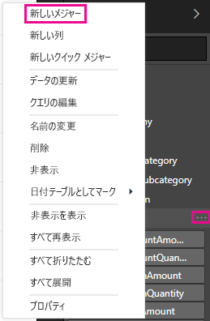
    
    Power BI Desktop リボンの [ホーム] タブにある [計算] グループの **[新しいメジャー]** を選択して、新しいメジャーを作成することもできます。
    
    ![リボンの [新しいメジャー]](media/desktop-tutorial-create-measures/meastut_netsales_newmeasureribbon.png)
    
    >[!TIP]
    >メジャーをリボンから作成すると、どのテーブルでもメジャーを作成できますが、使用する予定の場所にメジャーを作成すると見つけやすくなります。 この場合、まず Sales テーブルを選択してアクティブにし、**[新しいメジャー]** を選択します。 
    
    レポート キャンバスの上部に数式バーが表示されます。数式バーでは、メジャーの名前を変更し、DAX 式を入力できます。
    
    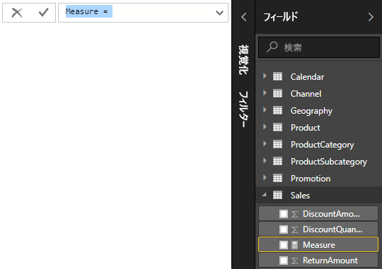
    
2.  新しいメジャーの既定の名前は "Measure" です。 名前を変更しない場合、新しいメジャーを追加すると Measure 2、Measure 3 などの名前になります。 メジャーを識別しやすくするために、数式バーで **[メジャー]** を強調表示し、「**Net Sales**」と入力します。
    
3.  これで、数式の入力を開始できます。 等号に続けて「**Sum**」と入力します。 入力すると、ドロップダウン候補リストに、入力した文字で始まるすべての DAX 関数が表示されます。 必要に応じて下にスクロールしてリストから **[SUM]** を選択し、Enter キーを押します。
    
    ![[SUM] の選択](media/desktop-tutorial-create-measures/meastut_netsales_newmeasure_formula_s.png)
    
    始めかっこが表示され、別のドロップダウン候補リストに、SUM 関数に渡すことのできるすべての列が表示されます。
    
    
    
    式は、常に、始めかっこと終わりかっこの間に入ります。 式には SUM 関数に渡す 1 つの引数 (SalesAmount 列) が含まれます。 リストに 1 つの値 "Sales (SalesAmount)" が残るまで、「SalesAmount」と入力します。 テーブル名の前にある列名は、列の*完全修飾名*と呼ばれます。 列の完全修飾名を使用すると、式を読みやすくなります。 
    
    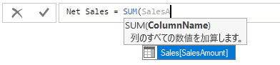
    
4. **Sales[SalesAmount]** を選択し、終わりかっこを入力します。
    
    > [!TIP]
    > 構文エラーが最も発生しやすいケースは、終わりかっこの入力漏れか、入力位置の間違いです。
    
    
    
5.  他の 2 つの列を減算するには:
    1. 最初の式の終わりかっこの後に、スペース、マイナス演算子 (**-**)、もう 1 つスペースの順に入力します。 
    2. もう 1 つの SUM 関数を入力し、**Sales[DiscountAmount]** 列が引数として選択できるようになるまで「DiscountAmount」と入力します。 閉じかっこを追加します。 
    3. スペース、もう 1 つのマイナス演算子、スペース、**Sales[ReturnAmount]** を引数とするもう 1 つの SUM 関数、閉じかっこの順に入力します。
    
    
    
6.  Enter キーを押すか、数式バーにあるチェック マークをクリックして入力を完了し、数式を検証します。 検証されたメジャーは、Sales テーブルの [フィールド] リストで使用できるようになります。 
    
    ![[フィールド] リストのメジャー](media/desktop-tutorial-create-measures/meastut_netsales_newmeasure_complete.png)
    
数式を入力する領域が足りなくなった場合や、複数行に分けたい場合は、数式バーの右側にある下向きのシェブロンを選択して、領域を広げます。

**Alt キーを押しながら Enter** キーを押して数式を複数行に分けるか、**Tab** キーを使用して配置を移動することができます。

### レポートでメジャーを使用する
これで、Net Sales メジャーをレポート キャンバスに追加し、レポートに他の任意のフィールドを追加して純売上高を計算できるようになりました。 国別の純売上高を表示するには:

1. **Net Sales** メジャーを **Sales** テーブルから選択するか、レポート キャンバスにドラッグします。
    
2. **RegionCountryName** フィールドを **Geography** テーブルから選択するか、グラフにドラッグします。
    
    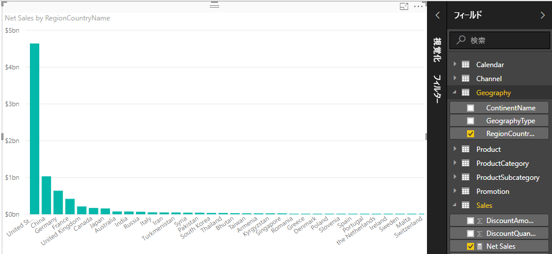
    
純売上高と売上高の差異を国別に表示するには、**SalesAmount** フィールドを選択するか、グラフにドラッグします。 

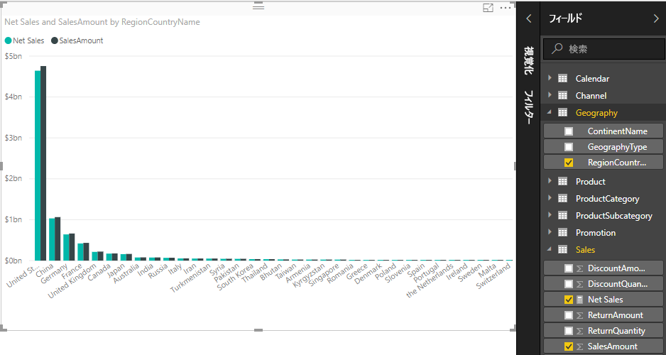

グラフには、自動的に合計された SalesAmount と、作成した Net Sales メジャーの 2 つのメジャーが使用されるようになりました。 各メジャーは別フィールド RegionCountryName のコンテキストで計算されました。
    
### スライサーでメジャーを使用する

スライサーを追加して、純売上高と売上高を、カレンダー年でさらにフィルター処理することができます。
    
1.  グラフの横に空白の領域をクリックしてから、**[視覚化]** で **[テーブル]** 視覚化を選択します。 これで、空白のテーブルの視覚化がレポート キャンバスに作成されます。
    
    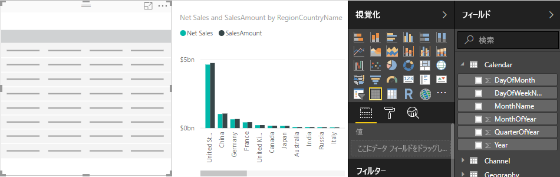
    
2.  **Year** フィールドを **Calendar** テーブルから新しい空白のテーブルの視覚化にドラッグします。 Year は数値フィールドなので、Power BI Desktop で値は合計されますが、集計としては意味がありません。 
    
    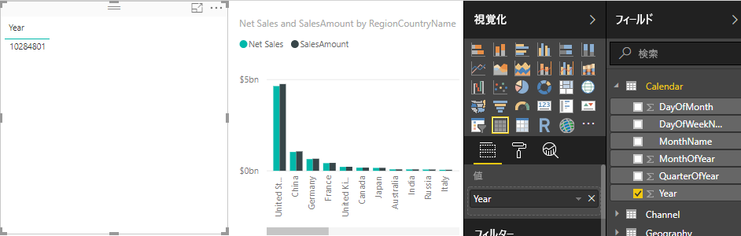
    
3.  [視覚化] ウィンドウの **[値]** で、**Year** の横にある下矢印を選択し、**[集計しない]** を選択します。 テーブルに個々の年が表示されるようになります。
    
    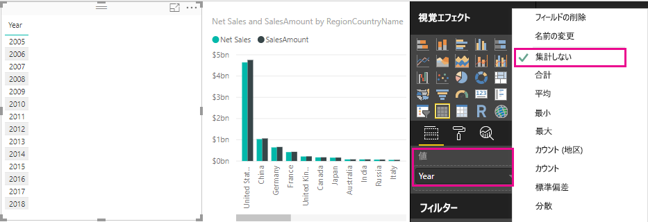
    
4.  [視覚化] ウィンドウで **[スライサー]** アイコンを選択して、テーブルをスライサーに変換します。

    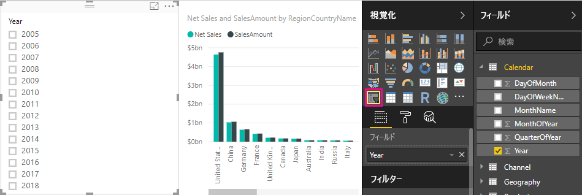
    
5.  **Year** スライサーで任意の値を選択すると、それに従って**国別の売上高と純売上高**グラフがフィルター処理されます。 選択した Year フィールドのコンテキストで Net Sales メジャーと SalesAmount メジャーが再計算され、結果が表示されます。 
    
    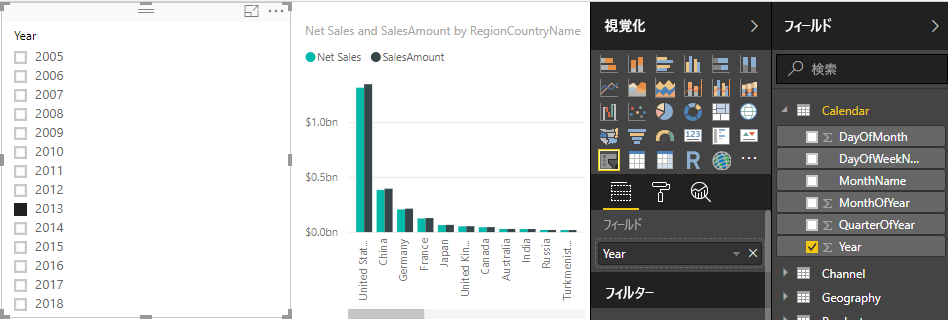

### 作成したメジャーを別のメジャーで使用する

販売単位あたりの純売上型単価が最も高い製品を知りたい場合は、純売上高を販売単位数で除算するメジャーが必要です。 この場合、Net Sales メジャーの結果を Sales[SalesQuantity] の合計で除算する新しいメジャーを作成することができます。

1.  **Net Sales per Unit** という名前の新しいメジャーを、Sales テーブルに作成します。
    
2.  数式バーに「**Net Sales**」と入力します。 追加できる項目が候補リストに表示されます。 **[Net Sales]** を選択します。
    
    
    
    また、始め角かっこ (**[**) を入力するだけで、メジャーを参照することもできます。 候補リストには、数式に追加できるメジャーのみが表示されます。
    
    
    
3.  スペース、除算演算子 (**/**)、もう 1 つのスペース、SUM 関数の順に入力し、「**Quantity**」と入力します。 候補リストに、名前に「Quantity」が含まれるすべての列が表示されます。 **Sales[SalesQuantity]** を選択し、閉じかっこを入力し、Enter キーを押すか、チェックマークを選択して数式を検証します。 数式は、次のようになるはずです。
    
    `Net Sales per Unit = [Net Sales] / SUM(Sales[SalesQuantity])`
    
4. **Net Sales per Unit** メジャーを Sales テーブルから選択するか、レポート キャンバスの空白の領域にドラッグします。 グラフには、販売されたすべての製品の単位あたりの純売上高が表示されますが、この情報はあまり役に立ちません。 
    
    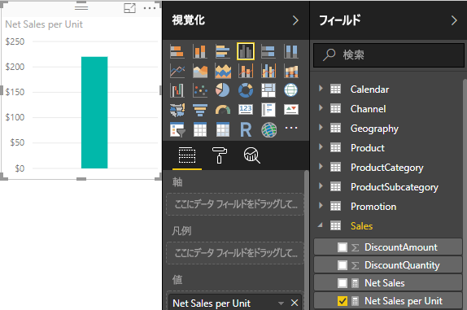
    
5. 表示方法を変えるために、グラフの視覚化タイプを **[ツリーマップ]** に変更します。
    
    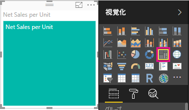
    
6. **Product Category** フィールドを選択するか、ツリーマップまたは [視覚化] ウィンドウの [グループ] フィールドにドラッグします。 ここでお勧めの情報を紹介します。
    
    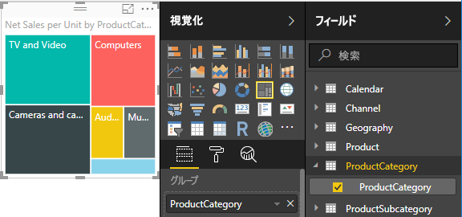
    
7. **ProductCategory** フィールドを削除し、代わりに **ProductName** フィールドをグラフにドラッグしてみてください。 
    
    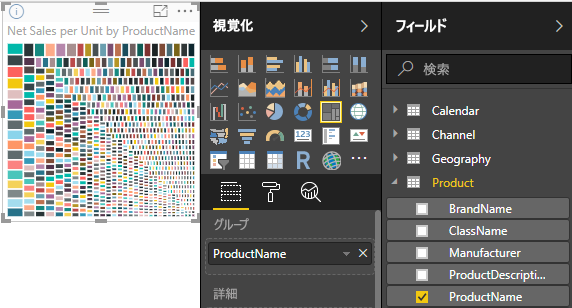
    
これは単なるお遊びですが、すばらしい機能ではありませんか。 他の視覚化のフィルター処理と書式設定も試してみてください。

## 学習した内容
メジャーには、データから必要な洞察を得るための多くの機能があります。 ここでは、数式バーを使用してメジャーを作成し、わかりやすい名前を付け、DAX の候補リストを使用して適切な数式の要素を見つけて選択する方法を学びました。 また、コンテキストについても学習しました。コンテキストとは、メジャーの計算結果が他のフィールドに従って変化すること、または数式にある他の式によって変化することを指します。

## 次の手順
- 多数の一般的なメジャーの計算を利用できる Power BI Desktop のクイック メジャーの詳細については、「[クイック メジャーを使用して一般的で強力な計算を簡単に実行する](desktop-quick-measures.md)」を参照してください。
  
- DAX の数式についてさらに詳しく知りたい場合や、さらに高度なメジャーを作成する場合は、「[Power BI Desktop での DAX の基本事項](desktop-quickstart-learn-dax-basics.md)」を参照してください。 この記事では、構文、関数、およびコンテキストの詳しい理解など、DAX の基本的な概念について説明します。
  
- また、「[Data Analysis Expressions (DAX) リファレンス](https://msdn.microsoft.com/library/gg413422.aspx)」を、ぜひお気に入りに追加してください。 DAX の構文、演算子、および 200 種類を超える DAX 関数について詳細を調べることができます。

