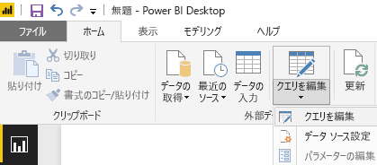

# チュートリアル: Power BI Desktop を使用して Facebook を分析する
このチュートリアルでは、 **Facebook**からデータをインポートして視覚化する方法を学習します。 このチュートリアルでは、Facebook の特定のページ (Power BI ページ) に接続する方法、データ変換ステップを適用する方法、およびいくつかの視覚化を作成する方法について学習します。

まず、取るべき手順を以下に示します。

* **タスク 1** : Facebook ページに接続する
* **タスク 2**: レポートビューを使用して視覚化を作成する
  
  * **手順 1**: ツリーマップの視覚化を作成する
* **タスク 3**: クエリ ビューでデータの形を整える
  
  * **手順 1**: 日付と時刻の列を 2 列に分割する
  * **手順 2**: 集約値を関連テーブルから追加する
* **タスク 4**: レポート ビューを使用して追加の視覚化を作成する
  
  * **手順 1**: レポートにクエリを読み込む
  * **手順 2**: 折れ線グラフと横棒グラフを作成する

## **タスク 1: Facebook ページに接続する**
このタスクでは、[Microsoft Power BI Facebook](https://www.facebook.com/microsoftbi) サイト (URL: *https://www.facebook.com/microsoftbi)* からデータをインポートします。

誰でもそのページに接続してこの手順に従うことができます。(この手順で使用する自分の Facebook アカウント以外に) 特別な資格情報は必要ありません。

1. **[はじめに] ダイアログ**または **[ホーム]** リボン タブで **[データの取得]** を選びます。
2. **[データの取得]** ダイアログが表示され、すべての種類のデータ ソースから選択できます。 **[その他]** グループから **[Facebook]** を選択します。
   
   
   
   **[接続]**を選択すると、ダイアログが表示され、サード パーティ サービスを使用する場合のリスクに関する警告が出されます。
   
   
3. [続行] を選ぶと、**[Facebook]** ダイアログ ボックスが表示されます。このダイアログ ボックスで、ページ名 (**microsoftbi**) を **[ユーザー名]** テキスト ボックスに貼り付けることができます。 **[接続]** ドロップダウンから **[投稿]** を選びます。
   
   
4. **[OK]**をクリックします。
5. 資格情報を求めるメッセージが表示されたら、Facebook アカウントを使用してサインインし、自分のアカウントを使って Power BI アクセスを可能にします。
   
   

ページへの接続を確立した後、データがモデルに読み込まれます。 

そこから、 **クエリ エディター** がデータを表示します。 **クエリ エディター** は Power BI Desktop の一部ですが、別のウィンドウで表示され、そのウィンドウでデータ接続のすべての変換を実行できます。

データが適切な状態になったら、それを Power BI Desktop に読み込むことができます。 **[ホーム]** リボンで **[読み込んで閉じる]** を選びます。

ダイアログが表示され、Power BI Desktop データ モデルへのデータ読み込みの進行状況が示されます。

読み込まれた後、**[レポート]** ビューに移動します。そのビューで、テーブルの列が右側の**フィールド**の一覧に表示されます。

## **タスク 2: レポートビューを使用して視覚化を作成する**
ページからデータが読み込まれたので、視覚化を使用してデータに関する考察を迅速かつ簡単に得ることができます。

**手順 1** : ツリーマップの視覚化を作成する

視覚化の作成は簡単で、**フィールドの一覧**からフィールドをドラッグして、**レポート キャンバス**にドロップするだけです。

**[タイプ]** フィールドを **レポート** キャンバスまでドラッグします。 Power BI Desktop が **レポート キャンバス**に新しい視覚化を作成します。 次に、 **フィールド** ( **レポート** キャンバスまでドラッグしたのと同じフィールド) から **[値]** 領域まで **[タイプ]** をドラッグして、 **[バー]** 視覚化を作成します。

視覚化のタイプを変更するには、単に**[視覚化]** ウィンドウから別のアイコンを選びます。 タイプを**ツリーマップ**に変更してみましょう。次の図のように、**[視覚化]** からそのアイコンを選びます。

次に、凡例を追加し、データ ポイントの色を変更してみましょう。 **[視覚化]** ウィンドウで **[書式]** アイコンを選びます。**[書式]** アイコンはペイント ブラシのようになります。

**[凡例]**の横にある下矢印を選択すると、セクションが展開され、選択した視覚化の凡例をカスタマイズする方法が示されます。 ここでは次のような選択を行いました。

* **[凡例]** スライダーを動かして **[オン]** に切り替え、凡例が表示されるようにした
* **[凡例の位置]** ドロップダウンから **[右]** を選択した
* **[タイトル]** スライダーも動かして **[オン]** に切り替え、凡例のタイトルが表示されるようにした
* 凡例のタイトルに **type** と入力した

次の図ではこれらの設定が既に適用され、視覚化に反映されています。

次に、いずれかのデータ ポイントの色を変更してみましょう。 リンク データ ポイントは青であるため、ハイパーリンクの一般的な色と似ています。

**[データの色]** の横にある矢印を選んで、そのセクションを展開します。 データ ポイントが表示されます。それぞれの色の横にある選択矢印をクリックすると、そのデータ ポイントの色を変更できます。

データ ポイントの横にある色のボックスの下矢印をクリックすると、色選択のダイアログが表示され、色を選択できます。 ここでは水色を選択します。

適切な結果を得られました。 次の図で、視覚化でデータ ポイントに色がどのように適用され、判例が **[データの色]** セクション内の色 を反映してどのように自動更新されるかを確認してください。

## **タスク 3: テーブルでデータを整える**
選択したテーブルをインポートして視覚化を開始したら、データを最大限利用するために、データの整形およびクレンジングのさまざまな手順を実行する必要があります。

**手順 1:** 日付と時刻の列を 2 列に分割する

この手順では、**created\_time** 列を分割し、日付の値と時刻の値の両方を取得します。 Power BI Desktop 内で既存のクエリを変更するときには必ず、 **クエリ エディター**を起動する必要があります。 それには、 **[ホーム]** タブで **[クエリを編集]** を選択します。

1. **クエリ エディター** のグリッドで、**created\_time** 列が表示されるまで右にスクロールします。
2. **[クエリ プレビュー]** グリッドの列ヘッダーを右クリックし、**[列の分割] \> [区切り記号による分割]** の順にクリックして列を分割します。 区切り記号のドロップダウンから **[カスタム]** を選び、**“T”** と入力します。この操作は、**[列の管理]** グループの **[ホーム]** リボン タブでも実行できることにご注意ください。
   
   
   
   
3. 作成した列の名前をそれぞれ、**created\_date**、**created\_time** に変更します。
4. 新しい列 **created\_time** を選び、**** **[クエリ ビュー]** リボンで、**[列の追加]** タブに移動し、**[開始の日付と時刻]** グループの下で **[時刻] \> [時]** の順に選びます。 これにより、時刻の時間部分だけを示す新しい列が追加されます。
   
   
5. **[ホーム]** タブに移動して **[データ型]** ドロップダウンを選ぶか、列を右クリックして **[変換] \> [整数]** を選ぶことにより、新しい **[時]** 列の種類を **[整数]** に変更します。
   
   

**手順 2:** 集約値を関連テーブルから追加する

この手順では、入れ子になった値から共有の数を追加して、視覚化で使用できるようにします。

1. **[共有]** 列が表示されるまで右にスクロールし続けます。 入れ子になった値は、実際の値を取得するために別の変換を実行する必要があることを示します。
2. 列ヘッダーの右上の  アイコンを選び、**展開/集約**ビルダーを開きます。 **[カウント]** を選択し、 **[OK]**を押します。 これにより、テーブル内の行ごとに、共有の数が追加されます。
   
   
   
   データが読み込まれた後、列の名前をダブルクリックするか、列を右クリックするか、 **[クエリ ビュー]** リボンの **[変換]** タブと **[任意の列]** グループの下の **[名前の変更]** を選択して、列の名前を **[shares]** にします。
3. 最後に、新しい **[shares]** 列の種類を **[整数]**に変更します。 列を選んだ状態で、列を右クリックして **[変換] \> [整数]** を選ぶか、******[ホーム]** タブに移動して **[データ型]** ドロップダウンを選ぶことにより、種類を変更できます。

### クエリ ステップの作成完了
[クエリ ビュー] でクエリ変換を実行すると、クエリ ステップが作成され、 **[クエリの設定]** ウィンドウの **[適用したステップ]** 一覧にクエリ ステップが作成されて表示されます。 各クエリ ステップには、"M" 言語とも呼ばれる、対応する Query 式があります。

| タスク | クエリの手順 | 式 |
| --- | --- | --- |
| Facebook ソースに接続する |Source |Facebook.Graph  (&quot;https://graph.facebook.com/microsoftbi/posts&quot;) |
| **列を分割** し、必要な値を取得する |Split Column by Delimiter |Table.SplitColumn  (Source,&quot;created_time&quot;,Splitter.SplitTextByDelimiter(&quot;T&quot;),{&quot;created_time.1&quot;, &quot;created_time.2&quot;}) |
| 新しい列の**種類を変更**する (自動ステップ) |Changed Type |Table.TransformColumnTypes  (#&quot;Split Column by Delimiter&quot;,{{&quot;created_time.1&quot;, type date}, {&quot;created_time.2&quot;, type time}}) |
| 列の**名前を変更**する**** |Renamed Columns |Table.RenameColumns  (#&quot;Changed Type&quot;,{{&quot;created_time.1&quot;, &quot;created_date&quot;}, {&quot;created_time.2&quot;, &quot;created_time&quot;}}) |
| 列を**挿入**する**** |Inserted Hour |Table.AddColumn  (#&quot;Renamed Columns&quot;, &quot;Hour&quot;, each Time.Hour([created_time]), type number) |
| **型を変更**する |Changed Type1 |Table.TransformColumnTypes  (#&quot;Inserted Hour&quot;,{{&quot;Hour&quot;, type text}}) |
| 入れ子のテーブルの値を**展開**する**** |Expand shares |Table.ExpandRecordColumn  (#&quot;Changed Type1&quot;, &quot;shares&quot;, {&quot;count&quot;}, {&quot;shares.count&quot;}) |
| 列の**名前を変更**する**** |Renamed Columns1 |Table.RenameColumns  (#&quot; Expand shares&quot;,{{&quot;shares.count&quot;, &quot;shares&quot;}}) |
| **型を変更する** |Changed Type2 |Table.TransformColumnTypes  (#&quot;Renamed Columns1&quot;,{{&quot;shares&quot;, Int64.Type}}) |

## **タスク 4: レポート ビューを使用して追加の視覚化を作成する**
残りの分析に必要な形に整えるためにデータを変換したので、作成されたテーブルをレポートに読み込んで、追加の視覚化を作成できます。

**手順 1:** レポートにクエリを読み込む

レポートにクエリの結果を読み込むためには、**クエリ エディター**で **[読み込んで閉じる]** を選ぶ必要があります。 これにより変更が Power BI Desktop に読み込まれ、 **クエリ エディター**が閉じます。

Power BI Desktop で **レポート** ビューに移動します。 Power BI Desktop で左側のバーの一番上にあるアイコンを選択します。

**手順 2:** 折れ線グラフと横棒グラフを作成する

視覚化を作成するには、 **フィールドの一覧** からフィールドをドラッグして、 **レポート キャンバス**にドロップします。

1. **[共有]** フィールドを **レポート** キャンバスまでドラッグします。これにより、棒グラフが作成されます。 created\_date をグラフまでドラッグすると、Power BI Desktop によって視覚化が**折れ線グラフ**に変更されます。
   
   
2. 次に、 **shares** フィールドをドラッグし、 **レポート キャンバス**にドロップします。 ここで、 **Hour (時間)** フィールドを **フィールドの一覧** の下の **[軸]**セクションにドラッグします。
   
   
3. 視覚化のタイプを変更するには、単に **[視覚化]** ウィンドウから別のアイコンをクリックします。 下図の矢印は、 **[横棒グラフ]** アイコンを指しています。
   
   
4. 視覚化の種類を **[横棒グラフ]**に変更します。
5. **横棒グラフ**が作成されますが、軸が期待どおりではありません。逆方向 (高い順) に並べ替える必要があります。 **Y 軸**の横にある下矢印を選んで、そのセクションを展開します。 軸の種類を **[連続]** から **[カテゴリ別]** に変更すると、期待どおりの並び方になります (下図はこれを選ぶ前の状態であるため、その次の図で結果の状態をご確認ください)。

適切な結果を得られました。 このページには視覚化が 3 つあるため、レポート ページに収まるようにサイズを変更します。

お分かりいただけたように、レポートの視覚化は簡単にカスタマイズできるため、希望どおりにデータを表示することができます。 Power BI Desktop は、さまざまなデータ ソースからデータを取得して分析のニーズに合わせてデータの形を整えることから、このデータを機能豊富な対話型の方法で視覚化することまで、シームレスなエンド ツー エンドのエクスペリエンスを提供します。 レポートが完成したら、[Power BI にアップロード](desktop-upload-desktop-files.md)し、それに基づいて、他の Power BI ユーザーと共有可能なダッシュボードを作成できます。

このチュートリアルの最終結果を[ここ](http://download.microsoft.com/download/1/4/E/14EDED28-6C58-4055-A65C-23B4DA81C4DE/FacebookAnalytics.pbix)からダウンロードすることができます

### 他の詳細情報については、次を参照してください。
* [他の Power BI Desktop のチュートリアルを読む](http://go.microsoft.com/fwlink/?LinkID=521937)
* [Power BI Desktop のビデオを見る](http://go.microsoft.com/fwlink/?LinkID=519322)
* [Power BI フォーラムにアクセスする](http://go.microsoft.com/fwlink/?LinkID=519326)
* [Power BI ブログを読む](http://go.microsoft.com/fwlink/?LinkID=519327)

