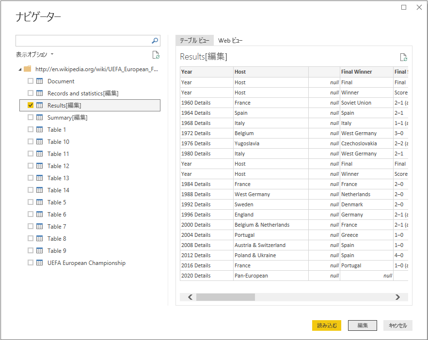
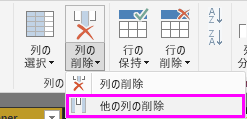
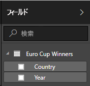

# Power BI Desktop を使用して Web ページのデータを分析する (チュートリアル)
このチュートリアルでは、Web ページからデータのテーブルをインポートし、このデータを視覚化するためにレポートを作成する方法を学習します。 このプロセスの一環として、Web ページ上で使用できるテーブル間を移動し、テーブルを新しい形に整えるために、データ変換の手順を適用します。

 この記事の内容:

* **タスク 1:** Web データ ソースに接続する
* **タスク 2:** クエリ ビューでデータの形を整える
  * 手順 1: 必要な列のみを表示するため、他の列を削除します
  * 手順 2: 選択した列の値をクリーンアップするために値を置き換えます
  * 手順 3: 列の値をフィルター処理します
  * 手順 4: 列の名前を変更します
  * 手順 5: 列の null 値をフィルター処理します
  * 手順 6: クエリの名前を変更します
  * クエリの手順が作成されました
* **タスク 3:** レポート ビューを使用して視覚化を作成する
  * 手順 1: レポートにクエリを読み込みます
  * 手順 2: マップの視覚化を作成します

## タスク 1: Web データ ソースに接続します
 タスク 1 では、次の場所にある UEFA 欧州選手権の Wikipedia ページから、トーナメントの概要テーブルをインポートします。http://en.wikipedia.org/wiki/UEFA\_European\_Football\_Championship

### Wikipedia ページのデータ ソースを追加します
1. **[はじめに] ダイアログ**または **[ホーム]** リボン タブで **[データの取得]** を選びます。
2. これにより、**[データの取得]** ダイアログが表示されます。そこで Power BI Desktop にデータをインポートするため、幅広いデータ ソースから選べます。 **[すべて]** または **[その他]** のグループの下にある **Web** を選びます。
3. **[Web コンテンツ]** ダイアログ ボックスの **[URL]** テキスト ボックスに、Wikipedia の URL (http://en.wikipedia.org/wiki/UEFA\_European\_Football\_Championship) を貼り付けます。
4. **[OK]**をクリックします。

この Web ページとの接続が確立すると、 **[ナビゲーター]** ダイアログで、この Wikipedia ページにあるテーブルの一覧が表示されます。 データをプレビューするには、それぞれのテーブルを 1 回クリックします。

**[ナビゲーター]** の左ウィンドウで、トーナメントの概要の結果を得るため **[結果[編集]]** テーブルを選択するか、 **[結果[編集]]** テーブルを選択して **[編集]**をクリックします。 データが分析に必要な形ではないため、これにより、レポートに読み込む前にこのテーブルの形をもう一度整えることができます。

テーブルのプレビューをクエリ ビューで表示します。そこで、データをクリーンアップするために変換手順のセットを適用できます。

## タスク 2: サブジェクト テーブルのデータの形を整えます
データ クエリ用にサブジェクト テーブルを選択したら、データの整形およびクレンジングのさまざまな手順を実行する方法を学習します。

**手順 1:** 必要な列のみを表示するため、他の列を削除します

この手順では、 **年** と **優勝者**以外のすべての列を除外します。

1. **[クエリ プレビュー]** グリッドで、**年**と**優勝者**の列を選びます (**Ctrl**キー  +  **クリック**)。
2. **[クエリ プレビュー]** グリッドの列ヘッダーを右クリックし、 **[その他の列の削除]** をクリックして選択されていない列を除外します。 なお、この操作は、 **[列の管理]** グループの **[ホーム]** リボン タブでも実行できます。

**手順 2:** 選んだ列の値をクリーンアップするために値を置き換えます

この手順では、 **年** の列の詳細サフィックスを置き換えます。 テーブルのプレビューで表示されないようにするため、このサフィックスは新しい行にあることに注意してください。 ただし、年の列で数値が含まれるセルの 1 つをクリックした場合、詳細ビューで完全な値が表示されます。

1. **年** の列を選択します。
2. **[クエリ ビュー]** リボンで、 **[ホーム]** タブの下の **[値の置換]** をクリックするか、 **年** の列を右クリックし **[値の置換]** をクリックして、詳細を空のテキストに置き換えます。
3. **[値の置換]** ダイアログ ボックスの **[検索する値]** テキスト ボックスに詳細を入力し、 **[置換後の文字列]** テキスト ボックスを空のままにします。
4. **[OK]**をクリックします。

 **手順 3:** 列の値をフィルター処理します

このステップでは、 **年** の列にフィルター処理を行い、"年" を含まない行を表示します。

1. **年** の列で、フィルターのドロップダウン矢印をクリックします。
2. **[フィルター]** ドロップダウンで、 **年** オプションをクリアします。
3. **[OK]**をクリックします。

**手順 4:** 列の名前を変更します

**年** の列のデータのクリーンアップが完了したので、 **優勝者** の列での作業に進みます。

勝者の一覧のみを対象にしているため、この列の名前を **国**に変更できます。

1. クエリのプレビューで **優勝者** の列を選択します。
2. **[クエリ ビュー]** リボンの **[変換]** タブと **[任意の列]** グループの下に **[名前の変更]**があります。
3. これにより、列の名前が編集可能になります。 この列の名前を **国**に変更します。

**手順 5:** 列の null 値をフィルター処理で除外します

さらに、**国**の列の null 値もフィルター処理で除外する必要があります。 これを実行するには、手順 3 でも使用したフィルター メニューを使用します。別の方法としては、次の手順に従ってください。

1. null 値を含む **国** の列内のセルの 1 つを右クリックします。
2. コンテキスト メニューで、**[テキスト フィルター] -\> [次の値と等しくない]** を選びます。
3. これにより、 **国** の列で null 値を持つ行を削除するための新しいフィルター手順が作成されます。

**手順 6:** クエリに名前を付けます

この手順では、最後のクエリに「 **欧州選手権の勝者**」という名前を付けます。

1. **[クエリ設定]** ウィンドウの **[名前]** テキスト ボックスに「 **欧州選手権の勝者**」と入力します。
   
   

## タスク 3: レポート ビューを使用して視覚化を作成します
分析に必要な形に整えるためにデータを変換したので、作成されたテーブルをレポートに読み込んで、いくつかの視覚化を作成できます。

**手順 1:** レポートにクエリを読み込む

クエリの結果を Power BI Desktop に読み込んでレポートを作成するために、**[ホーム]** リボンから **[閉じて読み込む]** を選びます。

これにより、クエリの評価をトリガーし、レポートに出力テーブルを読み込みます。 Power BI Desktop で **[レポート]** アイコンを選択して、レポート ビューを表示します。

**レポート ビュー** の右側にある **フィールド ウィンドウ**に、結果のテーブルのフィールドが表示されます。

**手順 2:** マップの視覚化を作成します

視覚化を作成するには、 **フィールドの一覧** からフィールドをドラッグして、 **レポート キャンバス**にドロップします。

1. **[国]** フィールドをドラッグし、 **レポート キャンバス**にドロップします。 これで、新しい視覚化が **レポート キャンバス**に作成されます。 この場合、国の一覧があるため、 **マップの視覚化**が作成されます。
   
   
2. 視覚化のタイプを変更するには、単に **[視覚化]** ウィンドウから別のアイコンをクリックします。
   
   
3. **マップ**の視覚化の種類を [マップ] のままにしておきます。視覚化の四隅のいずれかを必要なサイズまでドラッグすれば、視覚化のサイズを変更できます。
   
   
4. 現在、マップ内のすべてのポイントが同じサイズであることに注意してください。 これを変更して、欧州選手権でより多く勝利した国がマップでより大きなポイントで表されるようにします。 このためには、 **フィールドの一覧** の **[年]** フィールドを、 **フィールド ウィンドウ** の下半分の **[値]**ボックスにドラッグします。
   
   

お分かりいただけたように、自分の希望に沿ってデータを表示するために、レポートの視覚化を簡単にカスタマイズすることができます。 Power BI Desktop は、さまざまなデータ ソースからデータを取得して分析のニーズに合わせてデータの形を整えることから、このデータを機能豊富な対話型の方法で視覚化することまで、シームレスなエンド ツー エンドのエクスペリエンスを提供します。 レポートが完成したら、[Power BI にアップロード](desktop-upload-desktop-files.md)し、それに基づいて、他の Power BI ユーザーと共有可能なダッシュボードを作成できます。

これで、「 **Web からデータをインポート** 」チュートリアルは終わりです。 完成した Power BI Desktop ファイルを[ここ](http://download.microsoft.com/download/1/4/E/14EDED28-6C58-4055-A65C-23B4DA81C4DE/Analyzing_Data_From_The_Web.pbix)でダウンロードできます。

## 他の詳細情報については、次を参照してください。
* [他の Power BI Desktop のチュートリアルを読む](http://go.microsoft.com/fwlink/?LinkID=521937)
* [Power BI Desktop のビデオを見る](http://go.microsoft.com/fwlink/?LinkID=519322)
* [Power BI フォーラムにアクセスする](http://go.microsoft.com/fwlink/?LinkID=519326)
* [Power BI ブログを読む](http://go.microsoft.com/fwlink/?LinkID=519327)

