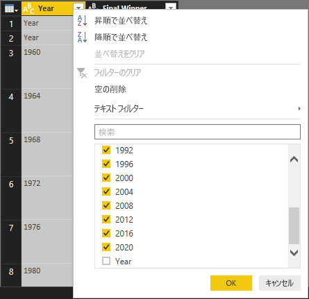
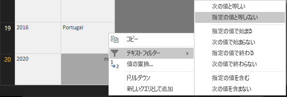
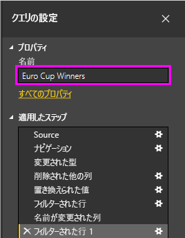
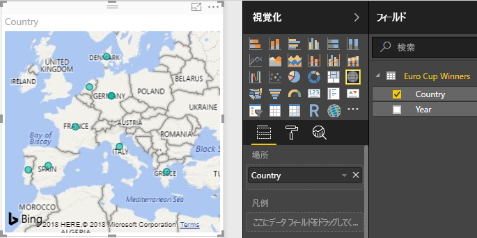
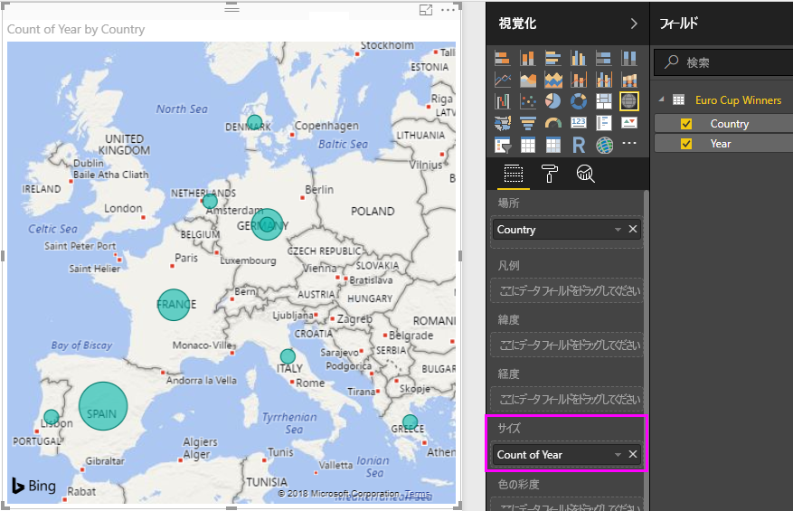
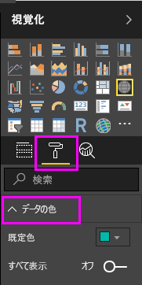
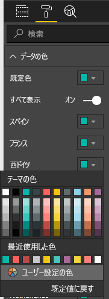
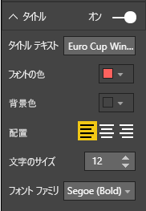
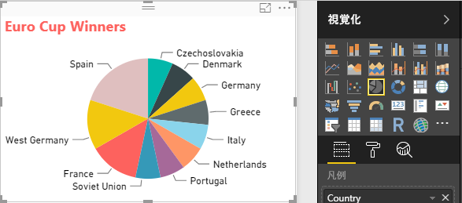

# チュートリアル: Power BI Desktop を使用して Web ページのデータを分析する

昔からのサッカー ファンなら、UEFA 欧州選手権 (ユーロ カップ) の優勝国が気になります。 Power BI Desktop を使うと、このデータを Web ページからレポートにインポートして、データを表示する視覚エフェクトを作成できます。 このチュートリアルでは、Power BI Desktop を使って次のことを行う方法を学習します。

- Web データ ソースに接続し、使用可能なテーブルの間を移動します。
- **Power Query エディター**を使ってデータの整形と変換を行います。
- クエリに名前を付け、Power BI Desktop レポートにインポートします。 
- マップと円グラフの視覚エフェクトを作成してカスタマイズします。

## Web データ ソースに接続する

UEFA 優勝国のデータは、UEFA European Football Championship Wikipedia ページ (http://en.wikipedia.org/wiki/UEFA_European_Football_Championship) の Results テーブルから取得できます。 

データをインポートするには:

1. Power BI Desktop の **[ホーム]** リボン タブで、**[データを取得]** の横の矢印をドロップダウンして、**[Web]** を選びます。
   
   ![リボンからの [データを取得]](media/desktop-tutorial-importing-and-analyzing-data-from-a-web-page/get-data-web3.png) 
   
   >[!NOTE]
   >**[データを取得]** 項目自体を選ぶか、Power BI の **[作業の開始]** ダイアログから **[データを取得]** を選び、**[データを取得]** ダイアログの **[すべて]** または **[その他]** セクションから **[Web]** を選んで、**[接続]** を選ぶこともできます。
   
2. **[Web から]** ダイアログ ボックスで、URL `http://en.wikipedia.org/wiki/UEFA_European_Football_Championship` を **[URL]** テキスト ボックスに貼り付けて、**[OK]** を選びます。
   
    ![ダイアログからの [データを取得]](media/desktop-tutorial-importing-and-analyzing-data-from-a-web-page/get-data-web2.png)
   
   Wikipedia の Web ページに接続すると、Power BI の **[ナビゲーター]** ダイアログ ボックスに、ページで使用可能なテーブルの一覧が表示されます。 テーブル名を選んでデータをプレビューできます。 **Results[edit]** テーブルに目的のデータがありますが、必要な形式と正確には一致していません。 レポートに読み込む前に、形式を変更し、データをクリーンアップします。 
   
   ![[ナビゲーター] ダイアログ ボックス](media/desktop-tutorial-importing-and-analyzing-data-from-a-web-page/tutorialimanaly_navigator.png)
   
   >[!NOTE]
   >**[プレビュー]** ウィンドウには最後に選んだテーブルが表示されていますが、**[編集]** または **[読み込み]** を選択すると、選んだすべてのテーブルが **Power Query エディター**に読み込まれます。 
   
3. **[ナビゲーター]** の一覧で **Results[edit]** テーブルを選び、**[編集]** を選びます。 
   
   テーブルのプレビューが **Power Query エディター**で開きます。ここで、変換を適用してデータをクリーンアップできます。 
   
   
   
## Power Query エディターでデータを整形する

年と優勝国だけを表示することによって、データをスキャンしやすくします。 **Power Query エディター**を使って、以下のデータ整形とクレンジングの手順を実行します。

最初に、**Year** と **Final Winners** 以外のすべての列をテーブルから削除します。

1. **Power Query エディター**のグリッドで、**Year** 列と **Final Winners** 列を選びます (**Ctrl** キーを押しながら複数の項目を選びます)。
   
2. 右クリックしてドロップダウンから **[他の列の削除]** を選ぶか、または **[ホーム]** リボン タブの **[列の管理]** グループから **[列の削除]** > **[他の列の削除]** を選んで、テーブルから他のすべての列を削除します。 
   
   ![[他の列の削除] ドロップダウン](media/desktop-tutorial-importing-and-analyzing-data-from-a-web-page/get-data-web6.png) または ![[他の列の削除] リボン](media/desktop-tutorial-importing-and-analyzing-data-from-a-web-page/webpage4.png)

次に、**Year** 列のセルから余計な単語 **Details** を削除します。

1. **年** の列を選択します。
   
2. 右クリックしてドロップダウンから **[値の置換]** を選ぶか、またはリボンの **[ホーム]** タブの **[変換]** グループから **[値の置換]** を選びます (**[変換]** タブの **[任意の列]** グループにもあります)。 
   
   ![[値の置換] ドロップダウン](media/desktop-tutorial-importing-and-analyzing-data-from-a-web-page/get-data-web7.png) または ![[値の置換] リボン](media/desktop-tutorial-importing-and-analyzing-data-from-a-web-page/get-data-web8a.png)
   
3. **[値の置換]** ダイアログ ボックスの **[検索する値]** テキスト ボックスに「**Details**」と入力し、**[置換後の文字列]** テキスト ボックスを空のままにします。そして、**[OK]** を選んで、**Year** 列から "Details" という単語を削除します。
   
   

**Year** の一部のセルには、年の値ではなく単語 "Year" のみが含まれています。 **Year** 列にフィルター処理を行い、"Year" という単語を含まない行のみを表示します。 

1. **Year** 列のフィルター ドロップダウン矢印を選びます。
   
2. ドロップダウンを下にスクロールし、**Year** オプションの横のチェック ボックスをオフにして、**[OK]** を選択し、**Year** が "Year" という単語だけの行を削除します。 

   

**Year** 列のデータのクリーンアップが完了したので、次に **Final Winner** 列の作業に進みます。 勝者国のデータだけが表示されるので、この列の名前を **Country** に変更します。 列の名前を変更するには次のようにします。

1. **Final Winner** 列のヘッダーをダブルクリックするか長押しします 
   - または、**Final Winner** 列のヘッダーを右クリックして、ドロップダウンから **[名前の変更]** を選びます。 
   - または、**Final Winner** 列を選び、リボンの **[変換]** タブの **[任意の列]** グループから **[名前の変更]** を選びます。 
   
   ![[名前の変更] ドロップダウン](media/desktop-tutorial-importing-and-analyzing-data-from-a-web-page/webpage7a.png) または ![[名前の変更] リボン](media/desktop-tutorial-importing-and-analyzing-data-from-a-web-page/get-data-web8.png)
   
2. ヘッダーに「**Country**」と入力して **Enter** キーを押し、列の名前を変更します。

"2020" 年のように **Country** 列が null 値の行もフィルターで除外します。 **Year** の値で行ったようにフィルター メニューを使って行うことができます。または次のようにしてもかまいません。

1. 値が *null* である **2020** の行の **Country** セルを右クリックします。 
2. コンテキスト メニューで **[テキスト フィルター]** > **[指定の値と等しくない]** を選び、そのセルの値を含むすべての行を削除します。
   
   
   
## レポート ビューにクエリをインポートする

意図したとおりにデータを整形したので、クエリに "Euro Cup Winners" という名前を付けて、レポートにインポートすることができます。

1. **[クエリ設定]** ウィンドウの **[名前]** テキスト ボックスに「**Euro Cup Winners**」と入力して **Enter** キーを押します。
   
   

2. リボンの **[ホーム]** タブから **[閉じて適用]** > **[閉じて適用]** を選びます。
   
   
   
クエリが Power BI Desktop の**レポート ビュー**に読み込まれて、**[フィールド]** ウィンドウに表示されます。 
   
   ![[フィールド] ウィンドウ](media/desktop-tutorial-importing-and-analyzing-data-from-a-web-page/webpage11.png)
>[!TIP]
>いつでも次のようにして **Power Query エディター**に戻ってクエリを編集および調整できます。
>- **[フィールド]** ウィンドウで **Euro Cup Winners** の隣の **[その他のオプション]** の省略記号ボタン **[...]** を選んで、ドロップダウンから **[クエリの編集]** を選びます。
>- または、レポート ビューの **[ホーム]** リボン タブの **[外部データ]** グループで **[クエリの編集]** > **[クエリの編集]** を選びます。 

## 視覚エフェクトを作成する

データに基づいて視覚エフェクトを作成するには: 

1. **[フィールド]** ウィンドウで **Country** フィールドを選ぶか、フィールドをレポート キャンバスにドラッグします。 Power BI Desktop がデータを国名として認識し、自動的に**マップ**視覚エフェクトを作成します。 
   
   
   
2. 隅のハンドルをドラッグしてマップを拡大し、すべての優勝国名が表示されるようにします。  

   
   
3. マップには、欧州選手権トーナメントで優勝したすべての国のデータ ポイントが同じように表示されています。 優勝した回数を反映するように各データ ポイントのサイズを変更するには、**[視覚化]** ウィンドウの下部の **[サイズ]** の下の **[ここにデータ フィールドをドラッグしてください]** に **Year** フィールドをドラッグします。 フィールドが自動的に **[Year のカウント]** メジャーに変化し、マップ視覚エフェクトで優勝回数が多い国ほどデータ ポイントが大きく表示されるようになります。 
   
   
   

## 視覚エフェクトをカスタマイズする

ご覧のように、データに基づいて視覚エフェクトを作成するのはとても簡単です。 また、意図した表現方法に少しでも近くなるように視覚エフェクトをカスタマイズするのも簡単です。 

### マップの書式を設定する
視覚エフェクトを選んで **[視覚化]** ウィンドウの **[書式]** (ペイント ローラー) アイコンを選ぶことで、視覚エフェクトの外観を変更することができます。 たとえば、視覚エフェクトの "Germany" のデータ ポイントは誤解を招きやすい表現になっています。これは、ドイツは西ドイツとして 2 回、ドイツとして 1 回優勝していますが、マップでは 2 つのポイントが分けられたりまとめられたりせずに、重ねて表示されているためです。 2 つのポイントに異なる色を設定して、これをわかりやすくします。 また、マップのタイトルをよりわかりやすく魅力的にすることもできます。 

1. 視覚エフェクトを選び、**[書式]** アイコンを選んでから、**[データの色]** を選んでデータの色のオプションを展開します。 
   
   
   
2. **[すべて表示]** を **[オン]** にし、**West Germany** の横のドロップダウンで黄色を選びます。 
   
   
   
3. **[タイトル]** を選んでタイトルのオプションを展開し、**[タイトル テキスト]** フィールドの現在のタイトルの代わりに「**Euro Cup Winners**」と入力します。 
4. **[フォントの色]** を赤に、**[テキスト サイズ]** を **12** に、**[フォント ファミリ]** を **[Segoe (Bold)]** にそれぞれ変更します。 
   
   
   

マップの視覚エフェクトは次のようになります。

   
### 視覚化の種類の変更
視覚エフェクトの種類を変更するには、視覚エフェクトを選び、**[視覚化]** ウィンドウの上部で別のアイコンを選びます。 たとえば、マップ視覚エフェクトにはソ連とチェコスロバキアのデータが表示されていません。これらの国が世界地図に存在しなくなったためです。 ツリーマップや円グラフのような別の種類の視覚エフェクトの方が、すべての値が表示されるためいっそう正確です。 

マップを円グラフに変更するには、マップを選んだ後、**[視覚化]** ウィンドウで **[円グラフ]** アイコンを選びます。 
   

>[!TIP]
>- **[データの色]** 書式オプションを使って、"Germany" と "West Germany" を同じ色にすることができます。 
>- 円グラフで優勝回数の多い国をグループにするには、視覚エフェクトの右上隅にある省略記号 **[...]** を選び、ドロップダウンから **[Year で並べ替え]** を選びます。 

Power BI Desktop は、さまざまなデータ ソースからデータを取得して分析のニーズに合わせてデータの形を整えることから、このデータを機能豊富な対話型の方法で視覚化することまで、シームレスなエンド ツー エンドのエクスペリエンスを提供します。 レポートが完成したら、[Power BI にアップロード](desktop-upload-desktop-files.md)し、それに基づいて、他の Power BI ユーザーと共有可能なダッシュボードを作成できます。

## 参照
* [他の Power BI Desktop のチュートリアルを読む](http://go.microsoft.com/fwlink/?LinkID=521937)
* [Power BI Desktop のビデオを見る](http://go.microsoft.com/fwlink/?LinkID=519322)
* [Power BI フォーラムにアクセスする](http://go.microsoft.com/fwlink/?LinkID=519326)
* [Power BI ブログを読む](http://go.microsoft.com/fwlink/?LinkID=519327)

