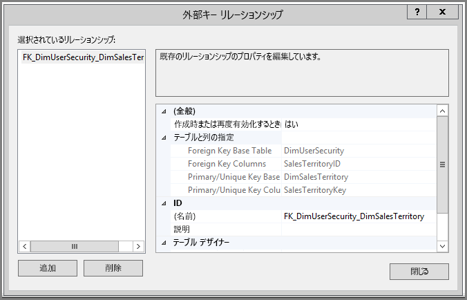
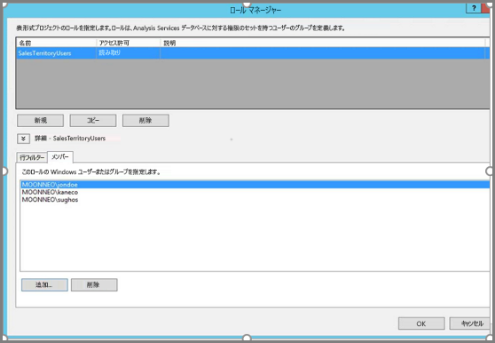
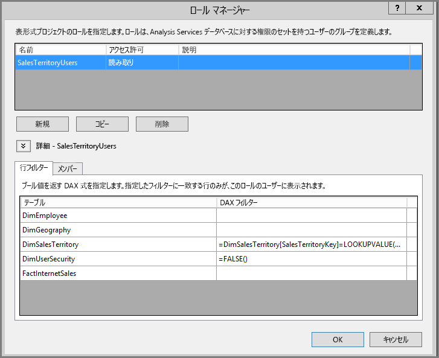
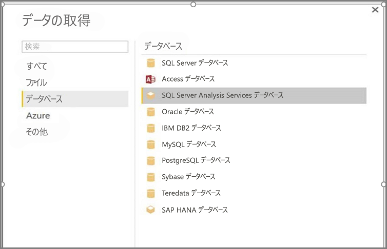
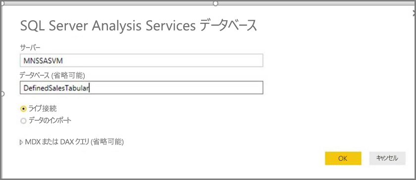
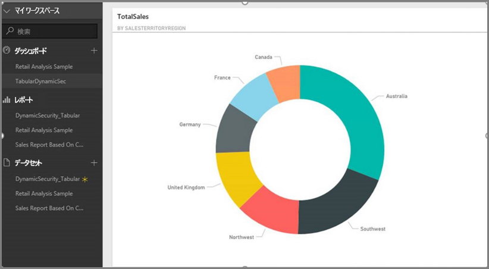
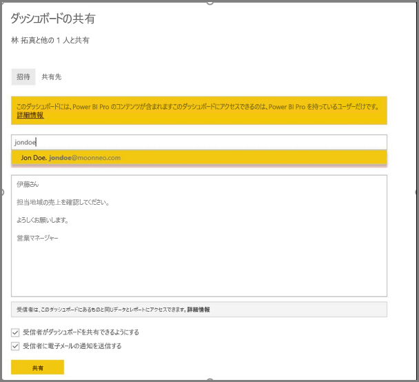
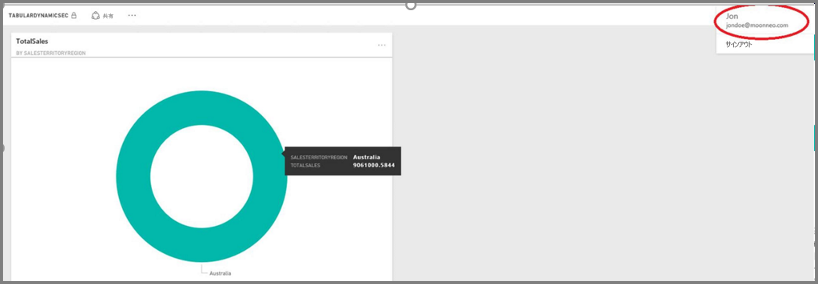

# <a name="tutorial-dynamic-row-level-security-with-analysis-services-tabular-model"></a>チュートリアル: Analysis サービス表形式モデルを使用した動的な行レベルのセキュリティ
このチュートリアルでは、**Analysis Services 表形式モデル**内に**行レベルのセキュリティ**を実装するために必要な手順と、Power BI レポートでのその使用方法を示します。 このチュートリアルの手順に従って、サンプル データセットを完了することで必要な手順を理解できるようになっています。

このチュートリアルでは、以下の手順について詳しく説明します。これらは、Analysis Services 表形式モデルで動的な行レベル セキュリティを実装するために必要な操作を理解するのに役立ちます。

* **AdventureworksDW2012** データベースに新しいセキュリティ テーブルを作成する
* 必要なファクト テーブルとディメンション テーブルを持つ表形式モデルを作成する
* ユーザーの役割とアクセス許可を定義する
* モデルを **Analysis Services 表形式** インスタンスにデプロイする
* Power BI Desktop を使用して、レポートにアクセスするユーザーに対応するデータを表示するレポートを作成する
* レポートを **Power BI サービス**にデプロイする
* レポートに基づいて新しいダッシュ ボードを作成し、最後に、
* 同僚とダッシュボードを共有する

このチュートリアルの手順に従うには、**AdventureworksDW2012** データベース (**[こちら](http://msftdbprodsamples.codeplex.com/releases/view/55330)**からダウンロードできます) が必要です。

## <a name="task-1-create-the-user-security-table-and-define-data-relationship"></a>タスク 1: ユーザーのセキュリティ テーブルを作成し、データのリレーションシップを定義する
**SQL Server Analysis Services (SSAS) 表形式**モデルを使用して行レベルの動的なセキュリティを定義する方法を説明する記事は多数あります。 [サンプルでは、この記事に従います。](https://msdn.microsoft.com/library/hh479759.aspx) 以下の手順では、このチュートリアルの最初のタスクについて説明します。

1. サンプルでは、**AdventureworksDW2012** リレーショナル データベースを使用します。 そのデータベースで、次の図のように、**DimUserSecurity** テーブルを作成します。 このサンプルでは、SQL Server Management Studio (SSMS) を使用してテーブルを作成します。
   
   
2. テーブルが作成され、保存されたら、次の図のように、**DimUserSecurity** テーブルの **SalesTerritoryID** 列と **DimSalesTerritory** テーブルの **SalesTerritoryKey** 列の間にリレーションシップを作成する必要があります。 この作業は **SSMS** から行うことができます。その場合、**DimUserSecurity** テーブルを右クリックして、**[編集]** を選択します。
   
   
3. テーブルを保存し、もう一度 **DimUserSecurity** テーブルを右クリックしてから **[Edit top 200 rows]** (上位 200 行の編集) を選択して、テーブルにユーザー情報の行をいくつか追加します。 これらのユーザーを追加すると、**DimUserSecurity** テーブルの行は次の図のようになります。
   
   
   
   これらのユーザーは以降のタスクで使用します。
4. 次に、**DimSalesTerritory** テーブルで*内部結合*を行います。このテーブルには、ユーザーに関連付けられている地域の詳細が示されます。 以下のコードで*内部結合*を実行します。*内部結合*が正常に行われると、テーブルはその下の図のようになります。
   
       **select b.SalesTerritoryCountry, b.SalesTerritoryRegion, a.EmployeeKey, a.FirstName, a.LastName, a.UserName from [dbo].[DimUserSecurity] as a join  [dbo].[DimSalesTerritory] as b on a.[SalesTerritoryKey] = b.[SalesTerritoryKey]**
   
   
5. 上の図に販売地域ごとの担当ユーザーなどの情報が示されていることに注目してください。 **手順 2.** でリレーションシップを作成したため、このようなデータが表示されます。 また、ユーザー **Jon Doe がオーストラリアの販売地域に含まれている**ことにも注目してください。 Jon Doe は以降の手順とタスクでも使用します。

## <a name="task-2-create-the-tabular-model-with-facts-and-dimension-tables"></a>タスク 2: ファクト テーブルとディメンション テーブルを持つ表形式モデルを作成する
1. リレーショナル データ ウェアハウスが準備できたら、表形式モデルを定義します。 モデルは **SQL Server Data Tools (SSDT)** を使用して作成できます。 表形式モデルを定義する方法の詳細については、[この記事を参照](https://msdn.microsoft.com/library/hh231689.aspx)してください。
2. 次に示すように、モデルに必要なすべてのテーブルをインポートします。
   
    
3. 必要なテーブルをインポートしたら、**読み取り**権限を持つ **SalesTerritoryUsers** という役割を定義する必要があります。 これを行うには、SQL Server Data Tools で **[モデル]** メニューをクリックしてから **[ロール]** をクリックします。 **[ロール マネージャー]** ダイアログ ボックスで、**[新規]** をクリックします。
4. **[ロール マネージャー]** の **[メンバー]** タブで、**タスク 1 の手順 3.** で **DimUserSecurity** テーブルに定義したユーザーを追加します。
   
    
5. 次に、**[行フィルター]** タブの下に示されている **DimSalesTerritory** と **DimUserSecurity** の両方のテーブルに適切な関数を追加します。
   
    
6. この手順では、**LOOKUPVALUE** 関数を使用して、Windows ユーザー名が **USERNAME** 関数によって返されるユーザー名と同じである列の値を返すようにします。 これで、**LOOKUPVALUE** によって返される値が同じテーブルまたは関連テーブルの値と一致した場合に、クエリを制限できます。 **[DAX フィルター]** 列に、次の数式を入力します。
   
       =DimSalesTerritory[SalesTerritoryKey]=LOOKUPVALUE(DimUserSecurity[SalesTerritoryID], DimUserSecurity[UserName], USERNAME(), DimUserSecurity[SalesTerritoryID], DimSalesTerritory[SalesTerritoryKey])
7. この数式では、**LOOKUPVALUE** 関数は、**DimUserSecurity[UserName]** が現在ログオンしている Windows ユーザー名と同じで、**DimUserSecurity[SalesTerritoryID]** が **DimSalesTerritory[SalesTerritoryKey]** と同じである場合に、**DimUserSecurity[SalesTerritoryID]** 列のすべての値を返します。
   
   次に、**LOOKUPVALUE** によって返される Sales セットの SalesTerritoryKey を使用して、**DimSalesTerritory** に示される行が制限されます。 行の **SalesTerritoryKey** が **LOOKUPVALUE** 関数によって返される ID セット内にある行のみが表示されます。
8. **DimUserSecurity** テーブルについては、**[DAX フィルター]** 列に、次の数式を入力します。
   
       =FALSE()
9. この数式は、すべての列が false ブール条件に解決されるように指定します。したがって、**DimUserSecurity** テーブルの列をクエリすることはできません。
10. この時点で、モデルを処理してデプロイする必要があります。 モデルのデプロイの際に支援が必要な場合は、[この記事](https://msdn.microsoft.com/library/hh231693.aspx)を参照してください。

## <a name="task-3-adding-data-sources-within-your-on-premises-data-gateway"></a>タスク 3: オンプレミス データ ゲートウェイ内のデータ ソースを追加する
1. 表形式モデルをデプロイし、使用できるようになったら、Power BI ポータルでオンプレミスの Analysis Services 表形式サーバーへのデータ ソース接続を追加する必要があります。
2. **Power BI サービス** がオンプレミスの分析サービスにアクセスできるようにするには、使用している環境で**[オンプレミス データ ゲートウェイ](service-gateway-onprem.md)**をインストールして構成する必要があります。
3. ゲートウェイを正しく構成したら、**Analysis Services** 表形式インスタンス用のデータ ソース接続を作成する必要があります。 この記事は、[Power BI ポータルでデータ ソースを追加する](service-gateway-enterprise-manage-ssas.md)場合に役立ちます。
   
   
4. 前の手順が完了していれば、ゲートウェイは構成されており、オンプレミスの **Analysis Services** データ ソースと対話できるようになっています。

## <a name="task-4-creating-report-based-on-analysis-services-tabular-model-using-power-bi-desktop"></a>タスク 4: Power BI Desktop を使用して Analysis Services 表形式モデルに基づくレポートを作成する
1. **Power BI Desktop** を起動して、**[データの取得]、[データベース]** の順に選択します。
2. データ ソースのリストから、**[SQL Server Analysis Services データベース]** を選択して、**[接続]** を選択します。
   
   
3. **Analysis Services** 表形式インスタンスの詳細を入力して、**[ライブ接続]** を選択します。 [OK] を選択します。 **Power BI** では、動的セキュリティは**ライブ接続**でのみ機能します。
   
   
4. **Analysis Services** インスタンスにデプロイされたモデルが表示されます。 該当するモデルを選択して、**[OK]** を選択します。
   
   
5. これで、**Power BI Desktop** では、**[フィールド]** ウィンドウのキャンバスの右側に使用可能なフィールドがすべて表示されます。
6. 右側の **[フィールド]** ウィンドウで、**FactInternetSales** テーブルからは **SalesAmount** メジャーを、**SalesTerritory** テーブルからは **SalesTerritoryRegion** ディメンションを選択します。
7. このレポートをシンプルなものにしておくために、この時点では列を追加しません。 データをよりわかりやすくするために、**ドーナツ グラフ**表示に切り替えます。
   
   
8. レポートの準備ができたら、Power BI ポータルに直接発行できます。 **Power BI Desktop** の **[ホーム]** リボンで、**[発行]** を選択します。

## <a name="task-5-creating-and-sharing-a-dashboard"></a>タスク 5: ダッシュボードを作成して共有する
1. レポートを作成し、**Power BI Desktop** で **[発行]** をクリックしたため、レポートは **Power BI** サービスに発行されます。 これで、サービスで、前の手順で作成した例を使用してモデル セキュリティ シナリオを示すことができます。
   
   役割が**販売マネージャーの Sumit** は、あらゆる販売地域からのデータを表示することができます。 したがって、Sumit はこのレポート (前のタスクの手順で作成したレポート) を作成し、Power BI サービスに発行します。
   
   レポートを発行したら、そのレポートに基づいて **TabularDynamicSec** という Power BI サービスにダッシュボードを作成します。 次の図で、販売マネージャー (Sumit) がすべての販売地域に対応するデータを表示できることがわかります。
   
   
2. ここで、Sumit は、オーストラリア地域の販売担当である Jon Doe という同僚とダッシュボードを共有します。
   
   
   
   
3. Jon Doe が **Power BI** サービスにログインし、Sumit が作成した共有ダッシュボードを表示した場合、Jon Doe には自分の担当する地域の売り上げ**のみ**が表示されます。 そのため、Jon Doe はログインし、Sumit が共有しているダッシュボードにアクセスして、オーストラリア地域の売り上げ**のみ**を表示します。
   
   
4. お疲れ様でした。 オンプレミスの **Analysis Services** 表形式モデルで定義された動的な行レベル セキュリティは、**Power BI** サービスに正常に反映され、確認されました。 Power BI は **effectiveusername** プロパティを使用して、現在の Power BI ユーザーの資格情報をオンプレミス データ ソースに送信してクエリを実行します。

## <a name="task-6-understanding-what-happens-behind-the-scenes"></a>タスク 6: バックグラウンドでの動作を理解する
1. このタスクは SQL Profiler に慣れていることを前提とします。オンプレミスの SSAS 表形式インスタンスで SQL Server プロファイラー トレースをキャプチャする必要があるためです。
2. ユーザー (ここでは Jon Doe) が Power BI サービスのダッシュ ボードにアクセスすると、すぐにセッションが初期化されます。 **salesterritoryusers** 役割は、**<EffectiveUserName>jondoe@moonneo.com</EffectiveUserName>** などの有効なユーザー名ですぐに有効になることがわかります。
   
       <PropertyList><Catalog>DefinedSalesTabular</Catalog><Timeout>600</Timeout><Content>SchemaData</Content><Format>Tabular</Format><AxisFormat>TupleFormat</AxisFormat><BeginRange>-1</BeginRange><EndRange>-1</EndRange><ShowHiddenCubes>false</ShowHiddenCubes><VisualMode>0</VisualMode><DbpropMsmdFlattened2>true</DbpropMsmdFlattened2><SspropInitAppName>PowerBI</SspropInitAppName><SecuredCellValue>0</SecuredCellValue><ImpactAnalysis>false</ImpactAnalysis><SQLQueryMode>Calculated</SQLQueryMode><ClientProcessID>6408</ClientProcessID><Cube>Model</Cube><ReturnCellProperties>true</ReturnCellProperties><CommitTimeout>0</CommitTimeout><ForceCommitTimeout>0</ForceCommitTimeout><ExecutionMode>Execute</ExecutionMode><RealTimeOlap>false</RealTimeOlap><MdxMissingMemberMode>Default</MdxMissingMemberMode><DisablePrefetchFacts>false</DisablePrefetchFacts><UpdateIsolationLevel>2</UpdateIsolationLevel><DbpropMsmdOptimizeResponse>0</DbpropMsmdOptimizeResponse><ResponseEncoding>Default</ResponseEncoding><DirectQueryMode>Default</DirectQueryMode><DbpropMsmdActivityID>4ea2a372-dd2f-4edd-a8ca-1b909b4165b5</DbpropMsmdActivityID><DbpropMsmdRequestID>2313cf77-b881-015d-e6da-eda9846d42db</DbpropMsmdRequestID><LocaleIdentifier>1033</LocaleIdentifier><EffectiveUserName>jondoe@moonneo.com</EffectiveUserName></PropertyList>
3. 有効なユーザー名要求に基づいて、Analysis Services は、ローカルの Active Directory のクエリの実行後に実際の moonneo\jondoe 資格情報に要求を変換します。 **Analysis Services** が Active Directory から実際の資格情報を取得すると、データに対するユーザーのアクセス許可に基づき、**Analysis Services** はそのユーザーがアクセス許可を持つデータのみを返します。
4. ダッシュボードでさらにアクティビティが発生した場合、たとえば、Jon Doe が SQL Profiler を使用してダッシュボードから基になるレポートに移動した場合、特定のクエリが DAX クエリとして Analysis Services 表形式モデルに返されることがわかります。
   
   
5. また、レポートのデータを取り込むために以下のような DAX クエリが実行されることがわかります。
   
   ```
   EVALUATE
     ROW(
       "SumEmployeeKey", CALCULATE(SUM(Employee[EmployeeKey]))
     )
   
   <PropertyList xmlns="urn:schemas-microsoft-com:xml-analysis">``
             <Catalog>DefinedSalesTabular</Catalog>
             <Cube>Model</Cube>
             <SspropInitAppName>PowerBI</SspropInitAppName>
             <EffectiveUserName>jondoe@moonneo.com</EffectiveUserName>
             <LocaleIdentifier>1033</LocaleIdentifier>
             <ClientProcessID>6408</ClientProcessID>
             <Format>Tabular</Format>
             <Content>SchemaData</Content>
             <Timeout>600</Timeout>
             <DbpropMsmdRequestID>8510d758-f07b-a025-8fb3-a0540189ff79</DbpropMsmdRequestID>
             <DbPropMsmdActivityID>f2dbe8a3-ef51-4d70-a879-5f02a502b2c3</DbPropMsmdActivityID>
             <ReturnCellProperties>true</ReturnCellProperties>
             <DbpropMsmdFlattened2>true</DbpropMsmdFlattened2>
             <DbpropMsmdActivityID>f2dbe8a3-ef51-4d70-a879-5f02a502b2c3</DbpropMsmdActivityID>
           </PropertyList>
   ```

## <a name="considerations"></a>考慮事項
行レベルのセキュリティ、SSAS、および Power BI を使用する場合に留意すべき考慮事項がいくつかあります。

1. Power BI でオンプレミスの行レベル セキュリティを使用できるのは、ライブ接続の場合のみです。
2. モデル処理後のデータでの変更は、Power BI サービスからの**ライブ接続**に基づくレポートにアクセスするユーザーに対してすぐに有効になります。

