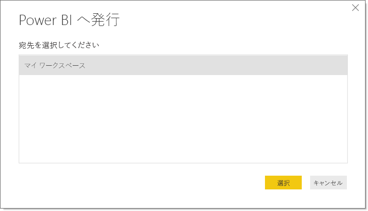

# Power BI Desktop からの発行
**Power BI Desktop** ファイルを **Power BI サービス**に発行すると、モデル内のデータおよび**レポート** ビューで作成したすべてのレポートが Power BI ワークスペースに公開されます。 ワークスペース ナビゲーターに、同じ名前の新しいデータセットおよびレポートが表示されます。

**Power BI Desktop** から発行すると、Power BI で **[データの取得]** を使用して接続し、**Power BI Desktop** ファイルをアップロードした場合と同じ効果を得られます。

> [!NOTE]
> Power BI のレポートに加えたすべての変更 (レポートにおける視覚化の追加、削除、変更など) は、元の **Power BI Desktop** ファイルには保存されません。
> 
> 

## Power BI Desktop データセットおよびレポートを発行するには
1. Power BI desktop で**ファイル** \> **発行** \> **Power BI へ発行** をクリックしてまたは**発行**で、リボン。  

   ![[発行] ボタン](media/desktop-upload-desktop-files/pbid_publish_publishbutton.png)

2. Power BI にサインインします。
3. 発行先を選択します。

   

完了すると、レポートのリンクが届きます。 リンクをクリックすると、Power BI サイトでレポートが開きます。

## Power BI Desktop から発行されたデータセットの再発行または置換
**Power BI Desktop** ファイルを発行すると、**Power BI Desktop** で作成したデータセットとすべてのレポートが Power BI サイトにアップロードされます。 **Power BI Desktop** ファイルを再発行すると、Power BI サイト内のデータセットが、**Power BI Desktop** ファイルから取得された更新済みデータセットと置き換えられます。

これは、すべて簡単ですが、知っておくべきいくつかの点があります。

* **Power BI Desktop** ファイルと同じ名前のデータセットが Power BI に既に複数個存在していた場合は、発行が失敗することがあります。 同じ名前のデータセットが Power BI に 1 つだけ存在するようにしてください。 ファイルの名前を変更して発行することもでき、その場合はファイルと同じ名前の新しいデータセットが作成されます。
* 列またはメジャーの名前を変更するか、これらを削除すると、Power BI でそのフィールドを使用している既存の視覚化が壊れる可能性があります。 
* Power BI は、既存列の形式変更の一部を無視します。 たとえば、列の形式を 0.25 から 25% に変更した場合などです。
* Power BI で既存データセットの更新スケジュールを設定し、新しいデータ ソースをファイルに追加してから再発行した場合は、スケジュールされている次回更新より前に、 *[データ ソースの管理]* でそれらのデータ ソースをサインインする必要があります。

