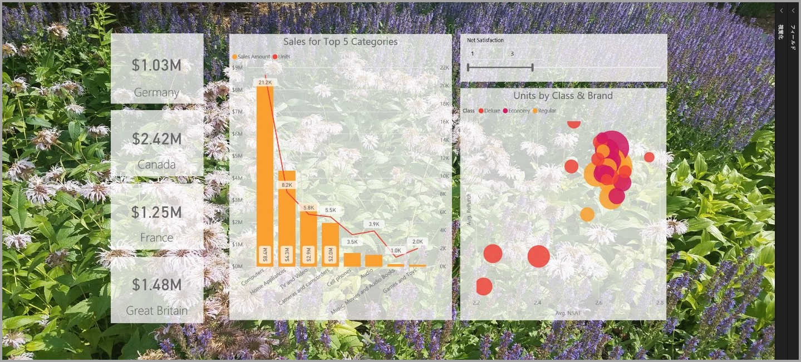
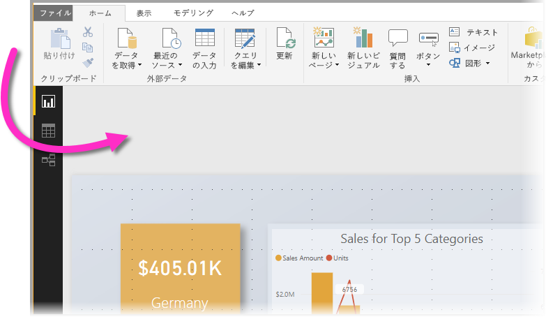
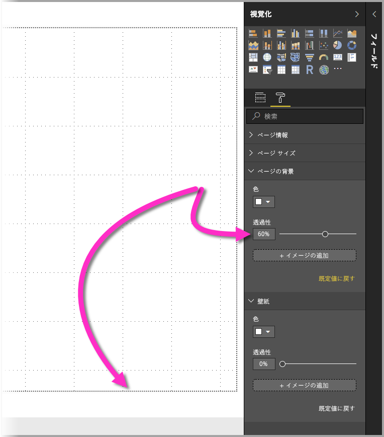
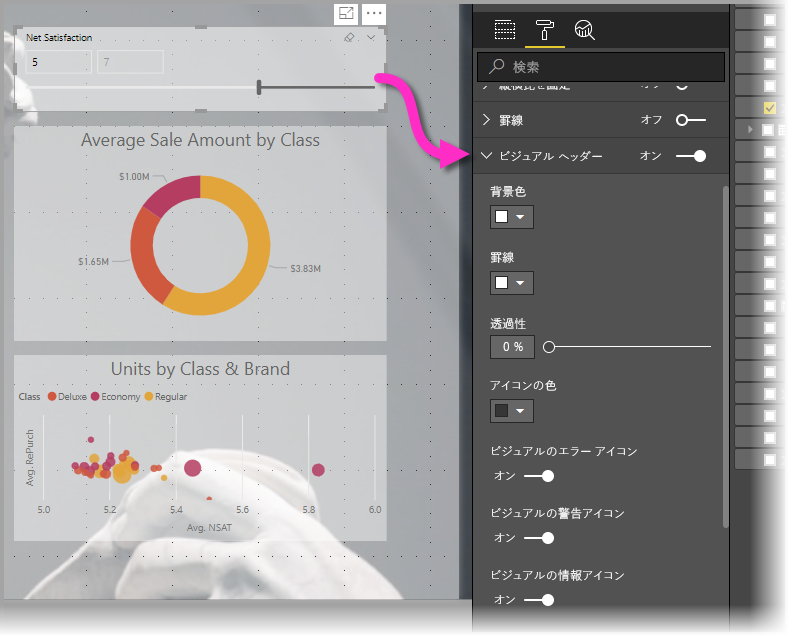
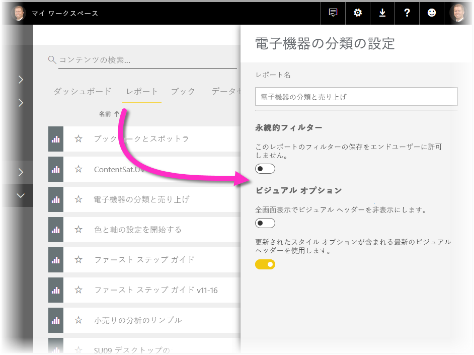

# ビジュアル要素を使用して Power BI レポートを強化する

**Power BI Desktop** では、壁紙やビジュアル ヘッダーなどのビジュアル要素を使用して、レポートの見た目を改善することができます。

**Power BI Desktop** の 2018 年 7 月のリリースから、レポートに使用できる拡張機能が追加され、分析やレポートを以前よりもさらに魅力的にすることができるようになりました。 この記事では、次のような機能強化について説明します。 

* レポートに**壁紙**を適用して、データで伝えたいストーリーの要素を背景で強化または強調することができます。
* 個々のビジュアルに改善された**ビジュアル ヘッダー**を使用すると、レポート キャンバスで適切に配置されたビジュアルを作成できます。 

以下のセクションでは、これらの機能強化を使用する方法と、レポートに適用する方法について説明します。

## Power BI レポートで壁紙を使用する

**壁紙**を使用して、レポート ページの外側の灰色の領域を書式設定できます。 次の図には、壁紙領域が適用される場所を示す矢印があります。 

レポートごとに壁紙を設定するか、レポート内のすべてのページに同じ壁紙を設定することができます。 壁紙を設定するには、レポートでビジュアルが選択されていないときに **[書式設定]** アイコンをタップまたはクリックします。ウィンドウに **[壁紙]** カードが表示されます。

![書式設定ウィンドウの [壁紙] 領域](media/desktop-visual-elements-for-reports/visual-elements-for-reports_03.png)

**[色]** ドロップダウンを選択して、**壁紙**として適用する色を選択できます。また、**[イメージの追加]** ボタンを選択して、壁紙として適用する画像を選択することができます。 色と画像のいずれであっても、**[透明度]** スライダーを使用して壁紙に透明度を適用することができます。

**壁紙**については、次の定義を覚えておくと便利です。

* レポート領域の外側にある灰色の領域が**壁紙**領域です
* キャンバス内でビジュアルを配置できる領域は、レポート **ページ**と呼ばれ、**書式設定ウィンドウ**の **[ページ背景]** ドロップダウンを使用して変更できます。

レポート **ページ** は (壁紙と比較すると) 常に前景にありますが、**壁紙**はその背面にあり、レポート ページで最も背面にある要素です。 ページに透明度を適用すると、レポートのビジュアルにも透明度が適用されるので、ビジュアルを透過して背景の壁紙を表示することができます。

新しいレポートでは、既定の設定は常に次のとおりです。

* レポート **ページ**は**白**に設定され、透明度は **100%** に設定されています
* **壁紙**は**白**に設定され、透明度は **0%** に設定されています

ページの背景に 50% を超える透明度を設定すると、レポートの作成中または編集中は、レポート キャンバスの境界を示す点線の境界線が表示されます。 

レポートの編集中に*のみ*点線の境界線が表示され、**Power BI サービス**で表示する場合など、発行されたレポートを表示するユーザーには表示*されない*点に注意してください。

> [!NOTE]
> 壁紙に濃色の背景を使用して、テキストの色に白または非常に明るい色を設定した場合は、**[PDF にエクスポート]** 機能には壁紙が含まれません。そのため、白のフォントでエクスポートしたものは、エクスポートされた PDF ファイルでほぼ表示されないことに注意してください。 **[PDF にエクスポート]** の詳細については、[PDF へのエクスポート](desktop-export-to-pdf.md)に関するページを参照してください。

## Power BI レポートで改善されたビジュアル ヘッダーを使用する

**Power BI Desktop** の 2018 年 7 月のリリースから、レポートのビジュアル ヘッダーが大幅に改善されました。 主な改善点は、ヘッダーがビジュアルから分離されたため、レイアウトと配置の好みに応じて位置を調整し、ビジュアルの上にヘッダーを表示するのではなく、ビジュアル内に表示できるようになりました。 

既定では、ヘッダーはタイトルに合わせてビジュアルの内側に表示されます。 次の図では、ビジュアル内にヘッダー (ピン アイコン、拡張アイコン、省略記号アイコン) があり、ビジュアルのタイトルと同じ水平位置に合わせて右揃えで表示されています。

ビジュアルにタイトルがない場合は、次の図のように、フロート状態の画像としてビジュアルの上部に右揃えでヘッダーが表示されます。 

ビジュアルがレポートの上部に配置されている場合、ビジュアル ヘッダーはビジュアルの下部に合わせて配置されます。 

各ビジュアルの**ビジュアル** ウィンドウの **[書式設定]** セクションには、**ビジュアル ヘッダー**というカードも表示されます。 このカードでは、ビジュアル ヘッダーのさまざまな特性を調整できます

> [!NOTE]
> トグルの表示は、レポートの作成時または編集時に影響がありません。 効果を確認するには、レポートを発行し、閲覧モードで表示する必要があります。 このような動作なので、編集中はビジュアル ヘッダーに用意されている多くのオプションが重要になります。特に、編集中に問題を警告する警告アイコンが重要です。

**Power BI サービス** にのみ表示されるレポートの場合、**[マイ ワークスペース] > [レポート]** に移動し、**設定**アイコンを選択してビジュアル ヘッダーの使用を調整できます。 次の図のように、**[設定]** を選択したレポートの設定が表示され、設定を調整できます。

### 既存のレポートで改善されたビジュアル ヘッダーを有効にする

新しいビジュアル ヘッダーは、すべての新しいレポートで既定の動作です。 既存のレポートの場合、**Power BI Desktop** でこの動作を有効にするには、**[ファイル] > [オプションと設定] > [オプション]** の順に選択し、**[レポートの設定]** セクションで **[更新されたスタイル オプションが含まれる最新のビジュアル ヘッダーを使用します]** チェックボックスをオンにします。

![既存のレポートで改善されたビジュアル ヘッダーを使用するには、[オプション] チェック ボックスをオンにする必要があります](media/desktop-visual-elements-for-reports/visual-elements-for-reports_06.png)

## 次の手順
**Power BI Desktop** と作業の開始方法の詳細については、次の記事を確認してください。

* [Power BI Desktop とは何ですか?](desktop-what-is-desktop.md)
* [Power BI Desktop でのクエリの概要](desktop-query-overview.md)
* [Power BI Desktop のデータ ソース](desktop-data-sources.md)
* [Power BI Desktop におけるデータへの接続](desktop-connect-to-data.md)
* [Power BI Desktop でのデータの整形と結合](desktop-shape-and-combine-data.md)
* [Power BI Desktop での一般的なクエリ タスク](desktop-common-query-tasks.md)   

