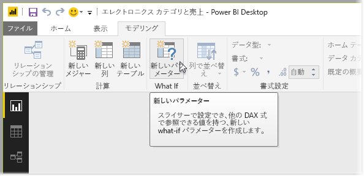
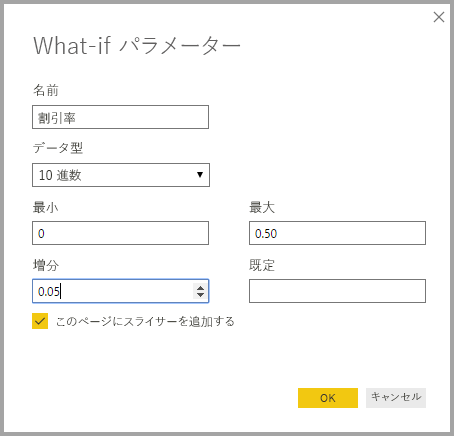
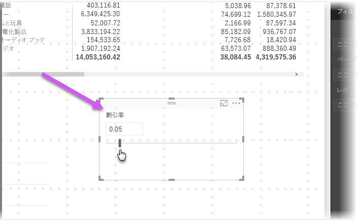
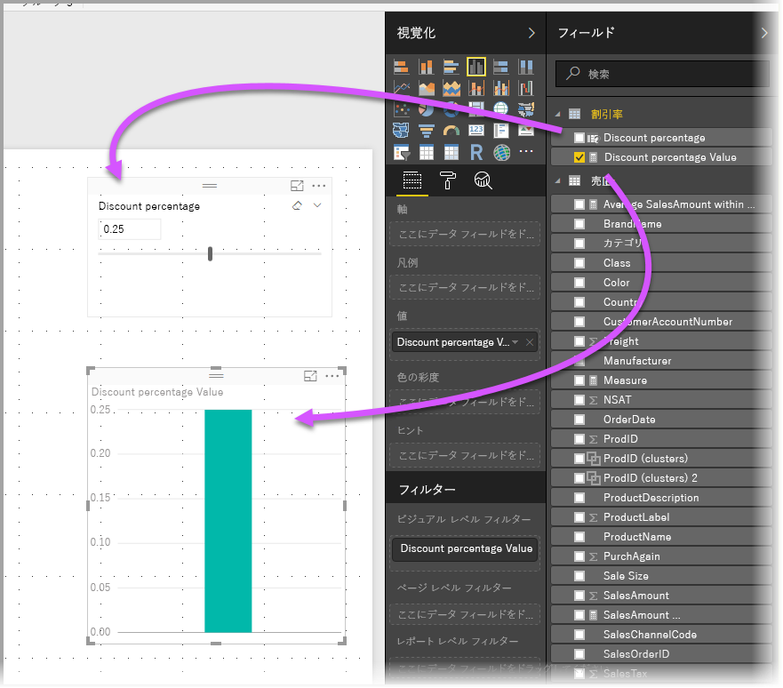
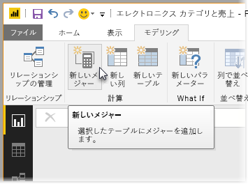
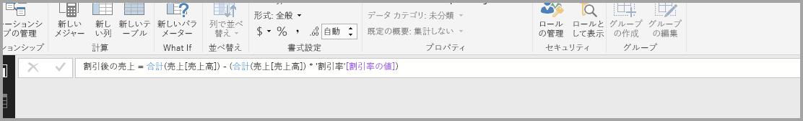
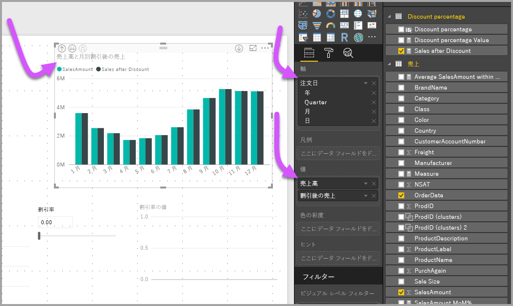
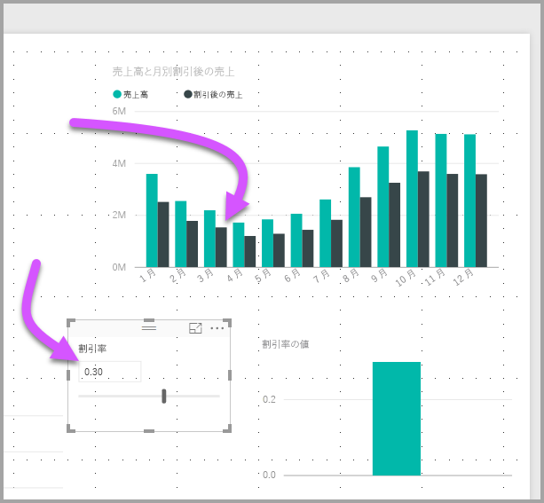

# Power BI Desktop で変数を視覚化する What-if パラメーターを作成して使用する
2018 年 8 月リリースの **Power BI Desktop** 以降では、レポート用の **What-if** 変数を作成し、スライサーで変数を操作して、レポート内の異なるキー値を視覚化および定量化できます。

**What-if** パラメーターは、**Power BI Desktop** の **[モデリング]** タブにあります。 これを選択すると、パラメーターを構成できるダイアログが表示されます。

## What-if パラメーターの作成
**What-if** パラメーターを作成するには、**Power BI Desktop** の **[モデリング]** タブで **[What-If]** ボタンを選びます。 次の図では、*Discount percentage* という名前のパラメーターを作成し、データ型を "*10 進数*" に設定しています。 "*最小値*" は 0、"*最大値*" は 0.50 (50%) です。 また、"*増分*" を 0.05 (5%) に設定してあります。 これはレポートで操作したときのパラメーターの調整量です。

> [!NOTE]
> 10 進数の場合、".50" だけではなく "0.50" のように先頭のゼロが必要です。 このようにしないと、値が妥当と見なされず、 **[OK]** ボタンを選択できません。
> 
> 

使いやすいように、 **[このページにスライサーを追加する]** チェック ボックスをオンにすると現在のレポート ページの **What-if** パラメーターにスライサーが自動的に追加されます。

**What-if** パラメーターを作成すると、パラメーターだけでなくメジャーも作成されて、**What-if** パラメーターの現在値を視覚化するために使うことができます。

**What-if** パラメーターを作成すると、パラメーターとメジャーの両方がモデルの一部になるということは重要であり、覚えておくと役に立ちます。 したがって、これらをレポート全体および他のレポート ページで使うことができます。 また、モデルに含まれるので、レポート ページからスライサーを削除できます。また、削除したスライサーを元に戻したい場合は、**What-if** パラメーターを **[フィールド]** リストからキャンバスにドラッグしてビジュアルをスライサーに変更するだけで、パラメーターをレポートに簡単に戻すことができます。

## What-if パラメーターの使用
**What-if** パラメーターを使う簡単な例を作成します。 前のセクションでは **What-if** パラメーターを作成しました。ここでは、スライダーで値を調整する新しいメジャーを作成することにより What-if パラメーターを使います。 そのためには、新しいメジャーを作成します。

新しいメジャーは、割引率を適用した合計売上金額を表示するだけの簡単なものです。 もちろん、複雑な興味深いメジャーを作成して、レポートの使用者が **What-if** パラメーターの変数を視覚化できるようにすることができます。 たとえば、販売員が、補正の効果を確認または特定の販売目標またはのパーセンテージを満たす場合増加より深いを売上割引を表示できるレポートを作成できます。

数式バーにメジャーの式を入力し、**Sales after Discount** という名前にして、結果を表示します。

その後、*SalesAmount* と作成した *Sales after Discount* メジャーを値にして、軸上に *OrderDate* がある縦棒グラフ ビジュアルを作成します。

スライダーを動かすと、*Sales after Discount* の縦棒に割引後の売り上げ高が反映されるのがわかります。

これで完了です。 あらゆる種類の状況で **What-if** パラメーターを使って、レポートのユーザーがレポートのさまざまなシナリオと対話できるようにすることができます。

