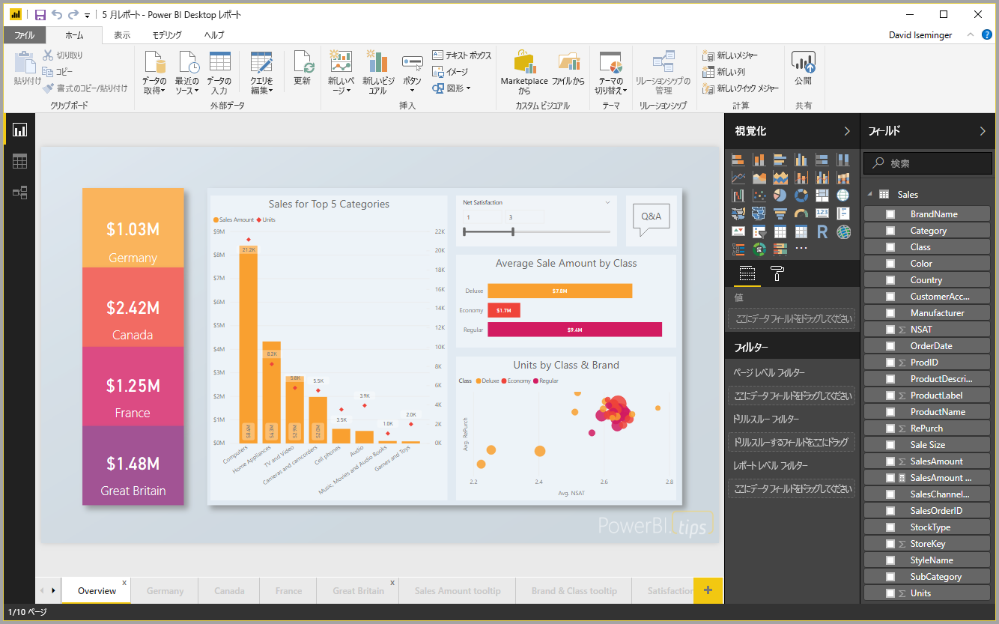
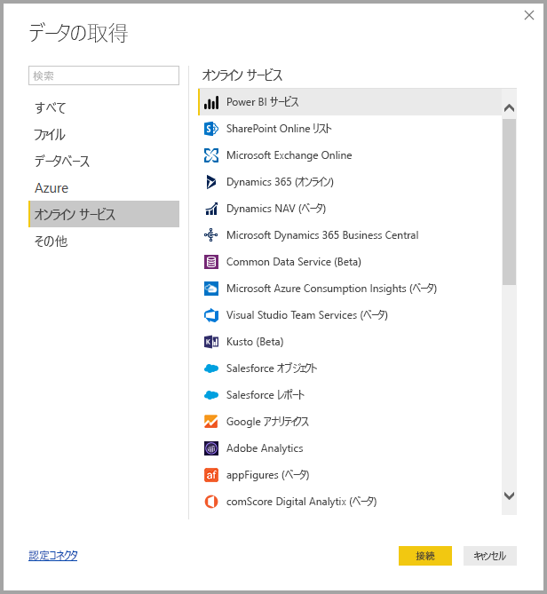
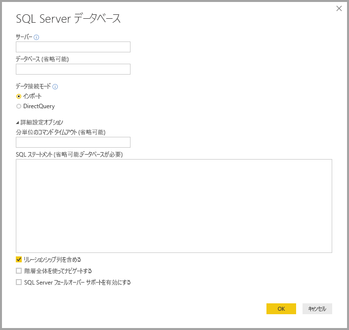
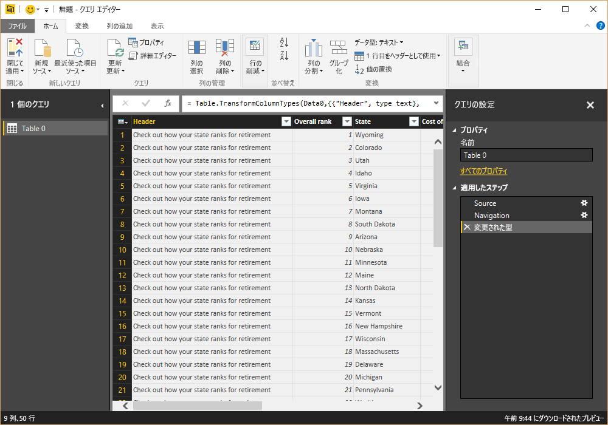
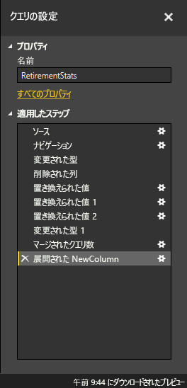
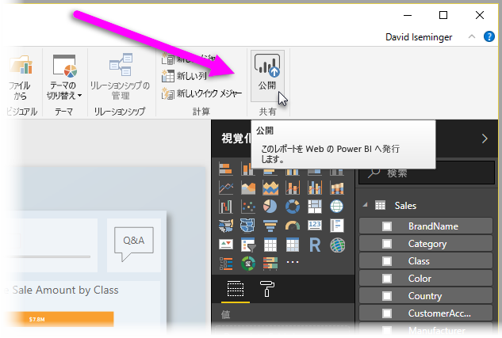

# Power BI Desktop とは何ですか?

**Power BI Desktop** はローカル コンピューターにインストールできる無料のアプリケーションであり、データへの接続、変換、および視覚化を行うことができるアプリケーションです。 **Power BI Desktop** を使用すると、複数の異なるデータ ソースに接続し、それらを組み合わせてデータ モデルに変換し (しばしばモデル化と呼ばれます)、変換後のデータ モデルを使用して、組織内の他のユーザーとレポートとして共有できるビジュアルやビジュアルのコレクションを作成できます。 Business Intelligence プロジェクトに取り組んでいるほとんどのユーザーは、**Power BI Desktop** を使用してレポートを作成した後、**Power BI サービス**を使用して、レポートを他のユーザーと共有します。

**Power BI Desktop** の最も一般的な使い方を次に示します。

* データへの接続
* データの変換とクリーニングを行って、データ モデルを作成する
* データの視覚的表現を示すグラフなどのビジュアルを作成する
* ビジュアルのコレクションである 1 ページまたは複数ページのレポートを作成する
* **Power BI サービス**を使用して、レポートを他のユーザーと共有する

このようなタスクを最も担当する人物は、多くの場合、"*データ アナリスト*" (単に "*アナリスト*" と呼ばれることもあります) または Business Intelligence プロフェッショナル (多くの場合 "*レポート作成者*" と呼ばれます) であるとみなされます。 ただし、自身をアナリストでもレポート作成者でもないと考えている多くの人々が、**Power BI Desktop** を使用して、同僚や組織と共有できる説得力のあるレポートを作成したり、さまざまなソースからデータをプルしてデータ モデルを作成したりしています。

**Power BI Desktop** を使用すると、複数のソースのすべてのデータを組織内の他のユーザーと共有できる 1 つのレポートにまとめた、複雑で視覚的にリッチなレポートを作成できます。 

## データへの接続
**Power BI Desktop** を使用するための最初の手順は、データに接続することです。 **Power BI Desktop** から接続できるデータ ソースには、たくさんの種類があります。 データに接続するには、**[ホーム]** リボンを選択し、**[データの取得] > [さらに表示]** を選択します。 次の図は、Power BI Desktop が接続できる多数のカテゴリを表示している **[データの取得]** ウィンドウを示しています。

データの種類を選択すると、Power BI Desktop がデータ ソースに接続するために必要な、URL や資格情報などの情報の入力を求められます。

1 つまたは複数のデータ ソースに接続したら、有用になるようにデータを変換できます。

## データの変換とクリーニング、モデルの作成

Power BI Desktop で、組み込みの**クエリ エディター**使用して、データのクリーニングと変換を実行できます。 クエリ エディターでは、データに対して、データ型の変更、列の削除、複数のソースのデータの結合などの変更を行うことができます。 作業は、ちょっと彫刻に似ています。大きな土 (データ) の塊から始めて、望みどおりになるまで、不要な部分を削り、必要な部分を付け加えてデータを整形していきます。 

データを変換するために実行したすべての手順 (テーブル名の変更、データ型の変換、または列の削除など) が**クエリ エディター**によって記録され、このクエリがデータ ソースに接続するたびに、これらの手順が実行され、データは常に指定したとおりに整形されます。

次の図は、整形され、モデルに変換されたクエリの **[クエリの設定]** ウィンドウを示しています。

 

データが望みどおりになったら、ビジュアルを作成できます。 

## ビジュアルの作成 

データ モデルが準備できたら、レポート キャンバスに "*フィールド*" をドラッグすることで、"*ビジュアル*" を作成できます。 "*ビジュアル*" は、モデル内のデータのグラフィック表現です。 次のビジュアルは、単純な縦棒グラフを示しています。 

Power BI Desktop から選択できるビジュアルには、さまざまな種類があります。 ビジュアルを作成または変更するには、**[視覚化]** ウィンドウからビジュアル アイコンを選択するだけです。 レポート キャンバスに選択済みのビジュアルがある場合は、選択済みのビジュアルがたった今選択した種類に変更されます。 ビジュアルが選択されていなければ、選択に基づいて新しいビジュアルが作成されます。

![Power BI Desktop の [視覚化] ウィンドウ](media/desktop-what-is-desktop/what-is-desktop_05.png)

## レポートの作成

多くの場合、Power BI Desktop でモデルを作成するために使用したデータのさまざまな側面を示すビジュアルのコレクションを作成します。 1 つの Power BI Desktop ファイル内のビジュアルのコレクションは "*レポート*" と呼ばれます。 レポートは、Excel ファイルが 1 つ以上のワークシートを持つことができるのと同じように、1 つまたは複数のページを持つことができます。 次の図は、Power BI Desktop レポートの最初のページを示しています。このページには、[概要] という名前が付けられています (図の下部にあるタブを参照してください)。 このレポートは 10 ページで構成されています。

## レポートの共有

レポートを他のユーザーと共有する準備ができたら、レポートを**Power BI サービス**に**発行**して、Power BI ライセンスを持っている組織内のすべてのユーザーが利用できるようにします。 Power BI Desktop レポートを発行するには、Power BI Desktop で **[ホーム]** リボンから **[発行]** ボタンを選択します。

**[発行]** を選択すると、Power BI Desktop によって Power BI アカウントを使用して **Power BI サービス**に接続されます。Power BI サービスで、レポートの共有先 (ワークスペース、チームのワークスペース、Power BI サービス内のその他の場所) を選択することを求められます。 Power BI サービスにレポートを共有するには、Power BI ライセンスが必要です。

## 次の手順

**Power BI Desktop** の使用を開始するために最初に検討する必要があるのは、そのアプリケーションをダウンロードしてインストールすることです。 **Power BI Desktop** の取得方法は 2 つあります。

* [Web から Power BI Desktop をダウンロードする](desktop-get-the-desktop.md)
* [Windows ストアから Power BI Desktop を取得する](http://aka.ms/pbidesktopstore)
