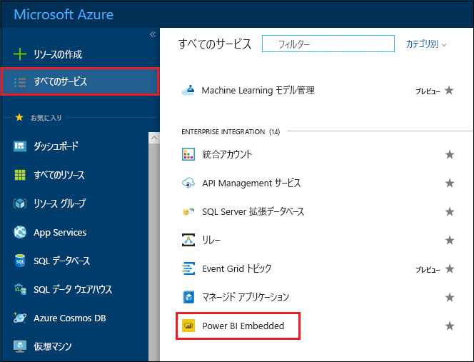
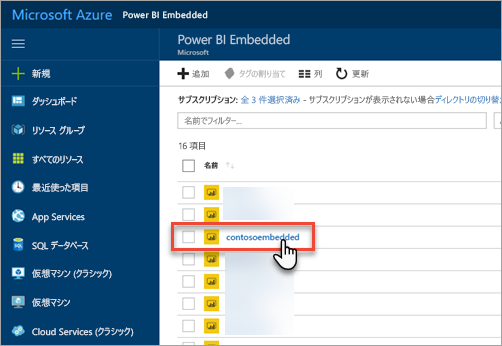
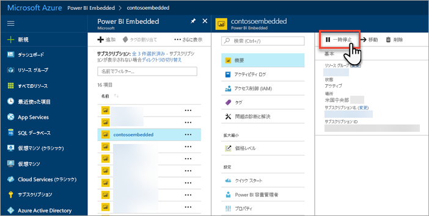
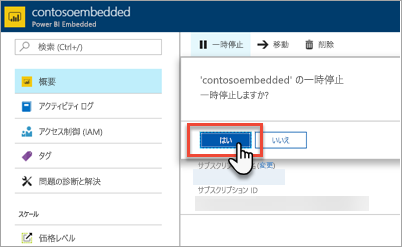
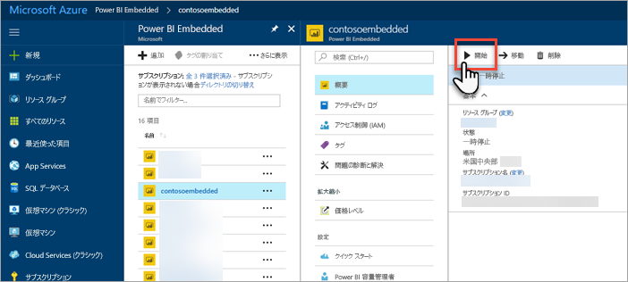
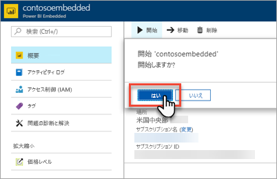

# Azure Portal での Power BI Embedded 容量の一時停止と開始

この記事では、Microsoft Azure で Power BI Embedded の容量を一時停止する方法と開始する方法について説明します。 Power BI Embedded 容量を作成していることが前提となります。 作成していない場合、「[Azure Portal での Power BI Embedded 容量の作成](azure-pbie-create-capacity.md)」を参照して作成してください。

Azure サブスクリプションをお持ちでない場合は、始める前に[無料アカウントを作成](https://azure.microsoft.com/free/)してください。

## 容量を一時停止する

容量を一時停止することで課金が止まります。 一定期間容量を使用する必要がない場合、容量を一時停止することをお勧めします。 容量は次の手順で一時停止します。

> [!NOTE]
> 容量を一時停止すると、Power BI 内でコンテンツが利用できなくなることがあります。 中断を防ぐ目的で、一時停止する前に容量からワークスペースの割り当てを解除してください。

1. [Azure Portal ](https://portal.azure.com/)にサインインします。

2. **[すべてのサービス]**  >  **[Power BI Embedded]** の順に選択すると、容量が表示されます。

    

3. 一時停止する容量を選択します。

    

4. 容量の詳細内で **[一時停止]** を選択します。

    

5. **[はい]** を選択すると容量の一時停止が確定します。

    

## 容量を開始する

容量を開始することで使用を再開します。 容量を開始すると、請求も再開されます。

1. [Azure Portal ](https://portal.azure.com/)にサインインします。

2. **[すべてのサービス]**  >  **[Power BI Embedded]** の順に選択すると、容量が表示されます。

    

3. 開始する容量を選択します。

    

4. 容量の詳細内で **[開始]** を選択します。

    

5. **[はい]** を選択すると容量の開始が確定します。

    

この容量にコンテンツが割り当てられている場合、開始後、利用可能になります。

## 次の手順

容量を拡大または縮小する場合、[Power BI Embedded 容量のスケーリング](azure-pbie-scale-capacity.md)に関するページを参照してください。

自分のアプリケーションに Power BI コンテンツを埋め込む方法については、[Power BI ダッシュボード、レポート、タイルを埋め込む方法](https://powerbi.microsoft.com/documentation/powerbi-developer-embedding-content/)に関するページを参照してください。

他にわからないことがある場合は、 [Power BI コミュニティで質問してみてください](http://community.powerbi.com/)。