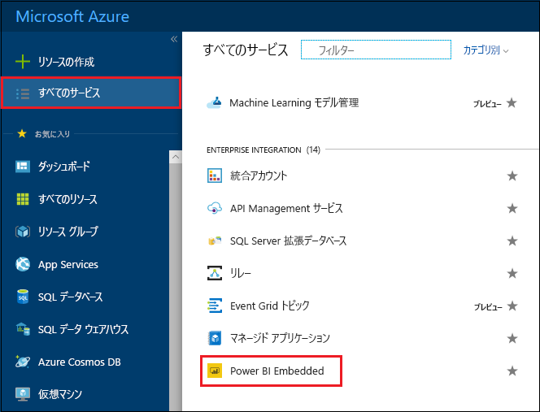
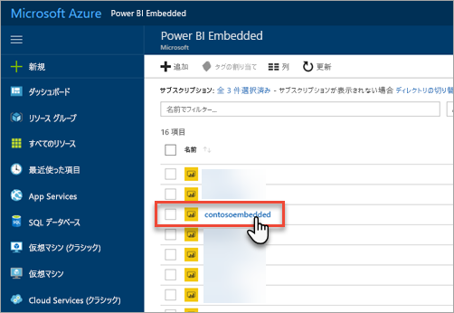
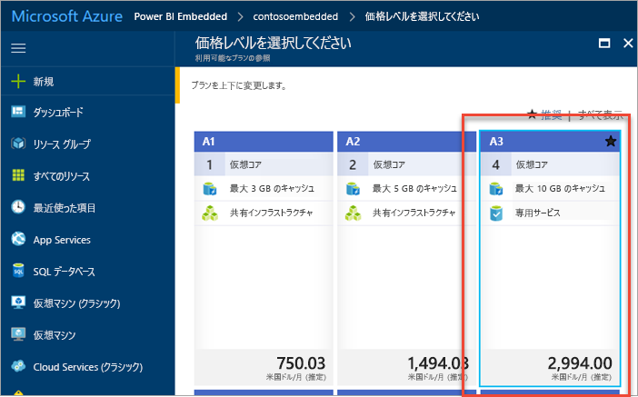
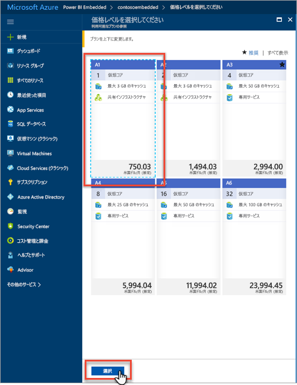
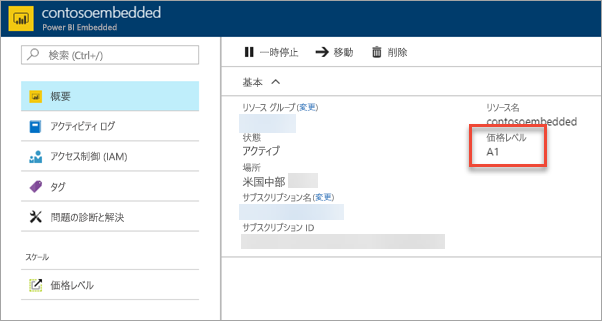

# Azure Portal で Power BI Embedded 容量をスケーリングする

この記事では、Microsoft Azure で Power BI Embedded の容量をスケーリングする方法について説明します。 スケーリングによって容量のサイズを増やしたり、減らしたりできます。

Power BI Embedded 容量を作成していることが前提となります。 作成していない場合、「[Azure Portal での Power BI Embedded 容量の作成](azure-pbie-create-capacity.md)」を参照して作成してください。

> [!NOTE]
> スケーリング操作は約 1 分かかります。 この間は容量を使用できません。 埋め込みコンテンツは読み込みできないことがあります。

## 容量をスケーリングする

1. [Azure Portal ](https://portal.azure.com/)にサインインします。

2. **[すべてのサービス]** > **[Power BI Embedded]** の順に選択すると、容量が表示されます。

    

3. スケーリングする容量を選択します。

    

4. 容量内で **[スケール]** の下にある **[価格レベル]** を選択します。

    ![[スケール] の下にある [価格レベル] オプション](media/azure-pbie-scale-capacity/azure-portal-scale-pricing-tier.png)

    現在ご利用の価格レベルには青で縁取られます。

    

5. サイズをスケーリングするには、移動先とする新しいレベルを選択します。 選択した新しいレベルが青の点線で囲まれます。 **[選択]** を選択すると、新しいレベルに移動します。

    

    容量のスケーリングには 1、2 分かかります。

6. [概要] タブでレベルを確認します。現在の価格レベルが表示されています。

    

## 次の手順

容量の一時停止と開始については、「[Pause and start your Power BI Embedded capacity in the Azure portal](azure-pbie-pause-start.md)」 (Azure Portal で Power BI Embedded を一時停止し、開始する) を参照してください。

自分のアプリケーションに Power BI コンテンツを埋め込む方法については、[Power BI ダッシュボード、レポート、タイルを埋め込む方法](https://powerbi.microsoft.com/documentation/powerbi-developer-embedding-content/)に関するページを参照してください。

他にわからないことがある場合は、 [Power BI コミュニティで質問してみてください](http://community.powerbi.com/)。
