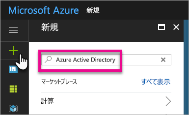
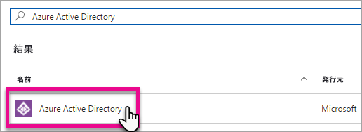
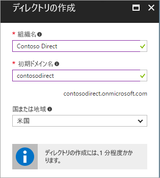
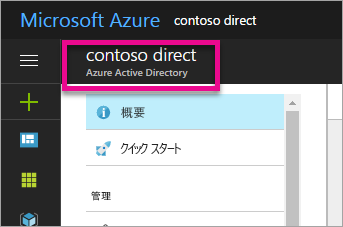
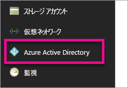
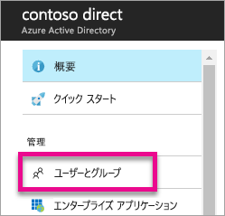
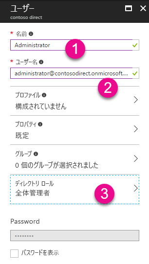
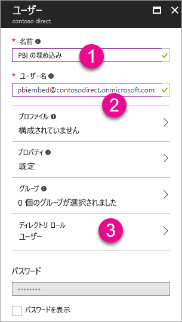
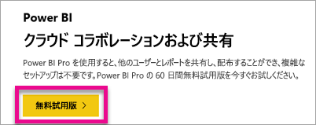

# Power BI で使用する Azure Active Directory テナントを作成する

Power BI REST API を使用して、カスタム アプリケーションで使用するために新しい Azure Active Directory (Azure AD) テナントを作成する方法を説明します。

テナントは、Azure Active Directory 内の組織の代表です。 これは、組織が Azure、Microsoft Intune または Office 365 などの Microsoft のクラウド サービスにサインアップする際に、受け取って所有する Azure AD サービスの専用インスタンスです。 各 Azure AD テナントは独立しており、他の Azure AD テナントとは切り離されています。

Azure AD テナントを作成すると、アプリケーションを定義してアクセス許可を割り当てて、アプリケーションで Power BI REST API を利用できるようすることができます。

組織にはアプリケーションに使用できる Azure AD テナントが既にある場合があります。 アプリケーションのニーズのためにそのテナントを利用することも、アプリケーション専用の新しいテナントを作成することもできます。 この記事では、新しいテナントを作成する方法を考察します。

## Azure Active Directory テナントを作成する

カスタム アプリケーションに Power BI を統合するには、Azure AD 内でアプリケーションを定義する必要があります。 これを行うには、Azure AD 内にディレクトリが必要です。 これがテナントです。 組織が Power BI または Office 365 を使用していないためにまだテナントがない場合は、[テナントを作成する必要があります](https://docs.microsoft.com/azure/active-directory/develop/active-directory-howto-tenant)。 アプリケーションを組織のテナントと混在させたくない場合にも、テナントを作成する必要があります。 これにより、分離させておくことができます。

または、テスト目的でテナントを作成することもできます。

新しい Azure AD テナントを作成するには、次の操作を行います。

1. [Azure Portal](https://portal.azure.com) を参照し、Azure サブスクリプションを持つアカウントを使用してサインインします。

2. **プラスのアイコン (+)** を選択し、*Azure Active Directory* を検索します。

    

3. 検索結果で **Azure Active Directory** を選択します。

    

4. **[作成]** を選択します。

5. **組織の名前**と**初期ドメイン名**を入力します。 **[作成]** を選択します。 これにより、ディレクトリが作成されます。

    

   > [!NOTE]
   > 初期ドメインは、onmicrosoft.com の一部になります。 他のドメイン名は、後で追加することができます。 テナントのディレクトリには、複数のドメインを割り当てることができます。

6. ディレクトリの作成が完了したら、新しいディレクトリを管理する情報ボックスを選択します。

これでディレクトリが作成されました。 次に、テナントにユーザーを追加します。

## Azure Active Directory テナントでユーザーを作成する

ディレクトリができたので、少なくとも 2 人のユーザーを作成してみましょう。 1 人はテナントのグローバル管理者となり、もう 1 人は埋め込みのマスター ユーザーとなります。 これをサービス アカウントと見なします。

1. Azure Portal 内で Azure Active Directory のフライアウトが表示されていることを確認します。

    

    そうでない場合は、左側のサービス バーから Azure Active Directory アイコンを選択します。

    
2. **[管理]** で **[ユーザーとグループ]** を選択します。

    
3. **[すべてのユーザー]**、**[+ 新しいユーザー]** の順に選択します。
4. このユーザーのユーザー名と名前を入力します。 このユーザーがテナントのグローバル管理者になります。 **[ディレクトリ ロール]** を [*グローバル管理者*] に変更することもできます。 また、一時パスワードを表示することもできます。 完了したら、**[作成]** を選択します。

    

5. テナント内の通常のユーザーに対してもう一度同じ操作を行うことができます。 これは、マスター埋め込みアカウントに使用することもできます。 今回は、**[ディレクトリ ロール]** は [*ユーザー*] のままにします。 忘れずにパスワードをメモしておきます。 **[作成]** を選択します。

    
6. 手順 5 で作成したユーザー アカウントで Power BI にサインアップします。 これには、[powerbi.com](https://powerbi.microsoft.com/get-started/) に移動し、[*Power BI - クラウド コラボレーションおよび共有*] の下で **[無料試用版]** を選択します。

    

    サインアップすると、Power BI Pro の 60 日間の無料体験を勧められます。 そこで選択して Pro ユーザーになることができます。 お探しのものが埋め込みのソリューションの開発である場合は、これで開始することができます。

   > [!NOTE]
   > ユーザー アカウントで指定したメール アドレスを使用してサインアップします。

## 次の手順

これで、Azure AD テナントが作成されました。このテナントを使用して、Power BI 内の項目をテストしたり、Power BI ダッシュボードやレポートのアプリケーションへの埋め込みに進むことができます。 項目の埋め込み方法の詳細については、「[Power BI ダッシュボード、レポート、およびタイルを埋め込む方法](embedding-content.md)」を参照してください。

[Azure AD ディレクトリとは](https://docs.microsoft.com/azure/active-directory/active-directory-whatis)  
[Azure Active Directory テナントを取得する方法](https://docs.microsoft.com/azure/active-directory/develop/active-directory-howto-tenant)  

他にわからないことがある場合は、 [Power BI コミュニティで質問してみてください](http://community.powerbi.com/)。
