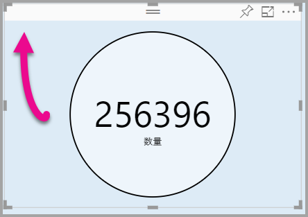

# <a name="tutorial-adding-formatting-options-to-a-power-bi-custom-visual"></a>チュートリアル:Power BI カスタム ビジュアルへの書式設定オプションの追加

このチュートリアルでは、ビジュアルに共通プロパティを追加する方法について説明します。

このチュートリアルで学習する内容は次のとおりです。
> [!div class="checklist"]
> * ビジュアルのプロパティを追加する。
> * ビジュアルをパッケージ化する。
> * カスタム ビジュアルを Power BI Desktop レポートにインポートする。

## <a name="adding-formatting-options"></a>書式設定オプションの追加

1. **Power BI** で**書式ページ**を選択します。

    次のメッセージが表示されます - "*このビジュアルに対して書式設定オプションは使用できません*"。

    

2. **Visual Studio Code** で、*capabilities.json* ファイルを開きます。

3. **dataViewMappings** 配列の前に、**objects** を追加します (8 行目の後)。

    ```json
    "objects": {},
    ```
    

4. **capabilities.json** ファイルを保存します。

5. **Power BI** で、書式設定オプションをもう一度確認します。

    > [!Note]
    > 書式設定オプションが変化していない場合は、**[Reload Custom Visual]\(カスタム ビジュアルの再読み込み\)** を選択します。

    

6. **[タイトル]** オプションを "*オフ*" に設定します。 ビジュアルの左上隅にメジャー名が表示されなくなったことを確認します。

    

    

### <a name="adding-custom-formatting-options"></a>カスタム書式設定オプションの追加

カスタム プロパティを追加して、円の色や境界線の幅を設定することができます。

1. PowerShell で、カスタム ビジュアルを停止します。

2. Visual Studio Code で、**capabilities.json** ファイルにある **objects** というラベルのオブジェクトに次の JSON フラグメントを挿入します。

    ```json
    "circle": {
     "displayName": "Circle",
     "properties": {
         "circleColor": {
             "displayName": "Color",
             "description": "The fill color of the circle.",
             "type": {
                 "fill": {
                     "solid": {
                         "color": true
                     }
                 }
             }
         },
         "circleThickness": {
             "displayName": "Thickness",
             "description": "The circle thickness.",
             "type": {
                 "numeric": true
                 }
             }
         }
     },
    ```

    この JSON フラグメントには circle という名前のグループが記述されています。これは、circleColor と circleThickness という 2 つのオプションで構成されています。

   

3. **capabilities.json** ファイルを保存します。

4. **src** フォルダーの内部から**エクスプローラー ウィンドウ**に入り、**settings.ts** を選択します。 *このファイルには、スターターのビジュアルに関する設定が記述されています*。

5. **settings.ts** ファイルで、2 つのクラスを次のコードに置き換えます。

    ```typescript
    export class CircleSettings {
     public circleColor: string = "white";
     public circleThickness: number = 2;
    }
    export class VisualSettings extends DataViewObjectsParser {
     public circle: CircleSettings = new CircleSettings();
    }
    ```

    

    このモジュールでは、2 つのクラスが定義されます。 **CircleSettings** クラスでは、**capabilities.json** ファイル内で定義されるオブジェクト (**circleColor** と **circleThickness**) の名前と一致する 2 つのプロパティが定義されます。また規定値も設定されています。 **VisualSettings** クラスでは **DataViewObjectParser** クラスが継承され、**circle** という名前のプロパティが追加されます。これは *capabilities.json* ファイル内で定義されるオブジェクトと一致しており、**CircleSettings** のインスタンスを返します。

6. **settings.ts** ファイルを保存します。

7. **visual.ts** ファイルを開きます。

8. **Visual** クラスに次のプロパティを追加します。

    ```typescript
    private visualSettings: VisualSettings;
    ```
    このプロパティには **VisualSettings** オブジェクトへの参照が格納され、ビジュアルの設定が記述されます。

    

9. **Visual** クラスで、**update** メソッドの前に次のメソッドを追加します。 このメソッドは、書式設定オプションを設定するために使用されます。

    ```typescript
    public enumerateObjectInstances(options: EnumerateVisualObjectInstancesOptions): VisualObjectInstanceEnumeration {
     const settings: VisualSettings = this.visualSettings ||
    VisualSettings.getDefault() as VisualSettings;
     return VisualSettings.enumerateObjectInstances(settings, options);
    }
    ```
    このメソッドは、書式設定オプションを設定するために使用されます。

    

10. **update** メソッドの **radius** 変数の宣言の後に、次のコードを追加します。

    ```typescript
    this.visualSettings = VisualSettings.parse<VisualSettings>(dataView);
    this.visualSettings.circle.circleThickness = Math.max(0, this.visualSettings.circle.circleThickness)this.visualSettings.circle.circleThickness = Math.min(10, this.visualSettings.circle.circleThickness);
    ```
    このコードは書式設定オプションを取得します。 ここでは **circleThickness** プロパティに渡される値が調整されます。負の値は 0 に変換され、10 より大きい値は 10 に変換されます。

    

11. **circle の要素**で、**fill の style** に渡される値を次の式に変更します。

    ```typescript
    this.visualSettings.circle.circleColor
    ```

    

12. **circle の要素**で、**stroke-width の style** に渡される値を次の式に変更します。

    ```typescript
    this.visualSettings.circle.circleThickness
    ```

    

13. visual.ts ファイルを保存します。

14. PowerShell で、ビジュアルを開始します。

    ```powershell
    pbiviz start
    ```

15. **Power BI** のビジュアルの上に表示されるツールバーで、**[自動再読み込みの切り替え]** を選択します。

16. **ビジュアルの書式**オプションで、**[Circle]** を展開します。

    

    **[色]** オプションと **[太さ]** オプションを変更します。

    **[太さ]** オプションの値を、0 より小さい値や 10 より大きい値に変更します。 すると、ビジュアルによって許容する最小値または最大値に値が更新されることを確認してください。

## <a name="packaging-the-custom-visual"></a>カスタム ビジュアルのパッケージ化

カスタム ビジュアル プロジェクトのプロパティ値を入力し、アイコン ファイルを更新したら、カスタム ビジュアルをパッケージ化します。

1. **PowerShell** で、カスタム ビジュアルを停止します。

2. **Visual Studio Code** で **pbiviz.json** ファイルを開きます。

3. **visual** オブジェクトで、**displayName** プロパティを *Circle Card* に変更します。

    **[視覚化]** ウィンドウでアイコンにカーソルを合わせると、表示名が表示されます。

    

4. **description** プロパティに次のテキストを入力します。

    *円の内側に書式設定された測定値を表示します*

5. 必要に応じて、**author** オブジェクトに作成者の詳細情報を入力します。

6. **pbiviz.json** ファイルを保存します。

7. **assets** オブジェクトのドキュメントでアイコンへのパスが定義されていることに注意してください。 このアイコンは、**_[視覚化]_** ウィンドウに表示されるイメージです。 これは "*20 × 20 ピクセル*" の **PNG** ファイルにする必要があります。

8. エクスプローラーで icon.png ファイルをコピーして貼り付け、assets フォルダーにある既定のファイルを置き換えます。

9. Visual Studio Code のエクスプローラー ウィンドウで assets フォルダーを展開し、icon.png ファイルを選択します。

10. アイコンを確認します。

    

11. Visual Studio Code で、すべてのファイルが保存されていることを確認します。

12. カスタム ビジュアルをパッケージ化するには、PowerShell で次のコマンドを入力します。

    ```powershell
    pbiviz package
    ```

    

パッケージがプロジェクトの **dist** フォルダーに出力されました。 パッケージには、カスタム ビジュアルを Power BI サービスまたは Power BI Desktop レポートにインポートするために必要なものがすべて含まれています。 これでカスタム ビジュアルのパッケージ化が完了し、使用する準備が整いました。

## <a name="importing-the-custom-visual"></a>カスタム ビジュアルのインポート

Power BI Desktop レポートを開き、カスタム ビジュアル Circle Card をインポートできるようになりました。

1. **Power BI Desktop** を開き、任意の "*サンプルのデータセット*" を使用して新しいレポートを作成します。

2. **_[視覚化]_** ウィンドウで**省略記号**を選択し、ファイルから **[インポート]** を選択します。

    

3. **インポート ウィンドウ**で、**[インポート]** を選択します。

4. 開いたウィンドウで、プロジェクトのディレクトリの **dist** フォルダーに移動します。

5. **circleCard.pbiviz** ファイルを選択して、**[開く]** を選択します。

6. ビジュアルが正常にインポートされたら、**[OK]** を選択します。

7. ビジュアルが **_[視覚化]_** ウィンドウに追加されたことを確認します。

    

8. **Circle Card** にカーソルを合わせると、ツールヒントが表示されることに注目してください。

## <a name="debugging"></a>デバッグ

カスタム ビジュアルのデバッグに関するヒントについては、[デバッグ ガイド](https://microsoft.github.io/PowerBI-visuals/docs/how-to-guide/how-to-debug/)を参照してください。

## <a name="next-steps"></a>次の手順

他のユーザーが使用できるように新しく開発したビジュアルをリストすることはできますが、その場合、**AppSource** に送信する必要があります。 このプロセスの詳細については、「[カスタム ビジュアルを AppSource に発行する](office-store.md)」を参照してください。