# <a name="tutorial-developing-a-power-bi-custom-visual"></a>チュートリアル:Power BI カスタム ビジュアルを開発する

開発者が Power BI にカスタム ビジュアルを簡単に追加して、ダッシュボードとレポートで使用できるようにします。 すぐに始められるように、すべての視覚化のコードが GitHub で公開されています。

ビジュアル化のフレームワークのほか、コミュニティの皆様が Power BI の質の高いのカスタム ビジュアルをビルドするのに役立つテスト スイートとツールを提供しています。

このチュートリアルでは、Circle Card という名前の Power BI カスタム ビジュアルを開発して、円の中に書式設定されたメジャー値を表示する方法を示します。 Circle Card ビジュアルでは、色の塗りつぶしと枠線の太さのカスタマイズをサポートします。

Power BI Desktop レポートでは、Circle Card になるようにカードが修正されます。

  

このチュートリアルで学習する内容は次のとおりです。
> [!div class="checklist"]
> * Power BI カスタム ビジュアルを作成する。
> * D3 ビジュアル要素を使ってカスタム ビジュアルを開発する。
> * ビジュアル要素を使ってデータ バインドを構成する。
> * データ値を書式設定する。

## <a name="prerequisites"></a>前提条件

* **Power BI Pro** にサインアップしていない場合は、[無料の試用版にサインアップ](https://powerbi.microsoft.com/pricing/)してください。
* [Visual Studio Code](https://www.visualstudio.com/) をインストールする必要があります。
* Windows ユーザーの場合は [Windows PowerShell](https://docs.microsoft.com/powershell/scripting/setup/installing-windows-powershell?view=powershell-6) バージョン 4 以降が、OSX ユーザーの場合は[ターミナル](https://macpaw.com/how-to/use-terminal-on-mac)が必要です。

## <a name="setting-up-the-developer-environment"></a>開発者環境を設定する

前提条件の他に、インストールする必要があるツールがいくつかあります。

### <a name="installing-nodejs"></a>node.js のインストール

1. Node.js をインストールするには、Web ブラウザーで [[Node.js]](https://nodejs.org) に移動します。

2. 最新機能の MSI インストーラーをダウンロードします。

3. インストーラーを実行して、インストールの手順に従います。 使用許諾契約に同意して、すべての既定値を受け入れます。

   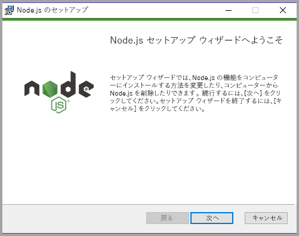

4. コンピューターを再起動します。

### <a name="installing-packages"></a>パッケージのインストール

次に、**pbiviz** パッケージをインストールする必要があります。

1. コンピューターが再起動された後に、Windows PowerShell を開きます。

2. pbiviz をインストールするには、次のコマンドを入力します。

    ```powershell
    npm i -g powerbi-visuals-tools
    ```

### <a name="creating-and-installing-a-certificate"></a>証明書の作成とインストール

#### <a name="windows"></a>Windows

1. 証明書を作成するには、次のコマンドを実行します。

    ```powershell
    pbiviz --create-cert
    ```

  結果が返され、"*パスフレーズ*" が生成されています。 ここでは、"*パスフレーズ*" は **_15105661266553327_** になっています。

  

2. 次に、証明書をインストールする必要があります。 証明書をインストールするには、次のコマンドを入力します。

    ```powershell
    pbiviz --install-cert
    ```

3. 証明書のインポート ウィザードで、ストアの場所が [現在のユーザー] に設定されていることを確認します。 *[次へ]* を選択します。

      

4. **[File to Import]\(インポートするファイル\)** 手順で、*[次へ]* を選択します。

5. **[秘密キーの保護]** 手順で、[パスワード] ボックスに、証明書の作成で受け取ったパスフレーズを貼り付けます。ここでも、パスフレーズは **_15105661266553327_** です。

      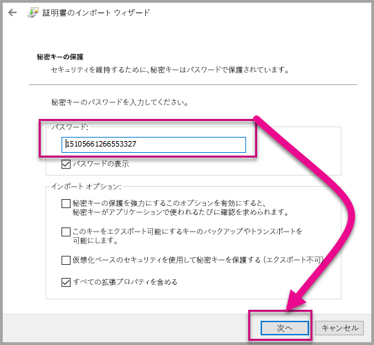

6. **[証明書ストア]** 手順で、**[証明書をすべて次のストアに配置する]** オプションを選択します。 次に、*[参照]* を選択します。

      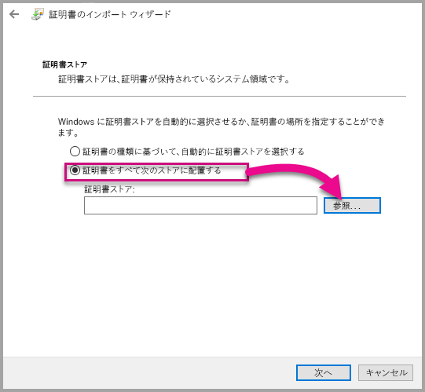

7. **[証明書ストアの選択]** ウィンドウで、**[信頼されたルート証明機関]** を選択して、*[OK]* をクリックします。 その後、**[証明書ストア]** 画面で *[次へ]* をクリックします。

      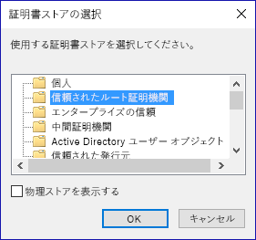

8. インポートを完了するには、**[完了]** を選択します。

9. セキュリティの警告を受信した場合は、**[はい]** を選択します。

    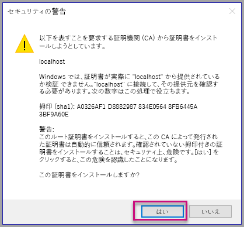

10. インポートが成功したという通知を受け取った場合は、**[OK]** をクリックします。

    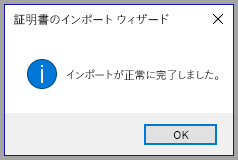

> [!Important]
> Windows PowerShell セッションを閉じないでください。

#### <a name="osx"></a>OSX

1. 左上の鍵がロックされている場合は、鍵を選択してロックを解除します。 *localhost* を検索し、証明書をダブルクリックします。

    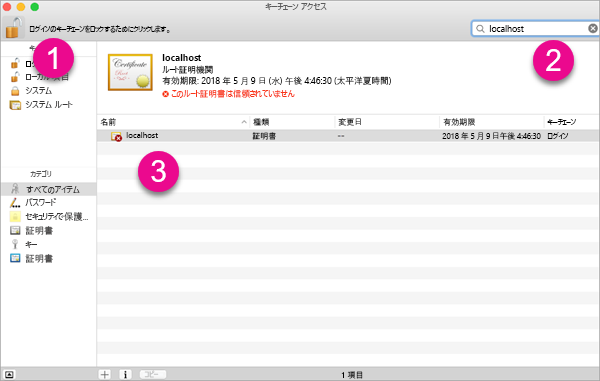

2. **[Always Trust]** \(常に信頼する) を選択して、ウィンドウを閉じます。

    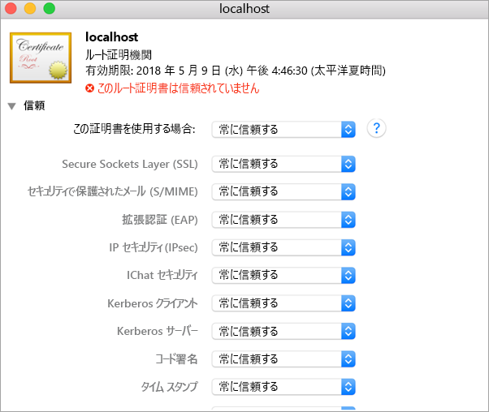

3. ユーザー名とパスワードを入力します。 **[Update Settings]** \(設定の更新) を選択します。

    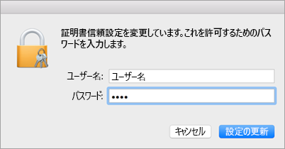

4. 開いているブラウザーをすべて閉じます。

> [!NOTE]
> 証明書が認識されない場合は、コンピューターの再起動が必要である可能性があります。

## <a name="creating-a-custom-visual"></a>カスタム ビジュアルの作成

環境を設定できたので、次はカスタム ビジュアルを作成します。

このチュートリアルの完全なソース コードを[ダウンロード](https://github.com/Microsoft/PowerBI-visuals-circlecard)できます。

1. Power BI Visual Tools パッケージがインストール済みであることを確認します。

    ```powershell
    pbiviz
    ```
    ヘルプの出力が表示されます。

    <pre><code>
        +syyso+/
    oms/+osyhdhyso/
    ym/       /+oshddhys+/
    ym/              /+oyhddhyo+/
    ym/                     /osyhdho
    ym/                           sm+
    ym/               yddy        om+
    ym/         shho /mmmm/       om+
        /    oys/ +mmmm /mmmm/       om+
    oso  ommmh +mmmm /mmmm/       om+
    ymmmy smmmh +mmmm /mmmm/       om+
    ymmmy smmmh +mmmm /mmmm/       om+
    ymmmy smmmh +mmmm /mmmm/       om+
    +dmd+ smmmh +mmmm /mmmm/       om+
            /hmdo +mmmm /mmmm/ /so+//ym/
                /dmmh /mmmm/ /osyhhy/
                    //   dmmd
                        ++

        PowerBI Custom Visual Tool

    Usage: pbiviz [options] [command]

    Commands:

    new [name]        Create a new visual
    info              Display info about the current visual
    start             Start the current visual
    package           Package the current visual into a pbiviz file
    update [version]  Updates the api definitions and schemas in the current visual. Changes the version if specified
    help [cmd]        display help for [cmd]

    Options:

    -h, --help      output usage information
    -V, --version   output the version number
    --install-cert  Install localhost certificate
    </code></pre>

    <a name="ssl-setup"></a>

2. サポートされているコマンドの一覧を含む、出力を確認します。

     

3. カスタム ビジュアル プロジェクトを作成するために、次のコマンドを入力します。 **CircleCard** はプロジェクトの名前です。

    ```PowerShell
    pbiviz new CircleCard
    ```
    

    > [!Note]
    > プロンプトの現在の位置で、新しいプロジェクトを作成します。

4. プロジェクト フォルダーに移動します。

    ```powershell
    cd CircleCard
    ```
5. カスタム ビジュアルを開始します。 これで、お使いのコンピューターでホストしながら、CircleCard ビジュアルが実行中になりました。

    ```powershell
    pbiviz start
    ```

    

> [!Important]
> Windows PowerShell セッションを閉じないでください。

### <a name="testing-the-custom-visual"></a>カスタム ビジュアルのテスト

このセクションでは、Power BI Desktop レポートをアップロードし、カスタム ビジュアルを表示するようにレポートを編集して、CircleCard カスタム ビジュアルをテストします。

1. [[PowerBI.com]](https://powerbi.microsoft.com/) にサインインして **[歯車] アイコン** に移動し、**[設定]** を選択します。

      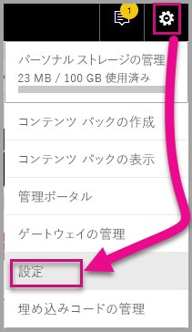

2. **[開発者]** を選択して、**[テスト用の開発者向けビジュアルを有効にする]** チェックボックスをオンにします。

    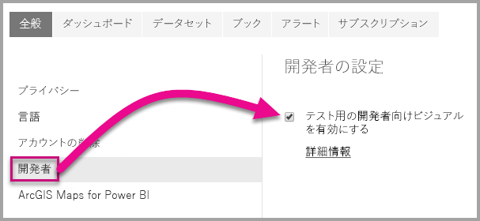

3. Power BI Desktop レポートをアップロードします。  

    [データ] > [ファイル] > [ローカル ファイル] の順に移動します。

    まだ Power BI Desktop レポートをお持ちでない場合は、サンプルの Power BI Desktop レポートを[ダウンロード](https://microsoft.github.io/PowerBI-visuals/docs/step-by-step-lab/images/US_Sales_Analysis.pbix)できます。

    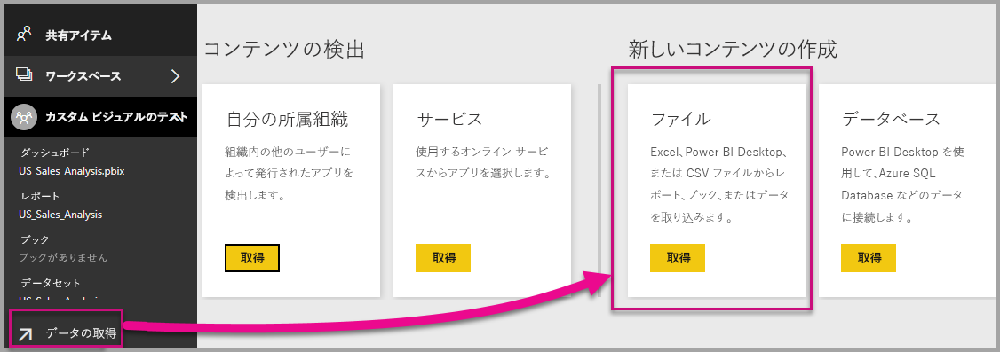 

    レポートを表示するには、左側のナビゲーション ウィンドウにある **[レポート]** セクションから **[US_Sales_Analysis]** を選択します。

    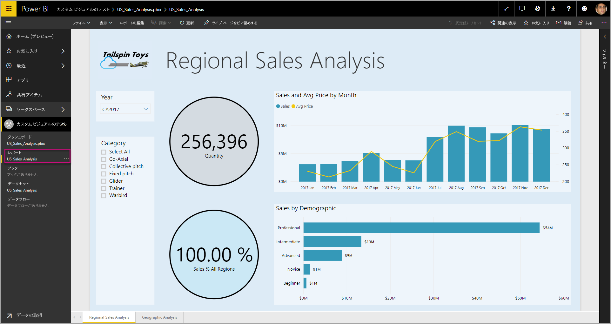

4. 次に、Power BI サービス内でレポートを編集する必要があります。

    **[レポートの編集]** へ移動します。

    

5. **[ビジュアル]** ウィンドウから **[開発者向けビジュアル]** を選択します。

    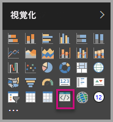

    > [!Note]
    > このビジュアルは、コンピューター上で起動したカスタム ビジュアルを表示しています。 開発者の設定が有効になっている場合のみ、利用可能です。

6. ビジュアルがレポート キャンバスに追加されたことを確認します。

    

    > [!Note]
    > これは、Update メソッドが呼び出された回数を表示する非常に簡単なビジュアルです。 この段階で、ビジュアルはまだデータを取得していません。

7. レポートで新しいビジュアルを選択した状態で、[フィールド] ウィンドウに移動し、[売上] を展開して [数量] を選択します。

    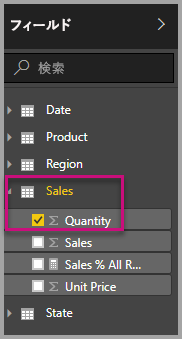

8. 次に、新しいビジュアルをテストするために、ビジュアルのサイズを変更して、更新値がインクリメントされていることを確認します。

    

PowerShell で実行されるカスタム ビジュアルを停止するために、Ctrl キーを押しながら C キーを押します。 バッチ ジョブの終了を求められた場合は、Y を入力して、Enter キーを押します。

## <a name="adding-visual-elements"></a>ビジュアル要素の追加

次に、**D3 JavaScript ライブラリ** をインストールする必要があります。 D3 とは、Web ブラウザーに動的な対話型データのビジュアルを生成するための JavaScript ライブラリです。 広く実装されている SVG HTML5 および CSS 標準を利用します。

これで、テキストと共に円を表示するカスタム ビジュアルを開発できるようになりました。

> [!Note]
> このチュートリアルの多くのテキスト エントリは、[こちら](https://github.com/uve/circlecard)からコピーできます。

1. PowerShell に **D3 ライブラリ**をインストールするために、次のコマンドを入力します。

    ```powershell
    npm i d3@3.5.5 --save
    ```

    

2. **D3 ライブラリ**の種類の定義をインストールするために、次のコマンドを入力します。

    ```powershell
    npm i @types/d3@3.5
    ```

    

    このコマンドは、JavaScript ファイルに基づいて TypeScript 定義をインストールします。(JavaScript のスーパーセットである)TypeScript でのカスタム ビジュアルの開発が可能になります。 Visual Studio Code は、TypeScript アプリケーションを開発するための理想的な IDE です。

3. [Visual Studio Code](https://code.visualstudio.com/) を起動します。

    次のコマンドを使用して、PowerShell から **Visual Studio Code** を起動できます。

    ```powershell
    code .
    ```

4. **[エクスプローラー] ウィンドウ**で、**[node_modules]** フォルダーを展開して **d3 ライブラリ**がインストールされたことを確認します。

    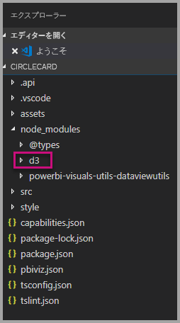

5. **[エクスプローラー] ウィンドウ**で [node_modules] > [@types] > [d3] の順に展開して、TypeScript ファイルである **index.d.ts** を確認します。

    

6. **pbiviz.json** ファイルを選択します。

7. **d3 ライブラリ**を登録するために、次のファイル参照を externalJS 配列に入力します。 既存のファイル参照と新しいファイル参照の間に、必ず "*コンマ*" を追加してください。

    ```javascript
    "node_modules/d3/d3.min.js"
    ```
    

8. **pbiviz.json** ファイルへの変更を保存します。

### <a name="developing-the-visual-elements"></a>ビジュアル要素の開発

ここでは、円とサンプル テキストを表示するカスタム ビジュアルを開発する方法を見ていきます。

1. **[エクスプローラー] ウィンドウ**で、**[src]** フォルダーを展開して、**[visual.ts]** を選択します。

    > [!Note]
    > **visual.ts** ファイルの最上部のコメントに注目してください。 MIT ライセンス契約の下で、Power BI カスタム ビジュアル パッケージを使用する権限が、無料で付与されます。 契約の一環として、ファイルの最上部に必ずコメントを残す必要があります。

2. Visual クラスから、以下の既定のカスタム ビジュアル ロジックを削除します。
    * 4 つのクラス レベルのプライベート変数宣言。
    * コンストラクターのすべてのコード行。
    * Update メソッドのすべてのコード行。
    * parseSettings および enumerateObjectInstances メソッドを含む、モジュール内の残りのすべての行。

    モジュール コードが次のようになっていることを確認します。

    ```typescript
    module powerbi.extensibility.visual {
    "use strict";
    export class Visual implements IVisual {

        constructor(options: VisualConstructorOptions) {

        }

        public update(options: VisualUpdateOptions) {

            }
        }
    }
    ```

3. *Visual* クラス宣言の下に、次の class-level プロパティを挿入します。

    ```typescript
     private host: IVisualHost;
     private svg: d3.Selection<SVGElement>;
     private container: d3.Selection<SVGElement>;
     private circle: d3.Selection<SVGElement>;
     private textValue: d3.Selection<SVGElement>;
     private textLabel: d3.Selection<SVGElement>; 
    ```

    

4. 次のコードを "*コンストラクター* "に追加します。

    ```typescript
    this.svg = d3.select(options.element)
                 .append('svg')
                 .classed('circleCard', true);
    this.container = this.svg.append("g")
                         .classed('container', true);
    this.circle = this.container.append("circle")
                             .classed('circle', true);
    this.textValue = this.container.append("text")
                                 .classed("textValue", true);
    this.textLabel = this.container.append("text")
                                 .classed("textLabel", true);
    ```

    このコードでは、ビジュアルの中に SVG グループを追加して、そこに円と 2 つのテキスト要素という合計 3 つの図形を追加します。

    ドキュメント内のコードを書式設定するには、**Visual Studio Code ドキュメント**の任意の場所をクリックして、**[ドキュメントのフォーマット]** を選択します。

      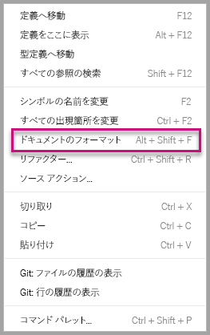

    読みやすさを向上させるために、コード スニペットに貼り付ける際は、必ずドキュメントを書式設定することをお勧めします。

5. *update* メソッドに次のコードを追加します。

    ```typescript
    let width: number = options.viewport.width;
    let height: number = options.viewport.height;
    this.svg.attr({
     width: width,
     height: height
    });
    let radius: number = Math.min(width, height) / 2.2;
    this.circle
     .style("fill", "white")
     .style("fill-opacity", 0.5)
     .style("stroke", "black")
     .style("stroke-width", 2)
    .attr({
     r: radius,
     cx: width / 2,
     cy: height / 2
    });
    let fontSizeValue: number = Math.min(width, height) / 5;
    this.textValue
     .text("Value")
     .attr({
         x: "50%",
         y: "50%",
         dy: "0.35em",
         "text-anchor": "middle"
     }).style("font-size", fontSizeValue + "px");
    let fontSizeLabel: number = fontSizeValue / 4;
    this.textLabel
     .text("Label")
     .attr({
         x: "50%",
         y: height / 2,
         dy: fontSizeValue / 1.2,
         "text-anchor": "middle"
     })
     .style("font-size", fontSizeLabel + "px");
    ```

    *このコードはビジュアルの幅と高さを設定して、ビジュアル要素の属性と形式を初期化します。*

6. **visual.ts** ファイルを保存します。

7. **capabilities.json** ファイルを選択します。

    14 行目から、オブジェクト要素全体 (行 14 ～ 60) を削除します。

8. **capabilities.json** ファイルを保存します。

9. PowerShell で、カスタム ビジュアルを起動します。

    ```powershell
    pbiviz start
    ```

### <a name="toggle-auto-reload"></a>自動再読み込みの切り替え

1. Power BI レポートに戻ります。
2. 開発者向けビジュアルの上に表示されるツールバーで、**[自動再読み込みの切り替え]** を選択します。

    

    このオプションは、プロジェクトの変更を保存するたびに、ビジュアルが自動的に再読み込みされることを保証します。

3. **[フィールド] ウィンドウ**から、**[数量]** フィールドを開発者向けビジュアルにドラッグします。

4. ビジュアルが次のようになっていることを確認します。

    

5. ビジュアルのサイズを変更します。

    ビジュアルで使用可能なディメンションに適合するように、円とテキストの値がスケーリングされることを確認します。

    update メソッドは、ビジュアルのサイズ変更の際に連続で呼び出され、結果として、ビジュアル要素の再スケーリングが円滑に行われます。

    これで、ビジュアル要素の開発が終わりました。

6. 引き続き、ビジュアルを実行します。

## <a name="configuring-data-binding"></a>データ バインドの構成

データ ロールとデータ ビューのマッピングを定義して、メジャーの値と表示名を表示するようにカスタム ビジュアル ロジックを変更します。

### <a name="configuring-the-capabilities"></a>機能の構成

**capabilities.json** ファイルを変更して、データ ロールとデータ ビューのマッピングを定義します。

1. Visual Studio Code で、**capabilities.json** ファイルの **dataRoles** 配列内から、すべてのコンテンツ (行 3 ～ 12) を削除します。

2. **dataRoles** 配列内に、次のコードを挿入します。

    ```json
    {
     "displayName": "Measure",
     "name": "measure",
     "kind": "Measure"
    }
    ```
    **dataRoles** 配列に、種類が**メジャー**の単一のデータ ロールを定義しました。名前は **measure**、表示は **Measure** となります。 このデータ ロールによって、メジャー フィールドまたは集計されたフィールドのどちらかを渡すことが可能になります。

3. **dataViewMappings** 配列内から、すべてのコンテンツ (行 10 ～ 31) を削除します。

4. **dataViewMappings** 配列内に、次のコンテンツを挿入します。

    ```json
            {
            "conditions": [
                { "measure": { "max": 1 } }
            ],
            "single": {
                "role": "measure"
            }
           }
    ```
    これで、**measure** という名前のデータ ロールに 1 つのフィールドを渡すことができるように、**dataViewMappings** 配列を定義しました。

5. **capabilities.json** ファイルを保存します。

6. Power BI で、ビジュアルが**メジャー**と共に構成できるようになったことを確認します。

    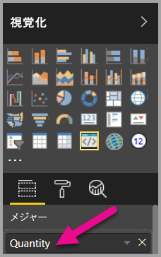

    > [!Note]
    > ビジュアル プロジェクトには、データ バインド ロジックがまだ含まれていません。

### <a name="exploring-the-dataview"></a>データビューの確認

1. ビジュアルの上に表示されるツールバーで、**[Dataview の表示]** を選択します。

    

2. **single** まで下方向に展開して、値を確認します。

    

3. **metadata** から、さらに **columns** 配列内へと下方向に展開して、特に **format** と **displayName** の値を確認します。

    

4. もう一度ビジュアルに切り替えて、ビジュアルの上に表示されるツールバーで、**[Dataview の表示]** を選択します。

    

### <a name="configuring-data-binding"></a>データ バインドの構成

1. **Visual Studio Code** の **visual.ts**ファイルに、update メソッドの最初のステートメントとして、次のステートメントを追加します。

    ```typescript
    let dataView: DataView = options.dataViews[0];
    ```
    

    このステートメントでは、簡単にアクセスできるように *dataView* を 1 つの変数に代入して、*dataView* オブジェクトを参照するようにその変数を宣言します。

2. **update** メソッドで、.text(“Value”)** を次のように置き換えます。

    ```typescript
    .text(dataView.single.value as string)
    ```
    

3. **update** メソッドで、**.text(“Label”)** を次のように置き換えます。

    ```typescript
    .text(dataView.metadata.columns[0].displayName)
    ```
    

4. **visual.ts** ファイルを保存します。

5. **Power BI** で、ビジュアルを確認します。値と表示名が表示されています。

これで、データ ロールを構成して、ビジュアルをデータビューにバインドできました。

次のチュートリアルでは、カスタム ビジュアルに書式設定オプションを追加する方法について説明します。

## <a name="debugging"></a>デバッグ

カスタム ビジュアルのデバッグに関するヒントについては、[デバッグ ガイド](https://microsoft.github.io/PowerBI-visuals/docs/how-to-guide/how-to-debug/)を参照してください。

## <a name="next-steps"></a>次の手順

> [!div class="nextstepaction"]
> [書式設定オプションの追加](custom-visual-develop-tutorial-format-options.md)
