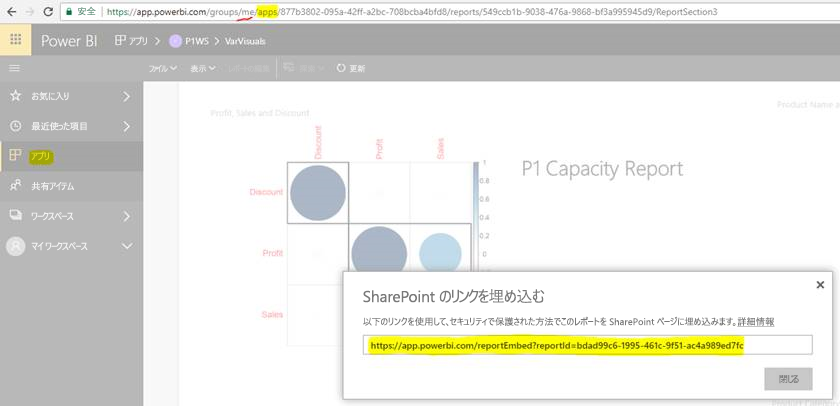

# アプリからレポートやダッシュボードを埋め込む

**Power BI** では、関連のある**ダッシュボード**や**レポート**をすべて 1 つの場所にまとめるアプリを作成し、組織内の大きなユーザー グループに発行することができます。 これらのアプリの使用は、ユーザーがすべて Power BI ユーザーである場合に関連します。したがって、Power BI アプリを使用すれば、コンテンツをそれらのユーザーと共有することができます。 ここでは、発行済み Power BI アプリから、およびサード パーティ製アプリケーションへのコンテンツの埋め込みを行う簡単な手順をいくつか共有します。

## 埋め込み用のレポート埋め込み URL の取得方法

1. 自分自身と共有するか、このフローを完了するように別のユーザーを誘導することで、ユーザー ワークスペース ("マイ ワークスペース") でアプリケーションをインスタンス化します。

2. Power BI サービスで対象のレポートを開きます。

3. [ファイル]、[SharePoint Online に埋め込む] の順に移動し、そこからレポート埋め込み URL を取得するか (以下のスナップショットを参照)、GetReports/GetReport REST API を呼び出して、応答から対応するレポートの embedURL フィールドを抽出します (ユーザーのワークスペースでアプリがインスタンス化されるため、REST 呼び出しでは URL の一部としてワークスペース識別子は使用できないことに注意してください)。

4. 手順 3 で取得した埋め込み URL を使用します。これは、JS SDK で使用します。

    

## 埋め込み用のダッシュボード埋め込み URL の取得方法

1. 自分自身と共有するか、このフローを完了するように別のユーザーを誘導することで、ユーザー ワークスペース ("マイ ワークスペース") でアプリケーションをインスタンス化します。

2. GetDashboards REST API を呼び出し、応答から対応するダッシュボードの embedURL フィールドを抽出します (ユーザーのワークスペースでアプリがインスタンス化されるため、REST 呼び出しでは URL の一部としてワークスペース識別子は使用できないことに注意してください)。

3. 手順 4 で取得した埋め込み URL を使用します。これは JS SDK で使用します。

## 次の手順

サード パーティの顧客と組織向けのアプリ ワークスペースから埋め込む方法も確認します。

> [!div class="nextstepaction"]
>[サード パーティの顧客向けの埋め込み](embed-sample-for-customers.md)

> [!div class="nextstepaction"]
>[組織向けの埋め込み](embed-sample-for-your-organization.md)