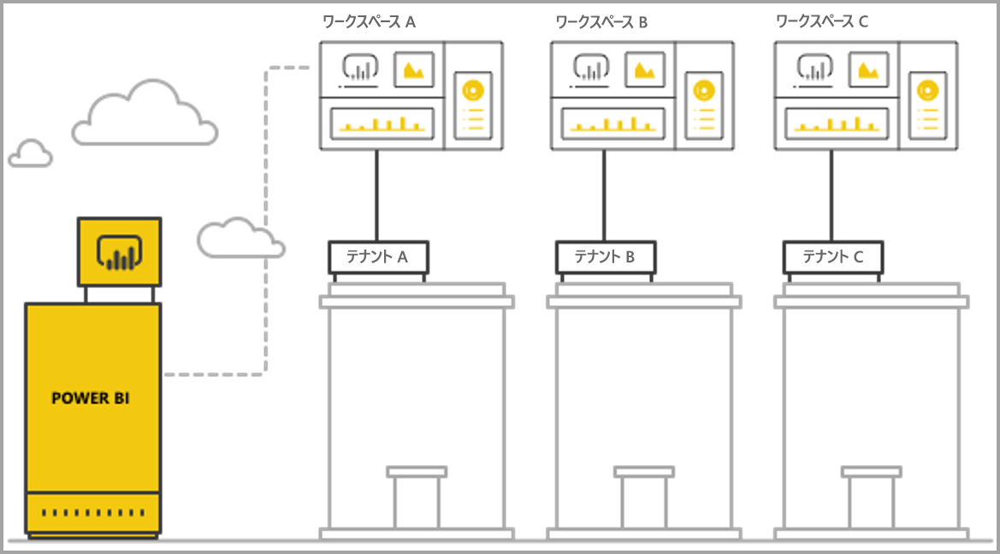
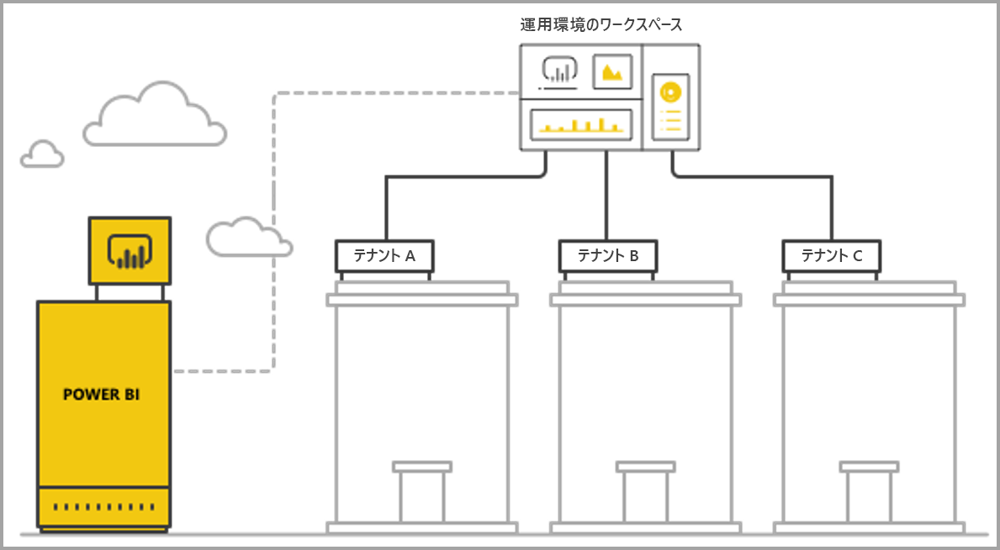

# Power BI の埋め込み分析でマルチテナントを管理する

マルチテナント SaaS アプリケーションを設計するときは、SaaS アプリケーションのニーズに最適なテナント モデルを慎重に選択する必要があります。 このプロセスは、SaaS アプリケーションの埋め込み分析部分としての Power BI に対しても有効です。 テナント モデルにより、Power BI およびストレージ アカウント内で各テナントのデータがマップおよび管理される方法が決まります。 テナント モデルは、アプリケーションの設計と管理に影響します。 後で別のモデルに切り替えると、コストがかかり、破壊的になる可能性があります。

Power BI Embedded では、テナント間の分離を維持するための基本的な方法が主に 2 つあります。

   1. **ワークスペースに基づく分離** - テナントごとに独立した Power BI ワークスペースを作成します。
   2. **行レベルのセキュリティに基づく分離** - 基になるデータを使用して、ユーザーまたはグループごとにデータへのアクセスを制御および管理します。

この記事では、さまざまな方法について説明し、複数の評価基準に従って分析します。

## 概念と用語

**[AAD](https://docs.microsoft.com/azure/active-directory/fundamentals/active-directory-whatis)** - Azure Active Directory。

**AAD アプリケーション** - AAD でのアプリケーション ID。 認証には、AAD アプリケーションが必要です。

**SaaS (サービスとしてのソフトウェア) アプリケーション** - エンタープライズまたは ISV によって実装されるシステムであり、通常はオンライン サービスです。 また、複数の顧客テナント (組織) を提供するための関連するソフトウェア システムでもあります。 この記事では、**SaaS アプリケーションで Power BI Embedded を使用して異なるテナントに分析を提供します**。 Power BI Embedded は、オンライン接続されているすべての種類のアプリケーションで動作できます。

**テナント** – SaaS アプリケーションと、SaaS アプリケーションに自分で格納したリソースやデータを使用する、単一の顧客 (組織)。

**[Power BI](../power-bi-overview.md)** - Power BI Embedded のプラットフォームとして機能する Power BI クラウド サービス。

**Power BI テナント** - 単一の AAD テナントに関連付けられている Power BI リソースのセット。

**[Power BI ワークスペース](../service-create-workspaces.md)** - Power BI のコンテンツ用のコンテナー。

**Power BI 成果物** – ダッシュボード、レポート、データセット、データフローなど、Power BI ワークスペース内にはいくつかの Power BI 成果物があります。

**[Power BI Embedded](azure-pbie-what-is-power-bi-embedded.md)**  -Power BI のコンテンツを管理して Power BI の要素を埋め込むアプリケーションを開発者が構築できるようにするパブリック API のセット。

**[行レベルのセキュリティ (RLS)](embedded-row-level-security.md)** - テーブル内の各行のデータへのユーザー アクセスを制御する機能を提供します。 データ ソース レベルまたは Power BI のセマンティック モデルで、行レベルのセキュリティを実装することができます。

**マスター ユーザー** - Power BI 内の SaaS アプリケーションを表す ID であり、SaaS アプリケーションで Power BI API を呼び出すときに使用されます。 Power BI Pro ライセンスを持つ AAD ユーザーである必要があります。

**AAD アプリケーション ユーザー (サービス プリンシパル)** - Power BI 内の SaaS アプリケーションを表す ID であり、SaaS アプリケーションで Power BI API を呼び出すときに使用されます。 AAD Web アプリケーションである必要があります。 Power BI での認証のために、"*マスター*" ユーザーの代わりに使用できます。

**容量** - Power BI サービス実行専用のリソースのセット。 [Power BI Premium 容量](../service-premium-what-is.md)は Power BI を社内で使用する企業を対象としたものですが、[Power BI Embedded 容量](azure-pbie-create-capacity.md)はサード パーティ向けの SaaS アプリケーションを開発するアプリケーション開発者を対象としています。

**[Power BI Pro ライセンス](../service-admin-purchasing-power-bi-pro.md)** - ユーザー ベースのライセンスであり、アプリ ワークスペースへのコンテンツの発行、Premium 容量なしでのアプリの利用、ダッシュボードの共有、ダッシュボードおよびレポートのサブスクライブを行う権限が付与されます。

**[データ接続モード](../desktop-directquery-about.md)** - 異なるモードで Power BI にデータ ソースを接続できます。

   * インポート - データを取得する最も一般的な方法です。
   * DirectQuery - ソース リポジトリ内のデータに直接接続します。
   * ライブ接続 - Analysis Services のデータ (Azure とオンプレミスの両方) に直接接続するもう 1 つのモードです。

## 評価基準

SaaS アプリケーションに適したテナント モデルの最適な選択肢は、具体的なビジネスおよび技術的な要件やデータ アーキテクチャなどによって異なります。 これらの要件および使用可能なテナント モデルのオプションとトレードオフをよく理解すると、SaaS アプリケーションに対する堅牢で、高パフォーマンスで、コスト効率に優れた、スケーラブルなアーキテクチャを定義するのに役立ちます。

異なるテナント モデルを選択するときに検討すべき点のセットを次に示します。

### データのアーキテクチャ

通常、Power BI Embedded を使用してアプリケーションを構築するときは、1 つまたは複数のテナント データベースが既に存在します。 Power BI Embedded には、データベースのテナント モデルと同様のテナント モデルを使用するのが簡単です。 データベースのテナント モデルをまだ定義されていない場合は、データ アーキテクチャを決定する前に他の側面を考慮することができます。

### データの分離

格納されるデータの機密性はどれくらいですか。 どのような分離レベルで異なる顧客のテナントを分離する必要がありますか。 答えは、さまざまな業界や特定の顧客の具体的な要件によって異なる場合があります。

### スケーラビリティ

最適なソリューションを見つけるには、近い将来に到達するスケールを定義します。 今は適切であるように見えるソリューションでも使用量やデータがスケールアップすると適切ではなくなる可能性があることに注意してください。 スケーラビリティを分析するときは、次の一覧を検討してください。

   * テナント (顧客) の数。
   * 各テナントのレポート、ダッシュボード、データセットの数。
   * 各データセットのデータのサイズと更新の間隔。
   * ユーザーの数。
   * ピーク時の同時実行ユーザーの数。

SaaS アプリケーションによっては、顧客の数や使用量は少なくても、データ量は多い場合があります。 または、顧客数や使用量は多くても、顧客ごとのデータやレポートの量は少ないこともあります。 このような状況での高い値は、将来のコストと運用の複雑さに影響する可能性があります。

### 自動化と運用の複雑さ

自動化する必要がある頻繁に発生するプロセスを特定します。

   * 新しいテナントをオンボーディングする頻度はどれくらいですか。 各テナントを完全にオンボードするにはどのようなアクションが必要ですか。
   * デプロイする必要がある新規または更新された Power BI コンテンツのリリース周期はどれくらいですか。
   * 各テナントにはいくつの行レベル セキュリティ ロールが定義されていますか。  

これらのプロセスとその対処方法を明らかにすると、各モデルの管理に伴う運用の複雑さを理解するのに役立ちます。

### データ所在地の要件と複数の地域をサポートする必要性

Power BI Embedded では、Multi-Geo のデプロイ (プレビュー機能) がサポートされています。 [Multi-Geo](embedded-multi-geo.md) を使用すると、Power BI Embedded のリソースを異なる複数のリージョンにデプロイし、特定のコンテンツを特定のリージョンに存在するように割り当てることができます。 この機能はすべてのモデルで使用できますが、管理するコンテンツの量とコストに影響する場合があります。 現在、Multi-Geo はデータ所在地要件を満たすために設計されており、コンシューマーの近くにデータを移動することによるパフォーマンスの向上は行われません。

### コスト

[Power BI Embedded](https://azure.microsoft.com/services/power-bi-embedded/) の購入モデルは **Power BI Premium** のようなリソース ベースです。 固定のコンピューティング能力とメモリで 1 つまたは複数の容量を購入します。 この容量は、**Power BI Embedded** を使用するときの主なコスト項目です。 容量を使用するユーザーの数に制限はありません。 唯一の制限は、容量のパフォーマンスです。 *マスター* ユーザーごと、または Power BI ポータルにアクセスする必要がある特定のユーザーごとに、[Power BI Pro ライセンス](../service-admin-licensing-organization.md)が必要です。

ライブ環境と使用状況をシミュレートし、容量に対してロード テストを実行して、容量で予想される負荷をテストおよび測定することをお勧めします。 Azure 容量または [Premium 容量メトリック アプリ](../service-admin-premium-monitor-capacity.md)で使用できるさまざまなメトリックで、負荷とパフォーマンスを測定できます。

### コンテンツのカスタマイズと作成

SaaS アプリケーションで、フローの一部としてレポートを編集および作成したり、、サービスにデータをアップロードしたりする機能をユーザーに提供するには、2 つのアプローチがあります。

   * [埋め込まれた iFrame での編集/作成モード](https://github.com/Microsoft/PowerBI-JavaScript/wiki/Create-Report-in-Embed-View) - ユーザーは、SaaS アプリケーション内で、レポートを表示したり、新しい空白のキャンバスを作成したりします。 この方法では、ユーザーは、Power BI ツール バーを使用し、ワークスペースでのデータセットに基づいてコンテンツを作成できます。 使い慣れた環境でのユーザーのコンテキストなので、このオプションをお勧めします。 操作や編集を簡単に始めることができ、ユーザーが作成するレポートは既存のデータセットに関連付けられます。

   * Power BI Desktop を使用してコンテンツを作成し、SaaS アプリケーションの UI を使用してそれをワークスペースにアップロードします。 このアプローチの方が、ユーザーが Power BI Desktop で使用できるツールは豊富です。 ただし、ユーザーは SaaS アプリケーションのコンテキスト外で別のツールを理解する必要があるため、このアプローチはお勧めしません。 PBIX ファイルをアップロードするということはデータセットを追加することを意味し、既にワークスペースにあるデータセットと重複する可能性があります。

## Power BI ワークスペースに基づく分離

Power BI ワークスペースに基づく分離では、1 つの Power BI テナントからの複数のテナントが SaaS アプリケーションでサポートされます。 ワークスペースに基づく分離には、異なるテナントで使用されるすべての Power BI コンテンツが含まれます。 テナントの分離は、複数のワークスペースを作成することにより、Power BI ワークスペースのレベルで実現されます。 各ワークスペースには、そのテナントの関連するデータセット、レポート、およびダッシュボードが含まれています。 また、各ワークスペースは、そのテナントのデータにのみ接続されます。 さらに分離が必要な場合は、ワークスペースとそのコンテンツごとに、"*マスター*" ユーザーまたはサービス プリンシパルを作成できます。

### データのアーキテクチャ

テナントのデータを管理するには 2 つの主な方法があります。

* テナントごとに個別のデータベース
* 1 つのマルチテナント データベース

SaaS アプリケーションのストレージでテナントごとに個別のデータベースが保持されている場合の、Power BI での自然な選択は、シングルテナント データセットと、データセットごとに対応するデータベースを指す接続文字列を使用することです。

SaaS アプリケーションのストレージで、すべてのテナントについてマルチテナント データベースが使用されている場合は、ワークスペースによってテナントを簡単に分離できます。 関連するテナントのデータのみを取得するパラメーター化されたデータベース クエリを使用して、Power BI のデータセットに対するデータベース接続を構成できます。 [Power BI Desktop](../desktop-query-overview.md) を使用するか、またはクエリで [API](https://docs.microsoft.com/rest/api/power-bi/datasets/updatedatasourcesingroup) と[パラメーター](https://docs.microsoft.com/rest/api/power-bi/datasets/updateparametersingroup)を使用して、接続を更新できます。

### データの分離

このテナント モデルのデータは、ワークスペース レベルで分離されます。 ワークスペースとテナントの間の簡単なマッピングにより、あるテナントのユーザーから別のテナントのコンテンツを見ることができないようにします。 1 つの "*マスター*" ユーザーを使用するには、すべての異なるワークスペースに対するアクセス権を持っている必要があります。 エンド ユーザーに表示するデータの構成は、[埋め込みトークンの生成](https://docs.microsoft.com/rest/api/power-bi/embedtoken)、エンド ユーザーが見ることのできないバックエンド専用プロセスで、または変更の間に定義されます。

分離を強化するには、アプリケーション開発者は、複数のワークスペースにアクセスできる "*マスター*" ユーザーまたはアプリケーションではなく、アプリケーションごとの "*マスター*" ユーザーまたはワークスペースを定義できます。 これにより、ヒューマン エラーまたは資格情報のリークが発生しても、複数の顧客のデータが漏えいしないようにできます。

### スケーラビリティ

このモデルの利点の 1 つは、テナントごとの複数のデータセットにデータを分離することで、[単一データセットのサイズ制限](https://docs.microsoft.com/power-bi/service-premium-large-datasets) (現在、容量 10 GB) が適用されないことです。 容量をオーバー ロードするときに、データセットのアクティブなメモリを解放するデータセットが使用されていない、削除できます。 1 つの大規模なデータセットでは、このようなことはできません。 複数のデータセットを使用すると、必要に応じて、複数の Power BI 容量にテナントを分離することもできます。

このような利点はありますが、将来的に SaaS アプリケーションが達する可能性のあるスケールを考慮する必要があります。 たとえば、管理できる成果物の数に関する制限に到達する可能性があります。 詳細については、この記事で後述されているデプロイに関する[制限](#summary-comparison-of-the-different-approaches)をご覧ください。 SKU が使用される容量には、同じ時間と最大データ更新の頻度で実行できる数の更新に収まるようにデータセットが必要なメモリのサイズに制限が導入されています。 数百または数千のデータセットを管理するときは、テストすることをお勧めします。 また、平均とピーク時の使用量、および他のテナントとは管理が異なる大きいデータセットを持つ特定のテナントや使用パターンが異なるテナントについて、考慮することをお勧めします。

### 自動化と運用の複雑さ

Power BI ワークスペースに基づく分離では、アプリケーション開発者は、数百または何千もの成果物を管理することが必要な場合があります。 アプリケーションのライフサイクル管理で頻繁に発生するプロセスを定義し、このテナント モデルで大規模にこれらの操作を実行するための適切なツール セットがあることを確認することが不可欠です。 操作の例を次に示します。

   * 新しいテナント (顧客) の追加
   * 一部または全部のテナントのレポートまたはダッシュボードの更新
   * 一部または全部のテナントのデータ セット スキーマの更新
   * 特定のテナントの計画外のカスタマイズ
   * データセットの更新の頻度

たとえば、新しいテナント用のワークスペースの作成は、自動化を必要とする一般的なタスクです。 [Power BI REST API](https://docs.microsoft.com/rest/api/power-bi/) を使用すると、[ワークスペース作成時の完全な自動化](https://powerbi.microsoft.com/blog/duplicate-workspaces-using-the-power-bi-rest-apis-a-step-by-step-tutorial/)を実現できます。

### Multi-Geo のニーズ

Multi-Geo では、目的のリージョンで容量を購入し、その容量にワークスペースを割り当てる必要があります。 異なるリージョンで異なるテナントをサポートする必要がある場合は、目的のリージョンで容量にテナントのワークスペースを割り当てる必要があります。 このタスクは単純な操作であり、コストは多くても同じ容量にすべてのワークスペースを割り当てる分だけです。 ただし、複数のリージョンにデータを置く必要があるテナントの場合は、ワークスペース内のすべての成果物を各リージョンの容量に複製する必要があり、コストと管理の複雑さの両方が増します。

### コスト

Power BI Embedded を使用するアプリケーション開発者は、[運用のための Power BI Embedded 容量を購入する](embed-sample-for-customers.md#move-to-production)必要があります。  ワークスペースに基づく分離モデルの影響および容量に対するその影響を理解しておく必要があります。

ワークスペースに基づく分離モデルは、次の理由で容量に適しています。

   * 容量に独立して割り当てることができる最小のオブジェクトはワークスペースなので (つまり、たとえばレポートを割り当てることはできません)、ワークスペースでテナントを分離すると、最大限の柔軟性で、各テナントとそのパフォーマンスのニーズを管理し、スケールアップ/スケールダウンによって容量の使用を最適化できます。 たとえば、量が多くて揮発性の高い大規模で重要なテナントは独立した容量で管理することにより一貫したサービス レベルを保証する一方で、小規模なテナントは別の容量にグループ化してコストを最適化できます。

   * ワークスペースを分離することは、データセットをテナント間で分離することにより、1 つの大規模なデータセットを使用するのではなく、データ モデルを小さなチャンクにできることも意味にします。 このタスクにより、容量でのメモリの使用をいっそう適切に管理でき、必要のない小さな未使用のデータセットを削除しながら、ユーザーが満足するパフォーマンスを維持できます。

複数のデータセットがある場合、更新プロセスで余分な容量が必要になることがあるので、アプリケーション開発者は並列更新の数に対する制限を考慮する必要があります。

### コンテンツのカスタマイズと作成

コンテンツ作成の基本的なユース ケースの場合、アプリケーション開発者は、編集機能を持つことができるテナントと、各テナントで編集を行うことができるユーザーの数を、慎重に検討する必要があります。 各テナントで複数のユーザーに編集を許可すると、多くのコンテンツが生成される場合があり、データセットごとのレポートの数や、ワークスペース内のデータセットの数など、データセットの制限に達する可能性があります。 この機能をユーザーに付与する場合は、コンテンツの生成をよく監視し、必要に応じてスケールアップすることをお勧めします。 同じ理由から、コンテンツの個人設定にはこの機能を使用しないことをお勧めします。この場合、各ユーザーがレポートに小さな変更を行って、自分用に保存する可能性があります。 SaaS アプリケーションでコンテンツの個人設定を許可する場合は、ユーザー固有のコンテンツに対するワークスペース保持ポリシーを導入して通知し、エンド ユーザーが異動したり、退職したり、プラットフォームを使用しなくなったりしたときの、コンテンツ削除のフローを容易にすることを検討します。

## 行レベルのセキュリティに基づく分離

行レベルのセキュリティに基づく分離の場合、SaaS アプリケーションでは 1 つのワークスペースを使用して複数のテナントがホストされます。 つまり、各 Power BI 成果物のレポート、ダッシュボード、データセットは 1 回だけ作成され、すべてのテナントによって使用されます。 テナント間のデータの分離は、マルチテナント データセットでの[行レベルのセキュリティ](embedded-row-level-security.md)を使用して実現されます。 エンド ユーザーが SaaS アプリケーションにログインしてコンテンツを開くと、そのユーザーのセッションに対して埋め込みトークンが生成され、ロールとフィルターにより、見ることを許可されたデータだけをユーザーが表示できることが保証されます。 同じテナントの異なるユーザーが同じデータを表示できないようにする場合は、アプリケーション開発者は、テナント間および同じテナント内の両方に、階層的なロールを実装する必要があります。

### データのアーキテクチャ

行レベルのセキュリティに基づく分離の実装は、すべてのテナントのデータが 1 つのデータ ウェアハウスに格納されている場合に最も簡単です。 この場合、アプリケーション開発者は、DirectQuery またはデータのインポートを使用して、データ ウェアハウスから Power BI のデータセットに関連するデータのみを渡すことができます。 データベース内のデータがテナントごとに分かれている場合は、1 つのデータセットに結合する必要があり、データベース内に存在するテナント間の分離が低下します。

### データの分離

行レベルのセキュリティに基づく分離では、データの分離はデータセットでの[行レベルのセキュリティの定義](embedded-row-level-security.md)を使用して実現され、これはすべてのデータが共存することを意味します。 この形式のデータの分離では、開発者のエラーによりデータの漏えいが発生しやすくなります。 行レベルのセキュリティはバックエンドで行われ、エンド ユーザーからセキュリティで保護されますが、データの機密性が高い場合、または顧客がデータの分離を要求している場合は、ワークスペースに基づく分離を使用する方がよい場合があります。

### スケーラビリティ

行レベルのセキュリティに基づく分離では、データがデータセットのサイズ制限 (現在は 10 GB) に収まる必要があります。 [増分更新](../service-premium-incremental-refresh.md)の導入と、予定されている Power BI データセット向け XMLA エンドポイントのリリースにより、データセットのサイズの制限は大幅に増える予定です。 ただし、その場合でも、データは、データ更新を実行するのに十分なメモリを残して、容量のメモリに収まる必要があります。 大規模なデプロイでは、現在の容量の制限をメモリが超過することでユーザーに対する問題が発生しないように、大きい容量を使用する必要があります。 スケールを処理する別の方法としては、Power BI の容量にすべてのデータをキャッシュするのではなく、 **[集計](../desktop-aggregations.md)** を使用したり、DirectQuery やライブ接続を使用してデータ ソースに直接接続したりすることができます。

### 自動化と運用の複雑さ

成果物の管理は、ワークスペースに基づく分離より、行レベルのセキュリティに基づく分離を使用する方がはるかに容易です。これは、テナントごとにバージョンが存在するのではなく、環境 (開発/テスト/運用) ごとに成果物のバージョンが 1 つだけであるためです。 大規模な環境では、成果物を管理するということは、数千や数万ではなく、数十の成果物を管理および更新することを意味します。

Power BI には、RLS のロールやルールを変更または作成するための API はまだありません。 ロールの追加または変更は、Power BI Desktop で手動によってのみ行うことができます。 RLS の階層を適用する必要がある場合、慎重に計画しないと、複雑でエラーが発生しやすくなります。

頻繁な作成または更新が必要な多くのロールとロール定義を管理する必要がある場合、行レベルのセキュリティに基づく分離は、管理しやすさの観点からはスケーラブルではありません。

運用面でのもう 1 つの複雑さは、メモリの使用状況を細かく監視し、ユーザーのエクスペリエンスが円滑になるように、アラートとスケーリングの堅牢なメカニズムを構築する必要があることです。  

### Multi-Geo のニーズ

すべてのデータが 1 つのデータセットに格納されるため、特定の場所に特定のデータをバインドする必要があるデータ所在地の要件を満たすことは困難です。 また、すべてのデータが各リージョンにレプリケートされて格納されるため、複数のリージョンを使用するとコストも大幅に増加します。 地理的に異なる場所に置く必要があるテナントの数が限られている場合は、上で説明したワークスペースに基づく分離モデルを使用して、それらのテナントのデータだけを異なるリージョンで保持することができます。

### コスト

行レベルのセキュリティに基づく分離での主要なコスト要因は、データセットのメモリ占有領域です。 データセットを格納し、メモリ需要のピークのための追加メモリ バッファーを保持するのに十分な容量が必要です。 このような状況を緩和する方法の 1 つは、SQL Server データベースまたは SQL Server Analysis Services キューブにデータを格納し、DirectQuery またはライブ接続を使用して、データ ソースからリアルタイムにデータを取得することです。 この方法では、データ ソースのコストは増加しますが、メモリのニーズのために容量を大きくする必要性は低下するため、Power BI の容量のコストは減ります。

### コンテンツのカスタマイズと作成

エンド ユーザーは、レポートを編集または作成するとき、運用環境のマルチテナント データセットを使用できます。 そのため、[レポートの作成](https://github.com/Microsoft/PowerBI-JavaScript/wiki/Create-Report-in-Embed-View)または編集には、埋め込み iFrame のオプションだけを使用することをお勧めします。そうすれば、行レベルのセキュリティが適用された同じデータセットに依存できます。 ユーザーに追加のデータセットを含む PBIX ファイルをアップロードさせると、コストがかかり、行レベルのセキュリティに基づく分離を使用した管理が難しくなる場合があります。 また、ユーザーが同じワークスペース内で新しいコンテンツを生成するときは、運用ワークスペースが制限に達しないことを確認し、どのコンテンツがどのテナントに接続されているかを区別するための堅牢なメカニズムを構築する必要があります。

## 各種アプローチの概要の比較

> [!Important]
> 以下の分析は、製品の現在の状態に基づくものです。 毎月新しい機能をリリースすることで、新しい機能の提供と既存の制限や脆弱なスポットへの対応を続けています。 毎月のブログ投稿を見て新機能を確認した後、この記事に戻って、テナント モデルの推奨事項に対する新機能の影響を確認してください。

| 評価基準 | ワークスペース ベース   | 行レベルのセキュリティ ベース  |  |  |
|--------------------------------------|----------------------------------------------------------------------------------------------------------------------|---------------------------------------------------------------------------------------|---|---|
| データのアーキテクチャ  | テナントごとに個別のデータベースがある場合に最も簡単  | すべてのテナントのすべてのデータが 1 つのデータ ウェアハウス内にある場合に最も簡単   |  |  |
| データの分離  | 良い。 テナントごとに専用のデータセットがある。  | 中程度。 すべてのデータが同じ共有データセット内にあるが、アクセス制御によって管理される。  |  |  |
| スケーラビリティ  | 中。 データを複数のデータセットに分割することで最適化が可能。  | 最低。 データセットの制限によって制約される。  |  |  |
| Multi-Geo のニーズ  | ほとんどのテナントが 1 つのリージョンのみに存在するときに好適。  | 非推奨。 データセット全体を複数のリージョンに格納しておく必要がある。  |  |  |
| 自動化と運用の複雑さ  | 個々のテナントに対して良好な自動化。   大規模な多数の成果物の管理が複雑。  | Power BI 成果物の管理は容易だが、大規模な RLS の管理は複雑。  |  |  |
| コスト  | 低から中。 使用を最適化して、テナントあたりのコストを削減できる。  頻繁な更新が必要なときは増えることがある。  | インポート モードを使用する場合は、中から高。  DirectQuery モードを使用する場合は、低から中。  |  |  |
| コンテンツのカスタマイズと作成  | 好適。 大きな規模では制限に達する可能性がある。  | 埋め込み iFrame でのみコンテンツを生成  |  |  |

## デプロイに関する考慮事項と制限事項

**Power BI の成果物の制限:**

* 1 人のユーザーまたは 1 つのアプリケーションがメンバー/管理者になることのできるワークスペース V1 (グループ) の数は、250 です。
* 1 人のユーザーまたは 1 つのアプリケーションがメンバー/管理者になることのできるワークスペース V2 (フォルダー) の数は、1,000 です。
* 1 つのワークスペース内のデータセットの数は、1,000 です。
* 1 つのデータセットに接続されるレポート/ダッシュ ボードの数は、1,000 です。
* *.pbix* ファイルをアップロードするためのデータセット メモリ サイズの制限は、10 GB です。

**Power BI の容量に関する考慮事項と制限事項:**

* 各容量では、[購入した SKU](../service-premium-what-is.md) に従って、割り当てられているメモリと仮想コアのみを使用できます。
* 各 SKU に対して推奨されるデータセットのサイズについては、[Premium の大規模なデータセット](../service-premium-what-is.md#large-datasets)に関する記事をご覧ください。
* 専用容量でのデータセットの最大サイズは、10 GB です。
* "*インポート モード*" のデータセットで 1 日にスケジュールできる更新の数は、48 です。
* "*インポート モード*" のデータセットでスケジュールされた更新の間隔は、30 分です。
* 容量に対して同時に実行できる更新の数については、[リソースの管理と最適化](../service-premium-what-is.md#capacity-nodes)に関する記事をご覧ください。
* 容量のスケーリングの平均時間は、1 ～ 2 分です。 その間、容量は使用できません。 [ダウンタイムを回避する](https://powerbi.microsoft.com/blog/power-bi-developer-community-november-update-2018/#scale-script)ため、スケールアウト アプローチを使用することをお勧めします。

## 次の手順

* [Power BI を使用した埋め込み分析](embedding.md)
* [Power BI Embedded](azure-pbie-what-is-power-bi-embedded.md)
* [Power BI Premium](../service-premium-what-is.md)
* [行レベルのセキュリティ](embedded-row-level-security.md)