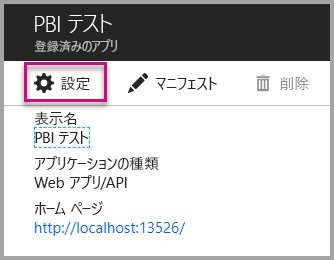
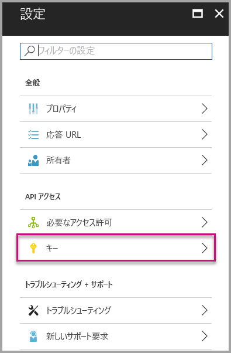

# <a name="tutorial-embed-a-power-bi-report-dashboard-or-tile-into-an-application-for-your-organization"></a>チュートリアル: 組織向けのアプリケーションに Power BI のレポート、ダッシュボード、タイルを埋め込む
このチュートリアルでは、組織向けのアプリケーションに **Power BI** を埋め込むときに、**Power BI .NET SDK** と **Power BI JavaScript API** を使って、アプリケーションにレポートを統合する方法を示します。 **Power BI** では、**ユーザー所有データ**を使用してレポート、ダッシュボード、またはタイルをアプリケーションに埋め込むことができます。 **ユーザー所有データ**を使用すれば、アプリケーションで Power BI サービスを拡張することができます。


このチュートリアルで学習する内容は次のとおりです。
>[!div class="checklist"]
>* Azure にアプリケーションを登録します。
>* Power BI レポートをアプリケーションに埋め込みます。

## <a name="prerequisites"></a>前提条件
作業を始めるには、**Power BI Pro** アカウントと **Microsoft Azure** サブスクリプションが必要です。

* **Power BI Pro** にサインアップしていない場合は、[無料の試用版にサインアップ](https://powerbi.microsoft.com/en-us/pricing/)してください。
* Azure サブスクリプションをお持ちでない場合は、始める前に[無料アカウントを作成](https://azure.microsoft.com/free/?WT.mc_id=A261C142F)してください。
* 独自の [Azure Active Directory テナント](create-an-azure-active-directory-tenant.md)のセットアップが必要です。
* [Visual Studio](https://www.visualstudio.com/) がインストールされている必要があります (バージョン 2013 以降)。

## <a name="setup-your-embedded-analytics-development-environment"></a>埋め込み分析開発環境をセットアップする

アプリケーションへのレポート、ダッシュボード、タイルの埋め込みを開始する前に、埋め込めるように環境がセットアップされていることを確認する必要があります。 セットアップの一環として、以下を行う必要があります。

[オンボード エクスペリエンス ツール](https://aka.ms/embedsetup/UserOwnsData)を使うと、環境の作成とレポートの埋め込みに役立つサンプル アプリケーションをすぐに使い始め、ダウンロードすることができます。

ただし、手動で環境をセットアップする場合は、以下を続行できます。
### <a name="register-an-application-in-azure-active-directory-azure-ad"></a>Azure Active Directory (Azure AD) にアプリケーションを登録する

アプリケーションを Azure Active Directory に登録すると、アプリケーションは Power BI REST API にアクセスできるようになります。 これにより、アプリケーションの ID を設定し、Power BI REST リソースへのアクセス許可を指定することができます。

1. [Microsoft Power BI API 条項](https://powerbi.microsoft.com/api-terms)に同意します。

2. [Azure Portal ](https://portal.azure.com)にサインインします。

    

3. 左側のナビゲーション ウィンドウで、**[すべてのサービス]**、**[アプリの登録]**、**[新しいアプリケーションの登録]** の順に選びます。

    </br>
    

4. 画面の指示に従って、新しいアプリケーションを作成します。 **ユーザー所有データ**の場合、アプリケーションの種類には **[Web アプリ/API]** を使用する必要があります。 また、**Azure AD** でトークン応答を返すために使用する、**[サインオン URL]** を指定する必要もあります。 アプリケーション固有の値を入力します ( 例:  http://localhost:13526/)

    

### <a name="apply-permissions-to-your-application-within-azure-active-directory"></a>Azure Active Directory でアプリケーションにアクセス許可を適用する

アプリ登録ページで指定されたものに加え、アプリケーションに対する追加のアクセス許可を有効にする必要があります。 アクセス許可を有効にするには、*グローバル管理者*アカウントでログインする必要があります。

### <a name="use-the-azure-active-directory-portal"></a>Azure Active Directory ポータルを使用する

1. Azure Portal で [[アプリの登録]](https://portal.azure.com/#blade/Microsoft_AAD_IAM/ApplicationsListBlade) を参照して、埋め込みに使うアプリを選びます。

    

2. **[設定]** を選び、**[API アクセス]** で **[必要なアクセス許可]** を選びます。

    

3. **[Windows Azure Active Directory]** を選択してから、**[サインインしたユーザーとしてディレクトリにアクセスします]** が選択されていることを確認します。 **[保存]** を選択します。

    

4. **[追加]** を選択します。

    

5. **[API を選択します]** を選びます。

    

6. **[Power BI サービス]** を選んでから、**[選択]** を選びます。

    

7. **[デリゲートされたアクセス許可]** のすべてのアクセス許可を選択します。 選択内容を保存するには 1 つずつ選択する必要があります。 完了したら、**[保存]** を選択します。

    

## <a name="setup-your-power-bi-environment"></a>Power BI の環境を設定する

### <a name="create-an-app-workspace"></a>アプリ ワークスペースを作成する

顧客向けのレポート、ダッシュボード、またはタイルを埋め込む場合は、コンテンツをアプリ ワークスペース内に配置する必要があります。

1. 最初に、ワークスペースを作成します。 **[ワークスペース]**  > **[アプリのワークスペースの作成]** の順に選びます。 これは、アプリケーションでアクセスする必要のあるコンテンツを配置する場所です。

    

2. ワークスペースの名前を付けます。 対応する**ワークスペース ID** が使用できない場合は、一意の ID になるように編集します。 これはアプリの名前にもなる必要があります。

    

3. 設定にはいくつかのオプションがあります。 **[パブリック]** を選択すると、組織内のすべてのユーザーがワークスペースの内容を表示できます。 一方、**[プライベート]** の場合、ワークスペースのメンバーしかその内容を表示できません。

    

    グループを作成した後は、公開/非公開を変更することはできません。

4. メンバーが**編集**可能かどうか、**表示専用**のアクセス許可を持つかどうかも選択できます。

    

5. ワークスペースへのアクセス許可を与えるユーザーの電子メール アドレスを追加して、**[追加]** を選択します。 追加できるのは個別ユーザーのみで、グループのエイリアスは追加できません。

6. ユーザーごとにメンバーか管理者かを判断します。管理者は、他のメンバーの追加を含め、ワークスペース自体を編集できます。 メンバーは、表示専用のアクセス許可を持っていない限り、ワークスペースのコンテンツを編集できます。 管理者とメンバーの両方がアプリを発行できます。

    新しいワークスペースを表示できるようになります。 Power BI でワークスペースが作成され、開きます。 メンバーであるワークスペースの一覧に表示されます。 管理者は、省略記号 (...) を選択すると、前の画面に戻って新しいメンバーの追加やアクセス許可の変更などの変更を加えることができます。

    

### <a name="create-and-publish-your-reports"></a>レポートを作成して発行する

Power BI Desktop を使用してレポートとデータセットを作成し、アプリ ワークスペースにこれらのレポートを発行できます。 レポートを発行するエンド ユーザーには、アプリ ワークスペースに発行するための Power BI Pro ライセンスが必要です。

1. GitHub からサンプルの [Blog Demo](https://github.com/Microsoft/powerbi-desktop-samples) をダウンロードします。

    

2. **Power BI Desktop** でサンプルの PBIX レポートを開きます

   

3. **アプリ ワークスペース**に発行します

   

    Power BI サービスを使ってオンラインでレポートを表示できるようになります。

   

## <a name="embed-your-content-using-the-sample-application"></a>サンプル アプリケーションを使用してコンテンツを埋め込む

次の手順に従い、サンプル アプリケーションを使用してコンテンツの埋め込みを開始します。

1. 最初に、GitHub から [User Owns Data サンプル](https://github.com/Microsoft/PowerBI-Developer-Samples)をダウンロードします。  [レポート](https://github.com/Microsoft/PowerBI-Developer-Samples/tree/master/User%20Owns%20Data/integrate-report-web-app)、[ダッシュボード](https://github.com/Microsoft/PowerBI-Developer-Samples/tree/master/User%20Owns%20Data/integrate-dashboard-web-app)、[タイル](https://github.com/Microsoft/PowerBI-Developer-Samples/tree/master/User%20Owns%20Data/integrate-tile-web-app)用にそれぞれ 1 つずつ、3 つの異なるサンプル アプリケーションがあります。  この記事は**レポート** アプリケーションに関するものです。手順については以下で説明します。

    

2. サンプル アプリケーションで Cloud.config ファイルを開きます。 アプリケーションを正常に実行するには、いくつかのフィールドを設定する必要があります。 **ClientID**、および **ClientSecret** というフィールドです。

    

    **ClientID** には、**Azure** から**アプリケーション ID** を設定します。 **ClientID** は、アクセス許可を要求しているユーザーに対して、アプリケーションが自身を識別するために使用します。

    **ClientID** を取得するには、次の手順に従います。

    [Azure Portal ](https://portal.azure.com)にサインインします。

    

    左側のナビゲーション ウィンドウで、**[すべてのサービス]**、**[アプリの登録]** の順に選びます。

    

    **ClientID** を使用する必要があるアプリケーションを選択します。

    

    **アプリケーション ID** が GUID として一覧表示されます。 この**アプリケーション ID** を、アプリケーションの **ClientID** として使います。

    

    **ClientSecret** は、**Azure** の **[アプリの登録]** セクションの **[キー]** セクションから設定します。

    **ClientSecret** を取得するには、次の手順に従います。

    [Azure Portal ](https://portal.azure.com)にサインインします。

    

    左側のナビゲーション ウィンドウで、**[すべてのサービス]**、**[アプリの登録]** の順に選びます。

    

    **ClientSecret** を使用する必要があるアプリケーションを選択します。

    

    **[設定]** を選択します。

    

    **[キー]** を選択します。

    

    **[説明]** に名前を入力し、**[期間]** を選択します。次に、**[保存]** を選択して、アプリケーションの **[値]** を取得します。 **キー値**を保存した後に **[キー]** ブレードを閉じると、値フィールドは**_非表示_** としてのみ示され、この時点では、**キー値**を取得することはできません。 **キー値**をなくした場合、**Azure portal** 内で新しく作成する必要があります。

    

     **groupId** には、Power BI から**アプリ ワークスペースの GUID** を設定します。

    

    **reportId** には、Power BI から**レポートの GUID** を設定します。

    

3. アプリケーションを実行します。

    最初に、**Visual Studio** で **[実行]** を選びます。

    

    次に、**[レポートを取得]** を選択します。

    

    サンプル アプリケーションでレポートを表示できるようになります。

    

## <a name="embed-your-content-within-your-application"></a>アプリケーション内にコンテンツを埋め込む
コンテンツを埋め込む手順は [Power BI REST API](https://docs.microsoft.com/rest/api/power-bi/) で実行できますが、この記事で説明するコード例は **.NET SDK** で作成されています。

レポートを Web アプリに統合するには、**Power BI REST API**、または **Power BI C# SDK** と、Azure Active Directory (AD) 承認**アクセス トークン**を使ってレポートを取得します。 その後、同じ**アクセス トークン**を使って、レポートを読み込みます。 **Power BI Rest API** では、特定の **Power BI** リソースへのプログラムによるアクセスが提供されます。 詳細については、「[Power BI REST API](https://docs.microsoft.com/rest/api/power-bi/)」(Power BI REST API) と [Power BI JavaScript API](https://github.com/Microsoft/PowerBI-JavaScript) に関するページを参照してください。

### <a name="get-an-access-token-from-azure-ad"></a>Azure AD からアクセス トークンを取得する
アプリケーション内では、Power BI REST API の呼び出しを行う前に、まず、Azure AD から**アクセス トークン**を取得する必要があります。 詳しくは、「[ユーザーを認証し、Power BI アプリ用の Azure AD アクセス トークンを取得する](get-azuread-access-token.md)」をご覧ください。

### <a name="get-a-report"></a>レポートを取得する
**Power BI** レポートを取得するには、[レポートの取得](https://docs.microsoft.com/rest/api/power-bi/reports/getreports)操作を使用して、**Power BI レポート**の一覧を取得します。 レポートの一覧から、レポート ID を取得できます。

### <a name="get-reports-using-an-access-token"></a>アクセス トークンを使ってレポートを取得する
[レポートを取得する](https://docs.microsoft.com/rest/api/power-bi/reports/getreports)操作により、レポートの一覧が返されます。 レポートの一覧から 1 つのレポートを取得できます。

REST API 呼び出しを行うには、*Authorization* ヘッダーを "*ベアラー {アクセス トークン}*" の形式で含める必要があります。

#### <a name="get-reports-with-the-rest-api"></a>REST API でレポートを取得する

**REST API** を使用してレポートを取得する方法のコード サンプルを以下に示します。

*埋め込むコンテンツ アイテム (レポート、ダッシュボード、またはタイル) を取得するサンプルは、[サンプル アプリケーション](#embed-your-content-using-the-sample-application)の **_Default.aspx.cs_** ファイル内にあります。*

```csharp
using Newtonsoft.Json;

//Get a Report. In this sample, you get the first Report.
protected void GetReport(int index)
{
    //Configure Reports request
    System.Net.WebRequest request = System.Net.WebRequest.Create(
        String.Format("{0}/Reports",
        baseUri)) as System.Net.HttpWebRequest;

    request.Method = "GET";
    request.ContentLength = 0;
    request.Headers.Add("Authorization", String.Format("Bearer {0}", accessToken.Value));

    //Get Reports response from request.GetResponse()
    using (var response = request.GetResponse() as System.Net.HttpWebResponse)
    {
        //Get reader from response stream
        using (var reader = new System.IO.StreamReader(response.GetResponseStream()))
        {
            //Deserialize JSON string
            PBIReports Reports = JsonConvert.DeserializeObject<PBIReports>(reader.ReadToEnd());

            //Sample assumes at least one Report.
            //You could write an app that lists all Reports
            if (Reports.value.Length > 0)
            {
                var report = Reports.value[index];

                txtEmbedUrl.Text = report.embedUrl;
                txtReportId.Text = report.id;
                txtReportName.Text = report.name;
            }
        }
    }
}

//Power BI Reports used to deserialize the Get Reports response.
public class PBIReports
{
    public PBIReport[] value { get; set; }
}
public class PBIReport
{
    public string id { get; set; }
    public string name { get; set; }
    public string webUrl { get; set; }
    public string embedUrl { get; set; }
}
```

#### <a name="get-reports-using-the-net-sdk"></a>.NET SDK を使ってレポートを取得する
REST API を直接呼び出すのではなく、.NET SDK を使ってレポートの一覧を取得することもできます。 レポートを一覧表示する方法のコード サンプルを以下に示します。

```csharp
using Microsoft.IdentityModel.Clients.ActiveDirectory;
using Microsoft.PowerBI.Api.V2;
using Microsoft.PowerBI.Api.V2.Models;

var tokenCredentials = new TokenCredentials(<ACCESS TOKEN>, "Bearer");

// Create a Power BI Client object. It is used to call Power BI APIs.
using (var client = new PowerBIClient(new Uri(ApiUrl), tokenCredentials))
{
    // Get the first report all reports in that workspace
    ODataResponseListReport reports = client.Reports.GetReports();

    Report report = reports.Value.FirstOrDefault();

    var embedUrl = report.EmbedUrl;
}
```

### <a name="load-a-report-using-javascript"></a>JavaScript を使ってレポートを読み込む
JavaScript を使って、Web ページの div 要素にレポートを読み込むことができます。

指定したワークスペースからレポートを取得する方法のコード サンプルを以下に示します。

*埋め込むコンテンツ アイテムがレポート、ダッシュボード、またはタイルのいずれかであるかに関係なく、それらを読み込むサンプルは、[サンプル アプリケーション](#embed-your-content-using-the-sample-application)の **_Default.aspx_** ファイル内にあります。*

```javascript
<!-- Embed Report-->
<div> 
    <asp:Panel ID="PanelEmbed" runat="server" Visible="true">
        <div>
            <div><b class="step">Step 3</b>: Embed a report</div>

            <div>Enter an embed url for a report from Step 2 (starts with https://):</div>
            <input type="text" id="tb_EmbedURL" style="width: 1024px;" />
            <br />
            <input type="button" id="bEmbedReportAction" value="Embed Report" />
        </div>

        <div id="reportContainer"></div>
    </asp:Panel>
</div>
```

**Site.master**

```javascript
window.onload = function () {
    // client side click to embed a selected report.
    var el = document.getElementById("bEmbedReportAction");
    if (el.addEventListener) {
        el.addEventListener("click", updateEmbedReporte, false);
    } else {
        el.attachEvent('onclick', updateEmbedReport);
    }

    // handle server side post backs, optimize for reload scenarios
    // show embedded report if all fields were filled in.
    var accessTokenElement = document.getElementById('MainContent_accessTokenTextbox');
    if (accessTokenElement !== null) {
        var accessToken = accessTokenElement.value;
        if (accessToken !== "")
            updateEmbedReport();
    }
};

// update embed report
function updateEmbedReport() {

    // check if the embed url was selected
    var embedUrl = document.getElementById('tb_EmbedURL').value;
    if (embedUrl === "")
        return;

    // get the access token.
    accessToken = document.getElementById('MainContent_accessTokenTextbox').value;

    // Embed configuration used to describe the what and how to embed.
    // This object is used when calling powerbi.embed.
    // You can find more information at https://github.com/Microsoft/PowerBI-JavaScript/wiki/Embed-Configuration-Details.
    var config = {
        type: 'report',
        accessToken: accessToken,
        embedUrl: embedUrl
    };

    // Grab the reference to the div HTML element that will host the report.
    var reportContainer = document.getElementById('reportContainer');

    // Embed the report and display it within the div container.
    var report = powerbi.embed(reportContainer, config);

    // report.on will add an event handler which prints to Log window.
    report.on("error", function (event) {
        var logView = document.getElementById('logView');
        logView.innerHTML = logView.innerHTML + "Error<br/>";
        logView.innerHTML = logView.innerHTML + JSON.stringify(event.detail, null, "  ") + "<br/>";
        logView.innerHTML = logView.innerHTML + "---------<br/>";
    }
  );
}
```

## <a name="using-a-power-bi-premium-dedicated-capacity"></a>Power BI Premium 専用容量の使用

アプリケーションの開発が終わったら、専用の容量を持つアプリのワークスペースに戻ります。

### <a name="create-a-dedicated-capacity"></a>専用の容量を作成する
専用の容量を作成することで、アプリ ワークスペースでコンテンツ専用のリソースを所有する利点が得られます。 ワークスペースが専用の容量に割り当てられていない場合、共有された容量と見なされます。 [Power BI Premium](../service-admin-premium-purchase.md) を使用して、専用の容量を作成することができます。

### <a name="assign-an-app-workspace-to-a-dedicated-capacity"></a>専用の容量にアプリ ワークスペースを割り当てる

専用の容量が作成されたら、アプリ ワークスペースをその専用の容量に割り当てることができます。 これを行うには、次の手順に従います。

1. **Power BI サービス**内でワークスペースを展開し、コンテンツを埋め込むために使用しているワークスペースの省略記号ボタンを選択します。 次に、**[Edit workspaces]\(ワークスペースの編集\)** を選択します。

    

2. **[詳細]** を展開し、**[専用の容量]** を有効にして、作成した専用の容量を選びます。 その後、**[保存]** を選びます。

    

3. **[保存]** を選択した後、アプリ ワークスペース名の横に**ひし形**が表示されます。

    

## <a name="next-steps"></a>次の手順
このチュートリアルでは、**Power BI の組織アカウント**を使用して、アプリケーションに Power BI コンテンツを埋め込む方法を説明しました。 これで、アプリを使用して、アプリケーションへの Power BI コンテンツの埋め込みを試すことができます。  サード パーティの顧客向けの Power BI コンテンツの埋め込みを試すこともできます。

> [!div class="nextstepaction"]
> [アプリからの埋め込み](embed-from-apps.md)

> [!div class="nextstepaction"]
>[サード パーティの顧客向けの埋め込み](embed-sample-for-customers.md)

他にわからないことがある場合は、 [Power BI コミュニティで質問してみてください](http://community.powerbi.com/)。
