# <a name="tutorial-embed-a-power-bi-report-dashboard-or-tile-into-an-application-for-your-organization"></a>チュートリアル:組織向けのアプリケーションに Power BI のレポート、ダッシュボード、タイルを埋め込む

**Power BI** では、ユーザー所有データを使用して、レポート、ダッシュボード、またはタイルをアプリケーションに埋め込むことができます。 **ユーザー所有データ**を使用すれば、アプリケーションで埋め込み分析を使用するように Power BI サービスを拡張できます。 このチュートリアルでは、レポートをアプリケーションに統合する方法を示します。 Power BI .NET SDK と Power BI JavaScript API を使用して、組織向けのアプリケーションに Power BI を埋め込みます。

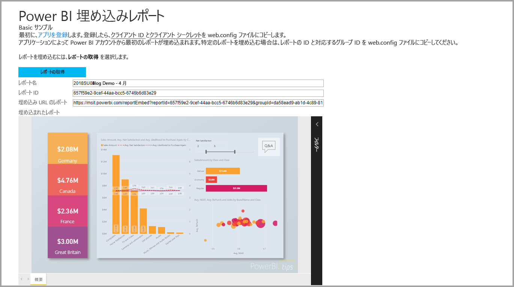

このチュートリアルでは、以下のタスクについて説明します。
> [!div class="checklist"]
> * Azure にアプリケーションを登録します。
> * Power BI レポートをアプリケーションに埋め込みます。

## <a name="prerequisites"></a>前提条件

作業を始めるには、Power BI Pro アカウントと Microsoft Azure サブスクリプションが必要です。

* Power BI Pro にサインアップしていない場合は、作業を始める前に[無料の試用版にサインアップ](https://powerbi.microsoft.com/pricing/)してください。
* Azure サブスクリプションをお持ちでない場合は、始める前に[無料アカウントを作成](https://azure.microsoft.com/free/?WT.mc_id=A261C142F)してください。
* 独自の [Azure Active Directory (Azure AD) テナント](create-an-azure-active-directory-tenant.md)を設定します。
* [Visual Studio](https://www.visualstudio.com/) バージョン 2013 以降をインストールします。

## <a name="set-up-your-embedded-analytics-development-environment"></a>埋め込み分析開発環境を設定する

アプリケーションへのレポート、ダッシュボード、タイルの埋め込みを開始する前に、埋め込めるように環境が設定されていることを確認します。 セットアップの一環として、次のアクションのいずれかを実行します。

* [埋め込みセットアップ ツール](https://aka.ms/embedsetup/UserOwnsData)を使うと、環境の作成とレポートの埋め込みを段階的に行うサンプル アプリケーションをすぐに使い始め、ダウンロードすることができます。

* 環境を手動で設定することにした場合は、次のセクションの手順を行います。

### <a name="register-an-application-in-azure-active-directory"></a>Azure Active Directory にアプリケーションを登録する

アプリケーションから Power BI REST API にアクセスできるようにするには、そのアプリケーションを Azure Active Directory に登録します。 その後、アプリケーションの ID を確立し、Power BI REST リソースへのアクセス許可を指定することができます。

1. [Microsoft Power BI API 条項](https://powerbi.microsoft.com/api-terms)に同意します。

2. [Azure portal](https://portal.azure.com) にサインインします。

    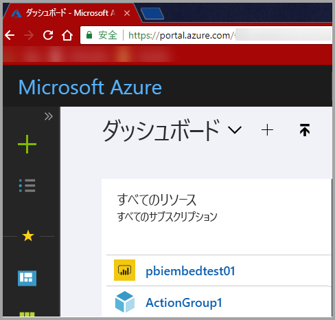

3. 左側のナビゲーション ウィンドウで、**[すべてのサービス]**、**[アプリの登録]** の順に選択します。 次に、**[新しいアプリケーションの登録]** を選択します。

    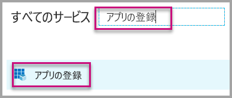</br>

    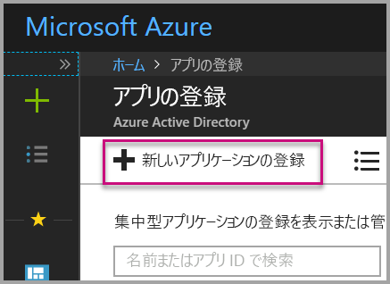

4. 画面の指示に従って、新しいアプリケーションを作成します。 **ユーザー所有データ**の場合、**[アプリケーションの種類]** には **[Web アプリ/API]** を使用します。 Azure AD でトークン応答を返すために使用する、**[サインオン URL]** を指定します。 アプリケーション固有の値を入力します。 たとえば、「`http://localhost:13526/`」と入力します。

    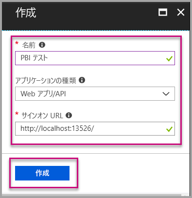

### <a name="apply-permissions-to-your-application-within-azure-active-directory"></a>Azure Active Directory でアプリケーションにアクセス許可を適用する

アプリ登録ページで指定したものに加え、アプリケーションに対するアクセス許可を有効にしてください。 アクセス許可を有効にするには、グローバル管理者アカウントでサインインします。

### <a name="use-the-azure-active-directory-portal"></a>Azure Active Directory ポータルを使用する

1. Azure portal 内で [[アプリの登録]](https://portal.azure.com/#blade/Microsoft_AAD_IAM/ApplicationsListBlade) を参照して、埋め込みに使うアプリを選びます。

    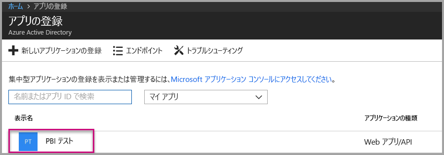

2. **[設定]** を選択します。 次に、**[API アクセス]** で **[必要なアクセス許可]** を選択します。

    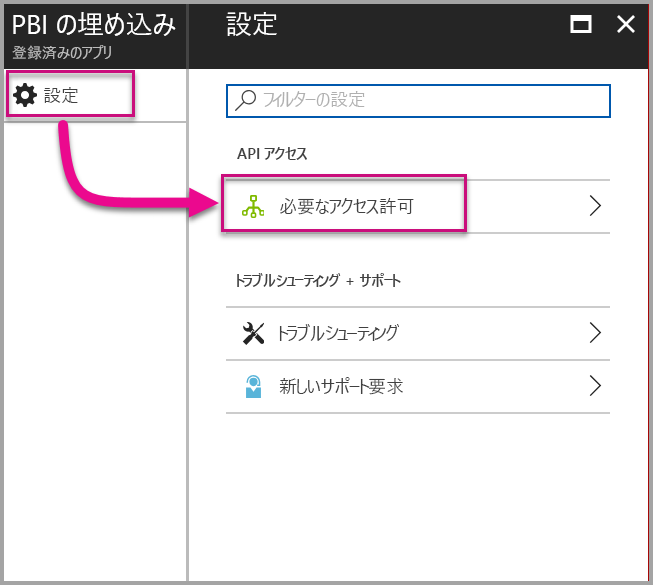

3. **[Windows Azure Active Directory]** を選択します。 次に、**[サインインしたユーザーとしてディレクトリにアクセスします]** が選択されていることを確認します。 **[保存]** を選択します。

    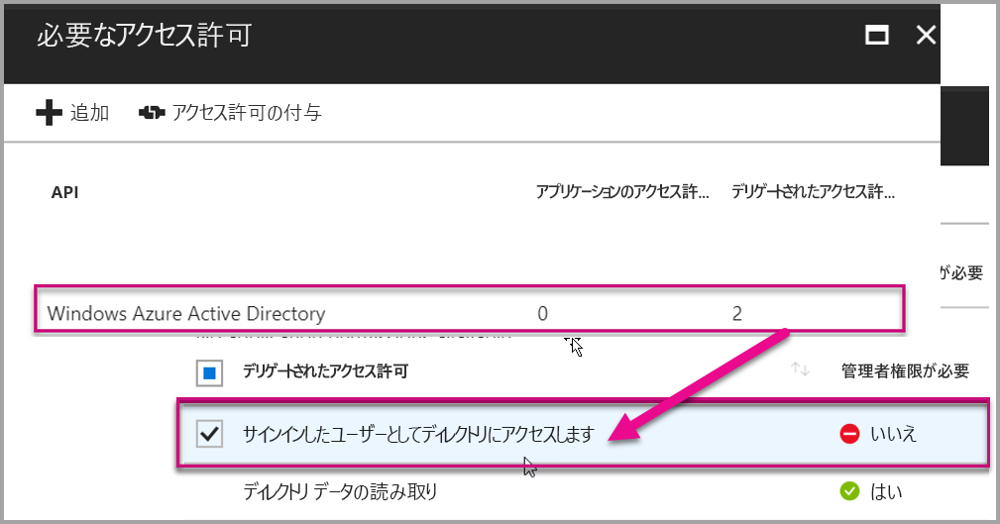

4. **[追加]** を選択します。

    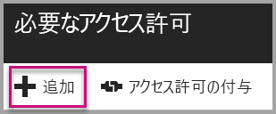

5. **[API を選択します]** を選びます。

    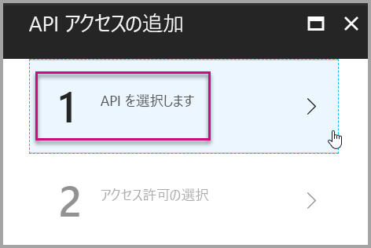

6. **[Power BI サービス]** を選択します。 次に、**[選択]** を選びます。

    

7. **[デリゲートされたアクセス許可]** のすべてのアクセス許可を選択します。 1 つずつ選択して選択内容を保存します。 完了したら、**[保存]** を選択します。

    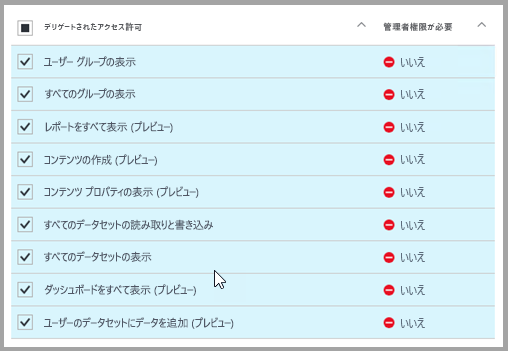

## <a name="set-up-your-power-bi-environment"></a>Power BI 環境を設定する

### <a name="create-an-app-workspace"></a>アプリ ワークスペースを作成する

顧客向けのレポート、ダッシュボード、またはタイルを埋め込む場合は、コンテンツをアプリ ワークスペース内に配置する必要があります。

1. 最初に、ワークスペースを作成します。 **[ワークスペース]**  > **[アプリのワークスペースの作成]** の順に選択します。 このワークスペースは、アプリケーションでアクセスする必要のあるコンテンツを配置する場所です。

    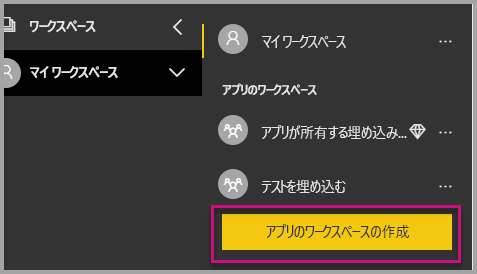

2. ワークスペースの名前を付けます。 対応する**ワークスペース ID** が使用できない場合は、一意の ID になるように編集します。 この名前をアプリの名前にする必要もあります。

    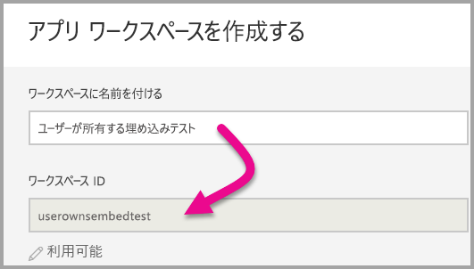

3. 設定にはいくつかのオプションがあります。 **[パブリック]** を選択すると、組織内のすべてのユーザーがワークスペースの内容を表示できます。 **[プライベート]** の場合、ワークスペースのメンバーしかその内容を表示できません。

    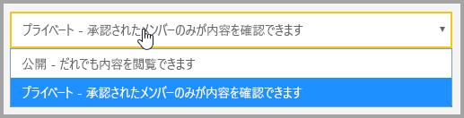

    グループを作成した後で、パブリックやプライベートの設定を変更することはできません。

4. メンバーが編集可能かどうか、表示専用のアクセス許可を持つかどうかも選択できます。

    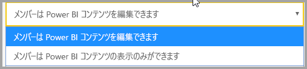

5. ワークスペースへのアクセス許可を与えるユーザーの電子メール アドレスを追加して、**[追加]** を選択します。 追加できるのは個別ユーザーのみで、グループのエイリアスは追加できません。

6. ユーザーごとにメンバーか管理者かを判断します。管理者は、他のメンバーの追加を含め、ワークスペース自体を編集できます。 メンバーは、表示専用のアクセス許可を持っていない限り、ワークスペースのコンテンツを編集できます。 管理者とメンバーの両方がアプリを発行できます。

    新しいワークスペースを表示できるようになります。 Power BI でワークスペースが作成され、開きます。 メンバーであるワークスペースの一覧に表示されます。 管理者は、省略記号 (...) を選択すると、前の画面に戻って新しいメンバーの追加やアクセス許可の変更などの変更を加えることができます。

    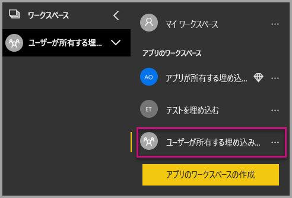

### <a name="create-and-publish-your-reports"></a>レポートを作成して発行する

Power BI Desktop を使用して、レポートとデータセットを作成することができます。 その後、そのレポートをアプリ ワークスペースに発行できます。 レポートを発行するエンド ユーザーには、アプリ ワークスペースに発行するための Power BI Pro ライセンスが必要です。

1. GitHub からサンプルの [Blog Demo](https://github.com/Microsoft/powerbi-desktop-samples) をダウンロードします。

    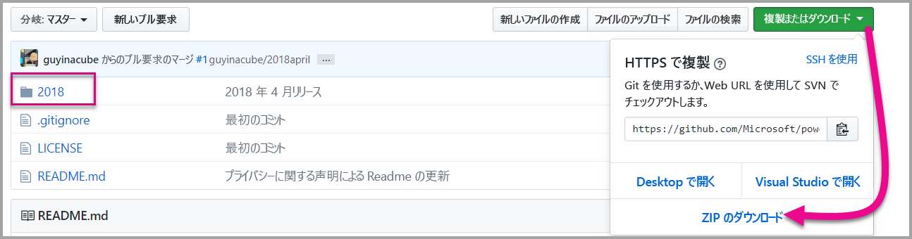

2. Power BI Desktop でサンプルの .pbix レポートを開きます。

   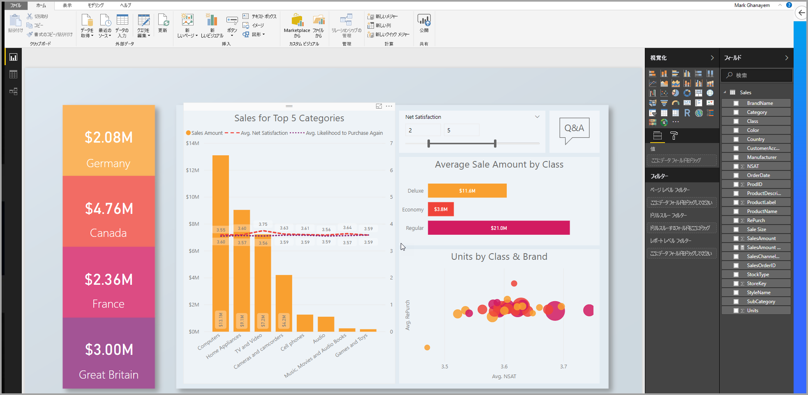

3. アプリ ワークスペースに発行します。

   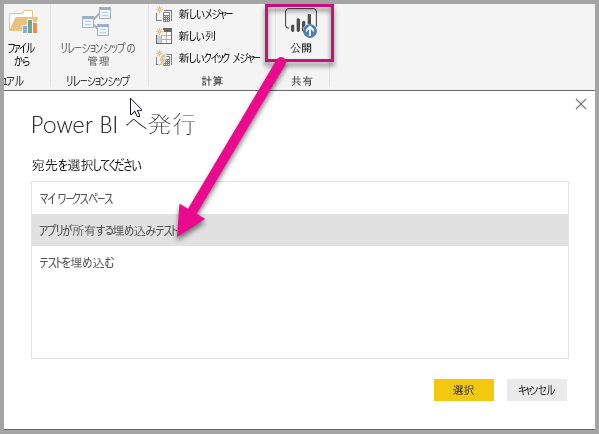

    Power BI サービスを使ってオンラインでレポートを表示できるようになります。

   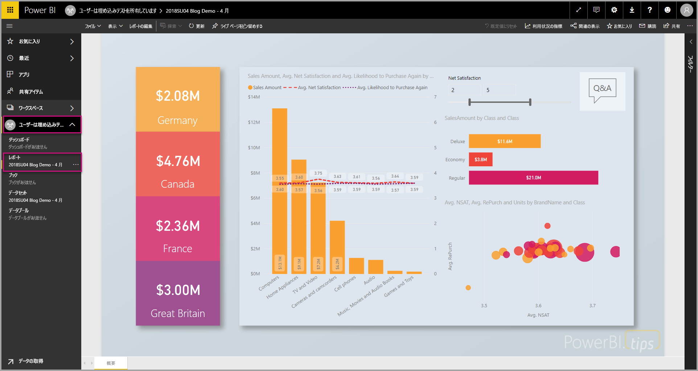

## <a name="embed-your-content-by-using-the-sample-application"></a>サンプル アプリケーションを使用してコンテンツを埋め込む

サンプル アプリケーションを使用してコンテンツを埋め込むには、次の手順に従います。

1. 最初に、GitHub から [User Owns Data サンプル](https://github.com/Microsoft/PowerBI-Developer-Samples)をダウンロードします。 [レポート](https://github.com/Microsoft/PowerBI-Developer-Samples/tree/master/User%20Owns%20Data/integrate-report-web-app)、[ダッシュボード](https://github.com/Microsoft/PowerBI-Developer-Samples/tree/master/User%20Owns%20Data/integrate-dashboard-web-app)、[タイル](https://github.com/Microsoft/PowerBI-Developer-Samples/tree/master/User%20Owns%20Data/integrate-tile-web-app)用にそれぞれ 1 つずつ、3 つの異なるサンプル アプリケーションがあります。 この記事は**レポート** アプリケーションに関するものです。

    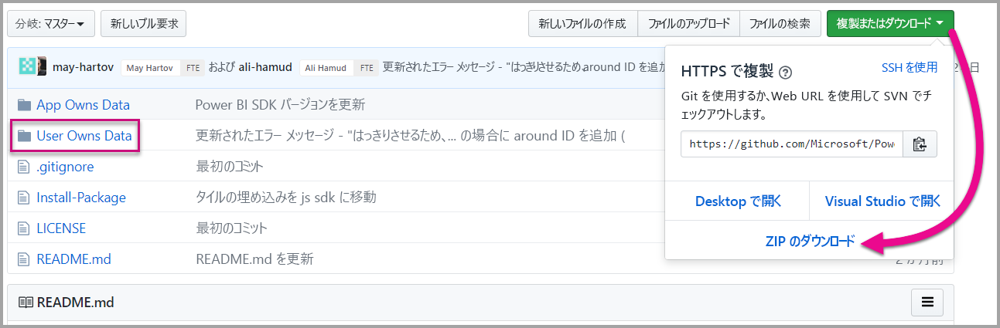

2. サンプル アプリケーションで **Cloud.config** ファイルを開きます。 アプリケーションを正常に実行するには、**[ApplicationID]** フィールドと **[ApplicationSecret]** フィールドを設定する必要があります。

    

    **[Application ID]** には、Azure から**アプリケーション ID** を設定します。 **ApplicationID** は、アクセス許可を要求しているユーザーに対して、アプリケーションで自身を識別するために使用されます。

    **ApplicationID** を取得するには、次の手順に従います。

    1. [Azure portal](https://portal.azure.com) にサインインします。

       

    2. 左側のナビゲーション ウィンドウで、**[すべてのサービス]**、**[アプリの登録]** の順に選択します。

       

    3. **ApplicationID** を使用する必要があるアプリケーションを選択します。

       

    4. **アプリケーション ID** が GUID として一覧表示されます。 この**アプリケーション ID** を、アプリケーションの **ApplicationID** として使用します。

        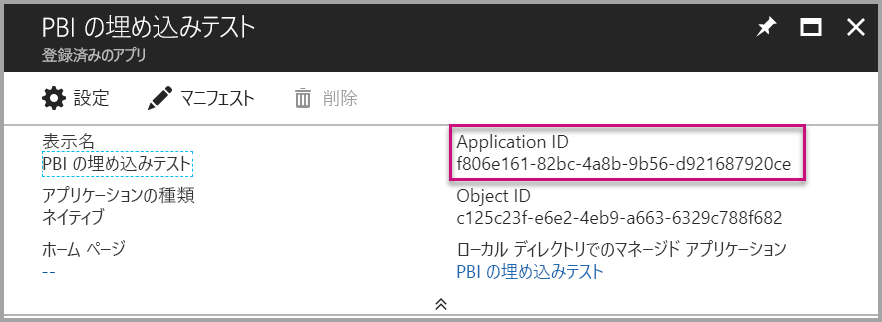

    **ApplicationSecret** は、**Azure** の **[アプリの登録]** セクションの **[キー]** セクションから設定します。

    **ApplicationSecret** を取得するには、次の手順に従います。

    1. [Azure portal](https://portal.azure.com) にサインインします。

       

    2. 左側のナビゲーション ウィンドウで、**[すべてのサービス]**、**[アプリの登録]** の順に選択します。

       

    3. **ApplicationSecret** を使用する必要があるアプリケーションを選択します。

       

    4. **[設定]** を選択します。

       ![[設定] を選択する](media/embed-sample-for-your-organization/embed-sample-for-your-organization-038.png)

    5. **[キー]** を選択します。

       ![[キー] を選択する](media/embed-sample-for-your-organization/embed-sample-for-your-organization-039.png)

    6. **[説明]** ボックスに名前を入力し、期間を選択します。 次に、**[保存]** を選択して、アプリケーションの**値**を取得します。 キーの値を保存した後で **[キー]** ウィンドウを閉じると、値フィールドは非表示としてのみ表示されます。 その時点では、キー値を取得することはできません。 キー値をなくした場合は、Azure portal で新しいものを作成します。

          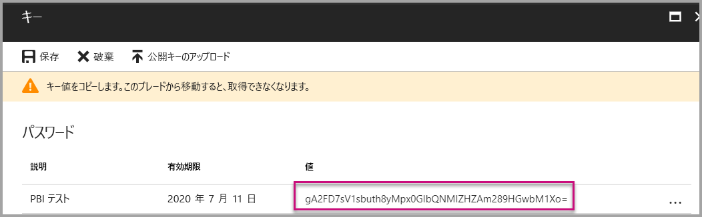

    7. **groupId** には、Power BI からアプリ ワークスペースの GUID を入力します。

       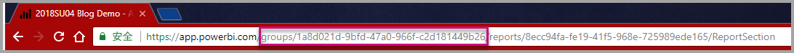

    8. **reportId** には、Power BI からレポート GUID を入力します。

       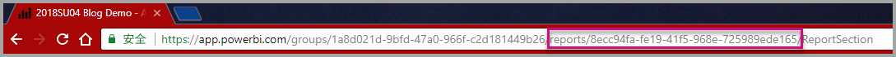

3. 次のようにして、アプリケーションを実行します。

    **Visual Studio** で **[実行]** を選びます。

    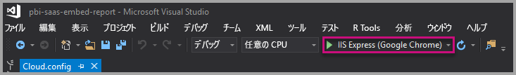

    次に、**[レポートを取得]** を選択します。

    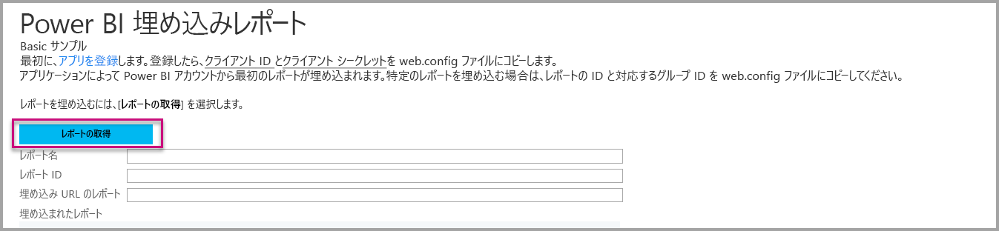

    サンプル アプリケーションでレポートを表示できるようになります。

    

## <a name="embed-your-content-within-your-application"></a>アプリケーション内にコンテンツを埋め込む

コンテンツを埋め込む手順は [Power BI REST API](https://docs.microsoft.com/rest/api/power-bi/) で行うことはできますが、この記事で説明するコード例は .NET SDK で作成されています。

Web アプリにレポートを統合するには、Power BI REST API または Power BI C# SDK を使用します。 Azure Active Directory 認証アクセス トークンを使用してレポートを取得することもできます。 その後、同じアクセス トークンを使ってレポートを読み込みます。 Power BI Rest API では、特定の Power BI リソースへのプログラムによるアクセスが提供されます。 詳細については、「[Power BI REST API](https://docs.microsoft.com/rest/api/power-bi/)」 (Power BI REST API) と [Power BI JavaScript API](https://github.com/Microsoft/PowerBI-JavaScript) に関するページを参照してください。

### <a name="get-an-access-token-from-azure-ad"></a>Azure AD からアクセス トークンを取得する

アプリケーション内では、Power BI REST API の呼び出しを行う前に、Azure AD からアクセス トークンを取得する必要があります。 詳しくは、「[ユーザーを認証し、Power BI アプリ用の Azure AD アクセス トークンを取得する](get-azuread-access-token.md)」をご覧ください。

### <a name="get-a-report"></a>レポートを取得する

Power BI レポートを取得するには、[レポートの取得](https://docs.microsoft.com/rest/api/power-bi/reports/getreports)操作を使用して、Power BI レポートの一覧を取得します。 レポートの一覧から、レポート ID を取得できます。

### <a name="get-reports-by-using-an-access-token"></a>アクセス トークンを使ってレポートを取得する

[レポートを取得する](https://docs.microsoft.com/rest/api/power-bi/reports/getreports)操作により、レポートの一覧が返されます。 レポートの一覧から 1 つのレポートを取得できます。

REST API 呼び出しを行うには、*Authorization* ヘッダーを "*ベアラー {アクセス トークン}*" の形式で含める必要があります。

#### <a name="get-reports-with-the-rest-api"></a>REST API でレポートを取得する

以下のコード サンプルでは、**REST API** を使用してレポートを取得する方法を示します。

> [!NOTE]  
> 埋め込むコンテンツ アイテムを取得するサンプルは、[サンプル アプリケーション](#embed-your-content-using-the-sample-application)の **Default.aspx.cs** ファイルにあります。 たとえば、レポート、ダッシュボード、タイルです。

```csharp
using Newtonsoft.Json;

//Get a Report. In this sample, you get the first Report.
protected void GetReport(int index)
{
    //Configure Reports request
    System.Net.WebRequest request = System.Net.WebRequest.Create(
        String.Format("{0}/Reports",
        baseUri)) as System.Net.HttpWebRequest;

    request.Method = "GET";
    request.ContentLength = 0;
    request.Headers.Add("Authorization", String.Format("Bearer {0}", accessToken.Value));

    //Get Reports response from request.GetResponse()
    using (var response = request.GetResponse() as System.Net.HttpWebResponse)
    {
        //Get reader from response stream
        using (var reader = new System.IO.StreamReader(response.GetResponseStream()))
        {
            //Deserialize JSON string
            PBIReports Reports = JsonConvert.DeserializeObject<PBIReports>(reader.ReadToEnd());

            //Sample assumes at least one Report.
            //You could write an app that lists all Reports
            if (Reports.value.Length > 0)
            {
                var report = Reports.value[index];

                txtEmbedUrl.Text = report.embedUrl;
                txtReportId.Text = report.id;
                txtReportName.Text = report.name;
            }
        }
    }
}

//Power BI Reports used to deserialize the Get Reports response.
public class PBIReports
{
    public PBIReport[] value { get; set; }
}
public class PBIReport
{
    public string id { get; set; }
    public string name { get; set; }
    public string webUrl { get; set; }
    public string embedUrl { get; set; }
}
```

#### <a name="get-reports-by-using-the-net-sdk"></a>.NET SDK を使ってレポートを取得する

REST API を直接呼び出すのではなく、.NET SDK を使ってレポートの一覧を取得することもできます。 次のコード サンプルでは、レポートを一覧表示する方法を示します。

```csharp
using Microsoft.IdentityModel.Clients.ActiveDirectory;
using Microsoft.PowerBI.Api.V2;
using Microsoft.PowerBI.Api.V2.Models;

var tokenCredentials = new TokenCredentials(<ACCESS TOKEN>, "Bearer");

// Create a Power BI Client object. It is used to call Power BI APIs.
using (var client = new PowerBIClient(new Uri(ApiUrl), tokenCredentials))
{
    // Get the first report all reports in that workspace
    ODataResponseListReport reports = client.Reports.GetReports();

    Report report = reports.Value.FirstOrDefault();

    var embedUrl = report.EmbedUrl;
}
```

### <a name="load-a-report-by-using-javascript"></a>JavaScript を使ってレポートを読み込む

JavaScript を使って、Web ページの div 要素にレポートを読み込むことができます。 以下のコード サンプルでは、指定したワークスペースからレポートを取得する方法を示します。

> [!NOTE]  
> 埋め込むコンテンツ アイテムを読み込むサンプルは、[サンプル アプリケーション](#embed-your-content-using-the-sample-application)の **Default.aspx** ファイルにあります。 たとえば、レポート、ダッシュボード、タイルです。

```javascript
<!-- Embed Report-->
<div> 
    <asp:Panel ID="PanelEmbed" runat="server" Visible="true">
        <div>
            <div><b class="step">Step 3</b>: Embed a report</div>

            <div>Enter an embed url for a report from Step 2 (starts with https://):</div>
            <input type="text" id="tb_EmbedURL" style="width: 1024px;" />
            <br />
            <input type="button" id="bEmbedReportAction" value="Embed Report" />
        </div>

        <div id="reportContainer"></div>
    </asp:Panel>
</div>
```

#### <a name="sitemaster"></a>Site.master

```javascript
window.onload = function () {
    // client side click to embed a selected report.
    var el = document.getElementById("bEmbedReportAction");
    if (el.addEventListener) {
        el.addEventListener("click", updateEmbedReporte, false);
    } else {
        el.attachEvent('onclick', updateEmbedReport);
    }

    // handle server side post backs, optimize for reload scenarios
    // show embedded report if all fields were filled in.
    var accessTokenElement = document.getElementById('MainContent_accessTokenTextbox');
    if (accessTokenElement !== null) {
        var accessToken = accessTokenElement.value;
        if (accessToken !== "")
            updateEmbedReport();
    }
};

// update embed report
function updateEmbedReport() {

    // check if the embed url was selected
    var embedUrl = document.getElementById('tb_EmbedURL').value;
    if (embedUrl === "")
        return;

    // get the access token.
    accessToken = document.getElementById('MainContent_accessTokenTextbox').value;

    // Embed configuration used to describe the what and how to embed.
    // This object is used when calling powerbi.embed.
    // You can find more information at https://github.com/Microsoft/PowerBI-JavaScript/wiki/Embed-Configuration-Details.
    var config = {
        type: 'report',
        accessToken: accessToken,
        embedUrl: embedUrl
    };

    // Grab the reference to the div HTML element that will host the report.
    var reportContainer = document.getElementById('reportContainer');

    // Embed the report and display it within the div container.
    var report = powerbi.embed(reportContainer, config);

    // report.on will add an event handler which prints to Log window.
    report.on("error", function (event) {
        var logView = document.getElementById('logView');
        logView.innerHTML = logView.innerHTML + "Error<br/>";
        logView.innerHTML = logView.innerHTML + JSON.stringify(event.detail, null, "  ") + "<br/>";
        logView.innerHTML = logView.innerHTML + "---------<br/>";
    }
  );
}
```

## <a name="using-a-power-bi-premium-dedicated-capacity"></a>Power BI Premium 専用容量の使用

これでアプリケーションの開発が完了したため、専用の容量を持つアプリ ワークスペースに戻ります。

### <a name="create-a-dedicated-capacity"></a>専用の容量を作成する

専用の容量を作成することで、アプリ ワークスペースでコンテンツ専用のリソースを所有する利点が得られます。 [Power BI Premium](../service-premium.md) を使用して、専用の容量を作成できます。

次の表は、[Microsoft Office 365](../service-admin-premium-purchase.md) で利用可能な Power BI Premium SKU の一覧です。

| 容量ノード | 仮想コアの合計<br/>(バックエンド + フロント エンド) | バックエンドの仮想コア | フロント エンドの仮想コア | DirectQuery/ライブ接続の制限 |
| --- | --- | --- | --- | --- | --- |
| EM1 |1 仮想コア |0.5 仮想コア、10 GB の RAM |0.5 仮想コア |1 秒あたり 3.75 |
| EM2 |2 仮想コア |1 仮想コア、10 GB の RAM |1 仮想コア |1 秒あたり 7.5 |
| EM3 |4 仮想コア |2 仮想コア、10 GB の RAM |2 仮想コア |1 秒あたり 15 |
| P1 |8 仮想コア |4 仮想コア、25 GB の RAM |4 仮想コア |1 秒あたり 30 |
| P2 |16 仮想コア |8 仮想コア、50 GB の RAM |8 仮想コア |1 秒あたり 60 |
| P3 |32 仮想コア |16 仮想コア、100 GB の RAM |16 仮想コア |1 秒あたり 120 |
| P4 |64 仮想コア |32 仮想コア、200 GB の RAM |32 仮想コア |1 秒あたり 240 |
| P5 |128 仮想コア |64 仮想コア、400 GB の RAM |64 仮想コア |1 秒あたり 480 |
> [!NOTE]
> - Microsoft Office アプリで埋め込もうとしている場合は、EM SKU を使用して、無料の Power BI ライセンスでコンテンツにアクセスできます。 しかし、Powerbi.com または Power BI Mobile を使用する場合、無料の Power BI ライセンスでコンテンツにアクセスすることはできません。
> - Powerbi.com または Power BI Mobile を使用して、Microsoft Office アプリで埋め込もうとしている場合は、無料の Power BI ライセンスでコンテンツにアクセスできます。

### <a name="assign-an-app-workspace-to-a-dedicated-capacity"></a>専用の容量にアプリ ワークスペースを割り当てる

専用の容量を作成した後、アプリ ワークスペースをその専用の容量に割り当てることができます。 このプロセスを完了するには、次の手順に従います。

1. Power BI サービス内でワークスペースを展開し、コンテンツを埋め込むために使用しているワークスペースの省略記号を選択します。 次に、**[Edit workspaces]\(ワークスペースの編集\)** を選択します。

    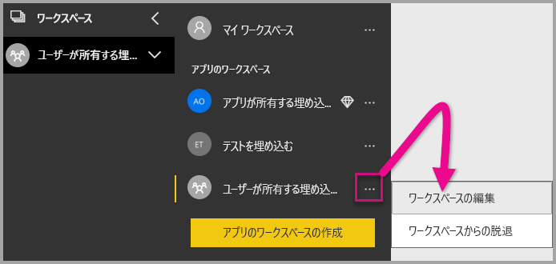

2. **[詳細]** を展開し、**[専用の容量]** を有効にします。 作成した専用の容量を選択します。 その後、**[保存]** を選びます。

    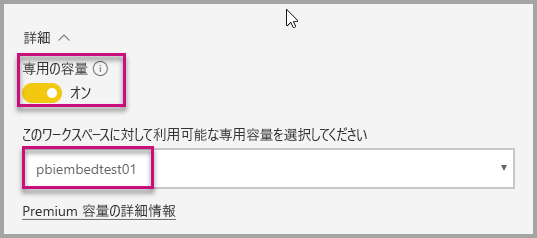

3. **[保存]** を選択した後、アプリ ワークスペース名の横にひし形が表示されます。

    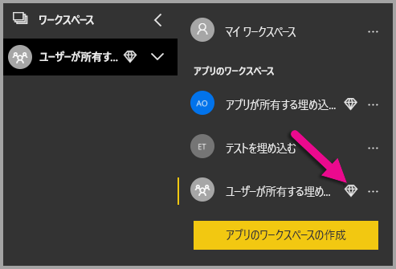

## <a name="admin-settings"></a>管理の設定

グローバル管理者または Power BI サービス管理者は、テナントに対して REST API を使う機能を有効または無効にできます。 Power BI 管理者は、組織全体または個々のセキュリティ グループに対してこれを設定できます。 既定では組織全体に対して有効になります。 [Power BI 管理ポータル](../service-admin-portal.md)でこれらの変更を行うことができます。

## <a name="next-steps"></a>次の手順

このチュートリアルでは、Power BI の組織アカウントを使用して、アプリケーションに Power BI コンテンツを埋め込む方法を説明しました。 これで、アプリを使用して、アプリケーションへの Power BI コンテンツの埋め込みを試すことができます。 顧客向けの Power BI コンテンツの埋め込みを試すこともできます。

> [!div class="nextstepaction"]
> [アプリからの埋め込み](embed-from-apps.md)

> [!div class="nextstepaction"]
>[顧客向けに埋め込む](embed-sample-for-customers.md)

さらに質問がある場合は、[Power BI コミュニティで質問してみてください](http://community.powerbi.com/)。
