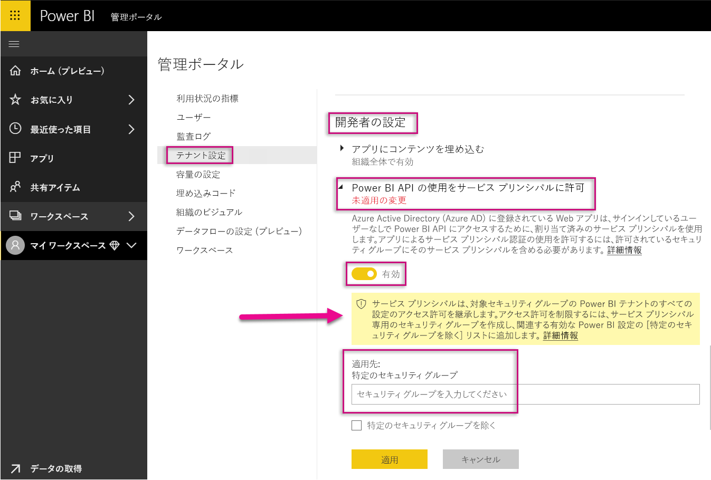
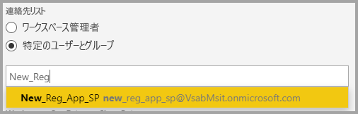
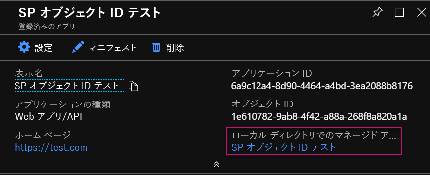
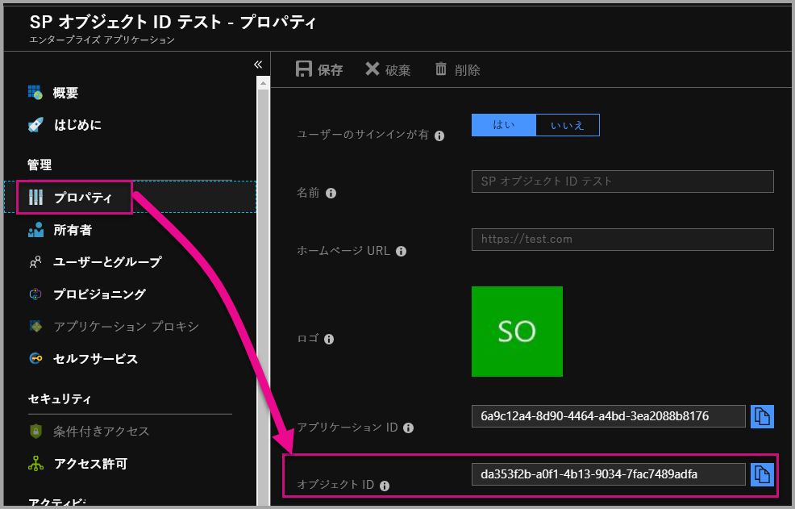

# <a name="service-principal-with-power-bi-preview"></a>Power BI でのサービス プリンシパル (プレビュー)

**サービス プリンシパル**を使用して、アプリケーションに Power BI コンテンツを埋め込み、**アプリ専用**トークンを使用して Power BI でオートメーションを使用することができます。 サービス プリンシパルは、**Power BI Embedded** を使用するとき、または **Power BI のタスクとプロセスを自動化する**ときに役に立ちます。

Power BI Embedded を使用するときは、サービス プリンシパルを使用するとメリットがあります。 主なメリットは、アプリケーションに対する認証を行うときに、マスター アカウント (サインインするためだけのユーザー名とパスワードである Power BI Pro ライセンス) が必要ないことです。 サービス プリンシパルでは、アプリケーションの認証にアプリケーション ID とアプリケーション シークレットが使用されます。

Power BI タスクを自動化する場合は、サービス プリンシパルのスケーリングを処理および管理する方法をスクリプトにすることもできます。

## <a name="application-and-service-principal-relationship"></a>アプリケーションとサービス プリンシパルの関係

Azure AD テナントをセキュリティ保護するリソースにアクセスするには、アクセスが必要なエンティティはセキュリティ プリンシパルを表します。 これは、ユーザー (ユーザー プリンシパル) とアプリケーション (サービス プリンシパル) の両方に当てはまります。

セキュリティ プリンシパルでは、Azure AD テナントでのユーザーとアプリケーションに対するアクセス ポリシーとアクセス許可が定義されています。 このアクセス ポリシーにより、サインイン時のユーザーやアプリケーションの認証や、リソース アクセス時の認証などのコア機能が有効になります。 詳細については、[Azure Active Directory (AAD) でのアプリケーションとサービス プリンシパル](https://docs.microsoft.com/azure/active-directory/develop/app-objects-and-service-principals)に関する記事をご覧ください。

Azure portal で Azure AD アプリケーションを登録すると、次の 2 つのオブジェクトが Azure AD テナントに作成されます。

* [アプリケーション オブジェクト](https://docs.microsoft.com/azure/active-directory/develop/app-objects-and-service-principals#application-object)
* [サービス プリンシパル オブジェクト](https://docs.microsoft.com/azure/active-directory/develop/app-objects-and-service-principals#service-principal-object)

アプリケーション オブジェクトはすべてのテナントで使用するためのアプリケーションの "*グローバル*" な表現として、サービス プリンシパル オブジェクトは特定のテナントで使用するための "*ローカル*" な表現として考えてください。

アプリケーション オブジェクトは、対応するサービス プリンシパル オブジェクトの作成に使用される共通で既定のプロパティが "*派生される*" 元のテンプレートとして機能します。

サービス プリンシパルは、アプリケーションが使用されるテナントごとに必要であり、テナントによってセキュリティ保護されているリソースにサインインしてアクセスするための ID を確立できるようにします。 シングルテナント アプリケーションのサービス プリンシパルは 1 つだけで (ホーム テナント内)、アプリケーションの登録時に作成されて、使用を承認されます。

## <a name="service-principal-with-power-bi-embedded"></a>Power BI Embedded でのサービス プリンシパル

サービス プリンシパルでは、アプリケーション ID とアプリケーション シークレットを使用することによって、アプリケーション内のマスター アカウント情報をマスクすることができます。 認証のためにアプリケーション内にマスター アカウントをハードコーディングする必要はなくなります。

**Power BI API** と **Power BI .NET SDK** でサービス プリンシパルを使用した呼び出しがサポートされるようになったため、サービス プリンシパルで [Power BI REST API](https://docs.microsoft.com/rest/api/power-bi/) を使用できます。 たとえば、ワークスペースの作成、ワークスペースのユーザーの追加または削除、ワークスペースへのコンテンツのインポートなど、ワークスペースに対する変更を行うことができます。

Power BI の成果物とリソースが[新しい Power BI ワークスペース](../service-create-the-new-workspaces.md)に格納されている場合は、サービス プリンシパルのみを使用できます。

## <a name="service-principal-vs-master-account"></a>サービス プリンシパルとマスター アカウント

認証に対するサービス プリンシパルと標準のマスター アカウント (Power BI Pro ライセンス) の使用には違いがあります。 次の表では、いくつかの重要な違いを示します。

| 関数の呼び出し | マスター ユーザー アカウント <br> (Power BI Pro ライセンス) | サービス プリンシパル <br> (アプリ専用トークン) |
|------------------------------------------------------|---------------------|-------------------|
| Power BI サービスにサインインできる  | はい | いいえ |
| Power BI 管理ポータルで有効にする | いいえ | はい |
| [アプリ ワークスペース (v1) で動作する](../service-create-workspaces.md) | はい | いいえ |
| [新しいアプリ ワークスペース (v2) で動作する](../service-create-the-new-workspaces.md) | はい | はい |
| Power BI Embedded で使用する場合は、ワークスペース管理者である必要がある | はい | はい |
| Power BI REST API を使用できる | はい | はい |
| 作成するにはグローバル管理者である必要がある | はい | いいえ |
| オンプレミス データ ゲートウェイをインストールして管理できる | はい | いいえ |

## <a name="get-started-with-a-service-principal"></a>サービス プリンシパルの使用を始める

従来のマスター アカウントを使用する場合とは異なり、サービス プリンシパル (アプリ専用トークン) を使用する場合は、いくつか異なる部分を設定する必要があります。 サービス プリンシパル (アプリ専用トークン) を使い始めるには、適切な環境を設定する必要があります。

1. Power BI で使用するために、Azure Active Directory (AAD) に[サーバー側 Web アプリケーションを登録](register-app.md)します。 アプリケーションを登録した後は、Power BI のコンテンツにアクセスするためのアプリケーション ID、アプリケーション シークレット、サービス プリンシパル オブジェクト ID を取得できます。 サービス プリンシパルは [PowerShell](https://docs.microsoft.com/powershell/azure/create-azure-service-principal-azureps?view=azps-1.1.0) で作成することができます。

    新しい Azure Active Directory アプリケーションを作成するためのスクリプトのサンプルを次に示します。

    ```powershell
    # The app id - $app.appid
    # The service principal object id - $sp.objectId
    # The app key - $key.value

    # Sign in as a user that is allowed to create an app.
    Connect-AzureAD

    # Create a new AAD web application
    $app = New-AzureADApplication -DisplayName "testApp1" -Homepage "https://localhost:44322" -ReplyUrls "https://localhost:44322"

    # Creates a service principal
    $sp = New-AzureADServicePrincipal -AppId $app.AppId

    # Get the service principal key.
    $key = New-AzureADServicePrincipalPasswordCredential -ObjectId $sp.ObjectId
    ```

   > [!Important]
   > Power BI でサービス プリンシパルを使用できるようにすると、アプリケーションの AD アクセス許可は無効になります。 アプリケーションのアクセス許可はその後、Power BI 管理ポータルを介して管理されます。

2. [Azure Active Directory (AAD) にセキュリティ グループ](https://docs.microsoft.com/azure/active-directory/fundamentals/active-directory-groups-create-azure-portal)を作成し、作成したアプリケーションをそのセキュリティ グループに追加します。 AAD セキュリティ グループは [PowerShell](https://docs.microsoft.com/powershell/azure/create-azure-service-principal-azureps?view=azps-1.1.0) で作成できます。

    新しいセキュリティ グループを作成し、そのセキュリティ グループにアプリケーションを追加するためのスクリプトのサンプルを次に示します。

    ```powershell
    # Required to sign in as a tenant admin
    Connect-AzureAD

    # Create an AAD security group
    $group = New-AzureADGroup -DisplayName <Group display name> -SecurityEnabled $true -MailEnabled $false -MailNickName notSet

    # Add the service principal to the group
    Add-AzureADGroupMember -ObjectId $($group.ObjectId) -RefObjectId $($sp.ObjectId)
    ```

3. Power BI 管理者は、Power BI 管理ポータルの **[開発者向け設定]** でサービス プリンシパルを有効にする必要があります。 Azure AD で作成したセキュリティ グループを、**[開発者向け設定]** の **[特定のセキュリティ グループ]** セクションに追加します。

   > [!Important]
   > サービス プリンシパルには、組織全体に対して有効化されるか、またはグループの一部としてサービス プリンシパルを有するセキュリティ グループに対して有効化される、すべてのテナント設定へのアクセス権があります。 サービス プリンシパルによる特定のテナント設定へのアクセスを制限するには、特定のセキュリティ グループへのアクセスのみを許可するか、またはサービス プリンシパルの専用のセキュリティ グループを作成して除外します。

    

4. [Power BI 環境](embed-sample-for-customers.md#set-up-your-power-bi-environment)を設定します。

5. 作成した新しいワークスペースに、**管理者**としてサービス プリンシパルを追加します。 このタスクは [API](https://docs.microsoft.com/rest/api/power-bi/groups/addgroupuser) または Power BI サービスを使用して管理できます。

    

6. ここで、サンプル アプリケーション内または独自のアプリケーション内のどちらにコンテンツを埋め込むかを選択します。

    * [サンプル アプリケーションを使用してコンテンツを埋め込む](embed-sample-for-customers.md#embed-content-using-the-sample-application)
    * [自分のアプリケーション内にコンテンツを埋め込む](embed-sample-for-customers.md#embed-content-within-your-application)

7. これで、[運用環境に移行する](embed-sample-for-customers.md#move-to-production)準備ができました。

## <a name="migrate-to-service-principal"></a>サービス プリンシパルに移行する

現在、Power BI または Power BI Embedded でマスター アカウントを使用している場合は、サービス プリンシパルの使用に移行できます。

[サービス プリンシパルの使用の開始](#get-started-with-a-service-principal)に関するセクションの最初の 3 つのステップを完了した後、以下のようにします。

既に Power BI で[新しいワークスペース](../service-create-the-new-workspaces.md)を使用している場合は、Power BI 成果物が含まれるワークスペースに**管理者**としてサービス プリンシパルを追加します。 一方、[従来のワークスペース](../service-create-workspaces.md)を使用している場合は、Power BI の成果物とリソースを新しいワークスペースにコピーまたは移動してから、そのワークスペースにサービス プリンシパルを**管理者**として追加します。

Power BI の成果物とリソースをワークスペース間で移動するための UI 機能はないので、このタスクを実行するには [API](https://powerbi.microsoft.com/pt-br/blog/duplicate-workspaces-using-the-power-bi-rest-apis-a-step-by-step-tutorial/) を使用する必要があります。 サービス プリンシパルで API を使用するときは、サービス プリンシパル オブジェクト ID が必要です。

### <a name="how-to-get-the-service-principal-object-id"></a>サービス プリンシパル オブジェクト ID を取得する方法

新しいアプリ ワークスペースにサービス プリンシパルを割り当てるには、[Power BI REST API](https://docs.microsoft.com/rest/api/power-bi/groups/addgroupuser) を使用します。 ワークスペースに管理者としてサービス プリンシパルを適用するなど、サービス プリンシパルを各種操作または変更のために参照するには、**サービス プリンシパル オブジェクト ID** を使用します。

Azure portal からサービス プリンシパル オブジェクト ID を取得する手順を次に示します。

1. Azure portal で新しいアプリの登録を作成します。  

2. 次に、**[ローカル ディレクトリでのマネージド アプリケーション]** の下で、作成したアプリケーションの名前を選択します。

   

    > [!Note]
    > 上の図のオブジェクト ID は、サービス プリンシパルで使用されているものではありません。

3. **[プロパティ]** を選択してオブジェクト ID を表示します。

    

PowerShell でサービス プリンシパル オブジェクト ID を取得するスクリプトのサンプルを次に示します。

   ```powershell
   Get-AzureADServicePrincipal -Filter "DisplayName eq '<application name>'"
   ```

## <a name="considerations-and-limitations"></a>考慮事項と制限事項

* サービス プリンシパルは、[新しいアプリ ワークスペース](../service-create-the-new-workspaces.md)でのみ動作します。
* サービス プリンシパルを使用する場合は、**マイ ワークスペース**はサポートされません。
* 運用環境に移行するときは、専用の Premium 容量が必要です。
* サービス プリンシパルを使用して Power BI ポータルにサインインすることはできません。
* Power BI 管理ポータル内の開発者向け設定でサービス プリンシパルを有効にするには、Power BI 管理者権限が必要です。
* サービス プリンシパルを使用して、オンプレミス データ ゲートウェイをインストールまたは管理することはできません。
* [組織のアプリケーションへの埋め込み](embed-sample-for-your-organization.md)では、サービス プリンシパルを使用することはできません。
* [データフロー](../service-dataflows-overview.md)管理はサポートされていません。
* サービス プリンシパルでは、管理 API がサポートされていません。

## <a name="next-steps"></a>次の手順

* [アプリを登録する](register-app.md)
* [顧客向けの Power BI Embedded](embed-sample-for-customers.md)
* [Azure Active Directory でのアプリケーション オブジェクトとサービス プリンシパル オブジェクト](https://docs.microsoft.com/azure/active-directory/develop/app-objects-and-service-principals)
