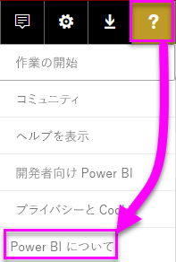
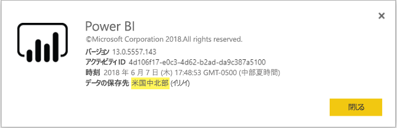

# <a name="frequently-asked-questions-about-power-bi-embedded"></a>Power BI Embedded に関してよく寄せられる質問

* 他の質問がある場合は、[Power BI コミュニティで質問してみてください](http://community.powerbi.com/)。
* それでも解決しない場合は、 [Power BI のサポート ページ](https://powerbi.microsoft.com/support/)をご覧ください。

## <a name="general"></a>全般

### <a name="what-is-power-bi-embedded"></a>Power BI Embedded とは何ですか?

[Microsoft Power BI Embedded (PBIE)](azure-pbie-what-is-power-bi-embedded.md) を利用すれば、アプリケーション開発者は、完全にインタラクティブな優れたレポートをアプリケーションに組み込むことができます。データの視覚化やコントロールを自分で一から構築する必要がなく、時間と費用が節約されます。

### <a name="who-is-the-target-audience-for-power-bi-embedded"></a>Power BI Embedded の対象者は誰ですか?

独自のアプリケーションを開発している開発者やソフトウェア企業。ISV (Independent Software Vendor) と呼ばれています。

### <a name="how-is-power-bi-embedded-different-from-power-bi-the-service"></a>Power BI Embedded と Power BI サービスの違いは何ですか?

アプリケーションを開発するとき、お客様の意思決定に役立てるよう、アプリケーションにビジュアルを組み込みたいが、分析ソリューションを一から構築することは望まない ISV または開発者を Power BI Embedded は対象としています。 [埋め込み分析](embedding.md)では、ビジネス ユーザーはビジネス データにアクセスしてクエリを実行し、アプリケーション内でこのデータを利用してインサイトを生成できます。

Power BI は、サービスとしてのソフトウェアの分析ソリューションです。組織はその最も重要なビジネス データを 1 つのビューで見ることができます。

### <a name="what-is-the-difference-between-power-bi-premium-and-power-bi-embedded"></a>Power BI Premium と Power BI Embedded の違いは何ですか?

Power BI Premium は、組織、パートナー、顧客、サプライヤーを 1 つのビューで見ることができる完全 BI ソリューションを望む企業向けです。 Power BI Premium は組織の意思決定に役立ちます。 Power BI Premium は SaaS 製品であり、Power BI ポータル、モバイル アプリ、社内で開発したアプリを介してコンテンツを利用するための機能が付いています。

Power BI Embedded は、アプリケーションの開発にビジュアルの埋め込みを利用したい ISV または開発者向けです。 Power BI Embedded はアプリケーション開発者向けであり、そのアプリケーションを入手すれば、組織の内外を問わず、誰でも Power BI Embedded 容量に保存されているコンテンツを利用できます。Power BI Embedded は顧客の意思決定に役立ちます。 Power BI Embedded 容量に入っているコンテンツは、ワンクリック Web 公開やワンクリック SharePoint 公開では共有できません。また、SSRS レポートはサポートされていません。

### <a name="what-is-the-microsoft-recommendation-for-when-a-customer-should-buy-power-bi-premium-vs-power-bi-embedded"></a>Power BI Premium と Power BI Embedded を比較して、どのような状況でどちらを購入するべきか、Microsoft は勧めていますか?

企業は企業向けのセルフサービス クラウド BI ソリューションである Power BI Premium を購入するように、ISV はクラウド駆動の埋め込み分析コンポーネントである Power BI Embedded を購入するように Microsoft は勧めています。 しかしながら、顧客が購入する製品については何の制約もありません。

ISV (通常、大規模な ISV) が P SK を利用し、事前パッケージ済みの Power BI サービスだけの機能を組織内に与えたり、アプリケーションに埋め込んだりする場合もあります。 基幹業務アプリケーションを開発し、それに分析を埋め込みたいが、事前パッケージ済み Power BI サービスは必要としない企業が Azure の A SKU の利用を決める場合もあります。

### <a name="how-many-embed-tokens-can-i-create"></a>埋め込みトークンはいくつ作成できますか?

埋め込みトークンと PRO ライセンスの組み合わせは、開発テストを意図したものです。そのため、Power BI マスター アカウントまたは[サービス プリンシパル](embed-service-principal.md)で生成できる埋め込みトークンの数には限りがあります。 運用環境で埋め込むには、[容量を購入](#technical)してください。 容量を購入する場合、生成できる埋め込みトークンの数に上限はありません。 現在の埋め込み使用パーセンテージを示す使用状況の値を確認するには、[使用可能な機能](https://docs.microsoft.com/rest/api/power-bi/availablefeatures)に関するページに移動します。

## <a name="technical"></a>技術的な質問

### <a name="what-is-the-difference-between-the-a-skus-in-azure-and-the-em-skus-in-office-365"></a>Azure の A SKU と Office 365 の EM SKU の違いは何ですか?

PowerBI.com は、ソーシャル コラボレーションや電子メール サブスクリプションなど、多彩な機能を SaaS (サービスとしてのソフトウェア) オファリングに含める 企業向けソリューションです。

Power BI Embedded は一連の API であり、開発者はこれを利用し、PaaS (サービスとしてのプラットフォーム) で埋め込み分析ソリューションを開発できます。 埋め込み分析シナリオの場合、PowerBI.com が ISV や開発者がその埋め込み分析ソリューション コンテンツやテナント レベル設定を管理する助けとなります。

それぞれを利用する場合の違いについて、部分的にまとめたものが次の一覧です。

| おすすめ | Power BI Embedded | Power BI Premium 容量 | Power BI Premium 容量 |
|----------------------------------------------------------------------------------|-------------------|---------------------------|---------------------------|
|   | (A SKU) | (EM SKU) | (P SKU) |
| Power BI アプリ ワークスペースからアーティファクトを埋め込む | Azure 容量 | Office 365 容量 | Office 365 容量 |
| 埋め込みアプリケーションで Power BI レポートを使用する | はい | はい | はい |
| SharePoint で Power BI レポートを利用する | いいえ | はい | はい |
| Dynamics で Power BI レポートを利用する | いいえ | はい | はい |
| Teams で Power BI レポートを利用する (モバイル アプリを除く) | いいえ | はい | はい |
| Powerbi.com と Power BI モバイルで無料 Power BI ライセンスでコンテンツにアクセスする | いいえ | いいえ | はい |
| MS Office アプリに埋め込まれている無料 Power BI ライセンスでコンテンツにアクセスする | いいえ | はい | はい |

### <a name="power-bi-now-offers-three-skus-for-embedding-a-skus-em-skus-and-p-skus-which-one-should-i-purchase-for-my-scenario"></a>Power BI では現在、埋め込み用に 3 つの SKU を用意しています。A SKU、EM SKU、P SKU です。 私のシナリオでは、どちらを購入するべきですか?

|  |A SKU (Power BI Embedded)  |EM SKU (Power BI Premium)  |P SKU (Power BI Premium)  |
|---------|---------|---------|---------|
|購入  |Azure Portal |Office |Office |
|ユース ケース | 独自のアプリケーションにコンテンツを埋め込む | <li> 独自のアプリケーションにコンテンツを埋め込む <br><br><br> <li> MS Office アプリケーションにコンテンツを埋め込む: <br> - [SharePoint](https://powerbi.microsoft.com/blog/integrate-power-bi-reports-in-sharepoint-online/) <br> - [Teams (モバイル アプリを除く)](https://powerbi.microsoft.com/blog/power-bi-teams-up-with-microsoft-teams/) <br> - [Dynamics 365](https://docs.microsoft.com/dynamics365/customer-engagement/basics/add-edit-power-bi-visualizations-dashboard) | <li> 独自のアプリケーションにコンテンツを埋め込む <br><br><br> <li> MS Office アプリケーションにコンテンツを埋め込む: <br> - [SharePoint](https://powerbi.microsoft.com/blog/integrate-power-bi-reports-in-sharepoint-online/) <br> - [Teams (モバイル アプリを除く)](https://powerbi.microsoft.com/blog/power-bi-teams-up-with-microsoft-teams/) <br> - [Dynamics 365](https://docs.microsoft.com/dynamics365/customer-engagement/basics/add-edit-power-bi-visualizations-dashboard) <br><br><br> <li> [Power BI サービス](https://powerbi.microsoft.com/)経由で Power BI ユーザーとコンテンツを共有する  |
|課金 |1 時間ごと |月単位 |月単位 |
|コミットメント  |コミットメントなし |年単位  |月単位/年単位 |
|差別化 |柔軟性に優れ、Azure Portal で、あるいは API 経由でリソースを拡大縮小したり、停止/再開したりできる  |SharePoint Online と Microsoft Teams にコンテンツを埋め込むために使用可能 (モバイル アプリを除く) |アプリケーションの埋め込みを結合し、同じ容量で Power BI Service を使用する |

### <a name="what-are-the-prerequisites-to-create-a-pbie-capacity-in-azure"></a>Azure で PBIE 容量を作成するための前提条件は何ですか?

* 組織のディレクトリにサインインします (MSA アカウントはサポートされていません)。
* Power BI テナントを用意する必要があります。すなわち、ディレクトリの少なくとも 1 名のユーザーを Power BI に登録している必要があります。 
* 組織のディレクトリに Azure サブスクリプションを用意する必要があります。

### <a name="how-can-i-monitor-power-bi-embedded-capacity-consumption"></a>Power BI Embedded の容量の消費はどのように監視できますか?

* [Power BI 管理ポータル](../service-admin-portal.md#power-bi-embedded)を使用します。

* Power BI で [metric app](https://review.docs.microsoft.com/power-bi/service-admin-premium-monitor-capacity) をダウンロードします。

* [Azure 診断ログ](azure-pbie-diag-logs.md)を使用します。

### <a name="can-my-capacity-scale-automatically-to-adjust-to-the-consumption-of-my-app"></a>容量はアプリの利用に合わせて調整する目的で自動的に拡大縮小できますか?

現在、自動的な拡大縮小はありませんが、API を利用してはすべていつでも拡大縮小できます。

### <a name="why-creatingscalingresuming-a-capacity-results-in-putting-the-capacity-into-a-suspended-state"></a>容量を作成、拡張、再開すると、容量が中断状態になります。なぜでしょうか?

容量のプロビジョニング (拡張、再開、作成) は失敗することがあります。 プロビジョニングの呼び出し元は、容量の ProvisioningState を確認する必要があります。そのために Get Details API の[Capacities - Get Details](https://docs.microsoft.com/rest/api/power-bi-embedded/capacities/getdetails) を使用します。

### <a name="can-i-only-create-power-bi-embedded-capacities-in-a-specific-region"></a>Power BI Embedded 容量は、特定のリージョンのみでしか使用できませんか?

[Multi-geo (プレビュー)](embedded-multi-geo.md) 機能では、Power BI ホーム テナントの場所とは異なるリージョンで [Power BI Embedded 容量](azure-pbie-create-capacity.md)を購入できます。

### <a name="how-can-i-find-what-is-my-pbi-tenant-region"></a>自分の PBI テナント リージョンを確認する方法はありますか?

PBI ポータルで PBI テナント リージョンを確認できます。

[https://app.powerbi.com/](https://app.powerbi.com/) > ? > Power BI について




### <a name="what-is-supported-by-the-cloud-solution-provider-csp-channel"></a>クラウド ソリューション プロバイダー (CSP) チャネルでは何がサポートされていますか?

* サブスクリプションの種類が CSP の場合、ご自身のテナントに対して PBIE を作成できます。
* パートナー アカウントは顧客テナントにサインインし、顧客テナントの代わりに PBIE を購入し、Power BI 容量の管理者として顧客テナント ユーザーを指定できます。

### <a name="why-do-i-get-an-unsupported-account-message"></a>アカウントがサポートされていませんというメッセージを受け取るのはなぜですか?

Power BI では、組織のアカウントでサインアップすることが求められます。 MSA (Microsoft アカウント) で Power BI にサインアップすることはできません。

### <a name="can-i-use-apis-to-create--manage-azure-capacities"></a>API を利用して Azure の容量を作成し、管理することはできますか?

はい。PowerShell コマンドレットや Azure Resource Manager API を利用して、PBIE リソースを作成および管理できます。

* REST API - https://docs.microsoft.com/rest/api/power-bi-embedded/
* PowerShell コマンドレット - https://docs.microsoft.com/powershell/module/azurerm.powerbiembedded/

### <a name="what-is-the-pbi-embedded-dedicated-capacity-role-in-a-pbi-embedded-solution"></a>PBI Embedded ソリューションでは、PBI Embedded 専用容量はどのような役割を果たしますか?

[ソリューションを運用に昇格させる](embed-sample-for-customers.md#move-to-production)には、Power BI コンテンツが必要です (アプリケーションで使用しており、Power BI Embedded (A SKU) 容量に割り当てるアプリ ワークスペース)。

### <a name="what-are-the-azure-regions-pbi-embedded-is-available"></a>どの Azure リージョンで PBI Embedded を利用できますか?

[PAM](https://ecosystemmanager.azurewebsites.net/home) (EcoManager) - Product Availability Manager を参照してください

利用できるリージョン (16 - Power BI と同じリージョン)

* 米国 (6) - 米国東部、米国東部 2、米国中北部、米国中南部、米国西部、米国西部 2
* ヨーロッパ (2) - 北ヨーロッパ、西ヨーロッパ
* アジア太平洋 (2) - 東南アジア、東アジア
* ブラジル (1) - ブラジル南部
* 日本 (1) - 東日本
* オーストラリア (1) - オーストラリア南東部
* インド (1) - インド西部
* カナダ (1) - カナダ中部
* 英国 (1) - 英国南部

### <a name="what-is-the-authentication-model-for-power-bi-embedded"></a>Power BI Embedded の認証モデルは何ですか?

Power BI Embedded では、マスター ユーザー (Power BI Pro のライセンスが与えられた指名ユーザー) の認証に引き続き Azure AD が利用されます。Power BI 内でアプリケーションを認証するときは[サービス プリンシパル](embed-service-principal.md)が使用されます。  

アプリケーション ユーザーの認証と承認は ISV が実装します。ISV はそのアプリケーションに独自の認証を実装できます。

Azure AD テナントを既に用意している場合、既存のディレクトリを利用できます。あるいは、埋め込みアプリケーション コンテンツ セキュリティに新しい Azure AD テナントを作成できます。

AAD トークンを取得するには、[Azure Active Directory 認証ライブラリ](https://docs.microsoft.com/azure/active-directory/develop/active-directory-authentication-libraries)のいずれかを使用できます。 複数のプラットフォームで利用可能なクライアント ライブラリがあります。

### <a name="my-application-already-uses-aad-for-user-authentication-how-can-we-use-this-identity-when-authenticating-to-power-bi-in-a-user-owns-data-scenario"></a>私はアプリケーションのユーザー認証に AAD を既に使用しています。 "ユーザーがデータを所有する" シナリオでは、Power BI に認証するとき、この ID をどのように利用できますか?

これは標準的な OAuth 代理フローです (<https://docs.microsoft.com/azure/active-directory/develop/web-api>)。 Power BI サービスに対するアクセス許可を (必要な範囲で) 要求するようにアプリケーションを構成する必要があります。 アプリのユーザー トークンが与えられたら、単にユーザー アクセス トークンを利用して ADAL API AcquireTokenAsync を呼び出し、リソース ID として Power BI リソース URL を指定します。 下のコード スニペットをご覧ください。この方法が示されています。

```csharp
var context = new AD.AuthenticationContext(authorityUrl);
var userAssertion = new AD.UserAssertion(userAccessToken);
var clientAssertion = new AD.ClientAssertionCertificate(MyAppId, MyAppCertificate)
var authenticationResult = await context.AcquireTokenAsync(resourceId, clientAssertion, userAssertion);
```

### <a name="how-is-power-bi-embedded-different-from-other-azure-services"></a>Power BI Embedded とその他の Azure サービスの違いは何ですか?

ISV/開発者は Azure で Power BI Embedded を購入する前に Power BI アカウントを用意する必要があります。 Power BI Embedded のデプロイ リージョンによって Power BI アカウントが決まります。 Azure の Power BI Embedded リソースを次の目的で管理します。

* 拡大/縮小
* 容量管理者の追加
* サービスの一時停止/再開

PowerBI.com を利用し、Power BI Embedded 容量のワークスペースの割り当て/割り当て解除を行います。

### <a name="what-deploy-regions-are-supported"></a>どのようなデプロイ リージョンがサポートされていますか?

オーストラリア南東部、ブラジル南部、カナダ中央、米国東部 2、インド西部、東日本、米国中北部、北ヨーロッパ、米国中南部、東南アジア、英国南部、西ヨーロッパ、米国西部、米国西部 2 です。

### <a name="what-type-of-content-pack-data-can-be-embedded"></a>どのような種類のコンテンツ パック データを埋め込むことができますか?

コンテンツ パックのデータセットから構築された**ダッシュボード**と**タイル**を埋め込むことは*できません*が、コンテンツ パックのデータセットから構築された**レポート**を埋め込むことは*できます*。

### <a name="what-is-the-difference-between-using-rls-vs-javascript-filters"></a>RLS の使用とJavaScript のフィルターの違いは何ですか?

多くの場合、RLS とJavaScript のフィルターを使うタイミングについて混乱があります。1 つは特定のユーザーが表示できるものの制御に関する方法であり、もう 1 つはユーザーの表示の最適化に関するものであるためです。

RLS の場合、ISV の開発者が、モデルの作成と埋め込みトークンの生成の一部として、データのフィルター処理を制御します。 エンド ユーザーには、ISV によって表示が許可されているもののみが表示されます。 この場合、ユーザーはフィルター処理されているものより少なく表示することはできますが、RLS の構成をバイパスして許可されているものよりも多く表示することはできません。

クライアント側のフィルター処理 (JavaScript) の場合、ISV では最初のビューでエンド ユーザーに表示されるものを決める場合はありますが、ISV ではエンドユーザーがビュー自体に適用する可能性がある変更を制御することはできません。 データのフィルター処理がバックエンドで発生する可能性もありますが、それは JavaScript クライアント コードによってトリガーされたものであり、そのためエンド ユーザーがこれを変更でき、セキュリティで保護されていると見なすことはできません。

詳細については、[RLS と JavaScript のフィルター](embedded-row-level-security.md#using-rls-vs-javascript-filters)に関するページをご覧ください。

### <a name="how-do-i-manage-permissions-for-service-principals-with-power-bi"></a>Power BI では、どのような方法でサービス プリンシパルのアクセス許可を管理しますか?

Power BI で[サービス プリンシパル](embed-service-principal.md)を使用できるようにすると、アプリケーションの AD アクセス許可は無効になります。 アプリケーションのアクセス許可はその後、Power BI 管理ポータルを介して管理されます。

サービス プリンシパルは、対象セキュリティ グループの Power BI テナントのすべての設定のアクセス許可を継承します。 アクセス許可を制限するには、サービス プリンシパル専用のセキュリティ グループを作成し、関連する有効な Power BI 設定の [特定のセキュリティ グループを除く] リストに追加します。

このような状況は、新しいワークスペースに**管理者**としてサービス プリンシパルを追加するときに問題となります。 このタスクは [API](https://docs.microsoft.com/rest/api/power-bi/groups/addgroupuser) または Power BI サービスを使用して管理できます。

### <a name="when-to-use-an-application-id-vs-a-service-principal-object-id"></a>アプリケーション ID とサービス プリンシパル オブジェクト ID はそれぞれどのような状況で使用しますか?

**[アプリケーション ID](embed-sample-for-customers.md#application-id)** は、認証のためにアプリケーション ID を渡すときに、アクセス トークンを作成する目的で使用されます。

ワークスペースに管理者としてサービス プリンシパルを適用するなど、サービス プリンシパルを各種操作または変更のために参照するには、**[サービス プリンシパル オブジェクト ID](embed-service-principal.md#how-to-get-the-service-principal-object-id)** を使用します。

### <a name="can-you-manage-an-on-premises-data-gateway-with-service-principal"></a>サービス プリンシパルでオンプレミス データ ゲートウェイを管理できますか?

マスター アカウントの場合のようにオンプレミス データ ゲートウェイ (データ ゲートウェイ) を管理することは、[サービス プリンシパル](embed-service-principal.md)ではできません。

マスター アカウントを利用すれば、データ ゲートウェイをインストールし、そのゲートウェイにユーザーを追加したり、データ ソースに接続したり、その他の管理タスクを実行したりできます。

サービス プリンシパルを利用すれば、SQL Server Analysis Services (SSAS) オンプレミス ライブ接続データ ソースを使用し、[行レベルセキュリティ (RLS)](embedded-row-level-security.md#on-premises-data-gateway-with-service-principal-preview) を構成できます。 サービス プリンシパルを使用して **Power BI Embedded** と統合するとき、SSAS でユーザーとデータへのユーザー アクセスをこの方法で管理できます。

### <a name="can-you-sign-into-the-power-bi-service-with-service-principal"></a>サービス プリンシパルで Power BI サービスにサインインできますか?

いいえ - サービス プリンシパルを使用して Power BI にサインインすることはできません。

また、埋め込みトークンの生成時のみ、外部アプリケーション (SaaS 埋め込み) でユーザーとしてコンテンツを利用できません。

### <a name="what-are-the-best-practices-to-improve-performance"></a>パフォーマンスを向上するベスト プラクティスについては、次を参照してください。

[Power BI Embedded のパフォーマンス](embedded-performance-best-practices.md)

## <a name="licensing"></a>ライセンス

### <a name="how-do-i-purchase-power-bi-embedded"></a>Power BI Embedded の購入方法は?

Power BI Embedded は Azure からお買い求めいただけます。

### <a name="what-happens-if-i-already-purchased-power-bi-premium-and-now-i-want-some-of-the-benefits-of-power-bi-embedded-in-azure"></a>Power BI Premium を既に購入しているとき、Azure で Power BI Embedded の機能を利用したいと考えた場合、どうなりますか?

コンシューマーは、購入した既存の Power BI Premium を現在の契約期間の終了まで支払い続け、その時点で必要に応じて購入した Power BI Premium を切り替えることができます。

### <a name="do-i-still-have-to-buy-power-bi-premium-to-get-access-to-power-bi-embedded"></a>Power BI Embedded にアクセスするには Power BI Premium を購入する必要がありますか?

いいえ。Power BI Embedded には、ソリューションをデプロイし、顧客に配信するために必要な Azure ベースの容量が含まれています。

### <a name="whats-the-purchase-commitment-for-power-bi-embedded"></a>Power BI Embedded の購入コミットメントは何ですか?

顧客は時間単位で使用方法を変更できます。 Power BI Embedded サービスには、月または年単位のコミットメントはありません。

### <a name="how-does-the-usage-of-power-bi-embedded-show-up-on-my-bill"></a>Power BI Embedded の使用状況は請求書にどのように表示されますか?

Power BI Embedded は、デプロイしたノードの種類に基づき、予測可能な時間レートで課金されます。 リソースが有効である限り、使用していなくても課金されます。 課金を停止するには、自分からリソースを一時停止する必要があります。

### <a name="who-needs-a-power-bi-pro-license-for-power-bi-embedded-and-why"></a>Power BI Embedded に Power BI Pro のライセンスを必要とするのはどのようなユーザーですか? また、その理由は?

REST API を使用する必要のあるすべての開発者には、Power BI Pro のライセンスまたは[サービス プリンシパル](embed-service-principal.md)が必要です。 Power BI ワークスペースにレポートを追加する必要のあるすべてのアナリストは、Power BI Pro のライセンスを用意するか、サービス プリンシパルを使用できます。 Power BI のテナントと容量を管理する必要のあるすべてのテナント管理者には、Power BI Pro のライセンスが必要です。

Power BI Embedded では、埋め込みコンテンツの管理と検証に Power BI ポータルを利用できるため、PowerBI.com 内でアプリを認証し、正しいリポジトリのレポートにアクセスするには、Power BI Pro ライセンスが必要です。

ただし、自分のアプリケーション内で[埋め込みレポートを作成または編集する](https://github.com/Microsoft/PowerBI-JavaScript/wiki/Create-Report-in-Embed-View)場合、エンド ユーザーは Power BI ユーザーである必要がないため、Pro ライセンスは必要ありません。

### <a name="can-i-get-started-for-free"></a>無料で始めることはできますか?

はい。Power BI Embedded の [Azure クレジット](https://azure.microsoft.com/free/)をご利用いただけます。

### <a name="can-i-get-a-trial-experience-for-power-bi-embedded-in-azure"></a>Azure で Power BI Embedded を試してみることはできますか?

Power BI Embedded は Azure の一部であるため、[Azure 登録時に受け取った $200 のクレジット](https://azure.microsoft.com/free/)を使ってサービスを利用することが可能です。

### <a name="is-power-bi-embedded-available-for-national-clouds-us-government-germany-china"></a>Power BI Embedded は国内クラウド (米国政府、ドイツ、中国) に利用できますか?

Power BI Embedded は[国内クラウド](embed-sample-for-customers-national-clouds.md)にも利用できます。

### <a name="is-power-bi-embedded-available-for-non-profits-and-educational"></a>非営利団体や教育機関は Power BI Embedded を利用できますか?

非営利団体や教育機関は Azure を購入できます。 Azure では、非営利団体や教育機関に特別料金は設定されていません。

## <a name="power-bi-workspace-collection"></a>Power BI ワークスペース コレクション

### <a name="what-is-power-bi-workspace-collection"></a>Power BI ワークスペース コレクションとは何ですか?

**Power BI ワークスペース コレクション** (**Power BI Embedded** バージョン 1) は、**Power BI ワークスペース コレクション** Azure リソースに基づくソリューションです。 このソリューションを利用すると、**Power BI ワークスペース コレクション** ソリューションの下にある Power BI コンテンツ、専用 API、および Power BI に対してアプリケーションを認証するワークスペース コレクション キーを使って、顧客向けの **Power BI Embedded** アプリケーションを作成できます。

### <a name="can-i-migrate-from-power-bi-workspace-collection-to-power-bi-embedded"></a>Power BI ワークスペース コレクションから Power BI Embedded に移行できますか?

1. 移行ツールを使って、**Power BI ワークスペース コレクション**のコンテンツを Power BI に複製できます https://docs.microsoft.com/power-bi/developer/migrate-from-powerbi-embedded#content-migration。

2. Power BI のコンテンツを使用する **Power BI Embedded** アプリケーション POC から始めます。

3. 運用する準備ができたら、**Power BI Embedded** の専用容量を購入し、その容量に Power BI のコンテンツ (ワークスペース) を割り当てます。

    > [!Note]
    > **Power BI Embedded** ソリューションを使って開発を行いながら、並行して **Power BI ワークスペース コレクション**を使い続けることができます。 準備ができたら、顧客を新しい **Power BI Embedded** ソリューションに移動し、**Power BI ワークスペース コレクション** ソリューションの使用を終了します。

詳しくは、「[Power BI Embedded に Power BI ワークスペース コレクション コンテンツを移行する方法](https://docs.microsoft.com/power-bi/developer/migrate-from-powerbi-embedded)」をご覧ください。

### <a name="is-power-bi-workspace-collection-on-a-path-to-be-deprecated"></a>パス上の Power BI ワークスペース コレクションは非推奨になりますか?

はい。ただし、**Power BI ワークスペース コレクション** ソリューションを既に使っているお客様は、非推奨になるまで引き続き使用できます。 お客様は、新しいワークスペース コレクション、および **Power BI ワークスペース コレクション** ソリューションをまだ使用する **Power BI Embedded** アプリケーションを作成することもできます。

ただし、これは、**Power BI ワークスペース コレクション** ソリューションに新しい機能が追加されないこと、およびお客様は新しい **Power BI Embedded** ソリューションに移行を計画するよう勧められることを意味します。

### <a name="when-is-power-bi-workspace-collection-support-discontinued"></a>Power BI ワークスペース コレクションのサポートはいつ終了しますか?

既に **Power BI ワークスペース コレクション** ソリューションを使っているお客様は、2018年 6 月末まで、またはサポート契約が終了するまで、引き続き使用できます。

### <a name="in-what-regions-can-pbi-workspace-collection-be-created"></a>PBI ワークスペース コレクションを作成できるリージョンはどこですか?

使用できるリージョンは、オーストラリア南東部、ブラジル南部、カナダ中部、米国東部 2、東日本、米国中北部、北ヨーロッパ、米国中南部、東南アジア、英国南部、西ヨーロッパ、インド西部、米国西部です。

### <a name="why-should-i-migrate-from-pbi-workspace-collection-to-power-bi-embedded"></a>PBI ワークスペース コレクションから Power BI Embedded に移行しなければならないのはなぜですか?

**Power BI ワークスペース コレクション**では使用できない新機能がいくつか、**Power BI Embedded** ソリューションに導入されています。

次のような機能です。

* すべての PBI データ ソースがサポートされますが、**Power BI ワークスペース コレクション**では 2 つのデータ ソースしかサポートされません。 
* Q&A、更新、ブックマーク、ダッシュボードとタイルの埋め込み、カスタム メニューなどの新機能は、**Power BI Embedded** ソリューションでのみサポートされます。
* 容量の課金モデル。

## <a name="embedding-setup-tool"></a>埋め込みセットアップ ツール

### <a name="what-is-the-embedding-setup-tool"></a>埋め込みのセットアップ ツールとは

[埋め込みのセットアップ ツール](https://aka.ms/embedsetup)を使うと、サンプル アプリケーションを簡単にダウンロードして Power BI で埋め込みを開始することができます。

### <a name="which-solution-should-i-choose"></a>選択するソリューション

* [顧客向けの埋め込み](embedding.md#embedding-for-your-customers)では、Power BI のアカウントがないユーザーのためにダッシュボードとレポートを埋め込むことができます。 [顧客向けの埋め込み](https://aka.ms/embedsetup/AppOwnsData)ソリューションを実行します。
* [組織向けの埋め込み](embedding.md#embedding-for-your-organization)を使って、Power BI サービスを拡張することができます。 [組織向けの埋め込み](https://aka.ms/embedsetup/UserOwnsData)ソリューションを実行します。

### <a name="ive-downloaded-the-sample-app-which-solution-do-i-choose"></a>ダウンロードしたサンプル アプリのどのソリューションを選択するか

**顧客向けの埋め込み**エクスペリエンスを使用している場合、*PowerBI-Developer-Samples.zip* ファイルを保存して解凍します。 その後、*PowerBI-Developer-Samples-master\App Owns Data* フォルダーを開き、*PowerBIEmbedded_AppOwnsData.sln* ファイルを実行します。

**組織向けの埋め込み**エクスペリエンスを使用している場合、*PowerBI-Developer-Samples.zip* ファイルを保存して解凍します。 *PowerBI-Developer-Samples-master\User Owns Data\integrate-report-web-app* フォルダーを開き、*pbi-saas-embed-report.sln* ファイルを実行します。

### <a name="how-can-i-edit-my-registered-application"></a>登録済みアプリケーションを編集する方法

AAD 登録済みアプリケーションの編集方法については、「[クイック スタート:Azure Active Directory のアプリケーションを更新する](https://docs.microsoft.com/azure/active-directory/develop/quickstart-v1-update-azure-ad-app)」をご覧ください。

### <a name="how-can-i-edit-my-power-bi-user-profile-or-data"></a>Power BI ユーザー プロファイルまたはデータを編集する方法

Power BI データの編集方法は、[こちら](https://docs.microsoft.com/power-bi/service-basic-concepts)をご覧ください。

詳しくは、「[埋め込みアプリケーションのトラブルシューティング](embedded-troubleshoot.md)」をご覧ください。

他にわからないことがある場合は、 [Power BI コミュニティを利用してください](http://community.powerbi.com/)。