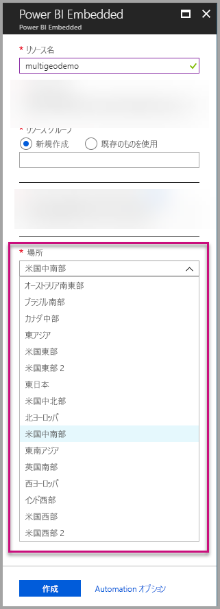
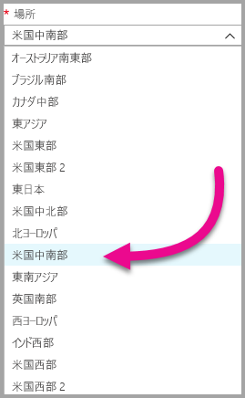
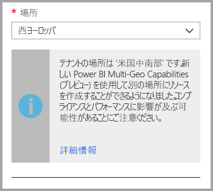
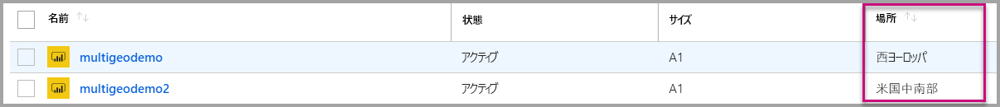
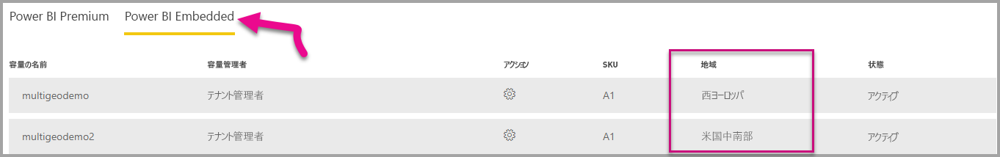

# Power BI Embedded の Multi-Geo のサポート (プレビュー)

**Power BI Embedded の Multi-Geo のサポート (プレビュー)** により、Power BI Embedded を使用して分析をアプリに組み込むアプリケーションをビルドする ISV や組織が、データを世界中の異なるリージョンにデプロイできるようになりました。

これにより、**Power BI Embedded** を使用しているユーザーは、[Power BI Premium による Multi-Geo の使用のサポート](../service-admin-premium-Multi-Geo.md)と同じ機能や制限事項に基づいて、**Multi-Geo** のオプションを使用して**容量**をセットアップできます。

## Multi-Geo を使用して新しい Power BI Embedded の容量リソースを作成する

**[リソースの作成]** 画面で、容量の場所を選択する必要があります。 これまでは Power BI テナントの場所のみに限定されていたため、単一の場所のみ選択できました。 Multi-Geo により、容量をデプロイする場所として別のリージョンを選択できるようになりました。

場所のドロップダウン メニューを開くと、既定でホーム テナントが選択されていることに気付きます。
  

別の場所を選択すると、その場所を認識しているかどうかを確認するメッセージが表示されます。

## 容量の場所を表示する

容量の場所は、Azure portal の Power BI Embedded の管理のメイン ページで簡単に確認できます。

Powerbi.com の管理ポータルでも確認できます。 管理ポータルで、[容量の設定] を選択し、[Power BI Embedded] タブに切り替えます。

[Power BI Embedded での容量の作成について詳しくはこちらをご覧ください。](azure-pbie-create-capacity.md)

## 既存の容量の場所を管理する

一度新しい容量を作成すると、Power BI Embedded リソースの場所は変更できません。

Power BI コンテンツを別のリージョンに移動するには、次の手順を実行します。

1. 別のリージョンに[新しい容量を作成](azure-pbie-create-capacity.md)します。

2. すべてのワークスペースを既存の容量から新しい容量に割り当てます。

3. 古い容量を削除または一時停止します。

重要で注意を要するのは、コンテンツを再割り当てすることなく容量を削除すると、その容量内のすべてのコンテンツがホーム リージョン内の共有容量に移ることです。

## Multi-Geo の API サポート

Multi-Geo で API を使用して容量を管理できるように、既存の API に次の変更を加えました。

1. **[容量を取得する](https://docs.microsoft.com/rest/api/power-bi/capacities/getcapacities)** - API はユーザーがアクセスできる容量の一覧を返します。 応答には容量の場所を示す 'region' という追加のプロパティが含まれるようになります。

2. **[容量に割り当てる](https://docs.microsoft.com/rest/api/power-bi/capacities)** - API は指定のワークスペースを容量に割り当てることを許可します。 この操作は、ワークスペースをホーム リージョン以外の容量に割り当てることや、ワークスペースを異なるリージョン間の容量に移動することを許可しません。 この操作を実行するには、ユーザーまたは[サービス プリンシパル](embed-service-principal.md)は引き続きワークスペースに対する管理アクセス許可、およびターゲット容量に対する管理アクセス許可または割り当てアクセス許可が必要です。

3. **[Azure Resource Manager API](https://docs.microsoft.com/rest/api/power-bi-embedded/capacities)** - *Create* や *Delete* を含む、Azure Resource Manager API の操作はすべて Multi-Geo をサポートします。

## 制限事項と考慮事項

* データ転送を開始する前に、リージョン間で開始されるすべての動作が、会社と政府のコンプライアンス要件をすべて満たしていることを確認してください。

* リモート リージョンに格納されているキャッシュ クエリは、保存時はそのリージョン内に残ります。 ただし、転送中の他のデータは、異なるのリージョン間を行き来する可能性があります。

* Multi-Geo 環境でデータを別のリージョンに移行する場合、ソース データは、データが移行された元のリージョンに最大 30 日間残る可能性があります。 その間、ユーザーはそのデータにアクセスできません。 30 日の期間中に、そのデータはこのリージョンから削除され、破棄されます。

* 一般的に、Multi-Geo でパフォーマンスが向上することはありません。 レポートとダッシュボードの読み込み処理の場合、ホーム リージョンに対してメタデータを要求する必要があります。

## 次の手順

以下のリンクを参照して、Power BI Embedded 容量や、すべての容量の Multi-Geo オプションの詳細を確認してください。

* [Power BI Embedded とは何ですか?](azure-pbie-what-is-power-bi-embedded.md)

* [Power BI Embedded 容量の作成](azure-pbie-create-capacity.md)

* [Power BI Premium 容量での Multi-Geo](../service-admin-premium-multi-geo.md)

他にわからないことがある場合は、 [Power BI コミュニティで質問してみてください](http://community.powerbi.com/)。