# <a name="row-level-security-with-power-bi-embedded"></a>Power BI Embedded での行レベルのセキュリティ

**行レベルのセキュリティ (RLS)** を使って、ダッシュボード、タイル、レポート、データセット内のデータへのユーザー アクセスを制限できます。 さまざまなユーザーが、別々のデータを見ながらそれらの同じアーティファクトで作業できます。 埋め込みでは RLS がサポートされています。

Power BI 以外のユーザー (アプリ所有データ) のために埋め込む場合は (一般に ISV のシナリオ)、この記事をお読みください。 ユーザーおよびロールを考慮するために埋め込むトークンを構成します。

組織内の Power BI ユーザー (ユーザー所有データ) のために埋め込む場合は、RLS は Power BI サービスで直接使う場合と同じように動作します。 アプリケーション内でそれ以上の操作を行う必要はありません。 詳しくは、「[Power BI での行レベルのセキュリティ (RLS)](../service-admin-rls.md)」をご覧ください。


RLS を利用するには、ユーザー、ロール、ルールの 3 つの主要な概念を理解することが重要です。 それぞれについて詳しく説明します。

**ユーザー** – アーティファクト (ダッシュボード、タイル、レポート、データセット) を表示するエンド ユーザー。 Power BI Embedded では、ユーザーは埋め込みトークンのユーザー名プロパティによって識別されます。

**ロール** – ユーザーはロールに属しています。 ロールはルールのコンテナーであり、"*営業マネージャー*" や "*営業担当者*" のような名前を付けます。ロールは Power BI Desktop で作成します。 詳しくは、「[Power BI Desktop での行レベルのセキュリティ (RLS)](../desktop-rls.md)」をご覧ください。

**ルール** – ロールにはルールが割り当てられ、それらのルールはデータに適用される実際のフィルターです。 ルールは、"Country = USA" のような単純なものもあれば、もっと動的なものもあります。
この記事の残りの部分では、RLS を作成し、埋め込みアプリケーション内でそれを使う方法の例について説明します。 この例では、[小売の分析のサンプル](http://go.microsoft.com/fwlink/?LinkID=780547)の PBIX ファイルを使います。


## <a name="adding-roles-with-power-bi-desktop"></a>Power BI Desktop でのロールの追加

**小売りの分析のサンプル**では、小売チェーンのすべての店舗の売上が表示されます。 RLS がないと、どの地域のマネージャーがサインインしてレポートを表示しても、必ず同じデータが表示されます。 経営陣は、各地域のマネージャーは自分が管理している店舗の売上のみを見ることができるようにする必要があると決定しました。 経営陣は、RLS を使い、地域のマネージャーに基づいてデータを制限できます。

RLS は Power BI Desktop で作成します。 データセットとレポートを開いた後は、ダイアグラム表示に切り替えてスキーマを見ることができます。


このスキーマについては注意することがいくつかあります。

* **Total Sales** などのすべてのメジャーは、**Sales** ファクト テーブルに格納されます。
* 他に次の 4 つの関連ディメンション テーブルがあります:**Item**、**Time**、**Store**、**District**。
* リレーションシップの線の矢印は、テーブル間でフィルターが適用される方向を示します。 たとえば、現在のスキーマの **Time[Date]** にフィルターを設定すると、**Sales** テーブルの値だけにフィルターが適用されます。 リレーションシップを示す線のすべての矢印は Sales テーブルを向いており、逆向きはないので、このフィルターによって他のテーブルは影響を受けません。
* **District** テーブルは、各地域のマネージャーを示します。
  
    

このスキーマを基にすると、**District** テーブルの **District Manager** 列にフィルターを適用し、そのフィルターがレポートを表示しているユーザーと一致した場合、そのフィルターはさらに **Store** と **Sales** テーブルに適用されて、その地域のマネージャーのデータが表示されます。

次にその方法を示します。

1. **[モデリング]** タブで **[ロールの管理]** を選びます。

    ![Power BI Desktop の [モデリング] タブ](media/embedded-row-level-security/powerbi-embedded-manage-roles.png)
2. **Manager** という名前の新しいロールを作成します。

    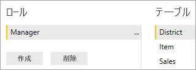
3. **District** テーブルに、「 **[District Manager] = USERNAME()** 」という DAX 式を入力します。

    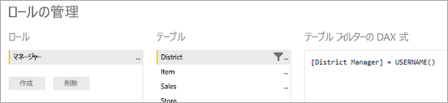
4. ルールが動作していることを確認するには、 **[モデリング]** タブで **[ロールとして表示]** を選び、作成した **Manager** ロールと **[その他のユーザー]** の両方を選びます。 ユーザーとして「**AndrewMa**」と入力します。

    ![[ロールとして表示] ダイアログ](media/embedded-row-level-security/powerbi-embedded-new-role-view.png)

    レポートには、**AndrewMa** としてサインインした場合のデータが表示されます。

ここでのフィルター適用方法では、**District**、**Store**、**Sales** の各テーブルのすべてのレコードがフィルター処理されます。 ただし、リレーションシップ上でのフィルターの向きのため、**Sales** から **Time**、**Sales** から **Item**、**Item** から **Time** テーブルには、フィルターは適用されません。 双方向のクロス フィルター処理について詳しくは、「[Bidirectional cross-filtering in SQL Server Analysis Services 2016 and Power BI Desktop](http://download.microsoft.com/download/2/7/8/2782DF95-3E0D-40CD-BFC8-749A2882E109/Bidirectional%20cross-filtering%20in%20Analysis%20Services%202016%20and%20Power%20BI.docx)」(SQL Server Analysis Services 2016 と Power BI Desktop での双方向クロス フィルター処理) ホワイトペーパーをダウンロードしてご覧ください。

## <a name="applying-user-and-role-to-an-embed-token"></a>埋め込みトークンへのユーザーとロールの適用

Power BI Desktop でロールを構成したので、そのロールを利用するための作業がアプリケーションに必要です。

ユーザーはアプリケーションによって認証および承認され、特定の Power BI Embedded レポートへのアクセスを、埋め込みトークンを使って許可されます。 Power BI Embedded は、ユーザーについての具体的な情報を持っていません。 RLS を機能させるためには、埋め込みトークンの一部として、ID の形式で追加コンテキストを渡す必要があります。 [埋め込みトークン](https://docs.microsoft.com/rest/api/power-bi/embedtoken) API を使って ID を渡すことができます。

この API は、ID とそれに関連するデータセットを示す値を受け取ります。 RLS を機能させるためには、ID の一部として次の要素を渡す必要があります。

* **ユーザー名 (必須)** – RLS ルールを適用するときにユーザーの識別に使うことができる文字列です。 指定できるユーザーは 1 人だけです。 ユーザー名は *ASCII* 文字で作成できます。
* **ロール (必須)** – 行レベル セキュリティのルールを適用するときに選択するロールを含む文字列です。 複数のロールを渡す場合は、文字列の配列として渡す必要があります。
* **データセット (必須)** – 埋め込むアーティファクトで使われるデータセットです。

**PowerBIClient.Reports** で **GenerateTokenInGroup** メソッドを使って、埋め込みトークンを作成できます。

たとえば、[PowerBIEmbedded_AppOwnsData](https://github.com/Microsoft/PowerBI-Developer-Samples/tree/master/App%20Owns%20Data) サンプルを変更できます。 "*Services\EmbedService.cs の 76 および 77 行目*" は次のように更新されます。

```csharp
// Generate Embed Token.
var generateTokenRequestParameters = new GenerateTokenRequest(accessLevel: "view");

var tokenResponse = await client.Reports.GenerateTokenInGroupAsync(GroupId, report.Id, generateTokenRequestParameters);
```

to

```csharp
var generateTokenRequestParameters = new GenerateTokenRequest("View", null, identities: new List<EffectiveIdentity> { new EffectiveIdentity(username: "username", roles: new List<string> { "roleA", "roleB" }, datasets: new List<string> { "datasetId" }) });

var tokenResponse = await client.Reports.GenerateTokenInGroupAsync("groupId", "reportId", generateTokenRequestParameters);
```

REST API を呼び出すと、更新された API は、ユーザー名、ロール文字列のリスト、データセット文字列のリストを含む **identities** という名前の JSON 配列を追加で受け取ります。 

例として、次のコードを使用します。

```json
{
    "accessLevel": "View",
    "identities": [
        {
            "username": "EffectiveIdentity",
            "roles": [ "Role1", "Role2" ],
            "datasets": [ "fe0a1aeb-f6a4-4b27-a2d3-b5df3bb28bdc" ]
        }
    ]
}
```

これですべての要素がそろったので、誰かがアプリケーションにログインしてこのアーティファクトを表示すると、行レベル セキュリティによる定義に従い、見ることを許可されているデータだけが表示されます。

## <a name="working-with-analysis-services-live-connections"></a>Analysis Services ライブ接続を使用する

行レベルのセキュリティをオンプレミス サーバーの Analysis Services ライブ接続と併用できます。 この種類の接続を利用するには、いくつかの概念を理解しておく必要があります。

ユーザー名プロパティとして有効な ID は、Analysis Services サーバーのアクセス許可を持つ Windows ユーザーです。

### <a name="on-premises-data-gateway-configuration"></a>オンプレミス データ ゲートウェイ構成

[オンプレミス データ ゲートウェイ](../service-gateway-onprem.md)は、Analysis Services ライブ接続の使用時に利用されます。 埋め込みトークンの生成時、ID が一覧表示された状態で、マスター アカウントをゲートウェイの管理者として一覧表示する必要があります。 マスター アカウントが一覧表示されない場合、行レベルのセキュリティがデータのプロパティに適用されません。 ゲートウェイの管理者ではないユーザーは役割を与えることができますが、有効な ID として自分のユーザー名を指定する必要があります。

### <a name="use-of-roles"></a>ロールの使用

役割は、埋め込みトークンの ID で与えられます。 役割が与えられない場合、与えられたユーザー名を利用し、関連する役割を解決できます。

### <a name="using-the-customdata-feature"></a>CustomData 機能の使用

CustomData 機能は、**Azure Analysis Services** にあるモデルに対してのみ動作し、またこれは **[ライブ接続]** モードでのみ動作します。 ユーザーおよびロールとは異なり、カスタム データ機能は .pbix ファイル内では設定できません。 カスタム データ機能を使ってトークンを生成するときは、ユーザー名が必要です。

CustomData 機能を使うと、**Azure Analysis Services** をデータ ソースとして使い、ご自身のアプリケーション内で Power BI データを表示する (アプリケーションの Azure Analysis Services に接続されている Power BI データを表示する) ときに、行フィルターを追加できます。

CustomData 機能を使うと、CustomData 接続文字列プロパティを使って、フリー テキスト (文字列) を渡すことができます。 Analysis Services では、*CUSTOMDATA()* 関数を介してこの値が使われます。

**Azure Analysis Services** 内で動的 RLS (これはフィルターの評価のために動的な値を使います) を設定するための唯一の方法は、*CUSTOMDATA()* 関数を使うことです。

ロール DAX クエリの内部で、およびメジャー DAX クエリ内でロールなしに、使うことができます。
CustomData 機能は、ダッシュボード、レポート、タイルの各アーティファクトたのためのトークン生成機能の一部です。 ダッシュボードは複数の CustomData ID (タイル/モデルごとに 1 つ) を持つことができます。

#### <a name="customdata-sdk-additions"></a>CustomData SDK の追加

CustomData 文字列プロパティが、トークン生成のシナリオの有効な ID に追加されました。

```json
[JsonProperty(PropertyName = "customData")]
public string CustomData { get; set; }
```

ID は、次の呼び出しを使ってカスタム データで作成できます。

```csharp
public EffectiveIdentity(string username, IList<string> datasets, IList<string> roles = null, string customData = null);
```

#### <a name="customdata-sdk-usage"></a>CustomData SDK の使用方法

REST API を呼び出す場合は、次の例のように各 ID の内部にカスタム データを追加できます。

```json
{
    "accessLevel": "View",
    "identities": [
        {
            "username": "EffectiveIdentity",
            "roles": [ "Role1", "Role2" ],
            "customData": "MyCustomData",
            "datasets": [ "fe0a1aeb-f6a4-4b27-a2d3-b5df3bb28bdc" ]
        }
    ]
}
```

Power BI Embedded アプリケーションで CustomData() 機能の設定を開始するための手順は、次のとおりです。

1. ご自身の Azure Analysis Services データベースを作成します。 次に、[SQL Server Management Studio](https://docs.microsoft.com/sql/ssms/download-sql-server-management-studio-ssms?view=sql-server-2017) を介してご自身の Azure Analysis Services サーバーにサインインします。

    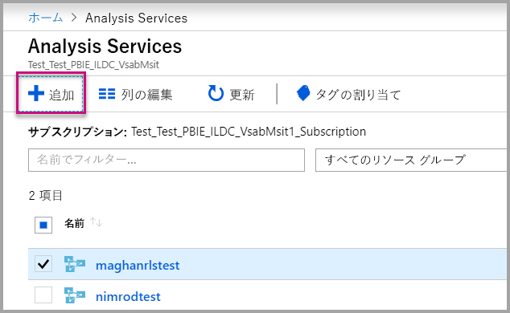

    

2. Analysis Services サーバーにロールを作成します。

    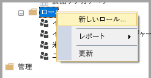

3. **[全般]** 設定を設定します。  ここでは **[ロール名]** を入力し、データベースのアクセス許可を **[読み取り]** 専用に設定します。

    

4. **[メンバーシップ]** 設定を設定します。 ここでは、このロールの影響を受けるユーザーを追加します。

    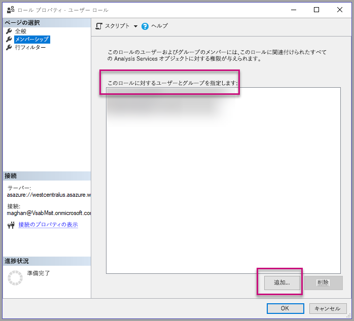

5. *CUSTOMDATA()* 関数を使って **[行フィルター]** DAX クエリを設定します。

    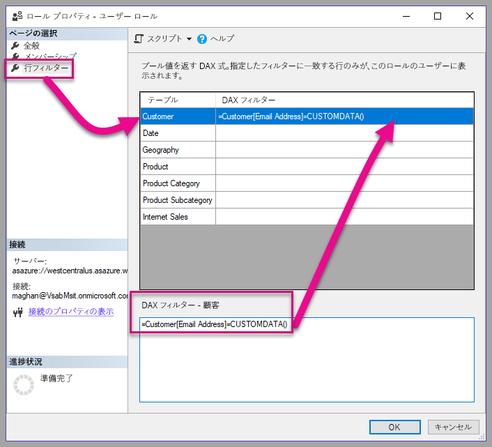

6. PBI レポートを構築し、それを専用の容量を持つワークスペースに発行します。

    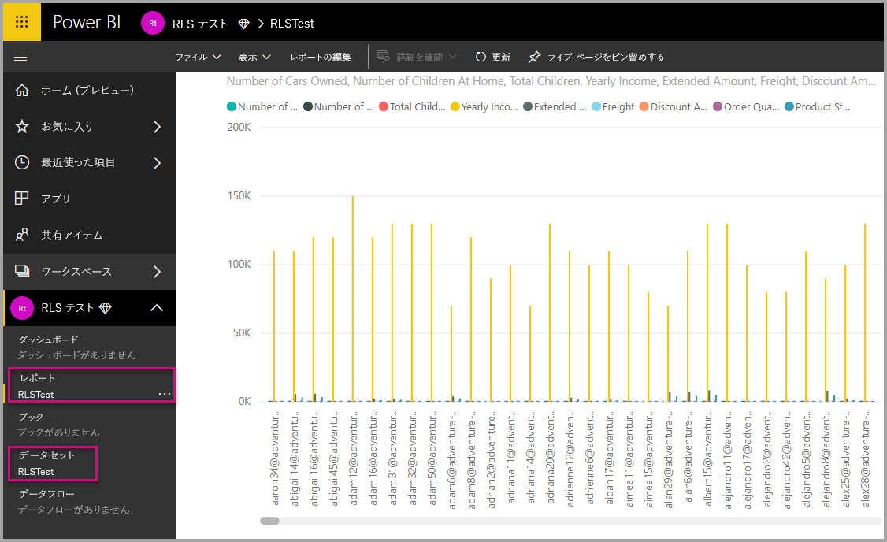

7. Power BI API を使って、アプリケーション内で CustomData 機能を使います。  カスタム データ機能を使ってトークンを生成するときは、ユーザー名が必要です。 ユーザー名は、マスター ユーザーの UPN と同じである必要があります。 マスター ユーザーは、作成したロールのメンバーである必要があります。 ロールが指定されていない場合、マスター ユーザーがそのメンバーになっているすべてのロールが RLS の評価に使用されます。

    使用する場合、[サービス プリンシパル](embed-service-principal.md)、マスターのアカウントを使用する代わりに、上記の手順を実行する必要もあります。 埋め込みトークンを生成する、使用して、[サービス プリンシパル オブジェクト ID](embed-service-principal.md#how-to-get-the-service-principal-object-id)ユーザー名とします。

    > [!Note]
    > 運用環境にアプリケーションをデプロイする準備ができたら、マスター ユーザーのアカウント フィールドまたはオプションは、エンド ユーザーに対して非表示である必要があります。

    CustomData 機能を追加する[コード](#customdata-sdk-additions)をご覧ください。

8. これで、カスタム データ値を適用してレポートが保持しているすべてのデータを確認する前に、アプリケーションでレポートを表示できるようになりました。

    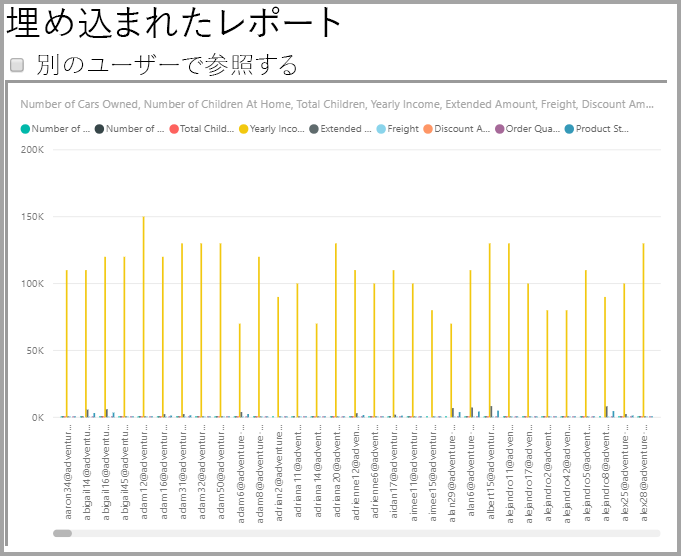

    次に、カスタム データ値を適用して、データの異なるセットがレポートでどのように表示されるかを確認します。
    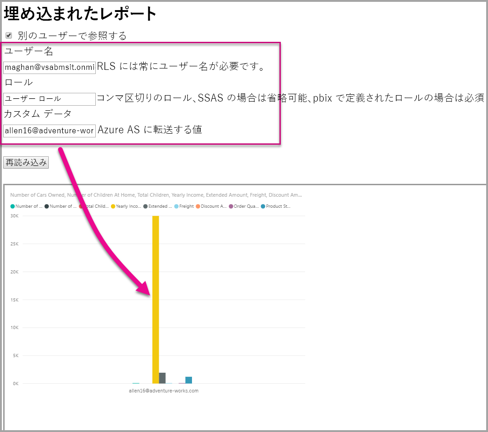

## <a name="using-rls-vs-javascript-filters"></a>RLS の使用とJavaScript のフィルター

レポート内のデータをフィルター処理することに決めた場合、**行レベルのセキュリティ (RLS)** か **JavaScript のフィルター**を使用できます。

[行レベルのセキュリティ](../service-admin-rls.md)は、データ モデルのレベルでデータをフィルター処理する機能です。 バックエンド データ ソースによって RLS 設定が制御されます。 データ モデルに基づいて、埋め込みトークンの生成によりセッションのユーザー名とロールが設定されます。 クライアント側のコードでこれをオーバーライド、削除、または制御することはできません。これがセキュリティで保護されていると見なされる理由です。 RLS を使ってデータを安全にフィルター処理することをお勧めします。 以下のオプションのいずれかを使うことで、RLS を使ってデータをフィルター処理できます。

* [Power BI レポートでロールを構成する](../desktop-rls.md)。
* データ ソース レベルでロールを構成する (Analysis Services のライブ接続のみ)。
* [埋め込みトークン](https://docs.microsoft.com/rest/api/power-bi/embedtoken/datasets_generatetokeningroup)で `EffectiveIdentity` を使ってプログラムで実行する。 埋め込みトークンを使う場合、実際のフィルターは特定のセッションの埋め込みトークンを通過します。

ユーザーが短縮、スコープ設定、またはフィルター処理されたデータのビューを利用できるようにするためには、[JavaScript のフィルター](https://github.com/Microsoft/PowerBI-JavaScript/wiki/Filters#page-level-and-visual-level-filters)を使います。 ただし、ユーザーは引き続きモデル スキーマのテーブル、列、およびメジャーにアクセスできるため、潜在的にはそこにあるすべてのデータにアクセスできます。 データへのアクセス制限は RLS を使う場合にのみ適用でき、クライアント側のフィルター処理 API を使う場合は適用できません。

## <a name="token-based-identity-with-azure-sql-database-preview"></a>Azure SQL Database でのトークン ベースの ID (プレビュー)

**トークン ベースの ID** では、**Azure SQL Database** に対する **Azure Active Directory (AAD)** のアクセス トークンを使用して、埋め込みトークンに対する有効な ID を指定することができます。

**Azure SQL Database** にデータを保持するお客様は、**Power BI Embedded** と統合すると、新しい機能を利用して、ユーザーと Azure SQL 内のデータへのユーザーのアクセスを管理することができます。

埋め込みトークンを生成するときに、Azure SQL でのユーザーの有効な ID を指定できます。 サーバーに AAD アクセス トークンを渡すことによって、ユーザーの有効な ID を指定できます。 アクセス トークンは、その特定のセッションにおいて、Azure SQL からそのユーザーに関連するデータだけをプルするために使用されます。

Azure SQL で各ユーザーのビューを管理したり、マルチテナント DB において特定の顧客として Azure SQL にサインインしたりするために使用できます。 また、Azure SQL でそのセッションに対して行レベルのセキュリティを適用し、そのセッションに関連のあるデータのみを取得して、Power BI で RLS を管理する必要がないようにすることもできます。

このような有効な ID の発行は、Azure SQL Server での RLS ルールに直接適用されます。 Power BI Embedded では、Azure SQL Server のデータのクエリを実行するときに、提供されたアクセス トークンが使用されます。 (アクセス トークンの提供対象である) ユーザーの UPN には、USER_NAME() SQL 関数の結果としてアクセスできます。

トークン ベースの ID は、Azure SQL Database に接続されている専用容量での DirectQuery モデルに対してのみ動作します。これは、AAD 認証を許可するように構成されています ([Azure SQL Database に対する AAD 認証の詳細](https://docs.microsoft.com/azure/sql-database/sql-database-manage-logins))。 トークン ベースの ID を使用するには、エンド ユーザーの OAuth2 資格情報を使用するように、データセットのデータ ソースを構成する必要があります。

   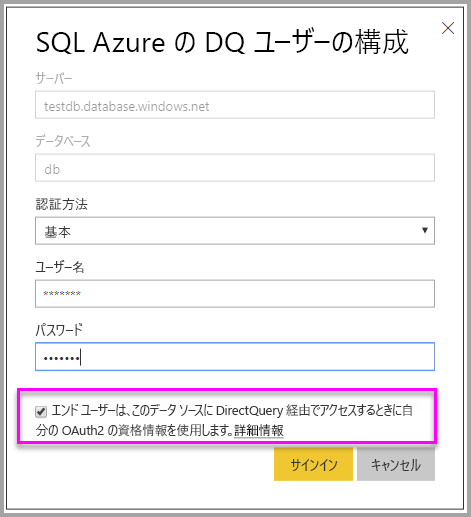

### <a name="token-based-identity-sdk-additions"></a>トークン ベースの ID に関して SDK に追加されたもの

ID BLOB プロパティが、トークン生成のシナリオの有効な ID に追加されました。

```JSON
[JsonProperty(PropertyName = "identityBlob")]
public IdentityBlob IdentityBlob { get; set; }
```

IdentityBlob 型は、値の文字列プロパティを保持する単純な JSON 構造です。

```JSON
[JsonProperty(PropertyName = "value")]
public string value { get; set; }
```

次の呼び出しを使用して、ID BLOB で EffectiveIdentity を作成できます。

```C#
public EffectiveIdentity(string username, IList<string> datasets, IList<string> roles = null, string customData = null, IdentityBlob identityBlob = null);
```

ID BLOB は、次の呼び出しを使用して作成できます。

```C#
public IdentityBlob(string value);
```

### <a name="token-based-identity-rest-api-usage"></a>トークン ベースの ID に関する REST API の使用方法

[REST API](https://docs.microsoft.com/rest/api/power-bi/embedtoken/reports_generatetoken#definitions) を呼び出す場合は、各 ID の内部に ID BLOB を追加できます。

```JSON
{
    "accessLevel": "View",
    "identities": [
        {
            "datasets": ["fe0a1aeb-f6a4-4b27-a2d3-b5df3bb28bdc"],
        “identityBlob”: {
            “value”: “eyJ0eXAiOiJKV1QiLCJh….”
         }
        }
    ]
}
```

ID BLOB で提供する値は、Azure SQL Server に対する (リソース URL が <https://database.windows.net/> の) 有効なアクセス トークンである必要があります。

   > [!Note]
   > Azure SQL に対するアクセス トークンを作成できるためには、Azure portal の AAD アプリ登録構成において、**Azure SQL Database** API に対する **Azure SQL DB と Data Warehouse へのアクセス**の委任されたアクセス許可を、アプリケーションに設定する必要があります。

   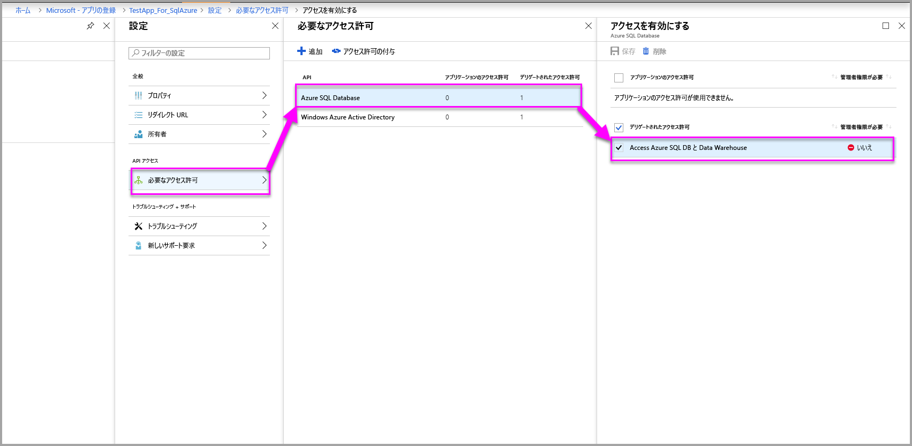

## <a name="on-premises-data-gateway-with-service-principal-preview"></a>サービス プリンシパルを使用するオンプレミス データ ゲートウェイ (プレビュー)

SQL Server Analysis Services (SSAS) オンプレミス ライブ接続データ ソースを使用して行レベル セキュリティ (RLS) を構成するお客様は、**Power BI Embedded** と統合することで、新しい[サービス プリンシパル](embed-service-principal.md)機能を使用して、ユーザーと、SSAS のデータへのユーザー アクセスを管理することができます。

[Power BI REST API](https://docs.microsoft.com/rest/api/power-bi/) を使用すると、[サービス プリンシパル オブジェクト](https://docs.microsoft.com/azure/active-directory/develop/app-objects-and-service-principals#service-principal-object)を使用して埋め込みトークンに対して SSAS オンプレミス ライブ接続用の有効な ID を指定することができます。

これまでは、SSAS オンプレミス ライブ接続用の有効な ID を指定することができるためには、埋め込みトークンを生成するマスター ユーザーがゲートウェイ管理者である必要がありました。現在では、ユーザーがゲートウェイ管理者である必要はなくなりました。ゲートウェイ管理者は、そのデータ ソースに専用のアクセス許可をユーザーに付与することができ、そのユーザーは埋め込みトークンを生成するときに、有効な ID をオーバーライドできます。 この新しい機能により、SSAS ライブ接続に対してサービス プリンシパルでの埋め込みが可能になります。

このシナリオを有効にするには、ゲートウェイ管理者が [Add Datasource User REST API](https://docs.microsoft.com/rest/api/power-bi/gateways/adddatasourceuser) を使用して、Power BI Embedded に対する *ReadOverrideEffectiveIdentity* アクセス許可をサービス プリンシパルに付与する必要があります。

管理ポータルを使用してこのアクセス許可を設定することはできません。 このアクセス許可は、API でのみ設定されます。 管理ポータルでは、そのようなアクセス許可を持つユーザーと SPN についての指示が表示されます。

## <a name="considerations-and-limitations"></a>考慮事項と制限事項

* Power BI サービス内でのロールへのユーザーの割り当ては、埋め込みトークンを使用したときの RLS には反映されません。
* Power BI サービスでは RLS の設定は管理者や編集アクセス許可を持つメンバーには適用されませんが、埋め込みトークンで ID を指定すると、データに適用されます。
* オンプレミス サーバー向けの Analysis Services ライブ接続がサポートされています。
* Azure Analysis Services ライブ接続ではロールによるフィルター処理はサポートされます。 動的フィルターは、CustomData を使用して適用できます。
* 基になるデータセットで RLS が必要ない場合、GenerateToken 要求に有効な ID が含まれていては**なりません**。
* 基になるデータセットがクラウド モデル (キャッシュされたモデルまたは DirectQuery) の場合は、有効な ID に少なくとも 1 つのロールが含まれている必要があります。そうでない場合、ロールの割り当ては行われません。
* ID のリストを使うと、ダッシュボードの埋め込みに複数の ID トークンを使うことができます。 他のすべてのアーティファクトでは、リストには単一の ID が含まれます。

### <a name="token-based-identity-limitations-preview"></a>トークン ベースの ID の制限 (プレビュー)

* この機能では、Power BI Premium での使用のみが制限されます。
* この機能は、オンプレミスの SQL Server では動作しません。
* この機能は、Multi-Geo では動作しません。

他にわからないことがある場合は、 [Power BI コミュニティで質問してみてください](https://community.powerbi.com/)。
