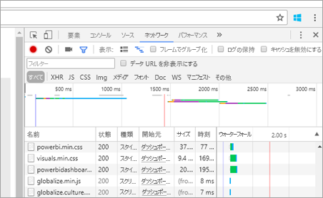

# <a name="troubleshooting-your-embedded-application"></a>埋め込みアプリケーションのトラブルシューティング

この記事では、Power BI からコンテンツを埋め込むときに発生する一般的な問題について説明します。

## <a name="tools-for-troubleshooting"></a>トラブルシューティングするためのツール

### <a name="fiddler-trace"></a>Fiddler のトレース

[Fiddler](http://www.telerik.com/fiddler) は、HTTP トラフィックを監視する Telerik 提供の無償ツールです。  クライアント コンピューターから Power BI API によるやり取りを確認できます。 これにより、エラーとその他の関連する情報が表示される場合があります。


### <a name="f12-in-browser-for-front-end-debugging"></a>フロント エンド デバッグにはブラウザーで F12

F12 を押すと、ブラウザー内で開発者ウィンドウが起動します。 これでネットワーク トラフィックやその他の情報を見ることができます。



### <a name="extracting-error-details-from-power-bi-response"></a>Power BI 応答からエラーの詳細を抽出する

このコード スニペットは、HTTP 例外からエラーの詳細を抽出する方法を示しています。

```
public static string GetExceptionText(this HttpOperationException exc)
{
    var errorText = string.Format("Request: {0}\r\nStatus: {1} ({2})\r\nResponse: {3}",
    exc.Request.Content, exc.Response.StatusCode, (int)exc.Response.StatusCode, exc.Response.Content);
    if (exc.Response.Headers.ContainsKey("RequestId"))
    {
        var requestId = exc.Response.Headers["RequestId"].FirstOrDefault();
        errorText += string.Format("\r\nRequestId: {0}", requestId);
    }

    return errorText;
}
```
要求 ID (およびエラーの詳細をトラブルシューティングのために) をログに記録することをお勧めします。
Microsoft サポートに連絡する際に、要求 ID を指定してください。

## <a name="app-registration"></a>アプリの登録

**アプリ登録エラー**

Azure Portal または Power BI アプリ登録ページ内のエラー メッセージは、特権が不十分であることを伝えます。 アプリケーションを登録するには、Azure AD テナントの管理者になる必要があります。または、非管理者ユーザーのアプリケーション登録を有効にする必要があります。

**新しいアプリを登録したとき、Power BI サービスが Azure Portal に表示されない**

少なくとも 1 名のユーザーを Power BI に登録する必要があります。 API 一覧に **Power BI サービス**が表示されない場合、Power BI にユーザーが登録されていません。

## <a name="rest-api"></a>REST API

**API の呼び出しで 401 が返される**

さらに調査するには、Fiddler キャプチャが必要になる場合があります。 Azure AD 内の登録済みアプリケーションに対して、必要なアクセス許可スコープがない可能性があります。 Azure Portal 内で Azure AD のアプリ登録内に必要なスコープがあることを確認します。

**API の呼び出しで 403 が返される**

さらに調査するには、Fiddler キャプチャが必要になる場合があります。 403 エラーにはいくつかの理由が考えられます。

* Azure AD 認証トークンの有効期限が切れています。
* 認証されたユーザーがグループ (アプリ ワークスペース) に属していません。
* 認証されたユーザーがグループ (アプリ ワークスペース) の管理者ではありません。
* Authorization ヘッダーが正しく記載されていない可能性があります。 入力ミスがないことを確認してください。

場合によっては、GenerateToken を呼び出す前にアプリケーションのバックエンドで認証トークンを更新する必要があります。

```
    GET https://wabi-us-north-central-redirect.analysis.windows.net/metadata/cluster HTTP/1.1
    Host: wabi-us-north-central-redirect.analysis.windows.net
    ...
    Authorization: Bearer eyJ0eXAiOi...
    ...
 
    HTTP/1.1 403 Forbidden
    ...
     
    {"error":{"code":"TokenExpired","message":"Access token has expired, resubmit with a new access token"}}
```

**有効な ID が与えられた GenerateToken が失敗する**

いくつかの理由から、有効な ID が与えられた GenerateToken が失敗することがあります。

* データセットが有効な ID に対応していない
* ユーザー名が指定されていない
* ロールが指定されていない
* DatasetId が指定されていない
* ユーザーに正しいアクセス許可が与えられていない

どれが原因か検証するには、次を試します。

* [get dataset](https://msdn.microsoft.com/library/mt784653.aspx) を実行します。 プロパティ IsEffectiveIdentityRequired は true ですか?
* ユーザー名はあらゆる EffectiveIdentity で必須です。
* IsEffectiveIdentityRolesRequired が true であれば、ロールが必要です。
* DatasetId はあらゆる EffectiveIdentity で必須です。
* Analysis Services の場合、マスター ユーザーをゲートウェイ管理者にする必要があります。

## <a name="data-sources"></a>データ ソース

**ISV が同じデータ ソースに対して複数の資格情報を求める**

データ ソースには、1 つのマスター ユーザーに対して 1 つの資格情報セットを与えることができます。 異なる資格情報を使用する必要がある場合、追加のマスター ユーザーを作成します。 次に、マスター ユーザーごとに異なる資格情報を割り当て、そのユーザーの Azure AD トークンを利用して埋め込みます。

## <a name="content-rendering"></a>コンテンツ レンダリング

**埋め込みコンテンツをレンダリングできない、使用できない、またはタイムアウトになる**

埋め込みトークンの有効期限が切れていないことを確認します。 埋め込みトークンの有効期限を確認し、更新してください。 詳細については、「[Refresh token using JavaScript SDK](https://github.com/Microsoft/PowerBI-JavaScript/wiki/Refresh-token-using-JavaScript-SDK-example)」 (JavaScript SDK を利用してトークンを更新する) を参照してください。

**レポートまたはダッシュボードが読み込まれない**

ユーザーがレポートまたはダッシュボードを表示できない場合、それが powerbi.com 内で正しく読み込まれることを確認してください。powerbi.com 内で読み込まれない場合、レポートまたはダッシュボードがアプリケーション内で機能することはありません。

**レポートまたはダッシュボードの動きが遅い**

Power BI Desktop から、あるいは powerbi.com 内でファイルを開き、パフォーマンスがアプリケーションまたは埋め込み API の問題として除外できる範囲であることを確認します。


よく寄せられる質問の答えは、「[Power BI Embedded FAQ](embedded-faq.md)」でご確認いただけます。

他にわからないことがある場合は、 [Power BI コミュニティを利用してください](http://community.powerbi.com/)。
