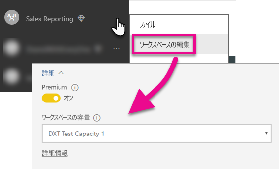

# Power BI ダッシュボード、レポート、およびタイルを埋め込む

ここでは、アプリケーション内に Power BI コンテンツを埋め込むために必要な手順について説明します。

Microsoft は [Power BI Premium を発表](https://powerbi.microsoft.com/blog/microsoft-accelerates-modern-bi-adoption-with-power-bi-premium/)しました。この新しい容量ベースのライセンス モデルは、ユーザーによるコンテンツのアクセス、共有および配布方法の柔軟性を高めます。 また、Power BI サービスのスケーラビリティとパフォーマンスが向上します。 Microsoft Azure 内に容量を作成することができる Power BI Embedded も発表されました。 Power BI Embedded はアプリケーションと顧客を対象としたものです。 

この記事では、組織向けと顧客向け両方の Power BI コンテンツの埋め込みについて説明します。 2 つのシナリオの手順は似ています。 手順が顧客向けの埋め込みに固有である場合は、そのことが示されています。

これを可能にするためにアプリケーションで実行する必要がある手順がいくつかあります。 アプリケーション内で埋め込みコンテンツを作成し、使用できるようにするために必要な手順を順に説明していきます。

> [!NOTE]
> Power BI API では引き続き、アプリ ワークスペースをグループと呼びます。 したがって、グループと記述されている場合はすべて、アプリ ワークスペースを使用していることを意味します。

## 手順 1: 埋め込み分析開発環境をセットアップする

アプリケーションへのダッシュボードとレポートの埋め込みを開始する前に、埋め込めるように環境がセットアップされていることを確認する必要があります。 セットアップの一環として、以下を行う必要があります。

* [Azure Active Directory テナントがあることを確認する](embedding-content.md#azureadtenant)
* [Power BI Pro アカウントを作成する](embedding-content.md#proaccount)
* [Azure Active Directory アプリケーションの登録とアクセス許可](embedding-content.md#appreg)

> [!NOTE]
> アプリケーションの開発には、Power BI の容量は必要ありません。 アプリケーションの開発者には Power BI Pro ライセンスが必要になります。

### Azure Active Directory テナント

Power BI からアイテムを埋め込むには、Azure Active Directory (Azure AD) テナントが必要になります。 このテナントには少なくとも 1 人の Power BI Pro ユーザーが必要です。 また、テナント内で Azure AD アプリを定義する必要があります。 既存の Azure AD テナントを利用することも、埋め込み専用に新しいものを作成することもできます。

顧客向けに埋め込む場合は、使用するテナント セットアップを決める必要があります。

* 既存の企業の Power BI テナントを使用しますか。
* アプリケーションで個別のテナントを使用しますか。
* 顧客ごとに個別のテナントを使用しますか。

既存のテナントを使用しない場合や、アプリケーション、または顧客ごとに新しいテナントを作成するよう選択できる場合は、「[Azure Active Directory テナントを作成する](create-an-azure-active-directory-tenant.md)」または「[Azure Active Directory テナントを取得する方法](https://docs.microsoft.com/azure/active-directory/develop/active-directory-howto-tenant)」を参照してください。

### Power BI Pro ユーザー アカウントを作成する

コンテンツを埋め込む場合、1 つの Power BI Pro アカウントのみが必要となります。 ただし、アイテムに固有のアクセス権を持ついくつかの異なるユーザーが必要になる場合があります。 ここでは、テナント内で考慮する必要がある可能性があるユーザーを示します。

次のアカウントはテナント内に存在し、Power BI Pro ライセンスを割り当てる必要があります。 Power BI 内でアプリ ワークスペースを使用する場合は、Power BI Pro ライセンスが必要です。

#### 組織/テナント管理者ユーザー

顧客向けの埋め込みでは、アプリケーションが使用するアカウントとして、組織/テナントのグローバル管理者ユーザーを使用しないことをお勧めします。 そうすれば、テナント内でのアプリケーション アカウントによるアクセスが最小限に抑えられます。 管理者ユーザーは、埋め込むために作成されたすべてのアプリ ワークスペースの管理者にすることをお勧めします。

#### コンテンツを作成するアナリストのアカウント

複数のユーザーが Power BI のコンテンツを作成する可能性があります。 コンテンツを作成し、Power BI に配置するアナリストごとに Power BI Pro アカウントが必要になります。

#### 顧客向けの埋め込みのためのアプリケーション "*マスター*" ユーザー アカウント

マスター アカウントは、顧客向けのコンテンツ埋め込み時にアプリケーションが使用するアカウントです。 通常、このシナリオは ISV アプリケーション向けです。 組織内で本当に必要なアカウントはマスター アカウントだけです。 管理者およびアナリスト アカウントとしても使用できますが、お勧めできません。 アプリケーションのバックエンドにはこのアカウントの資格情報が格納され、Power BI API で使用する Azure AD 認証トークンを取得するために使用されます。 このアカウントは、アプリケーションを顧客用に使用するための埋め込みトークンを生成する場合に使用されます。

マスター アカウントは、アプリケーションで使用する Power BI Pro ライセンスを持っている通常のユーザーに過ぎません。 このアカウントは、埋め込みに使用されるアプリ ワークスペースの管理者である必要があります。

###  アプリの登録とアクセス許可

REST API の呼び出しを行うには、Azure AD にアプリケーションを登録する必要があります。 詳しくは、「[Azure AD アプリを登録して Power BI コンテンツを埋め込む](register-app.md)」をご覧ください。

### アプリ ワークスペースを作成する

顧客向けにダッシュボードとレポートを埋め込む場合は、そのダッシュボードとレポートをアプリ ワークスペース内に配置する必要があります。 前述の "*マスター*" アカウントは、アプリ ワークスペースの管理者である必要があります。

[!INCLUDE [powerbi-service-create-app-workspace](../includes/powerbi-service-create-app-workspace.md)]

### レポートを作成してアップロードする

Power BI Desktop を使用してレポートとデータセットを作成し、アプリ ワークスペースにこれらのレポートを発行できます。 レポートを発行するエンド ユーザーには、アプリ ワークスペースに発行するための Power BI Pro ライセンスが必要です。

## 手順 2: コンテンツを埋め込む

アプリケーション内では、Power BI で認証する必要があります。 顧客向けのコンテンツを埋め込む場合は、アプリケーション内に "*マスター*" アカウントの資格情報を格納します。 詳しくは、「[ユーザーを認証し、Power BI アプリ用の Azure AD アクセス トークンを取得する](get-azuread-access-token.md)」をご覧ください。

認証を行った後、アプリケーション内で、Power BI REST API と JavaScript API を使用して、ダッシュボードとレポートをアプリケーションに埋め込みます。 

**組織向けの埋め込み**については、以下のチュートリアルをご覧ください。

* [ダッシュボードをアプリに統合する](integrate-dashboard.md)
* [タイルをアプリに統合する](integrate-tile.md)
* [レポートをアプリに統合する](integrate-report.md)

通常は ISV を対象としたものである**顧客向けの埋め込み**については、以下をご覧ください。

* [ダッシュボード、タイル、レポートをアプリケーションに統合する](embed-sample-for-customers.md)

顧客向けに埋め込む場合は、埋め込みトークンが必要です。 詳細については、「[GenerateToken](https://msdn.microsoft.com/library/mt784614.aspx)」を参照してください。

## 手順 3: ソリューションを運用に昇格する

運用環境に移行には、追加手順がいくつか必要です。

### 組織向けの埋め込み

組織向けの埋め込みの場合は、アプリケーションへのアクセス方法を知らせるだけです。 

容量によってアプリ ワークスペース (グループ) がバックアップされている場合、無料ユーザーはそのワークスペースから埋め込まれたコンテンツを利用できます。 アプリ ワークスペース (グループ) のメンバーとして無料ユーザーをリストします。そうしないと、401 非承認エラーが発生します。 次の表は、Office 365 で利用可能な Power BI Premium SKU の一覧です。

| 容量ノード | 合計コア *(バックエンド + フロントエンド)* | バックエンド コア | フロントエンド コア | DirectQuery/ライブ接続の制限 | ピーク時の最大のページ レンダリング数 |
| --- | --- | --- | --- | --- | --- |
| EM3 |4 v コア |2 コア、10 GB の RAM |2 コア | |601-1,200 |
| P1 |8 v コア |4 コア、25 GB の RAM |4 コア |1 秒あたり 30 |1,201-2,400 |
| P2 |16 v コア |8 コア、50 GB の RAM |8 コア |1 秒あたり 60 |2,401-4,800 |
| P3 |32 v コア |16 コア、100 GB の RAM |16 コア |1 秒あたり 120 |4,801-9600 |

> [!NOTE]
> グローバルまたは課金管理者は、Power BI Premium を購入するためには、テナント内に存在する必要があります。 Power BI Premium の購入方法については、「[Power BI Premium の購入方法](../service-admin-premium-purchase.md)」を参照してください。

### 顧客向けの埋め込み

顧客向けに埋め込む場合は、次のようにします。

* 開発用に個別のテナントを使う場合は、アプリ ワークスペース、ダッシュボード、およびレポートが運用環境で利用可能であることを確認する必要があります。 また、運用テナントの Azure AD でアプリケーションを作成し、手順 1 のとおり、適切なアプリにアクセス許可を割り当てたことを確認します。
* ニーズに合う容量を購入します。 以下の表を使って、必要になる可能性がある Power BI Embedded 容量の SKU を把握できます。 詳細については、「[Embedded analytics capacity planning whitepaper](https://aka.ms/pbiewhitepaper)」 (埋め込み分析の容量計画に関するホワイト ペーパー) を参照してください。 準備ができたら、[Microsoft Azure Portal](https://portal.azure.com) で購入できます。 Power BI Embedded 容量の作成方法の詳細については、「[Create Power BI Embedded capacity in the Azure portal](https://docs.microsoft.com/azure/power-bi-embedded/create-capacity)」(Azure Portal で Power BI Embedded 容量を作成する) をご覧ください。

| 容量ノード | 合計コア *(バックエンド + フロントエンド)* | バックエンド コア | フロントエンド コア | DirectQuery/ライブ接続の制限 | ピーク時の最大のページ レンダリング数 |
| --- | --- | --- | --- | --- | --- |
| A1 |1 v コア |0.5 コア、3 GB の RAM |0.5 コア | |1-300 |
| A2 |2 v コア |1 コア、5 GB の RAM |1 コア | |301-600 |
| A3 |4 v コア |2 コア、10 GB の RAM |2 コア | |601-1,200 |
| A4 |8 v コア |4 コア、25 GB の RAM |4 コア |1 秒あたり 30 |1,201-2,400 |
| A5 |16 v コア |8 コア、50 GB の RAM |8 コア |1 秒あたり 60 |2,401-4,800 |
| A6 |32 v コア |16 コア、100 GB の RAM |16 コア |1 秒あたり 120 |4,801-9600 |

* アプリ ワークスペースを編集し、[詳細] で容量にそれを割り当てます。

    

* 更新されたアプリケーションを運用環境にデプロイし、Power BI ダッシュボードとレポートの埋め込みを始めます。

## 管理の設定

グローバル管理者または Power BI サービス管理者は、テナントに対し REST API を使う機能を有効または無効にできます。 Power BI 管理者は、組織全体または個々のセキュリティ グループに対してこれを設定できます。 既定では組織全体に対して有効になります。 これは [Power BI 管理ポータル](../service-admin-portal.md)から行います。

## 次の手順

[Power BI で埋め込み](embedding.md)  
[Power BI に Power BI Embedded ワークスペース コレクション コンテンツを移行する方法](migrate-from-powerbi-embedded.md)  
[Power BI Premium とは](../service-premium.md)  
[Power BI Premium の購入方法](../service-admin-premium-purchase.md)  
[JavaScript API Git リポジトリ](https://github.com/Microsoft/PowerBI-JavaScript)  
[Power BI C# Git リポジトリ](https://github.com/Microsoft/PowerBI-CSharp)  
[JavaScript 埋め込みサンプル](https://microsoft.github.io/PowerBI-JavaScript/demo/)  
[埋め込み分析の容量計画に関するホワイト ペーパー](https://aka.ms/pbiewhitepaper)  
[Power BI Premium ホワイト ペーパー](https://aka.ms/pbipremiumwhitepaper)  

他にわからないことがある場合は、 [Power BI コミュニティで質問してみてください](http://community.powerbi.com/)。

