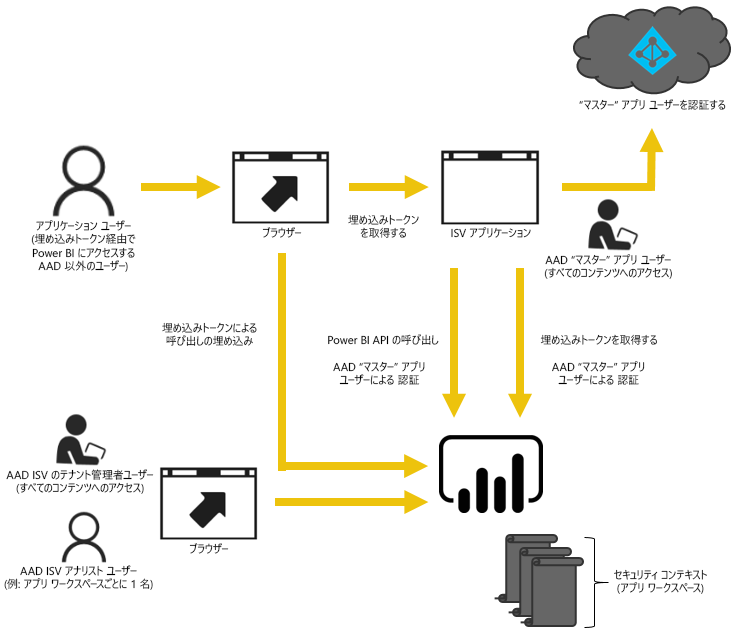

# Power BI で埋め込み
Power BI には、ダッシュボードとレポートをアプリケーションに埋め込むための API があります。 Power BI API では、一貫性のある一連の機能を利用し、コンテンツを埋め込むときにダッシュボード、ゲートウェイ、アプリ ワークスペースなどの最新の Power BI 機能にアクセスできます。

## 単一の API
Power BI コンテンツを埋め込む主なシナリオは 2 つあります。  組織内の (Power BI のライセンスを所有している) ユーザー向けの埋め込みと、Power BI ライセンスを所有する必要がないユーザーおよび顧客向けの埋め込みです。 Power BI REST API は両方のシナリオに対応します。 

Power BI ライセンスのない顧客やユーザーの場合、同じ API を使用して、組織用と顧客用のダッシュボードやレポートをカスタム アプリケーションに埋め込むことができます。 顧客は、アプリケーションで管理されているデータを参照します。 組織内の Power BI ユーザーの場合は、埋め込みアプリケーションのコンテキストまたは Power BI で直接*独自のデータ* を表示するための追加オプションが提供されます。 埋め込みのニーズに合わせて JavaScript や REST API を最大限に活用できます。

埋め込みの動作のサンプルについては、[JavaScript 埋め込みサンプル](https://microsoft.github.io/PowerBI-JavaScript/demo/)をご覧ください。

## 組織向けの埋め込み
組織向けの埋め込みを使って、Power BI サービスを拡張することができます。 その場合、コンテンツを表示する際に、アプリケーションのユーザーは Power BI サービスにサインインする必要があります。 サインインした組織のユーザーは、自分が所有しているか、あるいは Power BI サービスで共有されているダッシュボードとレポートにのみアクセスできます。 

*組織向けの埋め込みの例としては、内部の Web アプリケーション、SharePoint Online の Web パーツと Microsoft Teams の統合などがあります。*

組織向けの埋め込みについては、以下をご覧ください。

* [ダッシュボードをアプリに統合する](integrate-dashboard.md)
* [タイルをアプリに統合する](integrate-tile.md)
* [レポートをアプリに統合する](integrate-report.md)

編集や保存などのセルフサービス機能は、Power BI ユーザー向けの埋め込みの際に [JavaScript API](https://github.com/Microsoft/PowerBI-JavaScript) を介して使用できます。

## 顧客向けの埋め込み
顧客向けの埋め込みでは、Power BI のアカウントがないユーザーのためにダッシュボードとレポートを埋め込むことができます。 顧客は Power BI について何も知る必要はありません。 埋め込みアプリケーションを作成するには、少なくとも 1 つの Power BI Pro アカウントが必要です。 Power BI Pro アカウントは、アプリケーションのマスター アカウントとして機能します。 これをプロキシ アカウントと見なします。 Power BI Pro アカウントを使用して、アプリケーションが所有/管理する Power BI サービス内のダッシュボードとレポートにアクセスできる埋め込みトークンも生成できます。 

*顧客向けの埋め込みの例としては、他の企業に販売される ISV アプリケーションなどがあります。*

ダッシュボード、レポート、およびタイルを埋め込むには、組織向けの埋め込みで使用するのと同じ API を使用します。

> [!IMPORTANT]
> 埋め込みが Power BI サービスに依存する場合でも、顧客が Power BI に依存することはありません。 ユーザーは、アプリケーションに埋め込まれたコンテンツを表示するために Power BI にサインアップする必要はありません。
> 
> 

運用環境に移行する準備ができたら、アプリ ワークスペースを容量に割り当てる必要があります。 Microsoft Azure 内の Power BI Embedded が、アプリケーションで使う容量を提供します。

埋め込み方法の詳細については、「[Power BI ダッシュボード、レポート、およびタイルを埋め込む方法](embedding-content.md)」を参照してください。

Azure で Power BI ワークスペース コレクション サービスを使っていた場合、コンテンツを移行する方法については、「[Power BI に Power BI Embedded ワークスペース コレクション コンテンツを移行する方法](migrate-from-powerbi-embedded.md)」を参照してください。

## 次の手順
[Power BI ダッシュボード、レポート、およびタイルを埋め込む方法](embedding-content.md)  
[Power BI に Power BI Embedded ワークスペース コレクション コンテンツを移行する方法](migrate-from-powerbi-embedded.md)  
[Power BI Premium とは](../service-premium.md)  
[JavaScript API Git リポジトリ](https://github.com/Microsoft/PowerBI-JavaScript)  
[Power BI C# Git リポジトリ](https://github.com/Microsoft/PowerBI-CSharp)  
[JavaScript 埋め込みサンプル](https://microsoft.github.io/PowerBI-JavaScript/demo/)  
[埋め込み分析の容量計画に関するホワイト ペーパー](https://aka.ms/pbiewhitepaper)  
[Power BI Premium ホワイト ペーパー](https://aka.ms/pbipremiumwhitepaper)  

他にわからないことがある場合は、 [Power BI コミュニティで質問してみてください](http://community.powerbi.com/)。

