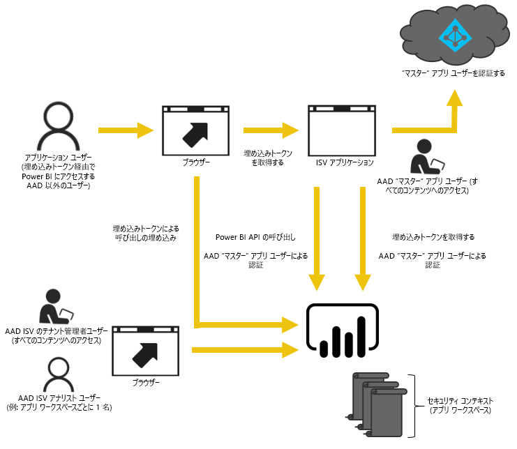
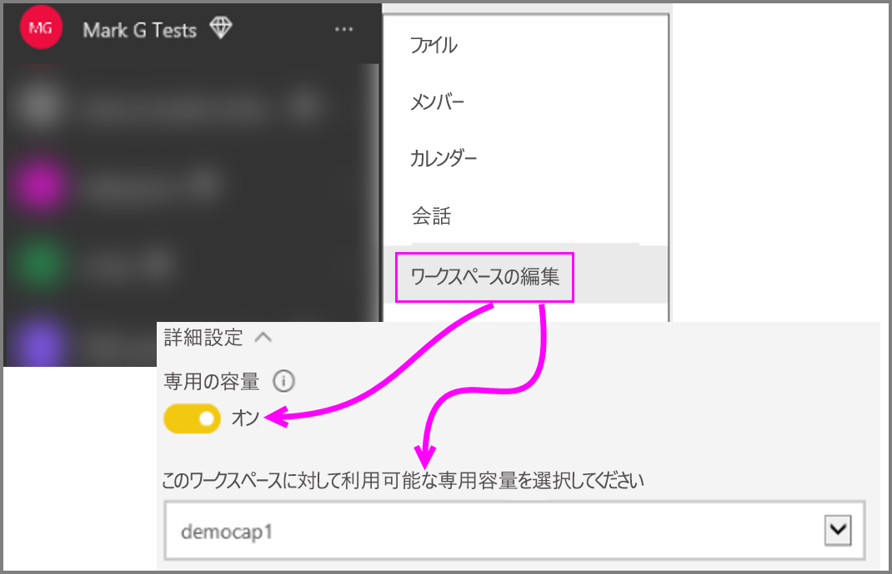

# Power BI Embedded に Power BI ワークスペース コレクション コンテンツを移行する方法
Power BI ワークスペース コレクションから Power BI Embedded に移行し、アプリでの埋め込みで先進機能を利用する方法について説明します。

最近、Microsoft は [Power BI Embedded を発表](https://powerbi.microsoft.com/en-us/blog/power-bi-embedded-capacity-based-skus-coming-to-azure/)しました。この新しい容量ベースのライセンス モデルは、ユーザーによるコンテンツのアクセス、共有および配布方法の柔軟性を高めます。 また、スケーラビリティとパフォーマンスが向上します。

Power BI Embedded では、1 つの API サーフェスで一貫性のある一連の機能を利用でき、コンテンツを埋め込む際にダッシュボード、ゲートウェイ、アプリ ワークスペースなどの最新の Power BI 機能にアクセスできます。 今後は、Power BI Desktop で作業を開始し、Power BI Embedded でデプロイできるようになります。

現在の Power BI ワークスペース コレクションは、期間限定で引き続き利用できます。 マイクロソフト エンタープライズ契約を結ばれたお客様は、現在の契約が満了するまでご利用いただけます。ダイレクト チャネルまたは CSP チャネル経由で Power BI ワークスペース コレクションを入手されたお客様は、Power BI Embedded が一般提供されてから 1 年間ご利用いただけます。  この記事では、Power BI ワークスペース コレクションから新しい Power BI Embedded エクスペリエンスに移行するためのいくつかのガイダンスと、アプリケーションの変更について予想されることを説明します。

> [!IMPORTANT]
> 移行作業は Power BI Embedded に依存しますが、アプリケーションのユーザーが**埋め込みトークン**を使うときに Power BI に依存することはありません。 ユーザーは、アプリケーションに埋め込まれたコンテンツを表示するために Power BI にサインアップする必要はありません。 この埋め込み方法を使って、Power BI 以外の Embedded ユーザーにサービスを提供することができます。
> 

新しい Power BI Embedded への移行を始める前に、[埋め込み設定ツール](https://aka.ms/embedsetup)を使って新しい Power BI Embedded 環境を設定するチュートリアルを参照できます。

適切なソリューションを選択します。
* **顧客向けの埋め込み** - [アプリ所有データ](https://aka.ms/embedsetup/AppOwnsData) ソリューションに興味があるとき。 [顧客向けの埋め込み](embedding.md#embedding-for-your-customers)では、Power BI のアカウントがないユーザーのためにダッシュボードとレポートを埋め込むことができます。 
* **組織向けの埋め込み** - [ユーザー所有データ](https://aka.ms/embedsetup/UserOwnsData) ソリューションに興味があるとき。 [組織向けの埋め込み](embedding.md#embedding-for-your-organization)を使って、Power BI サービスを拡張することができます。

## 移行の準備をする
Power BI ワークスペース コレクションから Power BI Embedded への移行の準備として、いくつかの作業を行う必要があります。 使用可能なテナントと、Power BI Pro ライセンスを持つユーザーが必要になります。

1. Azure Active Directory (Azure AD) テナントにアクセスできることを確認します。
   
    使うテナントのセットアップを決める必要があります。
   
   * 既存の企業の Power BI テナントを使用しますか。
   * アプリケーションで個別のテナントを使用しますか。
   * 顧客ごとに個別のテナントを使用しますか。
     
     アプリケーション、または顧客ごとに新しいテナントを作成することにした場合は、「[Azure Active Directory テナントを作成する](create-an-azure-active-directory-tenant.md)」または「[Azure Active Directory テナントを取得する方法](https://docs.microsoft.com/azure/active-directory/develop/active-directory-howto-tenant)」を参照してください。
2. アプリケーションの "マスター" アカウントとして機能する、この新しいテナントのユーザーを作成します。 そのアカウントで Power BI にサインアップする必要があります。また、このアカウントに Power BI Pro のライセンスが割り当てられている必要があります。

## Azure AD 内のアカウント
次のアカウントがテナント内に存在する必要があります。

> [!NOTE]
> これらのアカウントでは、アプリ ワークスペースを使用するために、Power BI Pro ライセンスが必要になります。
>

1. テナント管理者ユーザー。
   
    このユーザーは、埋め込むために作成されたすべてのアプリ ワークスペースのメンバーにすることをお勧めします。
2. コンテンツを作成するアナリストのアカウント。
   
    これらのユーザーは、必要に応じて、アプリ ワークスペースに割り当てる必要があります。
3. アプリケーション "*マスター*" ユーザー アカウント、または Embedded アカウント。
   
    アプリケーション バックエンドにはこのアカウントの資格情報が格納され、Power BI REST API で使用する Azure AD トークンを取得するために使用されます。 このアカウントは、アプリケーションの埋め込みトークンを生成するために使用されます。 また、このアカウントは、埋め込むために作成されたアプリ ワークスペースの管理者にする必要があります。
   
> [!NOTE]
> これは、埋め込みの目的で使用される組織内の通常のユーザー アカウントです。
>

## アプリの登録とアクセス許可
Azure AD 内でアプリケーションを登録し、特定のアクセス許可を付与する必要があります。

### アプリケーションを登録する
REST API の呼び出しを行うには、Azure AD にアプリケーションを登録する必要があります。 そのためには、Power BI アプリ登録ページだけでなく、Azure Portal に移動して追加構成を適用します。 詳しくは、「[Azure AD アプリを登録して Power BI コンテンツを埋め込む](register-app.md)」をご覧ください。

アプリケーションの**マスター** アカウントを使用してアプリケーションを登録する必要があります。

## アプリ ワークスペースを作成する (必須)
アプリケーションが複数の顧客にサービスを提供している場合、アプリ ワークスペースを利用することで、より適切に分離することができます。 ダッシュボードとレポートは顧客間で分離されます。 その後、アプリ ワークスペースごとに Power BI アカウントを使用して、顧客間でさらにアプリケーション エクスペリエンスを分離できます。

> [!IMPORTANT]
> Power BI 以外のユーザー向けに埋め込みを利用するために、個人用ワークスペースを使用することはできません。
> 
> 

Power BI 内でアプリ ワークスペースを作成するには、Pro ライセンスを持つユーザーが必要です。 アプリ ワークスペースを作成する Power BI ユーザーは、既定ではそのワークスペースの管理者になります。

> [!NOTE]
> アプリケーションの*マスター* アカウントは、ワークスペースの管理者である必要があります。
> 
> 

## コンテンツの移行
ワークスペース コレクションから Power BI Embedded へのコンテンツの移行は、現在のソリューションと並行して行うことができ、ダウンタイムを必要としません。

Power BI ワークスペース コレクションから Power BI Embedded にコンテンツをコピーするときに役立つ**移行ツール**を利用できます。 これは特に、多くのコンテンツがある場合に役立ちます。 詳細については、「[Power BI Embedded 移行ツール](migrate-tool.md)」を参照してください。

コンテンツの移行は主に 2 つの API に依存します。

1. .pbix のダウンロード - この API では、2016 年 10 月以降に Power BI にアップロードされた PBIX ファイルをダウンロードできます。
2. .pbix のインポート - この API では Power BI に PBIX をアップロードします。

いくつかの関連するコード スニペットについては、「[Power BI ワークスペース コレクションからコンテンツを移行するためのコード スニペット](migrate-code-snippets.md)」をご覧ください。

### レポートの種類
レポートにはいくつかの種類があり、それぞれ若干異なる移行フローが必要になります。

#### キャッシュ データセットとレポート
キャッシュ データセットは、ライブ接続や DirectQuery 接続とは異なり、データをインポートした PBIX ファイルを指します。

**フロー**

1. PaaS ワークスペースからの .pbix のダウンロード API の呼び出しを行います。
2. PBIX を保存します。
3. SaaS ワークスペースへの .pbix のインポートの呼び出しを行います。

#### DirectQuery データセットとレポート
**フロー**

1. GET https://api.powerbi.com/v1.0/collections/{collection_id}/workspaces/{wid}/datasets/{dataset_id}/Default.GetBoundGatewayDataSources を呼び出し、受信した接続文字列を保存します。
2. PaaS ワークスペースからの .pbix のダウンロード API の呼び出しを行います。
3. PBIX を保存します。
4. SaaS ワークスペースへの .pbix のインポートの呼び出しを行います。
5. POST  https://api.powerbi.com/v1.0/myorg/datasets/{dataset_id}/Default.SetAllConnections を呼び出して接続文字列を更新します
6. GET https://api.powerbi.com/v1.0/myorg/datasets/{dataset_id}/Default.GetBoundGatewayDataSources を呼び出して GW ID とデータソース ID を取得します
7. PATCH https://api.powerbi.com/v1.0/myorg/gateways/{gateway_id}/datasources/{datasource_id} を呼び出してユーザーの資格情報を更新します

#### 古いデータセットとレポート
これらは、2016 年 10 月より前に作成されたデータセット/レポートです。 .pbix のダウンロードでは、2016 年 10 月より前にアップロードされた PBIX はサポートされません。

**フロー**

1. 開発環境 (内部ソース管理) から PBIX を取得します。
2. SaaS ワークスペースへの .pbix のインポートの呼び出しを行います。

#### プッシュ データセットとレポート
.pbix のダウンロードでは*プッシュ API* データセットはサポートされません。 プッシュ API データセット データを PaaS から SaaS に移植することはできません。

**フロー**

1. データセット Json で "データセットの作成" API を呼び出し、SaaS ワークスペースにデータセットを作成します。
2. 作成したデータセット用にレポートを再構築します*。

いくつかの回避策を使用して、PaaS から SaaS にプッシュ API レポートを移行することができます。その場合、以下の手順を試します。

1. ダミーの PBIX をいくつか PaaS ワークスペースにアップロードします。
2. プッシュ API レポートを複製し、それを手順 1. に示されているダミーの PBIX にバインドします。
3. ダミーの PBIX でプッシュ API レポートをダウンロードします。
4. SaaS ワークスペースにダミーの PBIX をアップロードします。
5. SaaS ワークスペースでプッシュ データセットを作成します。
6. プッシュ API データセットにレポートを再バインドします。

## 新しいレポートを作成してアップロードする
Power BI ワークスペース コレクションから移行したコンテンツに加え、Power BI Desktop を使用してレポートとデータセットを作成してから、アプリ ワークスペースにそれらのレポートを発行することができます。 レポートを発行するエンド ユーザーには、アプリ ワークスペースに発行するための Power BI Pro ライセンスが必要です。

## アプリケーションを再構築する
1. powerbi.com 内のレポートの場所と Power BI REST API を使用するには、アプリケーションを変更する必要があります。
2. アプリケーションの*マスター* アカウントを使用して、AuthN/AuthZ 認証を再構築します。 このユーザーが他のユーザーの代わりに動作できるようにするには、[埋め込みトークン](https://docs.microsoft.com/rest/api/power-bi/embedtoken)を利用します。
3. Powerbi.com からレポートをアプリケーションに埋め込みます。

## ユーザーを Power BI ユーザーにマップする
アプリケーション内で管理するユーザーを、アプリケーション用の*マスター* Power BI 資格情報にマップします。 この Power BI *マスター* アカウントの資格情報はアプリケーション内に格納され、埋め込みトークンの作成に使用されます。

## 運用環境の準備ができたときに実行する作業
運用環境に移行する準備ができたら、以下の手順を実行する必要があります。

* 開発用に個別のテナントを使用する場合は、アプリ ワークスペース、ダッシュボードおよびレポートが運用環境で利用可能であることを確認する必要があります。 また、運用テナントの Azure AD でアプリケーションを作成し、手順 1. のとおり、適切なアプリにアクセス許可を割り当てたことを確認する必要があります。
* ニーズに合う容量を購入します。 ニーズに合った容量の大きさと種類については、[Power BI Embedded の分析の容量計画に関するホワイト ペーパー](https://aka.ms/pbiewhitepaper)をご覧ください。 Azure で[容量を購入](https://portal.azure.com/#create/Microsoft.PowerBIDedicated)できます。
* アプリ ワークスペースを編集し、[詳細] で Premium 容量にそれを割り当てます。
 
    
    
* 更新されたアプリケーションを運用環境にデプロイし、Power BI Embedded からのレポートの埋め込みを開始します。

## 移行後
Azure 内でいくつかのクリーンアップを行う必要があります。

* Power BI ワークスペース コレクションの Azure Embedded 内にデプロイ済みのソリューションからすべてのワークスペースを除去します。
* Azure 内に存在するすべてのワークスペース コレクションを削除します。

## 次の手順
[Power BI で埋め込み](embedding.md)  
[Power BI ワークスペース コレクション移行ツール](migrate-tool.md)  
[Power BI ワークスペース コレクションからコンテンツを移行するためのコード スニペット](migrate-code-snippets.md)  
[Power BI ダッシュボード、レポート、およびタイルを埋め込む方法](embedding-content.md)  
[Power BI Premium とは](../service-premium.md)  
[JavaScript API Git リポジトリ](https://github.com/Microsoft/PowerBI-JavaScript)  
[Power BI C# Git リポジトリ](https://github.com/Microsoft/PowerBI-CSharp)  
[JavaScript 埋め込みサンプル](https://microsoft.github.io/PowerBI-JavaScript/demo/)  
[ワークスペース コレクションの分析の容量計画に関するホワイト ペーパー](https://aka.ms/pbiewhitepaper)  
[Power BI Premium ホワイト ペーパー](https://aka.ms/pbipremiumwhitepaper)  

他にわからないことがある場合は、 [Power BI コミュニティで質問してみてください](http://community.powerbi.com/)。
