# <a name="power-bi-embedded-migration-tool"></a>Power BI Embedded 移行ツール

この移行ツールを使用して、Power BI Embedded Azure サービス (PaaS) のレポートを Power BI サービス (SaaS) にコピーできます。

ワークスペース コレクションから Power BI サービスへのコンテンツの移行は、現在のソリューションと並行して行うことができ、ダウンタイムを必要としません。

## <a name="limitations"></a>制限事項

* プッシュされたデータセットはダウンロードできません。Power BI サービス用の Power BI REST API を使用して作成し直す必要があります。
* 2016 年 11 月 26 日より前にインポートされた PBIX ファイルはダウンロードできなくなります。

## <a name="download"></a>ダウンロード

移行ツールのサンプルは [GitHub](https://github.com/Microsoft/powerbi-migration-sample) からダウンロードできます。 リポジトリの zip をダウンロードするか、ローカルに複製を作成することができます。 ダウンロードしたら、Visual Studio 内で *powerbi-migration-sample.sln* を開いてビルドし、移行ツールを実行できます。

## <a name="migration-plans"></a>移行プラン

移行プランは、Power BI Embedded 内のコンテンツと、Power BI サービスに発行する方法を列挙した単なるメタデータです。

### <a name="start-with-a-new-migration-plan"></a>新しい移行プランを開始する

移行プランは、Power BI Embedded で使用し、Power BI サービスに移行できる項目のメタデータです。 移行プランは XML ファイルとして保存されます。

新しい移行プランを作成して開始します。 新しい移行プランを作成するには、次の手順を実行します。

1. **[ファイル]**  >  **[New Migration Plan]\(新しい移行プラン\)** を選択します。

    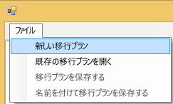

2. **Select Power BI Embedded Resource Group (Power BI Embedded リソース グループの選択)** ダイアログで 環境 ドロップダウンを選択し、製品を選択します。

3. サインインするように求められます。 Azure サブスクリプションのログイン アカウントを使用します。

   > [!IMPORTANT]
   > これは Power BI へのサインインに使用する Office 365 の組織アカウントでは**ありません**。

4. Power BI Embedded ワークスペース コレクションを保存する Azure サブスクリプションを選択します。

    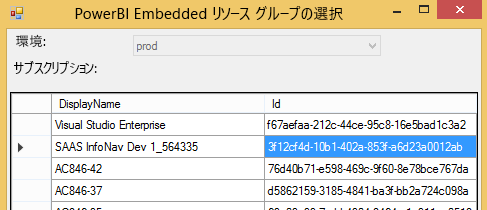
5. サブスクリプション リストの下にあるワークスペース コレクションを含む **[リソース グループ]** を選択し、 **[選択]** を選択します。

    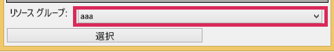

6. **[分析]** を選択します。 Azure サブスクリプション内の項目のインベントリが表示され、プランを開始することができます。

    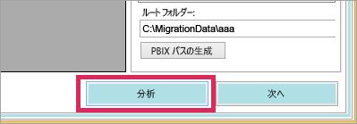

   > [!NOTE]
   > ワークスペース コレクション数と、ワークスペース コレクション内に存在するコンテンツ数によりますが、分析プロセスには数分かかります。

7. **分析**が完了すると、移行プランを保存するように求められます。

この時点で、移行プランは Azure サブスクリプションに接続されています。 移行プランの操作方法の流れについては、後述の説明を参照してください。 移行プランには、移行の分析と計画、ダウンロード、グループの作成、アップロードが含まれています。

### <a name="save-your-migration-plan"></a>移行プランを保存する

移行プランを保存して、後で使用することができます。 保存すると、移行プランのすべての情報を含む XML ファイルが作成されます。

移行プランを保存するには、次の手順を実行します。

1. **[ファイル]**  >  **[Save Migration Plan]/(移行プランの保存/)** を選択します。

    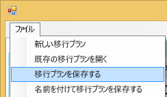

2. ファイルに名前を付けるか、自動生成されたファイル名を使用して、 **[保存]** を選択します。

### <a name="open-an-existing-migration-plan"></a>既存の移行プランを開く

保存した移行プランを開き、移行の作業を続けます。

既存の移行プランを開くには、次の手順を実行します。

1. **[ファイル]**  >  **[Open Existing Migration Plan]/(既存の移行プランを開く/)** を選択します。

    

2. 移行ファイルを選択し、 **[開く]** を選択します。

## <a name="step-1-analyze--plan-migration"></a>手順 1:移行の分析と計画

**[Analyze & Plan Migration]/(移行の分析と計画/)** タブには、Azure サブスクリプションのリソース グループの現在の内容が表示されます。

![[移行の分析と計画] タブ](media/migrate-tool/migrate-tool-step1.png)

例として *SampleResourceGroup* を見てみましょう。

### <a name="paas-topology"></a>PaaS トポロジ

これは *[リソース グループ] > [Workspace collections]/(ワークスペース コレクション/) > [ワークスペース]* の一覧です。 リソース グループとワークスペース コレクションにはフレンドリ名が表示されます。 ワークスペースには GUID が表示されます。

一覧の項目には、色と (#/#) 形式の数値も表示されます。 これは、ダウンロードできるレポート数を示します。
黒色は、すべてのレポートをダウンロードできることを示します。

赤色は、一部のレポートをダウンロードできないことを示します。 左側の数値は、ダウンロードできるレポートの合計数を示します。 右側の数値は、グループ内のレポートの合計数を示します。

PaaS トポロジ内の項目を選択して、レポート セクションにレポートを表示することができます。

### <a name="reports"></a>レポート

レポート セクションには、使用できるレポートが一覧表示され、ダウンロードできるかどうかが示されます。

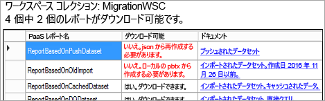

### <a name="target-structure"></a>ターゲット構造

**ターゲット構造**は、ダウンロード先とアップロード方法をツールに指示するための場所です。

#### <a name="download-plan"></a>ダウンロード プラン

パスは自動的に作成されます。 このパスは必要に応じて変更できます。 パスを変更する場合は、 **[Update paths]\(パスの更新\)** を選択する必要があります。

> [!NOTE]
> この項目を設定しても、実際にダウンロードは実行されません。 レポートのダウンロード先の構造を指定するだけです。

#### <a name="upload-plan"></a>[Upload Plan]/(アップロード プラン/)

Power BI サービス内で作成されるアプリ ワークスペースに使用するプレフィックスを指定できます。 プレフィックスの後は、Azure に存在するワークスペースの GUID になります。

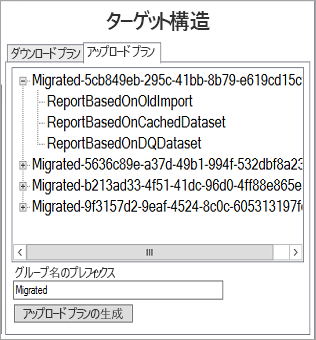

> [!NOTE]
> この項目を設定しても、実際に Power BI サービス内にグループは作成されません。 グループの名前付けの構造を定義するだけです。

プレフィックスを変更する場合、 **[Generate Upload Plan]/(アップロード プランの生成/)** を選択する必要があります。

必要に応じて、グループを右クリックし、[Upload Plan]/(アップロード プラン/) 内のグループ名を変更することもできます。

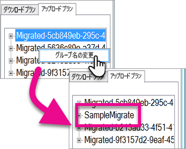

> [!NOTE]
> *グループ*の名前にスペースや無効な文字を含めることはできません。

## <a name="step-2-download"></a>手順 2:ダウンロード

**[ダウンロード]** タブには、レポートとそれに関連するメタデータの一覧が表示されます。 エクスポート状態が前のエクスポート状態と共に表示されます。

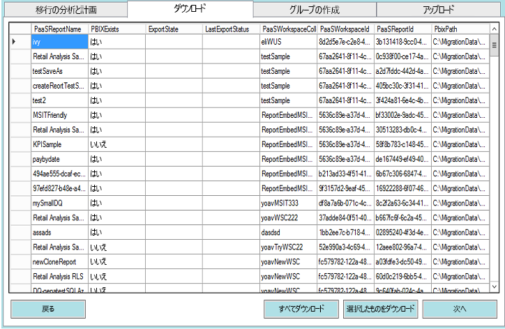

2 つのオプションがあります。

* 特定のレポートを選択し、 **[Download Selected]/(選択項目のダウンロード/)** を選択します
* **[Download All]/(すべてダウンロード/)** を選択します。


正常にダウンロードされると、 *[完了]* という状態が表示され、PBIX ファイルが存在することが反映されます。

ダウンロードが完了したら、 **[Create Groups]/(グループの作成/)** タブを選択します。

## <a name="step-3-create-groups"></a>手順 3:グループの作成

使用できるレポートをダウンロードしたら、 **[Create Groups]/(グループの作成/)** タブを選択します。このタブでは、作成した移行プランに基づいて、Power BI サービス内にアプリ ワークスペースが作成されます。 **[Analyze & Plan Migration]/(移行の分析と計画/)** 内の **[アップロード]** タブで指定した名前のアプリ ワークスペースが作成されます。

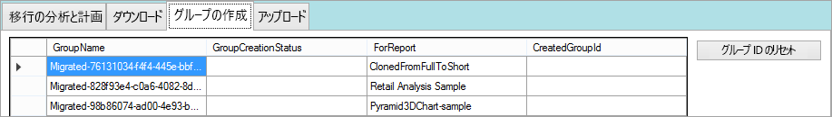

アプリ ワークスペースを作成するには、 **[Create Selected Groups]/(選択されているグループの作成/)** または **[Create All Missing Groups]/(見つからないすべてのグループの作成/)** を選択します。

いずれかのオプションを選択すると、サインインするように求められます。 *"アプリ ワークスペースを作成する Power BI サービスの資格情報を使用します。"*


これで、Power BI サービス内にアプリ ワークスペースが作成されます。 この操作では、アプリ ワークスペースにレポートがアップロードされません。

Power BI にサインインしてワークスペースが存在することを確認することで、アプリ ワークスペースが作成されたことを確認できます。 ワークスペースには何も表示されません。

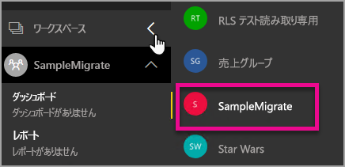

ワークスペースの作成後は、 **[アップロード]** タブに移動できます。

## <a name="step-4-upload"></a>手順 4:アップロード

**[アップロード]** タブで、レポートを Power BI サービスにアップロードします。 [ダウンロード] タブでダウンロードしたレポートの一覧と、移行プランに基づいたターゲット グループ名が表示されます。

![[アップロード] タブ](media/migrate-tool/migrate-tool-upload-tab.png)

選択したレポートをアップロードするか、すべてのレポートをアップロードすることができます。 また、アップロードの状態をリセットして項目を再アップロードすることもできます。

また、同じ名前のレポートが存在する場合の処理方法を選択することもできます。 **[中止]** 、 **[無視]** 、 **[上書き]** から選択できます。

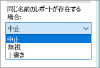

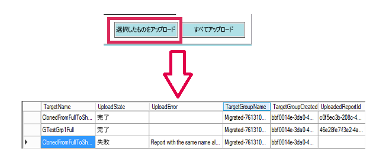

### <a name="duplicate-report-names"></a>重複するレポート名

同じ名前のレポートがあり、内容が異なるレポートとわかっている場合は、レポートの **TargetName** を変更する必要があります。 名前を変更するには、移行プランの XML を手動で編集します。

移行ツールを閉じてから変更し、ツールと移行プランを開き直す必要があります。

上の例では、重複するレポートの 1 つが同じ名前のレポートが存在するために失敗していることが表示されています。 移行プランの XML を開くと、次のような内容が表示されます。

```xml
<ReportMigrationData>
    <PaaSWorkspaceCollectionName>SampleWorkspaceCollection</PaaSWorkspaceCollectionName>
    <PaaSWorkspaceId>4c04147b-d8fc-478b-8dcb-bcf687149823</PaaSWorkspaceId>
    <PaaSReportId>525a8328-b8cc-4f0d-b2cb-c3a9b4ba2efe</PaaSReportId>
    <PaaSReportLastImportTime>1/3/2017 2:10:19 PM</PaaSReportLastImportTime>
    <PaaSReportName>cloned</PaaSReportName>
    <IsPushDataset>false</IsPushDataset>
    <IsBoundToOldDataset>false</IsBoundToOldDataset>
    <PbixPath>C:\MigrationData\SampleResourceGroup\SampleWorkspaceCollection\4c04147b-d8fc-478b-8dcb-bcf687149823\cloned-525a8328-b8cc-4f0d-b2cb-c3a9b4ba2efe.pbix</PbixPath>
    <ExportState>Done</ExportState>
    <LastExportStatus>OK</LastExportStatus>
    <SaaSTargetGroupName>SampleMigrate</SaaSTargetGroupName>
    <SaaSTargetGroupId>6da6f072-0135-4e6c-bc92-0886d8aeb79d</SaaSTargetGroupId>
    <SaaSTargetReportName>cloned</SaaSTargetReportName>
    <SaaSImportState>Failed</SaaSImportState>
    <SaaSImportError>Report with the same name already exists</SaaSImportError>
</ReportMigrationData>
```

失敗した項目については、SaaSTargetReportName の名前を変更できます。

```xml
<SaaSTargetReportName>cloned2</SaaSTargetReportName>
```

プランを開き直し、失敗したレポートを移行ツールでアップロードします。

Power BI に戻ると、レポートとデータセットがアプリ ワークスペースにアップロードされたことを確認できます。

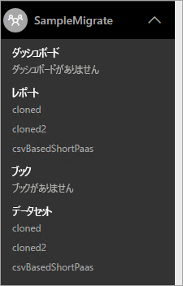

<a name="upload-local-file"></a>

### <a name="upload-a-local-pbix-file"></a>ローカル PBIX ファイルをアップロードする

ローカル バージョンの Power BI Desktop ファイルをアップロードできます。 ツールを閉じ、XML を編集し、**PbixPath** プロパティにローカル PBIX の完全なパスを指定します。

```xml
<PbixPath>[Full Path to PBIX file]</PbixPath>
```

XML を編集した後は、移行ツール内でプランを再び開き、レポートをアップロードします。

<a name="directquery-reports"></a>

### <a name="directquery-reports"></a>DirectQuery レポート

DirectQuery レポートの接続文字列をアップロードするには、更新する必要があります。 これは、*powerbi.com* 内で行うか、または Power BI Embedded (PaaS) から接続文字列をプログラムでクエリを実行して行うことができます。 例については、「[PaaS レポートから DirectQuery 接続文字列を抽出する](migrate-code-snippets.md#extract-directquery-connection-string-from-paas-report)」を参照してください。

その後、Power BI サービス (SaaS) 内のデータセットの接続文字列を更新し、データ ソースの資格情報を設定することができます。 その方法については、次の例を参照してください。

* [SaaS ワークスペースの DirectQuery 接続文字列を更新する](migrate-code-snippets.md#update-directquery-connection-string-is-saas-workspace)
* [SaaS ワークスペースの DirectQuery 資格情報を設定する](migrate-code-snippets.md#set-directquery-credentials-in-saas-workspace)

## <a name="embedding"></a>埋め込み

Power BI Embedded Azure サービスから Power BI サービスにレポートが移行されたので、アプリケーションを更新し、このアプリ ワークスペースにレポートを埋め込むことができるようになりました。

詳細については、「[Power BI に Power BI Embedded ワークスペース コレクション コンテンツを移行する方法](migrate-from-powerbi-embedded.md)」を参照してください。

## <a name="next-steps"></a>次の手順

[Power BI で埋め込み](embedding.md)  
[Power BI に Power BI Embedded ワークスペース コレクション コンテンツを移行する方法](migrate-from-powerbi-embedded.md)  
[Power BI Premium とは](../service-premium-what-is.md)  
[JavaScript API Git リポジトリ](https://github.com/Microsoft/PowerBI-JavaScript)  
[Power BI C# Git リポジトリ](https://github.com/Microsoft/PowerBI-CSharp)  
[JavaScript 埋め込みサンプル](https://microsoft.github.io/PowerBI-JavaScript/demo/)  
[Power BI Premium ホワイト ペーパー](https://aka.ms/pbipremiumwhitepaper)  

他にわからないことがある場合は、 [Power BI コミュニティで質問してみてください](http://community.powerbi.com/)。