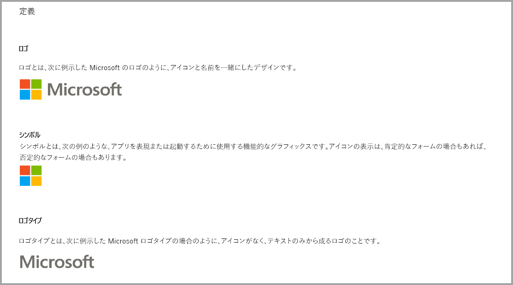
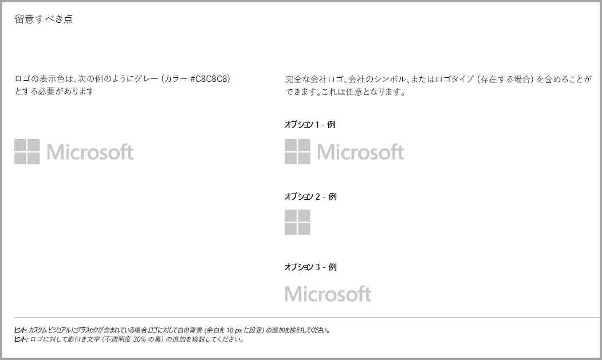
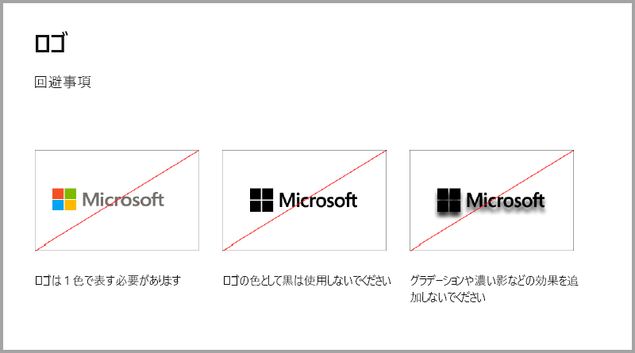
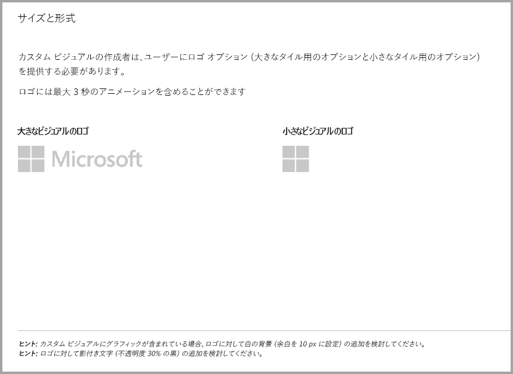
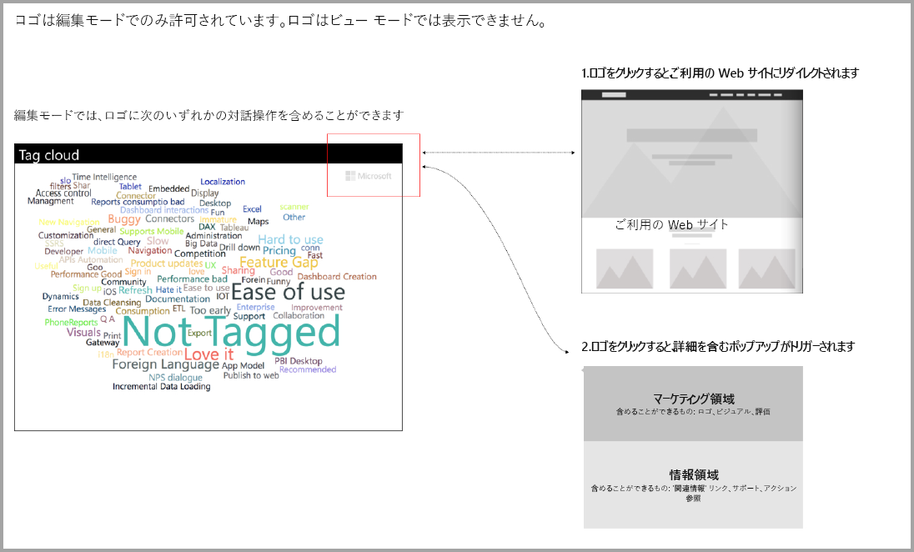

# Power BI ビジュアルの追加購入のガイドライン

最近まで、**Marketplace (AppSource)** では、無料の Power BI ビジュアルのみが受け付けられていました。 このポリシーは変わり、"additional purchase may be required" (追加購入が必要になる場合があります) の価格タグが付いたビジュアルも **AppSource** に送信できるようになります。 追加購入が必要なビジュアルは、Office ストアのアプリ内購入 (IAP) アドインと似ています。 [認定されたカスタム ビジュアルに関する記事](../power-bi-custom-visuals-certified.md)で説明されているように、開発者はこれらのビジュアルを、**AppSource** チームの承認後、認定の要件に準拠していることを確認してから認定のために送信することも可能です。

> [!Note]
> ビジュアルが認定されるには、外部サービスやリソースにはアクセスしないようにする必要があります。

> [!Note]
> すべての無料ビジュアルでは、以前に提供されていたものと同じ無料の機能をそのまま使用する必要があります。 古い無料機能の上に、オプションの高度な有料機能が追加されることがあります。 高度な機能を備えた IAP ビジュアルは新しいビジュアルとして送信し、古い無料のビジュアルを更新しないようにすることをお勧めします。

## 送信プロセスの変更点

開発者は IAP ビジュアルを、無料のビジュアルと同様に販売者のダッシュボードを使用して AppSource にアップロードします。 開発者は、送信したビジュアルに IAP 機能が含まれることを示すために、販売者のダッシュボードのメモに "Visual with in-app purchase." (アプリ内購入があるビジュアル) と記載する必要があります。 また、開発者は検証チームが IAP 機能を検証できるように、ライセンス キーやトークンを提供する必要があります。 ビジュアルが検証され承認されたら、AppSource の IAP ビジュアルの登録情報の価格オプションの下には、'Additional purchase may be required' (追加購入が必要になる場合があります) と記載されます。

## IAP 機能のある Power BI ビジュアルとは

IAP ビジュアルは無料のビジュアルであり、無料の機能で提供されていますが、それ以外にも操作に追加料金がかかる機能もあります。 開発者は、操作にはどの機能を追加購入する必要があるか、ビジュアルの説明でユーザーに通知する必要があります。 現在、Microsoft では、アプリおよびアドイン内での購入をサポートするネイティブ アプリケーション プログラミング インターフェイス (API) は用意していません。開発者は、このような購入には、サードパーティ製の支払いシステムを使用する必要があります。 弊社のストア [ポリシー](https://docs.microsoft.com/office/dev/store/validation-policies#2-apps-or-add-ins-can-display-certain-ads)を参照してください。

> [!NOTE]
> 無料機能では透かしを使用できません。 開発者が有効なライセンスがない状態で高度な有料機能を使用すると、ポップアップ ウィンドウまたは透かしが表示されます。  

## ロゴのガイドライン

このセクションでは、ロゴをビジュアルに追加するための仕様について説明します。

> [!NOTE]
> ロゴは編集モードでのみ許可されています。 ロゴはビュー モードでは表示できません。

## ベスト プラクティス

### ビジュアルのランディング ページ

ランディング ページを使用すると、ユーザーにご自分のビジュアルの使用方法およびライセンスの購入場所を明確にできます。 自動でトリガーされる動画は含めないでください。 ライセンスの購入の詳細情報やリンクや IAP 機能の使用方法など、ユーザーの操作性を改善する資料のみを追加してください。

### ライセンス キーおよびトークン

ユーザーの利便性のために、ユーザーに便利な場所である書式ウィンドウの上部にライセンス キーやトークン関連のフィールドを追加します。

## よく寄せられる質問

詳細情報と質問の回答については、[ビジュアルの追加購入についてよく寄せられる質問](https://docs.microsoft.com/power-bi/power-bi-custom-visuals-faq#visuals-with-additional-purchases)に関する記事をご覧ください。

## 次の手順

[AppSource](office-store.md) にカスタム ビジュアルを発行して、他のユーザーが見つけたり使用したりすることができるようにする方法について説明します。
