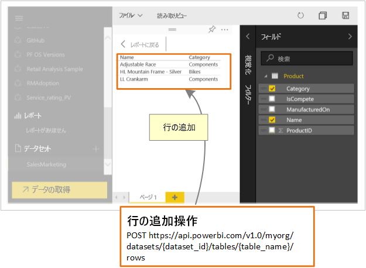

# Power BI API の開発者向け機能

Power BI には、対話型で、さまざまなデータ ソースからリアルタイムで作成、更新できるダッシュボードが表示されます。 REST 呼び出しをサポートするプログラミング言語を使って、リアルタイムで Power BI ダッシュボードと統合するアプリを作成できます。 アプリに、Power BI のタイルとレポートを統合することもできます。

開発者は、対話型のレポートやダッシュ ボードで使用できる独自のデータ表示を作成することもできます。

Power BI API を使って行うことのできる例は以下のとおりです。

| **操作の内容** | **参照先** |
| --- | --- |
| Power BI ユーザーと Power BI 以外のユーザーのためにダッシュボード、レポート、タイルを埋め込む (アプリ所有データ) |[Power BI ダッシュボード、レポート、およびタイルを埋め込む方法](embedding-content.md) |
| 既存のビジネス ワークフローを拡張して、主要なデータを Power BI ダッシュボードにプッシュします。 |[ダッシュボードにデータをプッシュする](walkthrough-push-data.md) |
| Power BI に対して認証を行う |[Power BI に対して認証を行う](get-azuread-access-token.md) |
| カスタム ビジュアルを作成します。 |[Power BI カスタム ビジュアルの開発](custom-visual-develop-tutorial.md) |

> [!NOTE]
> Power BI API では引き続き、アプリ ワークスペースをグループと呼びます。 したがって、グループと記述されている場合はすべて、アプリ ワークスペースを使用していることを意味します。

## Power BI の開発者向けサンプル

Power BI 開発者向けのサンプルには、ダッシュ ボード、レポート、タイルの埋め込み項目が含まれます。

[Power BI の開発者向けサンプル](https://github.com/Microsoft/PowerBI-Developer-Samples)

* **App Owns Data** 内のサンプルは Power BI 以外のユーザーでの埋め込み用です。
* **User Owns Data** 内のサンプルは Power BI ユーザーでの埋め込み用です。

## GitHub リポジトリ

* [.NET SDK](https://github.com/Microsoft/PowerBI-CSharp)
* [JavaScript API](https://github.com/Microsoft/PowerBI-JavaScript)
* [カスタム ビジュアル](https://github.com/Microsoft/PowerBI-visuals)

## 開発者向けツール

次は、Power BI 項目の開発を支援するツールです。

[埋め込みセットアップ ツール](https://aka.ms/embedsetup)に移動して、Power BI コンテンツを埋め込む方法がわかるサンプル アプリケーションをすぐにダウンロードすることができます。

適切なソリューションを選択します。

* [顧客向けの埋め込み](embedding.md#embedding-for-your-customers)では、Power BI のアカウントがないユーザーのためにダッシュボードとレポートを埋め込むことができます。 [顧客向けの埋め込み](https://aka.ms/embedsetup/AppOwnsData)ソリューションを実行します。

* [組織向けの埋め込み](embedding.md#embedding-for-your-organization)を使って、Power BI サービスを拡張することができます。 [組織向けの埋め込み](https://aka.ms/embedsetup/UserOwnsData)ソリューションを実行します。

JavaScript API の使用に関する完全なサンプルについては、[Playground ツール](https://microsoft.github.io/PowerBI-JavaScript/demo)を使用できます。 このツールを使うと、さまざまな種類の Power BI Embedded のサンプルを簡単に再生できます。 JavaScript API について詳しくは、[PowerBI-JavaScript wiki](https://github.com/Microsoft/powerbi-javascript/wiki) のページもご覧ください。

## Power BI にデータをプッシュする

Power BI API を使って、データセットにデータをプッシュできます。 この機能により、データセット内のテーブルに行を追加できます。 ダッシュボードのタイルやレポートのビジュアルに新しいデータを反映できます。

## 次の手順

[データセットにデータをプッシュする](walkthrough-push-data.md)  
[Power BI カスタム ビジュアルの開発](custom-visual-develop-tutorial.md)  
[Power BI REST API リファレンス](https://docs.microsoft.com/rest/api/power-bi/)  

他にわからないことがある場合は、 [Power BI コミュニティで質問してみてください](http://community.powerbi.com/)。
