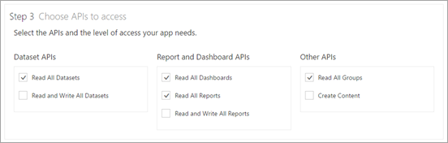
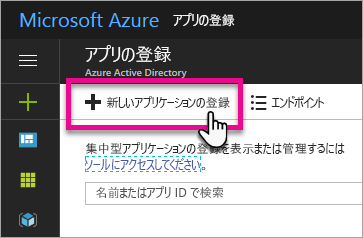
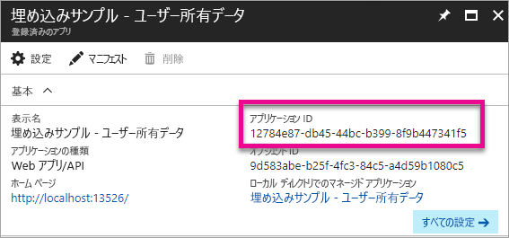
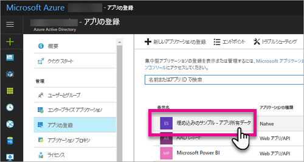
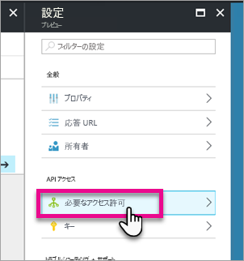
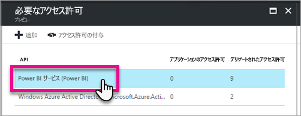
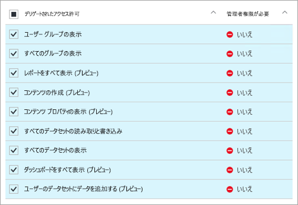

# <a name="register-an-azure-ad-app-to-embed-power-bi-content"></a>Azure AD アプリを登録して Power BI コンテンツを埋め込む
埋め込みの Power BI コンテンツとともに使用するため、Azure Active Directory (Azure AD) 内にアプリケーションを登録する方法を説明します。

Power BI REST API へのアプリケーションのアクセスを許可するには、アプリケーションを Azure AD に登録します。 これにより、アプリケーションの ID を設定し、Power BI REST リソースへのアクセス許可を指定することができます。

> [!IMPORTANT]
> Power BI アプリを登録する前に、[Azure Active Directory テナントと組織のユーザー](create-an-azure-active-directory-tenant.md)が必要です。 テナント内のユーザーで Power BI にサインアップしていない場合、アプリの登録が正常に完了しません。

アプリケーションを登録するには 2 つの方法があります。 [Power BI アプリ登録ツール](https://dev.powerbi.com/apps/)を使う方法と、Azure Portal 内で直接登録する方法です。 記入する必要のあるフィールドが少ししかないため、Power BI アプリの登録ツールが最も簡単なオプションです。 アプリに変更を加える場合は、Azure portal を使います。

## <a name="register-with-the-power-bi-app-registration-tool"></a>Power BI アプリ登録ツールで登録する
アプリケーションの ID を設定し、Power BI REST リソースへのアクセス許可を指定するには、 **Azure Active Directory** でアプリケーションを登録する必要があります。 コンソール アプリや Web サイトなどのアプリケーションを登録すると、アクセス許可を要求しているユーザーを識別するためにアプリケーションで使用される識別子を受け取ります。

Power BI アプリ登録ツールでアプリケーションを登録する方法を以下に説明します。

1. [dev.powerbi.com/apps](https://dev.powerbi.com/apps) に移動します。
2. **[既存のアカウントでサインイン]** を選択します。
3. **アプリ名**を入力します。
4. アプリの種類の選択は、使用しているアプリケーションの種類によって異なります。
   
   * クライアント デバイスで実行されるアプリには、**[ネイティブ アプリ]** を使用します。 実際のアプリケーションに関係なく顧客向けのコンテンツを埋め込む場合、**[ネイティブ アプリ]** を選択する必要があります。 Web アプリケーションであっても同じです。
   * Web アプリまたは Web API には、**[サーバー側の Web アプリ]** を使用します。

5. **[リダイレクト URL]** と **[ホーム ページの URL]** の値を入力します。 **[リダイレクト URL]** は任意の有効な URL に使用できます。
   
    **[ホーム ページの URL]** は、アプリケーションの種類に **[サーバー側の Web アプリ]** を選択した場合にのみ使用できます。
   
    *顧客向けの埋め込み*サンプルおよび *integrate-dashboard-web-app* サンプルの場合、**リダイレクト URL** は `http://localhost:13526/Redirect` です。 レポートとタイルのサンプルでは、**リダイレクト URL** は `http://localhost:13526/` です。
6. アクセス権を持つアプリケーションの API を選択します。 Power BI のアクセス許可について詳しくは、「[Power BI のアクセス許可](power-bi-permissions.md)」をご覧ください。
   
    
7. **[アプリの登録]** を選択します。
   
    **クライアント ID** が表示されます。**サーバー側の Web アプリ**を選択すると、**クライアント シークレット**が表示されます。 **クライアント ID** は必要に応じて後で Azure Portal から取得できます。 **クライアント シークレット**をなくした場合、Azure portal で新しく作成する必要があります。

8. Azure に移動して、**[アクセス許可の付与]** を選択する必要があります。
   > [!Note]
   > これを行うには、Azure テナントの全体管理者である必要があります

* Azure に移動します。
* **[アプリの登録]** を探して選びます。
* アプリを選びます。
* **[設定]** を選択します。
* **[必要なアクセス許可]** を選びます。
* **[Power BI サービス]** を選んで、アプリ登録サイトから選んだアクセス許可を確認します。
* **[アクセス許可の付与]** を選びます。

カスタム アプリケーションの一部として登録済みのアプリケーションを使用して Power BI サービスと対話できるようになりました。

> [!IMPORTANT]
> 顧客向けのコンテンツを埋め込む場合は、Azure portal で追加のアクセス許可を構成する必要があります。 詳しくは、「[Azure AD でアプリケーションにアクセス許可を適用する](#apply-permissions-to-your-application)」をご覧ください。
> 

## <a name="register-with-the-azure-portal"></a>Azure Portal に登録する
アプリケーションを登録するためのもう 1 つのオプションは、Azure Portal で直接行うことです。 アプリケーションを登録するには、次の手順に従います。

1. [Microsoft Power BI API 条項](https://powerbi.microsoft.com/api-terms)に同意します。
2. [Azure Portal ](https://portal.azure.com)にサインインします。
3. ページの右上隅で、アカウントを選択して、Azure AD テナントを選択します。
4. 左側のナビゲーション ウィンドウで、**[その他のサービス]**、**[セキュリティ + ID]** の **[アプリの登録]**、**[新しいアプリケーションの登録]** の順に選びます。
   
    
5. 画面の指示に従って、新しいアプリケーションを作成します。
   
   * Web アプリケーションの場合は、アプリのベース URL となるサインオン URL を指定します。これは `http://localhost:13526` のようにユーザーがサインインできる場所です。
   * ネイティブ アプリケーションの場合は、Azure AD がトークンの応答を返すために使用する**リダイレクト URI** を指定します。 アプリケーション固有の値を入力します (例: `http://myapplication/Redirect`)

Azure Active Directory でアプリケーションを登録する方法の詳細については、「[Azure Active Directory とアプリケーションの統合](https://docs.microsoft.com/azure/active-directory/develop/active-directory-integrating-applications)」を参照してください。

## <a name="how-to-get-the-client-id"></a>クライアント ID を取得する方法
アプリケーションを登録すると、 **クライアント ID**を受け取ります。  アプリケーションがユーザーを識別できるように、**クライアント ID** はユーザーへのアクセス許可を要求します。

次にクライアント ID を取得する方法を示します。

1. [Azure Portal ](https://portal.azure.com)にサインインします。
2. ページの右上隅で、アカウントを選択して、Azure AD テナントを選択します。
3. 左側のナビゲーション ウィンドウで、**[その他のサービス]**、**[アプリの登録]** の順に選択します。
4. クライアント ID を取得するアプリケーションを選択します。
5. GUID として**アプリケーション ID** が一覧表示されます。 これがアプリケーションのクライアント ID です。
   
    

## <a name="apply-permissions-to-your-application-within-azure-ad"></a>Azure AD でアプリケーションにアクセス許可を適用する
> [!IMPORTANT]
> このセクションは、**組織向けのコンテンツを埋め込む**アプリケーションにのみ適用されます。
> 

アプリ登録ページで指定されたものに加え、アプリケーションに対する追加のアクセス許可を有効にする必要があります。 その場合、Azure AD ポータルを使用することも、プログラムで実行することもできます。

埋め込みに使った*マスター* アカウントまたはグローバル管理者アカウントでログインできます。

### <a name="using-the-azure-ad-portal"></a>Azure AD ポータルの使用
1. Azure Portal で [[アプリの登録]](https://portal.azure.com/#blade/Microsoft_AAD_IAM/ApplicationsListBlade) を参照して、埋め込みに使うアプリを選びます。
   
    
2. **[API アクセス]** の **[必要なアクセス許可]** を選択します。
   
    

3. **[必要なアクセス許可]** 内で、**[Power BI サービス (Power BI)]** を選択します。
   
    
   
   > [!NOTE]
   > Azure AD ポータルで直接アプリを作成した場合は、**[Power BI サービス (Power BI)]** が存在しない可能性があります。 存在しない場合は、**[+ 追加]** を選択してから **[1 API を選択します]** を選択します。 API リストで **[Power BI サービス]** を選択して、**[選択]** を選択します。  **[+ 追加]** に **[Power BI サービス (Power BI)]** がない場合は、少なくとも 1 人のユーザーで Power BI にサインアップします。
   > 
   > 
4. **[デリゲートされたアクセス許可]** のすべてのアクセス許可を選択します。 選択内容を保存するには 1 つずつ選択する必要があります。 完了したら、**[保存]** を選択します。
   
    
5. **[必要なアクセス許可]** 内で、**[アクセス許可の付与]** を選択します。
   
    "*マスター アカウント*" で Azure AD により同意を求めるプロンプトが表示されないようにするには、**[アクセス許可の付与]** アクションが必要です。 この操作を実行するアカウントがグローバル管理者である場合は、組織のすべてのユーザーにこのアプリケーションに対するアクセス許可を与えることになります。 このアクションを実行するアカウントが*マスター アカウント*であり、グローバル管理者ではない場合は、*マスター アカウント*にのみこのアプリケーションに対するアクセス許可を与えます。
   
    ![[必要なアクセス許可] ダイアログの [アクセス許可の付与]](media/register-app/powerbi-embedded-azuread-app-grant-permissions.png)

### <a name="applying-permissions-programmatically"></a>プログラムでのアクセス許可の適用
1. テナント内で既存のサービス プリンシパル (ユーザー) を取得する必要があります。 その方法については、「[Get servicePrincipal](https://developer.microsoft.com/en-us/graph/docs/api-reference/beta/api/serviceprincipal_get)」 (servicePrincipal を取得する) を参照してください。
   
    *Get servicePrincipal* API は {id} なしで呼び出すことができます。その場合、テナント内のサービス プリンシパルがすべて取得されます。
2. **appId** プロパティとしてアプリ クライアント ID を使用してサービス プリンシパルを確認します。
3. アプリにサービス プランがない場合は、新しく作成します。
   
    ```
    Post https://graph.microsoft.com/beta/servicePrincipals
    Authorization: Bearer ey..qw
    Content-Type: application/json
    {
    "accountEnabled" : true,
    "appId" : "{App_Client_ID}",
    "displayName" : "{App_DisplayName}"
    }
    ```
4. Power BI API にアプリのアクセス許可を付与する
   
   既存のテナントを使用しており、すべてのテナント ユーザーのためにアクセス許可を付与したくない場合は、**contentType** の値を **Principal** に置き換えることにより、特定のユーザーにアクセス許可を付与できます。

   **consentType** の値には、**AllPrincipals** または **Principal** を指定できます。

   * **AllPrincipals** は、テナント管理者がテナント内のすべてのユーザーの代理でアクセス許可を付与するためにのみ使用できます。
   * **Principal** は、特定のユーザーの代理でアクセス許可を付与する場合に使用します。 この場合、要求の本文に *principalId={User_ObjectId}* というプロパティを追加する必要があります。
    
     マスター アカウントで、Azure AD から同意を求めるプロンプトが表示されないようにするには (非対話形式のサインインを実行しているときには不可能)、*アクセス許可の付与*が必要です。
   
     ```
     Post https://graph.microsoft.com/beta/OAuth2PermissionGrants
     Authorization: Bearer ey..qw
     Content-Type: application/json
     { 
     "clientId":"{Service_Plan_ID}",
     "consentType":"AllPrincipals",
     "resourceId":"c78b2585-1df6-41de-95f7-dc5aeb7dc98e",
     "scope":"Dataset.ReadWrite.All Dashboard.Read.All Report.Read.All Group.Read Group.Read.All Content.Create Metadata.View_Any Dataset.Read.All Data.Alter_Any",
     "expiryTime":"2018-03-29T14:35:32.4943409+03:00",
     "startTime":"2017-03-29T14:35:32.4933413+03:00"
     }
     ```
5. アプリのアクセス許可を Azure Active Directory (AAD) に付与する
   
   **consentType** の値には、**AllPrincipals** または **Principal** を指定できます。

   * **AllPrincipals** は、テナント管理者がテナント内のすべてのユーザーの代理でアクセス許可を付与するためにのみ使用できます。
   * **Principal** は、特定のユーザーの代理でアクセス許可を付与する場合に使用します。 この場合、要求の本文に *principalId={User_ObjectId}* というプロパティを追加する必要があります。
    
   マスター アカウントで、Azure AD から同意を求めるプロンプトが表示されないようにするには (非対話形式のサインインを実行しているときには不可能)、*アクセス許可の付与*が必要です。

   ```
   Post https://graph.microsoft.com/beta/OAuth2PermissionGrants
   Authorization: Bearer ey..qw
   Content-Type: application/json
   { 
   "clientId":"{Service_Plan_ID}",
   "consentType":"AllPrincipals",
   "resourceId":"61e57743-d5cf-41ba-bd1a-2b381390a3f1",
   "scope":"User.Read Directory.AccessAsUser.All",
   "expiryTime":"2018-03-29T14:35:32.4943409+03:00",
   "startTime":"2017-03-29T14:35:32.4933413+03:00"
   }
   ```

## <a name="next-steps"></a>次の手順
Azure AD でアプリケーションを登録したので、アプリケーションでユーザーを認証する必要があります。 詳細については、「[ユーザーを認証し、Power BI アプリ用の Azure AD アクセス トークンを取得する](get-azuread-access-token.md)」をご覧ください。

他にわからないことがある場合は、 [Power BI コミュニティで質問してみてください](http://community.powerbi.com/)。
