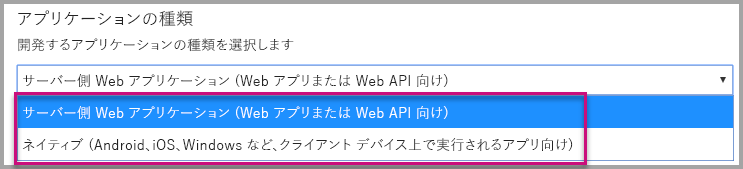
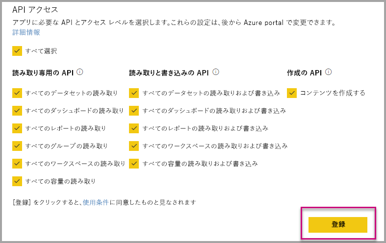
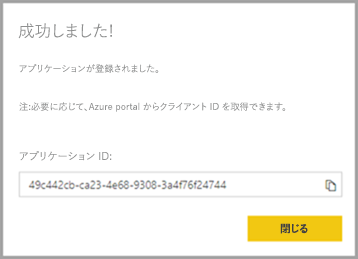
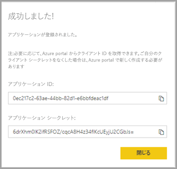

# <a name="register-an-azure-ad-application-to-use-with-power-bi"></a>Azure AD アプリケーションを登録して Power BI とともに使用する

埋め込みの Power BI コンテンツとともに使用するため、Azure Active Directory (Azure AD) 内にアプリケーションを登録する方法を説明します。

[Power BI REST API](https://docs.microsoft.com/rest/api/power-bi/) へのアプリケーションのアクセスを許可するには、アプリケーションを Azure AD に登録します。 アプリケーションを登録すると、アプリケーションの ID を設定し、Power BI REST リソースへのアクセス許可を指定できるようになります。

> [!IMPORTANT]
> Power BI アプリを登録する前に、[Azure Active Directory テナントと組織のユーザー](create-an-azure-active-directory-tenant.md)が必要です。 テナント内のユーザーで Power BI にサインアップしていない場合、アプリの登録が正常に完了しません。

アプリケーションを登録するには 2 つの方法があります。 [Power BI アプリ登録ツール](https://dev.powerbi.com/apps/)を使う方法と、Azure Portal 内で直接登録する方法です。 入力が必要なフィールドは少ししかないため、Power BI アプリの登録ツールを使用すると便利です。 アプリに変更を加える場合は、Azure portal を使います。

## <a name="register-with-the-power-bi-application-registration-tool"></a>Power BI アプリケーション登録ツールで登録する

**Azure Active Directory** にアプリケーションを登録して、アプリケーションの ID を設定し、Power BI REST リソースへのアクセス許可を指定します。 コンソール アプリや Web サイトなどのアプリケーションを登録すると、識別子を受け取ります。これは、アプリケーションがアクセス許可を要求していることをユーザーに対して示すために使用されます。

Power BI アプリ登録ツールでアプリケーションを登録する方法を以下に説明します。

1. [dev.powerbi.com/apps](https://dev.powerbi.com/apps) に移動します。

2. 既存のアカウントで **[サインイン]** を選択し、次に **[次へ]** を選択します。

3. **[アプリケーション名]** を指定します。

4. **[アプリケーションの種類]** を指定します。

    アプリケーションの種類として、**[ネイティブ]** と **[Server-side web applications]\(サーバー側 Web アプリケーション\)** を選択する理由の違いは次のとおりです。

    ネイティブ:
    * 認証にマスター ユーザー アカウント (Power BI へのサインインに使用される Power BI Pro ライセンス) を使用して、[顧客用に設計した](embed-sample-for-customers.md)アプリケーションを作成する予定です。

    Server-side web applications (サーバー側 Web アプリケーション):
    * [自分の組織用に設計した](embed-sample-for-your-organization.md)アプリケーションを作成する予定です。
    * 認証にサービス プリンシパルを使用して、[顧客用に設計した](embed-sample-for-customers.md)アプリケーションを作成する予定です。
    * Web アプリまたは Web API を作成する予定です。

    

5. アプリケーションの種類として **[Server-side web application]\(サーバー側 Web アプリケーション\)** を選択した場合は、次に **[ホーム ページ URL]** と **[リダイレクト URL]** に値を入力します。 **[リダイレクト URL]** は任意の有効な URL で機能します。また、作成したアプリケーションと対応している必要があります。 **[ネイティブ]** を選択した場合は、手順 6 に進みます。

6. アプリケーションに必要な Power BI API を選択します。 Power BI のアクセス許可について詳しくは、「[Power BI のアクセス許可](power-bi-permissions.md)」をご覧ください。 次に **[登録]** を選択します。

    

    > [!Important]
    > サービス プリンシパルを Power BI で使用できるようにすると、Azure Active Directory のアクセス許可は無効になります。 アクセス許可は、Power BI 管理ポータルを介して管理されます。

7. アプリケーションの種類に **[ネイティブ]** を選択した場合は、**[アプリケーション ID]** が提供されます。 アプリケーションの種類に **[Server-side Web app]\(サーバー側 Web アプリ\)** を選択した場合は、**[アプリケーション ID]** と **[アプリケーション シークレット]** を受け取ります。

    > [!Note]
    > **[アプリケーション ID]** は必要に応じて後で Azure portal から取得できます。 **[クライアント シークレット]** をなくした場合は、Azure portal で新しく作成する必要があります。

| ネイティブ | サーバー側 Web アプリケーション |
|--------|-----------------------------|
|  |  |

カスタム アプリケーションの一部として登録済みのアプリケーションを使用して Power BI サービスおよび Power BI Embedded アプリケーションと対話できるようになりました。

## <a name="register-with-the-azure-portal"></a>Azure Portal に登録する

アプリケーションを登録するためのもう 1 つのオプションは、Azure Portal で直接行うことです。 アプリケーションを登録するには、次の手順に従います。

1. [Microsoft Power BI API 条項](https://powerbi.microsoft.com/api-terms)に同意します。

2. [Azure Portal ](https://portal.azure.com)にサインインします。

3. ページの右上隅でご自分のアカウントを選択することで、ご自分の Azure AD テナントを選択します。

4. 左側のナビゲーション ウィンドウで、**[すべてのサービス]**、**[Azure Active Directory]**、**[アプリの登録]**、**[新しいアプリケーションの登録]** の順に選択します。

    

5. 画面の指示に従って、新しいアプリケーションを作成します。

   * Web アプリケーションの場合は、アプリのベース URL となるサインオン URL を指定します。これは、ユーザーがサインインできる場所です (例: `http://localhost:13526`)。
   * ネイティブ アプリケーションの場合は、Azure AD がトークンの応答を返すために使用する**リダイレクト URI** を指定します。 アプリケーション固有の値を入力します (例: `http://myapplication/Redirect`)。

Azure Active Directory でアプリケーションを登録する方法の詳細については、「[Azure Active Directory とアプリケーションの統合](https://docs.microsoft.com/azure/active-directory/develop/active-directory-integrating-applications)」を参照してください。

## <a name="how-to-get-the-application-id"></a>アプリケーション ID を取得する方法

アプリケーションを登録すると、[[アプリケーション ID]](embed-sample-for-customers.md#application-id) を受け取ります。  アプリケーションがユーザーを識別できるように、**アプリケーション ID** はユーザーへのアクセス許可を要求します。

## <a name="how-to-get-the-service-principal-object-id"></a>サービス プリンシパル オブジェクト ID を取得する方法

[Power BI API](https://docs.microsoft.com/rest/api/power-bi/) を使用する場合は、サービス プリンシパルを参照するために、[サービス プリンシパル オブジェクト ID](embed-service-principal.md#how-to-get-the-service-principal-object-id) を使用して操作を定義する必要があります。たとえば、ワークスペースに管理者としてサービス プリンシパルを適用する場合などです。

## <a name="apply-permissions-to-your-application-within-azure-ad"></a>Azure AD でアプリケーションにアクセス許可を適用する

アプリ登録ページで指定されたものに加え、アプリケーションに対する追加のアクセス許可を有効にします。 このタスクは、Azure AD ポータルを使用するか、プログラムで実行することができます。

埋め込みに使った "*マスター*" アカウント、グローバル管理者アカウントのどちらを使ってもログインできます。

### <a name="using-the-azure-ad-portal"></a>Azure AD ポータルの使用

1. Azure portal 内で [[アプリの登録]](https://portal.azure.com/#blade/Microsoft_AAD_IAM/ApplicationsListBlade) を参照して、埋め込みに使うアプリを選びます。

    
2. **[API アクセス]** の **[必要なアクセス許可]** を選択します。

    

3. **[必要なアクセス許可]** 内で、**[Power BI サービス (Power BI)]** を選択します。

    

   > [!NOTE]
   > Azure AD ポータルで直接アプリを作成した場合は、**[Power BI サービス (Power BI)]** が存在しない可能性があります。 存在しない場合は、**[+ 追加]** を選択してから **[1 API を選択します]** を選択します。 API リストで **[Power BI サービス]** を選択して、**[選択]** を選択します。  **[+ 追加]** に **[Power BI サービス (Power BI)]** がない場合は、少なくとも 1 人のユーザーで Power BI にサインアップします。

4. **[デリゲートされたアクセス許可]** のすべてのアクセス許可を選択します。 1 つずつ選択して選択内容を保存します。 完了したら、**[保存]** を選択します。

    
5. **[必要なアクセス許可]** 内で、**[アクセス許可の付与]** を選択します。

    Azure AD により同意を求めるプロンプトが表示されないようにするには、*マスター アカウント*に **[アクセス許可の付与]** アクションが必要です。 この操作を実行するアカウントがグローバル管理者である場合は、組織のすべてのユーザーにこのアプリケーションに対するアクセス許可を与えることになります。 このアクションを実行するアカウントが*マスター アカウント*であり、グローバル管理者ではない場合は、*マスター アカウント*にのみこのアプリケーションに対するアクセス許可を与えます。

    ![[必要なアクセス許可] ダイアログの [アクセス許可の付与]](media/register-app/powerbi-embedded-azuread-app-grant-permissions.png)

### <a name="applying-permissions-programmatically"></a>プログラムでのアクセス許可の適用

1. テナント内で既存のサービス プリンシパル (ユーザー) を取得する必要があります。 その方法については、「[Get servicePrincipal](https://developer.microsoft.com/graph/docs/api-reference/beta/api/serviceprincipal_get)」 (servicePrincipal を取得する) を参照してください。

    *Get servicePrincipal* API は {ID} なしで呼び出すことができます。その場合、テナント内のサービス プリンシパルがすべて取得されます。

2. **appId** プロパティとしてアプリのアプリケーション ID を使用してサービス プリンシパルを確認します。

3. アプリにサービス プランがない場合は、新しく作成します。

    ```json
    Post https://graph.microsoft.com/beta/servicePrincipals
    Authorization: Bearer ey..qw
    Content-Type: application/json
    {
    "accountEnabled" : true,
    "appId" : "{App_Client_ID}",
    "displayName" : "{App_DisplayName}"
    }
    ```

4. Power BI API にアプリのアクセス許可を付与する

   既存のテナントを使用しており、すべてのテナント ユーザーのためにアクセス許可を付与したくない場合は、**contentType** の値を **Principal** に置き換えることにより、特定のユーザーにアクセス許可を付与できます。

   **consentType** の値には、**AllPrincipals** または **Principal** を指定できます。

   * **AllPrincipals** は、テナント管理者がテナント内のすべてのユーザーの代理でアクセス許可を付与するためにのみ使用できます。
   * **Principal** は、特定のユーザーの代理でアクセス許可を付与する場合に使用します。 この場合、要求の本文に *principalId={User_ObjectId}* というプロパティを追加する必要があります。

     マスター アカウントで、Azure AD から同意を求めるプロンプトが表示されないようにするには (非対話形式のサインインを実行している場合は不可能)、"*アクセス許可の付与*" を行う必要があります。

     ```json
     Post https://graph.microsoft.com/beta/OAuth2PermissionGrants
     Authorization: Bearer ey..qw
     Content-Type: application/json
     {
     "clientId":"{Service_Plan_ID}",
     "consentType":"AllPrincipals",
     "resourceId":"c78a3685-1ce7-52cd-95f7-dc5aea8ec98e",
     "scope":"Dataset.ReadWrite.All Dashboard.Read.All Report.Read.All Group.Read Group.Read.All Content.Create Metadata.View_Any Dataset.Read.All Data.Alter_Any",
     "expiryTime":"2018-03-29T14:35:32.4943409+03:00",
     "startTime":"2017-03-29T14:35:32.4933413+03:00"
     }
     ```

    **resourceId** *c78a3685-1ce7-52cd-95f7-dc5aea8ec98e* はユニバーサルではありませんが、テナントに依存します。 この値は、Azure Active Directory (AAD) テナント内の "Power BI サービス" アプリケーションの objectId です。

    ユーザーは Azure portal ですぐにこの値を取得できます。
    1. https://portal.azure.com/#blade/Microsoft_AAD_IAM/StartboardApplicationsMenuBlade/AllApps

    2. 検索ボックスで "Power BI サービス" と検索します

5. アプリのアクセス許可を Azure Active Directory (AAD) に付与する

   **consentType** の値には、**AllPrincipals** または **Principal** を指定できます。

   * **AllPrincipals** は、テナント管理者がテナント内のすべてのユーザーの代理でアクセス許可を付与するためにのみ使用できます。
   * **Principal** は、特定のユーザーの代理でアクセス許可を付与する場合に使用します。 この場合、要求の本文に *principalId={User_ObjectId}* というプロパティを追加する必要があります。

   マスター アカウントで、Azure AD から同意を求めるプロンプトが表示されないようにするには (非対話形式のサインインを実行している場合は不可能)、"*アクセス許可の付与*" を行う必要があります。

   ```json
   Post https://graph.microsoft.com/beta/OAuth2PermissionGrants
   Authorization: Bearer ey..qw
   Content-Type: application/json
   { 
   "clientId":"{Service_Plan_ID}",
   "consentType":"AllPrincipals",
   "resourceId":"61e57743-d5cf-41ba-bd1a-2b381390a3f1",
   "scope":"User.Read Directory.AccessAsUser.All",
   "expiryTime":"2018-03-29T14:35:32.4943409+03:00",
   "startTime":"2017-03-29T14:35:32.4933413+03:00"
   }
   ```

## <a name="next-steps"></a>次の手順

Azure AD でアプリケーションを登録したので、アプリケーションでユーザーを認証する必要があります。 詳細については、「[ユーザーを認証し、Power BI アプリ用の Azure AD アクセス トークンを取得する](get-azuread-access-token.md)」をご覧ください。

他にわからないことがある場合は、 [Power BI コミュニティで質問してみてください](http://community.powerbi.com/)。