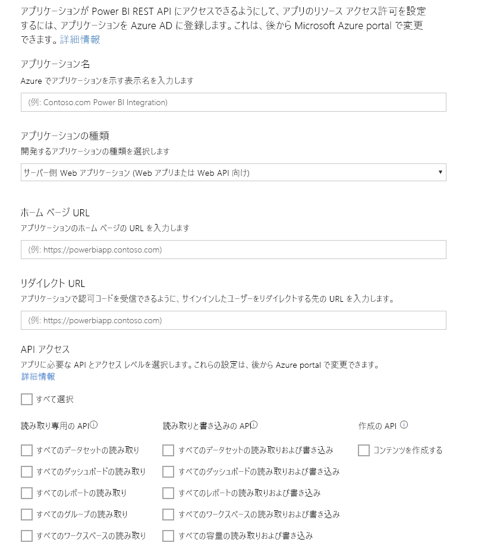

# 手順 1: アプリを Azure AD に登録する
この記事は、チュートリアル「[データセットにデータをプッシュする](walkthrough-push-data.md)」の一部です。

Power BI データセットにデータをプッシュする最初の手順では、Azure AD にアプリを登録します。 Azure AD でアプリを識別する **クライアント ID** を取得するために、この手順を最初に実行する必要があります。 **クライアント ID**がないと、Azure AD はアプリを認証できません。

> **注**: Power BI 用アプリを登録する前に、[Power BI にサインアップする](create-an-azure-active-directory-tenant.md)必要があります。
> 
> 

Azure AD にアプリを登録する手順は次のとおりです。

## Azure AD にアプリを登録する
1. dev.powerbi.com/apps に移動します。
2. **[既存のアカウントでサインインする]**をクリックして、Power BI アカウントにサインインします。
3. **[アプリ名]** を入力します (例: ダッシュボードにデータをプッシュするサンプル)。
4. **[アプリの種類]**で、 **[ネイティブ アプリ]**を選びます。
5. **[リダイレクト URL]** を入力します (例: **https://login.live.com/oauth20_desktop.srf**)。 **ネイティブ クライアント アプリ**の場合、リダイレクト URI は、認証する特定のアプリケーションに関する詳細を **Azure AD** に提供します。 クライアント アプリの標準の URI は https://login.live.com/oauth20_desktop.srf です。
6. **[アクセスする API の選択]**では、 **[すべてのデータセットの読み取りと書き込み]**を選びます。 すべての Power BI アプリのアクセス許可については、「[Power BI のアクセス許可](power-bi-permissions.md)」をご覧ください。
7. **[アプリの登録]**をクリックし、生成された **クライアント ID** を保存します。 **クライアント ID** は、Azure AD 内でアプリを識別します。

**[Power BI にアプリケーションを登録する]** ページは、次のようなものです。

次の手順では、[認証アクセス トークンを取得する](walkthrough-push-data-get-token.md)方法について説明します。

[次の手順 >](walkthrough-push-data-get-token.md)

## 次の手順
[Power BI にサインアップする](create-an-azure-active-directory-tenant.md)  
[認証アクセス トークンを取得する](walkthrough-push-data-get-token.md)  
[チュートリアル: データセットにデータをプッシュする](walkthrough-push-data.md)  
[アプリケーションを登録する](register-app.md)  
[Power BI REST API の概要](overview-of-power-bi-rest-api.md)  

他にわからないことがある場合は、 [Power BI コミュニティで質問してみてください](http://community.powerbi.com/)。

