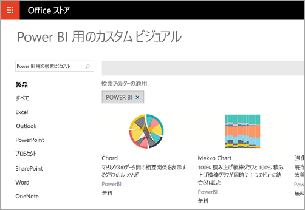

# Power BI の開発者向け機能
Power BI には、開発者向けのさまざまなオプションがあります。 たとえば、埋め込み、カスタム ビジュアル、ストリーミング データセットなどです。

## 埋め込み
Power BI サービスと Azure の Power BI Embedded は、ダッシュボードとレポートを埋め込むための単一の API を提供します。 これは、1 つの API サーフェスで一貫性のある一連の機能を利用でき、コンテンツを埋め込む際にダッシュボード、ゲートウェイ、アプリ ワークスペースなどの最新の Power BI 機能にアクセスできることを意味します。 詳しくは、「[Power BI で埋め込み](embedding.md)」をご覧ください。

## カスタム ビジュアル
カスタム ビジュアルを使うと、Power BI レポート内で使う独自のビジュアルを作成できます。 カスタム ビジュアルは、TypeScript で記述します。TypeScript は JavaScript のスーパー セットであり、高度な機能をサポートすると共に ES6/ES7 機能への早期アクセスに対応します。 ビジュアルのスタイル設定は、カスケード スタイル シート (css) を使用して処理されます。 わかりやすくするために、入れ子、変数、mixin、条件、ループなどの高度な機能をサポートする Less プリコンパイラを使用します。これらの機能を使用しない場合は、Less ファイル内にプレーンな css だけを記述します。

カスタム ビジュアルの開発と発行の方法について詳しくは、「[カスタム ビジュアルを Office ストアに発行する](office-store.md)」をご覧ください。

## Power BI にデータをプッシュする
Power BI API を使って、データセットにデータをプッシュできます。 これにより、データセット内のテーブルに行を追加できます。 ダッシュボードのタイルやレポートのビジュアルに新しいデータを反映できます。

詳しくは、「[ダッシュボードにデータをプッシュする](walkthrough-push-data.md)」をご覧ください。

## 次の手順
[Power BI で埋め込み](embedding.md)  
[Power BI に Power BI Embedded ワークスペース コレクション コンテンツを移行する方法](migrate-from-powerbi-embedded.md)  
[JavaScript API Git リポジトリ](https://github.com/Microsoft/PowerBI-JavaScript)  
[Power BI C# Git リポジトリ](https://github.com/Microsoft/PowerBI-CSharp)  
[カスタム ビジュアルを Office ストアに発行する](office-store.md)  
[Power BI ビジュアル Git リポジトリ](https://github.com/Microsoft/PowerBI-visuals)  
[JavaScript 埋め込みサンプル](https://microsoft.github.io/PowerBI-JavaScript/demo/)  
[Power BI Premium ホワイト ペーパー](https://aka.ms/pbipremiumwhitepaper)  
他にわからないことがある場合は、 [Power BI コミュニティを利用してください](http://community.powerbi.com/)。

