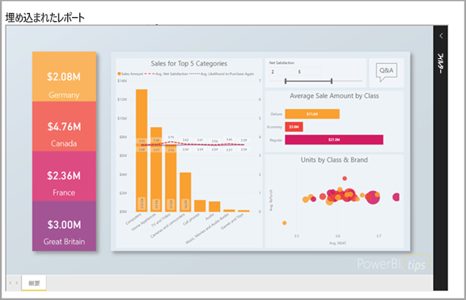

# Power BI の開発者向け機能

開発者は、さまざまな方法で、アプリケーションに Power BI コンテンツを含めることができます。 開発者として、これらのオプション (**Power BI での埋め込み**、**カスタム ビジュアル**、および**Power BI へのデータのプッシュ**など) を使用できます。

## Power BI コンテンツの埋め込み

Power BI サービス (SaaS) と Azure (PaaS) の Power BI Embedded サービスには、ダッシュボードとレポートの埋め込み用の API があります。 この機能は、コンテンツを埋め込む際に、ダッシュボード、ゲートウェイ、アプリ ワークスペースなどの最新の Power BI 機能にアクセスできることを意味します。

[埋め込みセットアップ ツール](https://aka.ms/embedsetup)に移動し、すばやく開始してサンプル アプリケーションをダウンロードすることができます。

適切なソリューションを選択します。

* [顧客向けの埋め込み](embedding.md#embedding-for-your-customers)では、Power BI のアカウントがないユーザーのためにダッシュボードとレポートを埋め込むことができます。 [顧客向けの埋め込み](https://aka.ms/embedsetup/AppOwnsData)ソリューションを実行します。

* [組織向けの埋め込み](embedding.md#embedding-for-your-organization)を使って、Power BI サービスを拡張することができます。 [組織向けの埋め込み](https://aka.ms/embedsetup/UserOwnsData)ソリューションを実行します。

Power BI での埋め込みの詳細については、「[Embedding with Power BI](embedding.md)」 (Power BI での埋め込み) を参照してください。

## カスタム ビジュアルの開発

Power BI でカスタム ビジュアルを使用し、自分や所属企業に合った独自のビジュアルを作成することができます。 多くの場合、これらのカスタム ビジュアルは開発者によって作成されます。 これらは、Power BI に含まれている多くのビジュアルがまだニーズを満たしていない場合に構築されます。

カスタム ビジュアルを利用すれば、Power BI レポート内で使用する自分のビジュアルを作成できます。 カスタム ビジュアルは、JavaScript のスーパーセットである、TypeScript で記述されています。 TypeScript は、いくつかの高度な機能と ES6/ES7 機能への早期アクセスをサポートしています。 ビジュアルのスタイル設定は、カスケード スタイル シート (CSS) を使用して処理されます。 便宜上、いくつかの高度な機能 (入れ子、変数、条件、ループ、およびその他の機能など) をサポートする Less プリコンパイラが使用されています。 これらの機能のいずれも使用しない場合は、less ファイル内にプレーンな CSS を記述できます。

カスタム ビジュアルの開発についての詳細の学習を開始する場合は、「[開発者ツールを使ってカスタム ビジュアルを作成する](custom-visual-develop-tutorial.md)」を参照してください。

## API オートメーションの使用

Power BI には、対話型で、さまざまなデータ ソースからリアルタイムで作成、更新できるダッシュボードが表示されます。 REST 呼び出しをサポートするプログラミング言語を使って、リアルタイムで Power BI ダッシュボードと統合するアプリを作成できます。 アプリに、Power BI のタイルとレポートを統合することもできます。

開発者は、対話型のレポートやダッシュ ボードで使用できる独自のデータ表示を作成することもできます。

Power BI API でできることをいくつか確認する場合は、「[Power BI API の開発者向け機能](overview-of-power-bi-rest-api.md)」を参照してください。

## 次の手順

[Power BI で埋め込み](embedding.md)  

[Power BI カスタム ビジュアルの開発](https://microsoft.github.io/PowerBI-visuals/docs/step-by-step-lab/developing-a-power-bi-custom-visual/)

[Power BI API の開発者向け機能](overview-of-power-bi-rest-api.md)

[Power BI デベロッパー センター](https://powerbi.microsoft.com/developers/)