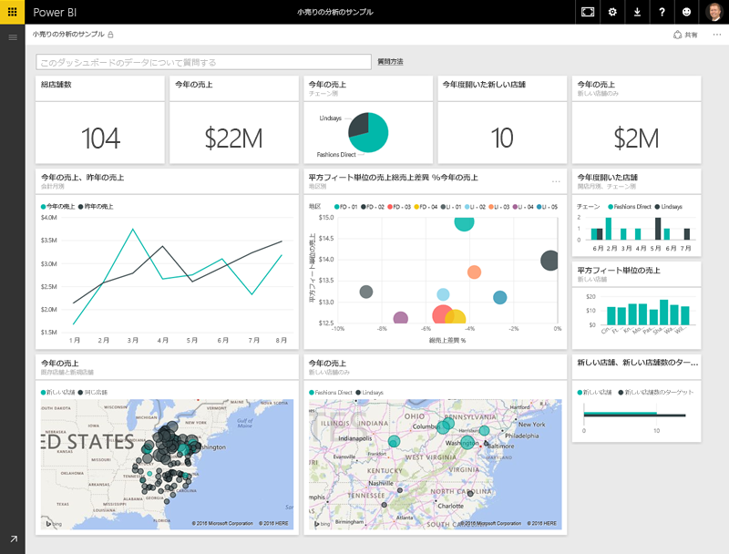
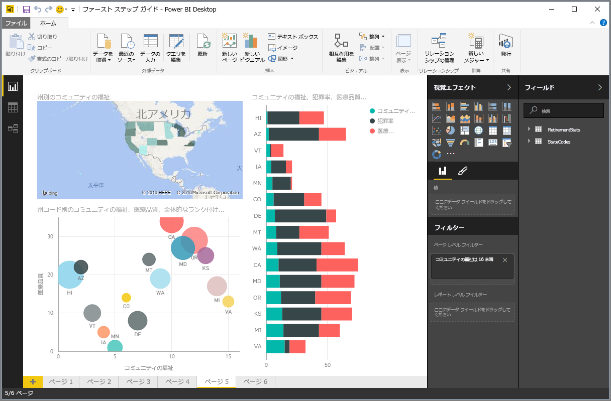
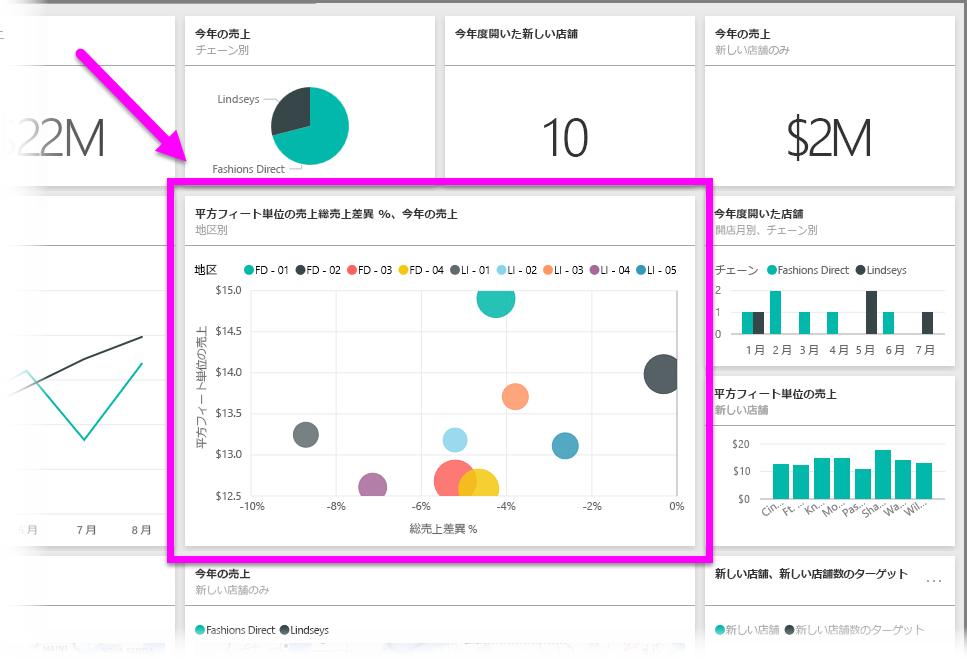

Power BI で実行できる機能は、すべていくつかの基本的な**構成要素**に分けることができます。 これらの構成要素を理解すると、それらを個別に展開し、高度で複雑なレポートの作成を開始できます。 つまり、一見複雑な機能も、基本的な構成要素で成り立っています。たとえば、建物は木材や金属、コンクリート、ガラスなどから作られます。 車は金属、繊維、およびゴムから作られます。 もちろん、建物や車も、これらの構成要素のアレンジに応じて、基本的なものにするか、または高度なものにすることができます。

ここでは、これらの基本的な構成要素に注目し、それらを使って作成できる簡単な機能のいくつかについて説明した上で、複雑な機能の作成方法についても簡単に説明します。

Power BI の基本的な構成要素は次のとおりです。

* 視覚エフェクト
* データセット
* レポート
* ダッシュボード
* タイル

## 視覚エフェクト
**視覚エフェクト** (**ビジュアル**ともいいます) とは、チャート、グラフ、色分したマップ、データを視覚的に表現するために作成した興味深い物などを指す、データの視覚的表現のことです。 Power BI には、さまざまな視覚エフェクトの種類が用意されていますが、今後も常時追加される予定です。 次の図は、Power BI サービスで作成されたさまざまな視覚エフェクトのコレクションを示しています。

視覚エフェクトは、重要な事柄を表す 1 つの数値のように簡単にすることもできますし、特定の社会問題や関心事に対する投票者の感情を示す、傾向別に色分けされたマップのように、視覚的に複雑にすることもできます。 ビジュアルの目的は、背景や洞察が得られるような形でデータを表示することです。こうした背景や洞察は、一般的に数値や文字列の未加工テーブルからでは識別が困難です。

## データセット
**データセット**は、Power BI の視覚エフェクトの作成に使用するデータのコレクションです。

次の図に示すような、Excel ワークブックの単一のテーブルに基づく単純なデータセットを得ることができます。

**データセット**は、たくさんの異なるソースの組み合わせにすることもできます。そうすることで、フィルター処理や組み合わせにより、Power BI で使用する一意の収集データ (データセット) を提供できます。

たとえば、web サイトの 1 テーブル、Excel テーブル、オンラインの電子メール マーケティング キャンペーン結果の 3 つの異なるデータベース フィールドからデータセットを作成できます。 このような一意の組み合わせは、たくさんの異なるソースからまとめて取得したものですが、単独の**データセット**とみなすこともできます。

Power BI に取り込む前にデータをフィルター処理することにより、重要なデータのみに重点を置くことができます。 たとえば、マーケティング キャンペーンの電子メールを受信した顧客のみをデータセットに含まれるように、連絡先データベースをフィルター処理できます。 そうすれば、キャンペーンに含まれていた顧客のそのサブセット (フィルター処理されたコレクション) に基づいてビジュアルを作成できます。 フィルター処理をすることで、自分のデータと作業に重点を置くことができます。

Power BI の重要かつ有効な部分は、その中に含まれる多数のデータ **コネクタ**です。 Excel や SQL のデータベース、Azure や Oracle、また、Facebook、Salesforce、MailChimp のようなサービスなど、必要なデータがどこにあっても、Power BI に組み込まれたデータ コネクタにより、そのデータへ簡単に接続し、必要に応じてデータをフィルター処理し、データセットに取り込むことができます。

データセットを取得すると、そのデータセットの異なる部分をさまざまな方法で表示する視覚エフェクトの作成を開始し、表示された内容から洞察を得ることができます。 そこで役に立つのがレポートです。

## レポート
Power BI の**レポート**は、1 つまたは複数のページにまとめて表示される視覚エフェクトのコレクションです。 販売プレゼンテーションのために作成する他のレポートや、学校の宿題用に記述するとレポートと同様に、Power BI の**レポート**も、相互に関連付けられている項目のコレクションです。 次の図に、Power BI Desktop の**レポート**を示します。ここに示すのは、6 ページのレポートの 5 ページ目です。 Power BI サービスでレポートを作成することもできます。

レポートからさまざまな視覚エフェクトを作成し、必要に応じて複数の異なるページに編成し、内容を伝えるのに最適な方法でそれらを自由にアレンジできます。

四半期売り上げ高に関するレポート、特定分野での製品の成長に関するレポート、北極グマの移動パターンに関するレポートなどを作成する場合があります。 どのようなテーマであれ、レポートから視覚エフェクトを収集し、1 つ (または複数) のページに編成できます。

## ダッシュボード
レポートのあるページ、または視覚エフェクトのコレクションを共有する準備ができたら、**ダッシュボード**を作成します。 車のダッシュボードとほぼ同様に、Power BI **ダッシュボード**は、他のユーザーと共有できる単一のページのビジュアルのコレクションです。 多くの場合、ダッシュボードは、説明しようとしているデータやストーリーをすばやく理解できるようにするための、ビジュアルの選択したグループです。

ダッシュボードは、キャンバスと呼ばれる 1 つのページに収まるようにします (キャンバスは Power BI Desktop またはサービスの空白の背景で、ここに視覚エフェクトを配置します)。 芸術家や画家が使用するキャンバスのようなもの、すなわち、興味深く説得力のあるビジュアルを作成、結合、再加工するワークスペースとお考えください。
ダッシュボードは、他のユーザーまたはグループと共有すると、Power BI サービスやモバイル デバイスを起動中に、他のユーザーまたはグループがあなたのダッシュボードを操作できるようになります。

## タイル
Power BI の**タイル**は、レポートやダッシュ ボードに見られる単一の視覚エフェクトで、 個々 のビジュアルを含む四角形のボックスになります。 次の図に示すのは、他のタイルで囲まれている 1 つのタイル (明るいボックスで強調表示されたもの) です。

Power BI でレポートやダッシュボードを*作成*する場合、どのように情報を表現するかに応じて、タイルを自由に移動、配置できます。 タイルは、好みに合わせて大きくしたり、高さや幅を変更したり、他のタイルに寄せたりすることができます。

ダッシュボードやレポートを*表示*または*消費*する場合、つまり、ダッシュボードやレポートの作成者または所有者ではなく、それらを共有している場合、ダッシュボードやレポートの操作は可能ですが、タイルのサイズ変更や配置方法の変更はできません。

## まとめ
Power BI とその構成要素の基本については以上です。 では、もう一度確認してみましょう。

Power BI はサービス、アプリ、コネクタのコレクションで、保存場所に関係なくデータに接続できます。また、必要に応じてフィルター処理して Power BI に取り込めば、説得力のある視覚エフェクトを作成して他のユーザーと共有できます。  

以上で Power BI のさまざまな基本構成要素について理解できました。また、*自分自身にとって*意味のあるデータセットを作成できることや、内容が伝わり視覚的に説得力のあるレポートを作成できることが分かりました。 Power BI で伝える内容に必要なのは、複雑さや難解さではなく説得力です。

ある人にとっては、データセットで単一の Excel テーブルを使用し、チームとダッシュボードを共有することが、Power BI の非常に便利な使用方法です。

別の人にとっては、他のデータベースやリアルタイム ソースと組み合わせてリアルタイムの Azure SQL Data Warehouse テーブルを使用し、リアルタイムでフィルター処理しながら製造の進行状況を常時監視することが、Power BI に求める価値となります。

どちらの場合もプロセスは同じで、データセットを作成し、説得力のあるビジュアルを構築し、他のユーザーと共有します。 同様に、両者の結果も (双方にとって) 同じで、日々拡大するデータの世界を活用し、そこから実用的な洞察を得ます。

データの洞察に必要なデータセットが簡単か複雑かに関係なく、Power BI はすぐに使い始めることができます。また、自分のニーズに合わせて拡張しながら、データの世界のニーズに合わせて複雑にすることもできます。 Power BI は Microsoft 製品であるため、これを頼りに堅牢性、拡張性、Office との親和性、エンタープライズ対応などを実現できます。

次に、その仕組みを確認しましょう。 まずは Power BI サービスから見ていきます。

