このトピックでは、Power BI の最初の 2 つの要素がどのように連携しているかを詳しく見ていきます。

* **Power BI Desktop** でレポートを作成します。
* **Power BI サービス**で、レポートを発行します。

Power BI Desktop を開始して、 **[データの取得]** を選択します。 データ ソースのコレクションが表示されます。ここでデータ ソースを選択できます。 次の図では、Web ページをソースとして選択しています。上のビデオでは、Will は **Excel** ブックを選択しました。

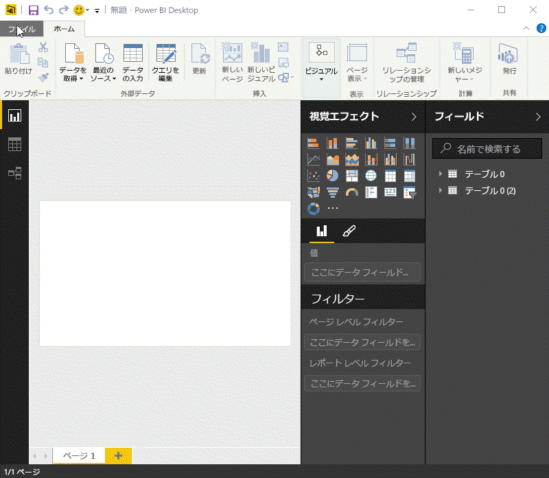

どのデータ ソースを選択するかに関係なく、Power BI はそのデータ ソースに接続し、そのソースから利用できるデータを表示します。 また、次の図は、さまざまな状態と必要な退職者統計を分析する Web ページのデータの例です。

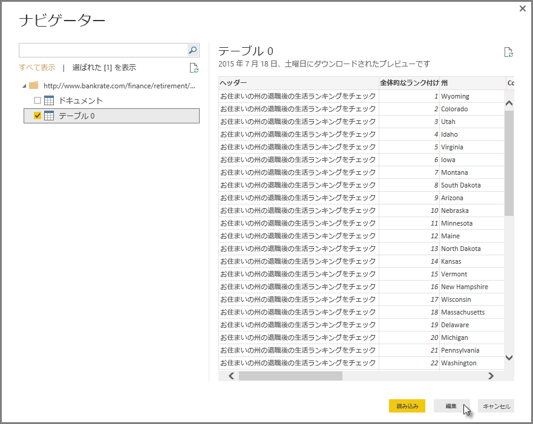

Power BI Desktop の**レポート** ビューでレポートの作成を開始します。

**レポート** ビューには、次の 5 つの主な領域があります。

1. リボン。これにはレポートと視覚エフェクトに関連する一般的なタスクが表示されます。
2. **レポート** ビューまたはキャンバス。ここに視覚エフェクトが作成されて配置されます。
3. **[ページ]** タブ領域 (下部にあります)。レポートのページを選択または追加できます。
4. **[視覚エフェクト]** ウィンドウ。視覚エフェクトの変更、色や軸のカスタマイズ、フィルターの適用、フィールドのドラッグなどを行えます。
5. **[フィールド]** ウィンドウ。ここではクエリの要素とフィルターを**レポート** ビューにドラッグしたり、 **[視覚エフェクト]** ウィンドウの**フィルター**領域にドラッグしたりできます。

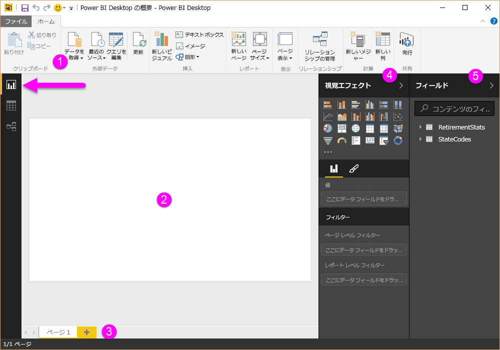

**[視覚エフェクト]** ウィンドウと **[フィールド]** ウィンドウは、端の小さな矢印を選んで折りたたむことができます。これにより、**レポート** ビューの領域が増えて、優れた視覚エフェクトを作成できます。 さらに、視覚エフェクトを変更する際、上下の矢印が表示されます。これは、状況に応じてそのセクションの展開や折りたたみができることを意味します。

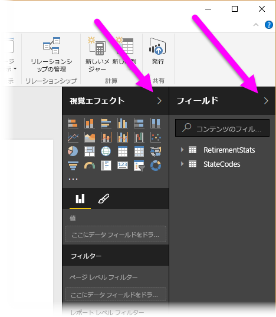

**[フィールド]** リストから **レポート** ビューにフィールドをドラッグするだけで、視覚エフェクトを作成できます。 このケースでは、[州] フィールドを *[RetirementStats]* からドラッグして、その結果を観察します。

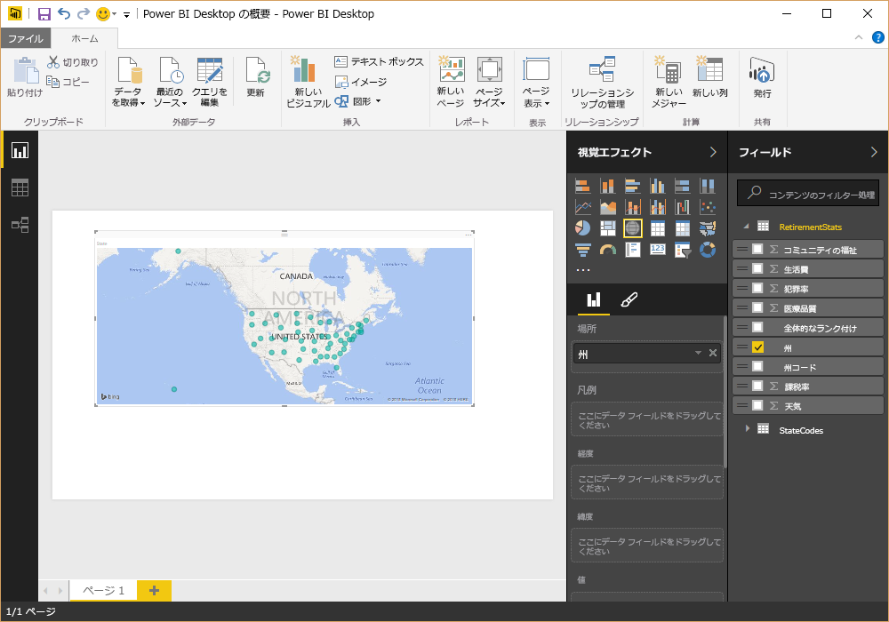

ご覧ください。Power BI Desktop により、地図ベースの視覚エフェクトが自動的に作成されました。これは、[州] フィールドに地理的位置情報データが含まれていることが認識されたためです。

少し話を早く進めましょう。視覚エフェクトが含まれるレポートを作成したら、そのレポートを Power BI サービスに発行する準備ができています。 Power BI Desktop の **[ホーム]** リボンで、 **[発行]** を選択します。

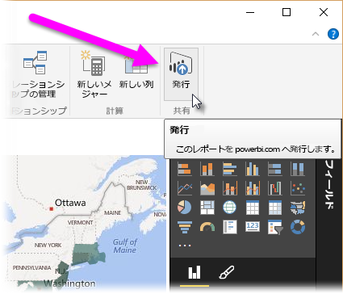

Power BI にサインインするよう求めるメッセージが表示されます。

サインインして、発行プロセスが完了すると、次のダイアログ ボックスが表示されます。 リンク (以下の **[成功!]** ) を選択すると、Power BI サービスが表示されます。発行したレポートはここで確認できます。

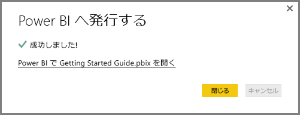

Power BI にサインインすると、サービスで公開した Power BI Desktop ファイルが表示されます。 以下の図では、Power BI Desktop で作成したレポートが **[レポート]** セクションに表示されています。

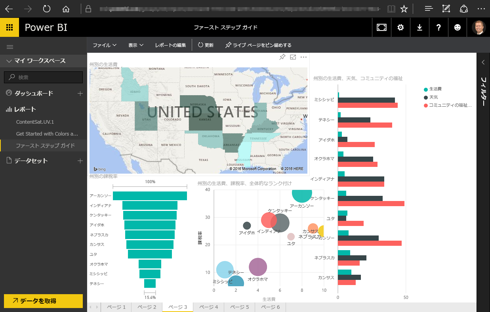

そのレポートで**ピン** アイコンを選択すると、そのビジュアルをダッシュボードにピン留めできます。 次の図では、明るいボックスと矢印でピン アイコンが強調表示されています。

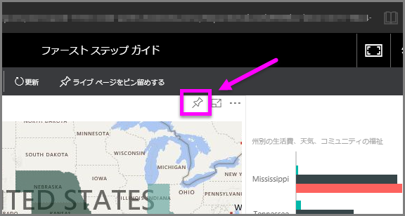

ピン アイコンを選択すると、次のダイアログ ボックスが表示されます。ここで、ビジュアルを既存のダッシュボードにピン留めするか、新しいダッシュボードを作成できます。

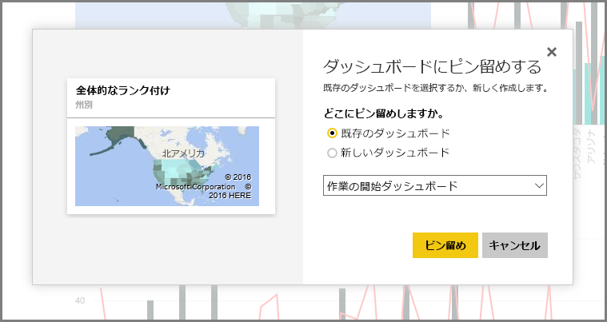

レポートからビジュアルをいくつかピン留めすると、そのビジュアルはダッシュボードで確認できます。

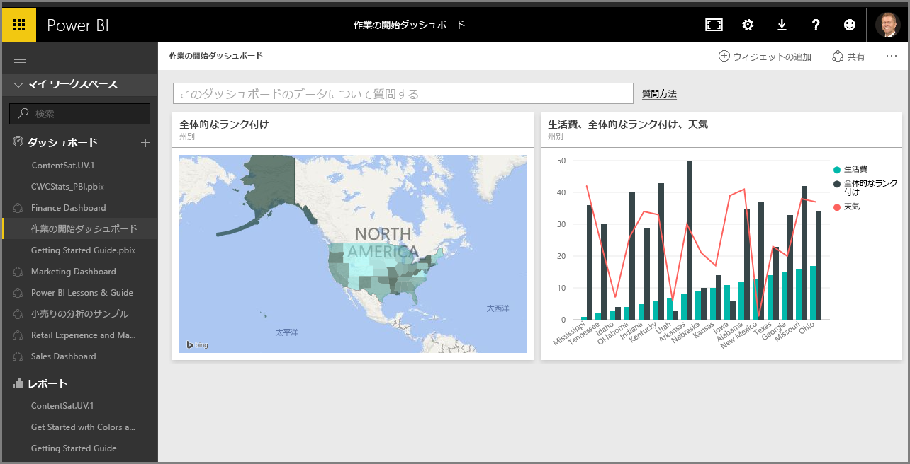

もちろん Power BI では、作成したダッシュボードの共有など、さらに多くを行うことができます。 共有については、このコースで後述します。

次は、Facebook、Salesforce など、クラウド サービスに接続するだけでダッシュボードを自動作成する機能について確認します。

