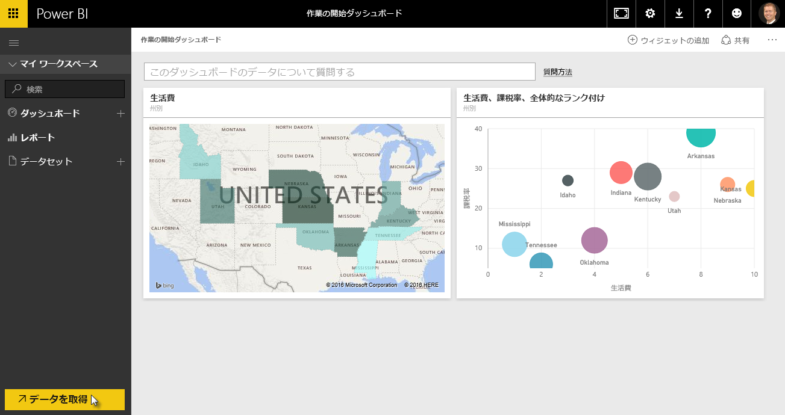
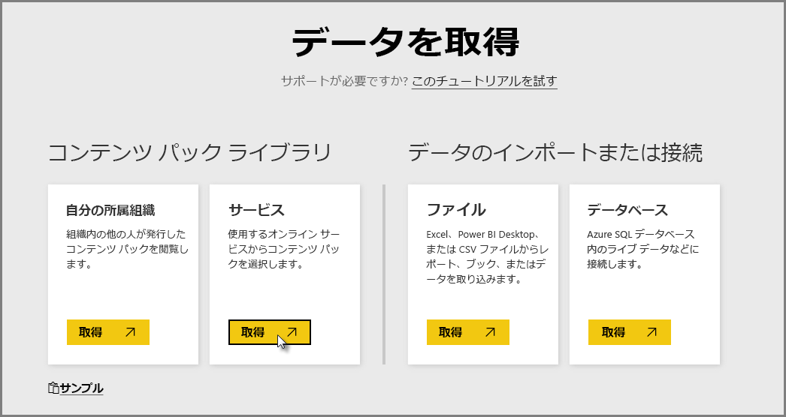
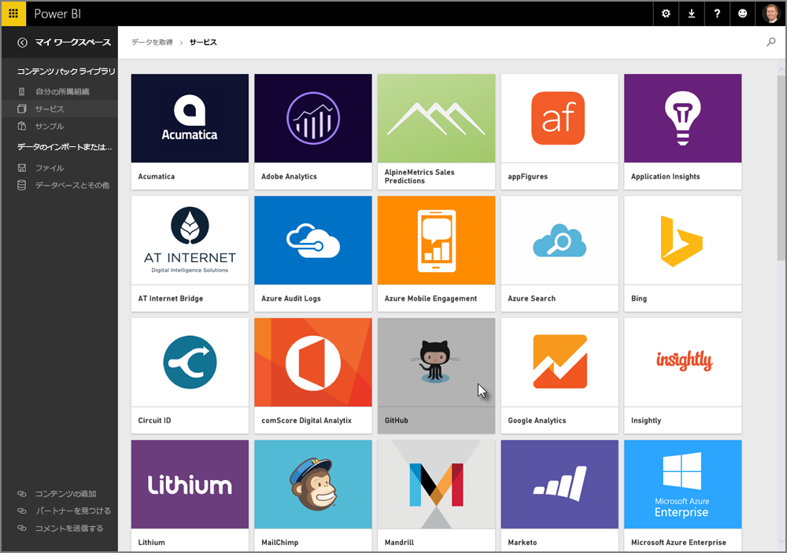
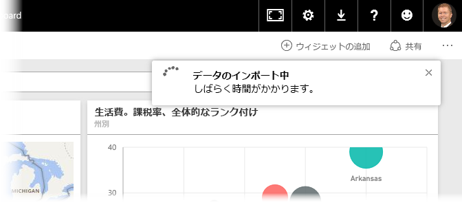
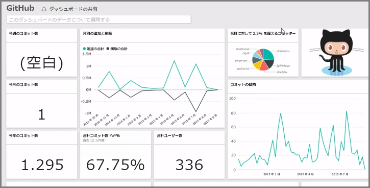
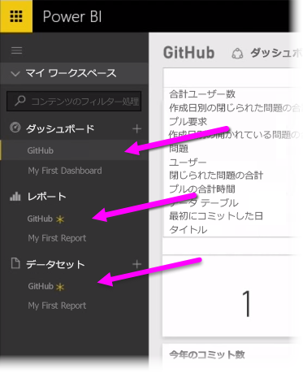
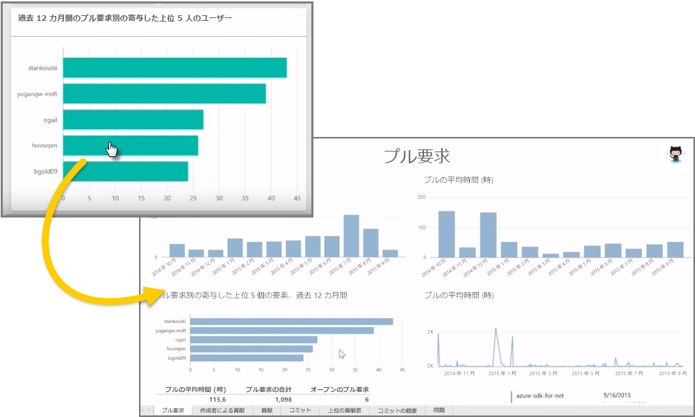
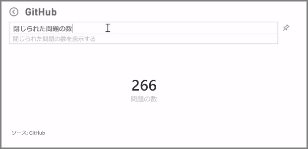
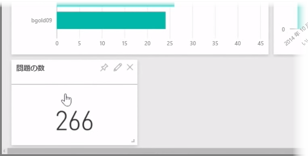
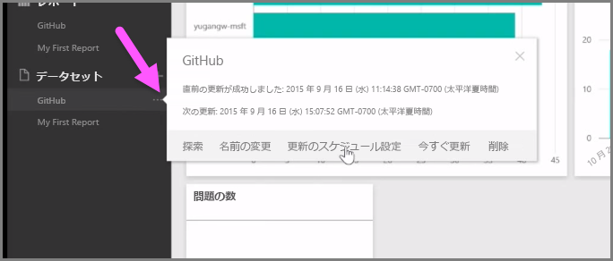

これまで学んだとおり、Power BI Desktop でレポートを作成し、Power BI サービスに公開し、サービスまたはモバイル アプリに表示できるように他のユーザーと共有するのが、Power BI での一般的な作業の流れです。

ただし、Power BI サービスが初めての人もいるため、まずサービスについて簡単に説明してから、Power BI でビジュアルをすばやく作成する簡単で一般的な方法、*コンテンツ パック*について説明します。

**コンテンツ パック**は、Salesforce などの特定のデータ ソースに基づく、事前構成された既製のビジュアルとレポートのコレクションです。 コンテンツ パックの使用は、TV ディナー (調理済みの冷凍食品) を電子レンジで加熱したり、ファスト フード店でセット メニューを注文するようなものです。数回のクリックとコメントだけで、調和のとれた設計のアントレのコレクションが出来上がり、すべてコンパクトで使いやすいパッケージに入れた状態で提供されます。

では、コンテンツ パックについて、またそのサービスとしくみについて簡単に見てみましょう。 コンテンツ パック (とそのサービス) の詳細については、以降のセクションで説明します。ここでの説明は、食欲を刺激するためのしょっとした味見と考えてください。

## クラウド サービスによりすぐに使用可能なダッシュ ボードを作成する
Power BI があれば、データへの接続は簡単です。 Power BI サービスから、ホーム画面の左下隅にある **Get Data (データの取得)** ボタンをクリックするだけです。

*キャンバス* (Power BI サービスの中央の領域) には、Power BI サービスで使用可能なデータ ソースが表示されます。 Excel ファイル、データベース、Azure データなどの一般的なデータ ソースだけでなく、Power BI は、Salesforce、Facebook、Google Analytics などの**ソフトウェア サービス** (SaaS プロバイダー、クラウド サービスとも呼ばれます) や、その他の各種 SaaS サービスにも簡単に接続できます。

これらのソフトウェア サービス向けに、**Power BI サービス**には、**コンテンツ パック**と呼ばれる、ダッシュボードとレポートに事前に配置された既製ビジュアルのコレクションが用意されています。 コンテンツ パックを使用すると、選択したサービスのデータにより Power BI をすばやく稼働させることができます。 たとえば、Salesforce のコンテンツ パックを使用する場合、Power BI が (資格情報を指定した時点で) Salesforce アカウントに接続し、定義済みのビジュアルとダッシュボードのコレクションを Power BI で設定します。

Power BI には、各種サービス向けにコンテンツ パックが用意されています。 次の図は、 **[サービス]** ボックスで **Get (取得)** をクリックする (前の画像を参照) と表示される、アルファベット順に並んだサービスの最初の画面を示しています 。 この図からわかるように、選択肢がたくさんあります。

ここでは **GitHub** を選択してみます。 GitHub とは、オンライン ソースをコントロールするためのアプリケーションです。 GitHub コンテンツ パックの必要情報と資格情報を入力すると、自分のデータのインポートが始まります。

データが読み込まれると、定義済みの GitHub コンテンツ パックのダッシュボードが表示されます。

**ダッシュボード**のほかに、ダッシュボードの作成用に (GitHub コンテンツ パックの一部として) 生成された**レポート**も使用できます。また同様に、データのインポート中に作成された**データセット** (GitHub から取得したデータのコレクション) を使用して GitHub レポートを作成することもできます。

ダッシュボードでビジュアルのいずれかをクリックすると、そのビジュアルの作成元である **[レポート]** ページへ自動的に移動します。 したがって、**pull requests で上位 5 ユーザー**のビジュアルがクリックされている場合、Power BI は**Pull Requests**ページをレポート (ビジュアルの作成元のレポート ページ) に開きます。

## データに関する質問
データに関する質問も可能です。質問をすると、その質問に基づいてリアルタイムで Power BI サービスがビジュアルを作成します。 次の図は、 **[自然言語クエリ]** バーに入力した内容に基づき、解決した問題数 (Count of Issues) を示すビジュアルに Power BI が数字を作成する様子を示しています。

気になるビジュアルがある場合は、自然言語クエリ バーの右側にある**ピン**のアイコンを選択して、そのビジュアルをダッシュボードにピン留めすることができます。 ここでは、現在選択されているダッシュボードが GitHub のダッシュボードなので、ビジュアルはこのダッシュボードにピン留めされています。

## Power BI サービスでのデータの更新
コンテンツ パックのデータセット、または Power BI で使用するその他のデータを**更新**することもできます。 更新を設定するには、データ セットの横にある省略記号 (3 つのドット数) を選択してメニューを表示します。

メニューの下部にある **[更新のスケジュール設定]** オプションを選択します。 [設定] ダイアログがキャンバスに表示されます。このダイアログで必要に応じて更新を設定できます。

Power BI サービスの概要については以上です。 このサービスで実行できる機能はほかにもたくさんありますが、それらについては、このコースの後半で取り上げます。 また、接続できるデータの種類もたくさんあり、各種のコンテンツ パックが用意されていますが、それらについても随時追加される予定です。

では、次のトピックに移りますが、この「**概要**」セクションについてまとめてから、以降の手順に備えます。

