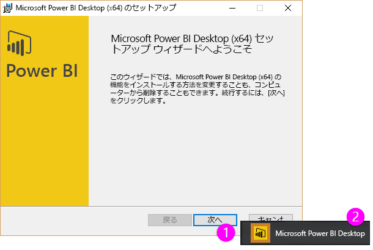
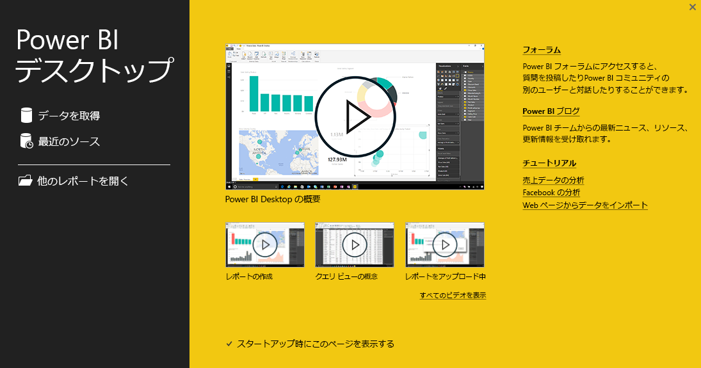

この Power BI 用**ガイド付き学習**コースの 2 番目のセクションへようこそ。このセクションは「**データの取得**」です。 このセクションでは、Power BI Desktop に重点を置きながら、さまざまなデータ中心機能と Power BI のツールについて見ていきます。 これらのツールの多くは Power BI サービスにも適用されるため、このセクションでは 2 つの機能を同時に学習することになります。

データを取得したときに、期待通りの形式になっていない場合や*整って*いない場合もあります。 したがって、このセクションでは、データを取得する方法やクリーンアップする方法 (データの*クリーニング*または*変換*という場合もあります) について説明します。また、データを簡単に取得するための、いくつかの高度なテクニックについても説明します。

いつものように、このコースでは、Power BI での作業の流れと同じ順序に従って一連の学習を行います。 ではまず、出発点となる場合の多い **Power BI Desktop** から確認しましょう。

## Power BI Desktop の概要
Power BI Desktop は、データを接続、クリーンアップ、視覚化するツールです。 Power BI Desktop を使用してデータに接続し、きさまざまな方法でデータをモデル化、視覚化できます。 Business Intelligence プロジェクトで作業しているユーザーの多くは、ほとんどの時間を Power BI Desktop の使用に費しています。

Power BI Desktop は [Web から](http://go.microsoft.com/fwlink/?LinkID=521662)ダウンロードできます。また、[**Windows ストア**](http://aka.ms/pbidesktopstore)からアプリとして **Power BI Desktop** をインストールすることもでき、Power BI サービスからダウンロードすることもできます。 サービスで **Power BI Desktop** を取得する場合は、Power BI の右上にある下矢印ボタンを選択し、Power BI Desktop を選択するだけです。

Power BI Desktop は、アプリケーションとして Windows コンピューターにインストールされます。

このため、Power BI Desktop をダウンロードすると、Windows の他のアプリケーションと同様にインストールし実行できます。 次の図は、アプリケーションを起動すると表示される Power BI Desktop のスタート画面です。

Power BI Desktop は、ローカルのオンプレミス データベースからクラウド サービスや Excel ワークシートまで、さまざまなデータ ソースに接続します。 Power BI Desktop は、列の分割、列名の変更、データ型の変更、日付の操作など、データのクリーニングや書式設定により、データをより使いやすくするのに役立ちます。 また、データをモデル化して分析しやすくなるように、列間のリレーションシップを作成することもできます。

