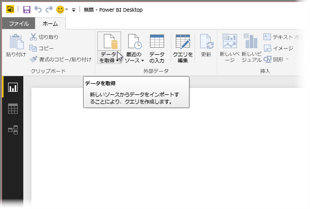
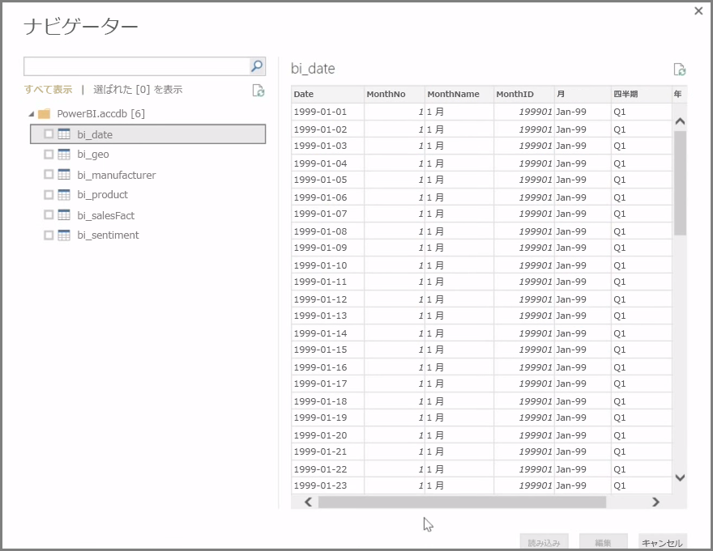
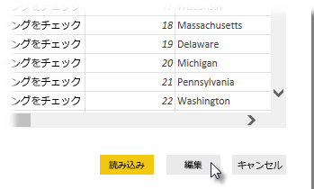

**Power BI Desktop** は、オンプレミス データベース、Excel ワークブック、クラウド サービスなど、あらゆる種類のデータ ソースに接続できます。 現時点では、GitHub や Marketo など 59 を超えるさまざまなクラウド サービスに独自のコネクタがあり、XML、CSV、テキスト、ODBC などから一般的なソースに接続できます。 Power BI では、Web サイトの URL から直接表形式のデータを取得することもできますが、 まずは Power BI Desktop を開いてデータに接続するところから始めましょう。

**Power BI Desktop** を起動してスタート画面に移動すると、 **[ホーム]** タブのリボンから [データの取得] を選択できます。

Power BI Desktop の更新プログラムは毎月リリースされていて、更新プログラムごとに **Power BI Desktop の新機能** に関するページで、更新プログラム、ブログへのリンク、ダウンロード リンクに関する情報が更新されます。

Power BI Desktop では、あらゆる種類のデータ ソースを使用できます。 接続を確立するソースを選択します。 選択内容に応じて、コンピューターまたはネットワーク上のソースの検索、または要求を認証するサービスへのサインインが求められます。

接続後、最初に表示されるウィンドウが **[ナビゲーター]** です。 [ナビゲーター] には、データ ソースのテーブルやエンティティが表示されます。その 1 つをクリックすると、内容のプレビューが表示されします。 次に、選択したテーブルまたはエンティティを直接インポートするか、または **[編集]** を選択して、データをインポートする前に変換しクリーンアップできます。

Power BI Desktop に取り込むテーブルを選択したら、 **[ナビゲーター]** の右下隅にある **[読み込み]** ボタンをクリックすると、Power BI Desktop にそれらのテーブルを読み込むことができます。 ただし、Power BI Desktop にそれらのテーブルを読み込む前に、変更を加えなければならない場合もあります。 顧客のサブセットのみが必要な場合や、特定の国でのみ発生した販売データのフィルター処理が必要な場合があります。 そのような場合は、[編集] ボタンを選択すると、Power BI Desktop にすべて取り込む前に、そのデータをフィルター処理または変換できます。

その方法とデータの編集については、次のセクションで説明します。

