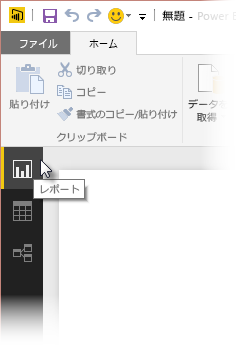
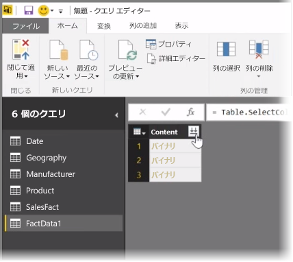
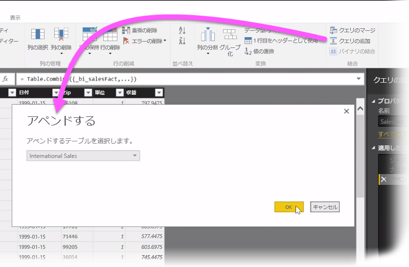
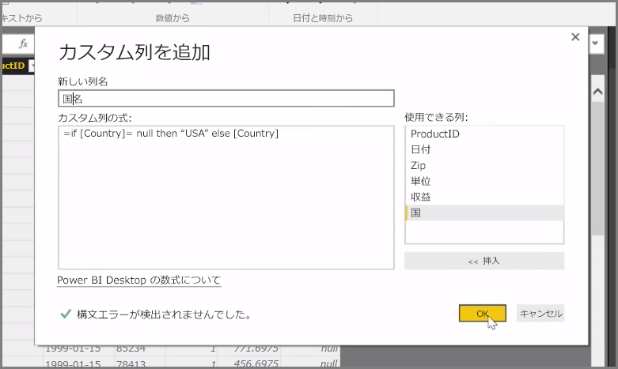

この記事では、**Power BI Desktop** の高度なデータ インポートとクリーニング手法について調査します。 **クエリ エディター**でデータを整形し、**Power BI Desktop** に取り込むと、そのデータをさまざまな方法で表示できます。 Power BI Desktop には 3 つのビューがあります。 **[レポート]** ビュー、 **[データ]** ビュー、 **[リレーションシップ]** ビューです。 各ビューを表示するには、キャンバスの左上にあるビューのアイコンを選択します。 次の図では、**レポート** ビューが選択されています。 アイコンの横にある黄色のバーは、アクティブなビューを示します。

ビューを変更するには、他の 2 つのアイコンのいずれかを選択するだけです。 アイコンの横にある黄色のバーは、アクティブなビューを示します。

Power BI Desktop は、モデリング プロセス中はいつでも、複数のソースのデータを 1 つのレポートに結合できます。 追加のソースを既存のレポートに追加するには、 **[ホーム]** リボンの **[クエリを編集]** を選択し、**クエリ エディター**で **[新しいソース]** を選択します。

**Power BI Desktop** には、[フォルダー] など、使用できるデータ ソースが他にも多数存在します。 フォルダーに接続すると、一連の Excel ファイルや CSV ファイルなど、複数のファイルのデータを一度にインポートできます。 選択したフォルダー内のファイルはバイナリ コンテンツとして**クエリ エディター**に表示され、 **[コンテンツ]** 列の上部にある二重矢印アイコンをクリックすると、その値が読み込まれます。

Power BI の最も便利なツールの 1 つが*フィルター*です。 たとえば、列の横にあるドロップダウン矢印を選択すると、テキスト フィルターのチェックリストが開きます。このフィルターは、モデルから値を削除するときに使用できます。

また、クエリをマージおよび追加して、複数のテーブル (またはフォルダー内のさまざまなファイルのデータ) を、必要なデータのみが含まれる 1 つのテーブルに変換することもできます。 **[クエリの追加]** ツールを使用すると、新しいテーブルのデータを既存のクエリに追加できます。 Power BI Desktop によってクエリの列が一致が試みられ、その後、ユーザーが**クエリ エディター**で必要に応じて調整できます。

最後に、 **[カスタム列の追加]** ツールにより、上級ユーザーには、強力な M 言語を使用してクエリ式をゼロから作成するオプションが提供されます。 M クエリ言語のステートメントに基づいてカスタム列を追加すると、望むとおりにデータを取得することができます。

