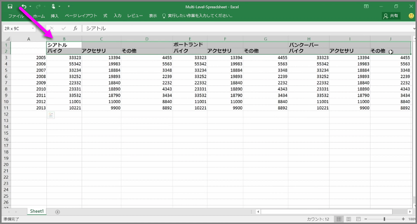
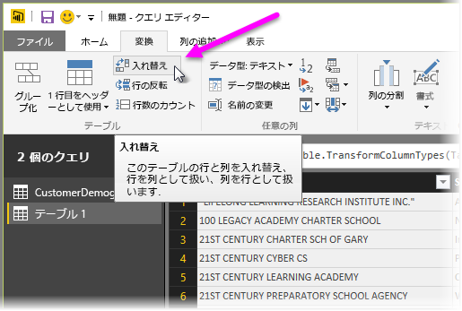
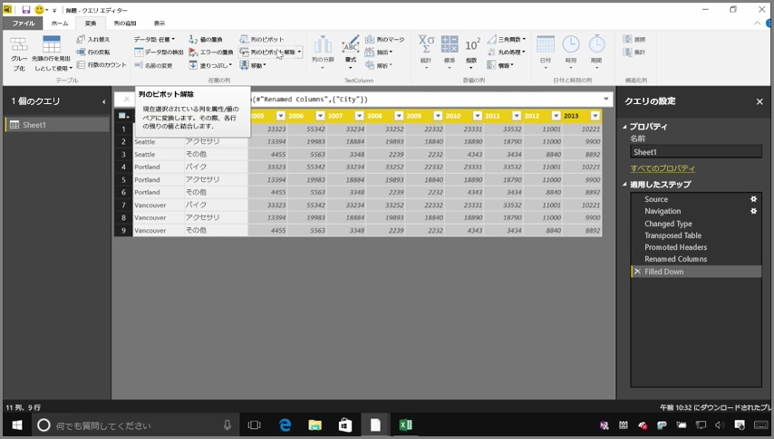
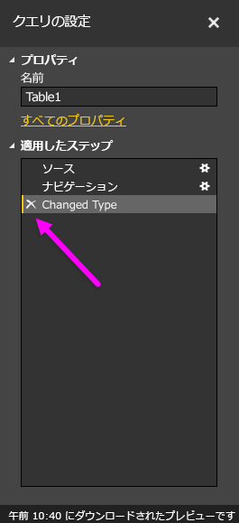
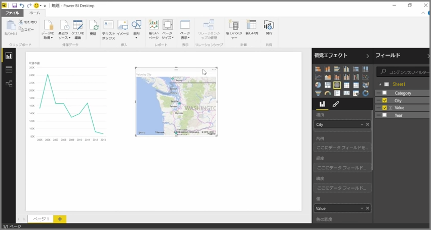

Power BI はほぼすべてのソースからデータをインポートできますが、視覚化エフェクトとモデリング ツールが列指向データには最適です。 Excel スプレッドシートによく見られるように、データが単列形式で書式設定されていない場合もありますが、視覚的には良く見えるテーブル レイアウトが、自動化されたクエリに最適とは限りません。 たとえば、次のスプレッドシートには、複数の列にまたがるヘッダーがあります。

幸い Power BI には、複数列のテーブルを使用できるデータセットにすばやく変換するツールがあります。

## データの入れ替え
たとえば、**クエリ エディター**で**入れ替え**を使用すると、データを反転できる (列を行に、行を列にすることができる) ため、操作できる書式にデータを分割できます。

ビデオの手順に従ってこの操作を数回行うと、Power BI でより使いやすい書式になるように、テーブルが整形されていきます。

## データの書式設定
また、インポートされたデータを Power BI が正しく分類、識別できるように、データの書式設定が必要な場合もあります。

*行をヘッダーに昇格して*ヘッダーを分割する、**[塗りつぶし]** を使用して *null* の値を特定の列の上下で見つかった値に変更する、**[列のピボット解除]** を実行するなど、いくつかの変換を使用すると、そのデータを Power BI で使用できるデータセットに最適化できます。

Power BI には、これらの変換を自分のデータで試してみて、どの種類のデータを Power BI で操作しやすい単票形式に変換するかを判断できます。 また、実行するすべての操作はクエリ エディターの [適用したステップ] セクションに記録されるため、変換が意図したとおりに機能しない場合は、ステップの横にある **x** をクリックするだけで元に戻すことができます。

## ビジュアルの作成
データを変換および最適化し、そのデータを Power BI で使用できる書式に変換すると、ビジュアルの作成を開始できます。

## 次の手順
**お疲れ様でした。** Power BI の**ガイド付き学習**コースのこのセクションが完了しました。 以上で Power BI Desktop に**データを取得**する方法と、そのデータを*整形*または*変換*する方法が分かったので、説得力のあるビジュアルを作成できるようになりました。

Power BI のしくみと、Power BI を*好みに合わせて*機能させる方法を学ぶための次の手順は、**モデリング**とは何かを理解することです。 既に学習したように、**データセット**は Power BI の基本的な構成要素ですが、データセットによっては、複雑でさまざまなデータ ソースに基づいている場合もあります。 また場合によっては、作成するデータセットに独自の特殊なタッチ (または*フィールド*) を追加する必要があります。

次のセクションでは、**モデリング**とその全体像についてさらに詳しく学習します。 では、次のセクションでお会いしましょう。

