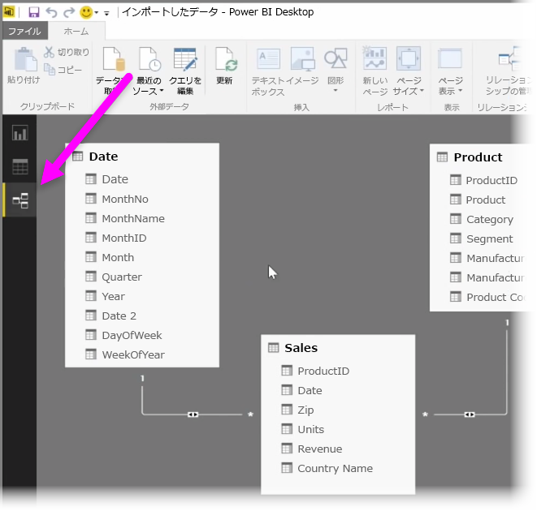
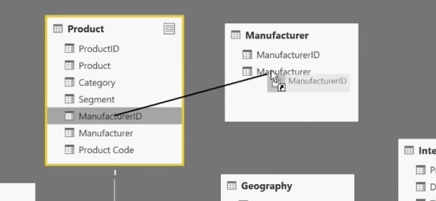
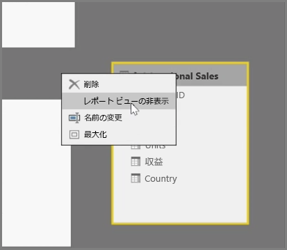
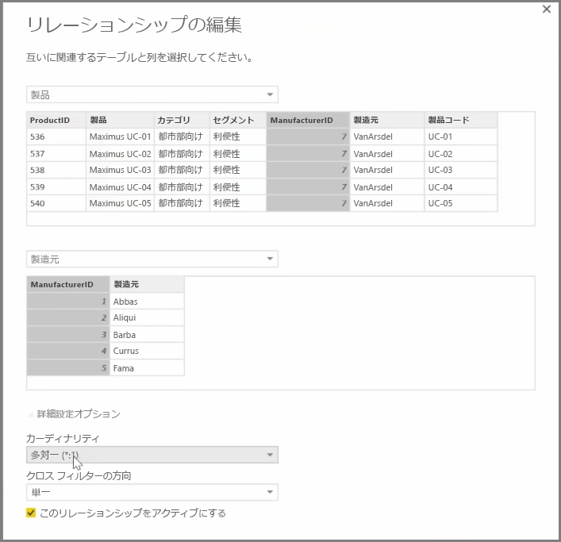

Power BI では、テーブルや要素間のリレーションシップを視覚的に設定することができます。 データを図形式で表示するには、画面の左側のレポート キャンバスの横にある**リレーションシップ ビュー**を使用します。

**リレーションシップ** ビューには、各テーブルとその列を表すブロックと、ブロックどうしをつなぐ、リレーションシップを表す線が表示されます。

リレーションシップは、簡単に追加および削除できます。 リレーションシップを削除するには、リレーションシップ上で右クリックし、**[削除]** を選択します。 リレーションシップを作成するには、テーブル間でリンクするフィールドをドラッグ アンド ドロップします。

テーブルまたは個々の列がレポートに表示されないようにするには、リレーションシップ ビューでテーブルまたは列を右クリックし、**[Hide in Report View (レポート ビューで非表示にする)]** を選択します。

データ リレーションシップのより詳細なビューを表示するには、**[ホーム]** タブの **[リレーションシップの管理]** を選択します。**[リレーションシップの管理]** ダイアログが開き、リレーションシップが視覚的な図ではなくリストとして表示されます。 ここで **[自動検出]** を選択すると、新しいデータまたは更新されたデータにおけるリレーションシップを見つけることができます。 リレーションシップを手動で編集するには、**[リレーションシップの管理]** ダイアログの **[編集]** を選択します。 このダイアログに用意されている高度なオプションを使用して、リレーションシップの*カーディナリティ*と*クロスフィルターの方向*を設定できます。

[カーディナリティ] では、*[Many to One (多対一)]* または *[One to One (一対一)]* のオプションを選択できます。 *[Many to One (多対一)]* は、ファクト対ディメンションの種類のリレーションシップです。たとえば、各製品が複数の行に記録されている売上テーブルを、製品がそれぞれ一意の行に記録されているテーブルと対応付けることができます。 *[One to One (一対一)]* は、通常、参照テーブル内の単一のエントリをリンクするために使用します。

既定では、リレーションシップは両方向のクロスフィルター処理用に設定されます。 一方向のみのクロスフィルター処理では、リレーションシップのモデル機能の一部が制限されます。

データ間に正確なリレーションシップを設定することで、複数のデータ要素にまたがる複雑な計算を作成できます。

