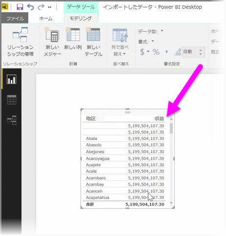
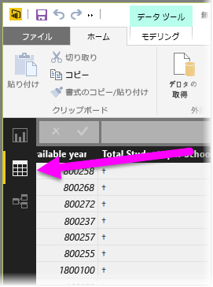
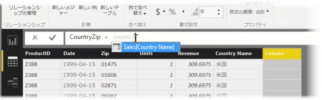
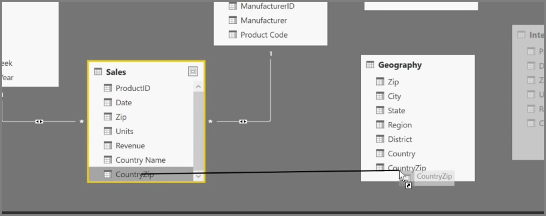
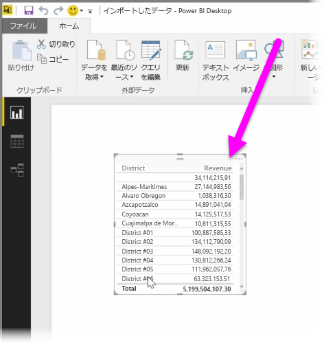

計算列の作成は、データを充実させて強化するための簡単な方法です。 **計算列**は、既存のデータの 2 つ以上の要素を変換したり組み合わせたりする計算式を定義することにより作成する新しい列です。 たとえば、2 つの列を 1 つに組み合わせることによって、新しい列を作成できます。

計算列を作成する合理的な理由の 1 つは、リレーションシップの確立に使用できる一意のフィールドが存在しない場合に、テーブル間のリレーションシップを確立することです。 単純なテーブルのビジュアルを Power BI Desktop で作成し、すべてのエントリに対して同じ値を取得した場合、リレーションシップがないことに気づきますが、基になるデータが異なることはわかっています。

データ内の一意のフィールドのリレーションシップを作成するには、たとえば「市外局番」列と「市内番号」列の値がデータ内に存在する場合は、それらを組み合わせることで「完全な電話番号」の新しい計算列を作成できます。 計算列は、モデルや視覚エフェクトをすばやく作成するのに役立つツールです。

計算列を作成するには、Power BI Desktop でレポート キャンバスの左側にある **[データ ビュー]** を選択します。

[モデリング] タブから **[新しい列]** を選択します。 これにより、DAX (Data Analysis Expressions) 言語を使用して計算式を入力できる数式バーが有効になります。 DAX は Excel にも見られる強力な数式言語で、堅牢な計算式を作成できます。 数式を入力すると、数式の作成を支援し高速化できるように、一致する数式やデータ要素が Power BI Desktop に表示されます。

数式を入力すると、Power BI の数式バーに、特定の DAX 関数と関連するデータ列の候補が表示されます。

各テーブルに計算列が作成されると、それらを一意のキーとして使用し、テーブル間のリレーションシップを確立できます。 **[リレーションシップ]** ビューに移動すると、あるテーブルから別のテーブルへフィールドをドラッグしてリレーションシップを作成できます。

**[レポート]** ビューに戻ると、地域別のさまざまな値が表示されています。

計算列を作成して実行できることは、ほかにもたくさんあります。

