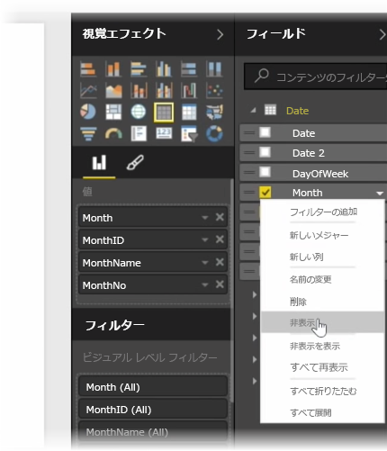
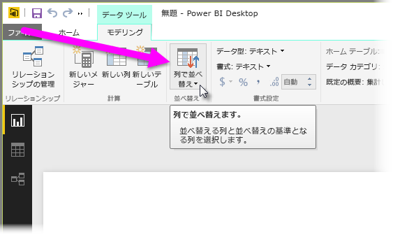
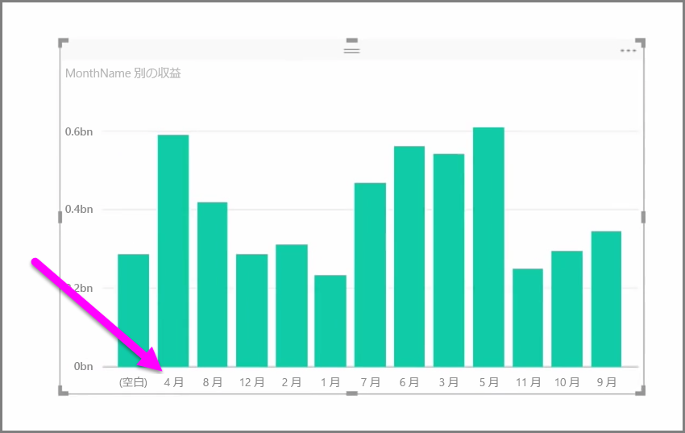
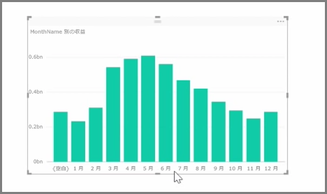

インポートしたデータには、余分な情報や既に別の列で利用できるデータなど、実際のレポート タスクや視覚化タスクには不要なフィールドが含まれていることがよくあります。 Power BI Desktop には、データを最適化するためのツールが用意されています。データを最適化することで、レポートやビジュアルを作成したり、共有レポートを表示したりするうえでの有用性が高まります。

## フィールドを非表示にする
Power BI Desktop の **[フィールド]** ウィンドウで列を非表示にするには、列を右クリックし、 **[非表示]** を選択します。 非表示にした列は削除されるわけではありません。このフィールドを既存の視覚エフェクトで使用している場合、データはそのビジュアルに存在したままになります。また、他の視覚エフェクトでそのデータを使用することもできます。非表示のフィールドは、 **[フィールド]** ウィンドウに表示されないだけです。

**リレーションシップ** ビューでテーブルを表示した場合、非表示のフィールドは淡色で示されます。繰り返しますが、データはこの状態でも利用でき、モデルに属しています。これらのデータは単に表示されていないだけです。 非表示のフィールドは、いつでも再表示できます。そのためには、フィールドを右クリックし、 **[unhide (再表示)]** を選択します。

## 別のフィールドによる視覚化データの並べ替え
**[モデリング]** タブに用意されている **[列で並べ替え]** ツールを使用すると、指定した順序でデータを表示できます。

一般的な例として、月の名前を含むデータは既定でアルファベット順に並べ替えられるため、"August" は "February" の前に来ます。

この場合、[フィールド] の一覧でフィールドを選択し、 **[モデリング]** タブの **[列で並べ替え]** 、並べ替えるフィールドの順に選択することで、問題を解決できます。 このケースでは、"MonthNo" カテゴリ並べ替えオプションを選択すると、意図したとおりに月が並べ替えられます。

別の方法として、フィールドのデータ型を設定して、情報が適切に処理されるように最適化できます。 レポート キャンバスからデータ型を変更するには、 **[フィールド]** ウィンドウで列を選択し、 **[Format (書式)]** ボックスの一覧でいずれかの書式設定オプションを選択します。 作成済みの、このフィールドを表示するすべてのビジュアルが自動的に更新されます。

