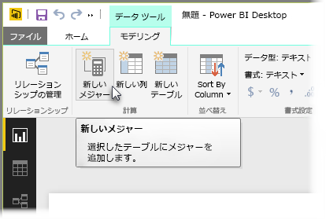
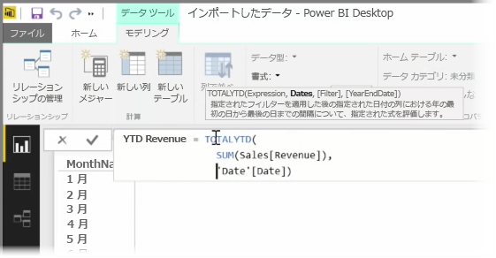
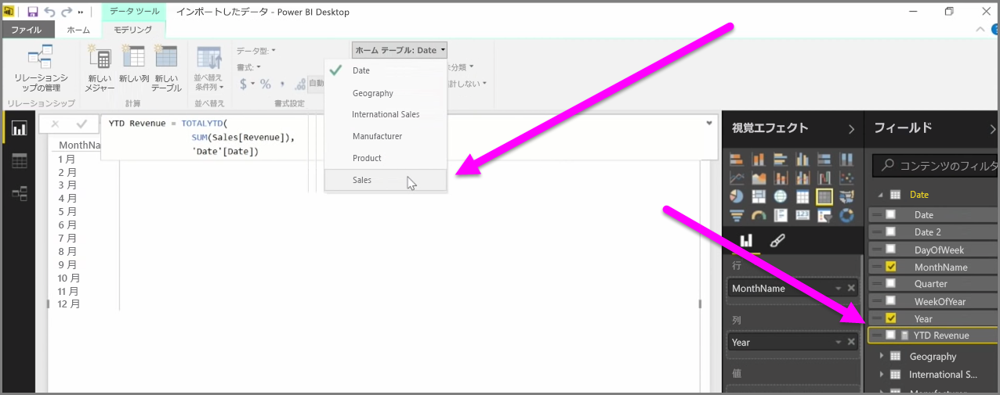

*メジャー*は、Power BI のデータ モデルに存在する計算式です。 メジャーを作成するには、 **[レポート]** ビューで **[モデリング]** タブから **[新しいメジャー]** をクリックします。

DAX の優れた機能の 1 つが Power BI の Data Analysis Expression 言語ですが、この言語には、特に *[年度累計]* や *[前年比]* などの時間ベースの計算式を中心とする、たくさんの便利な関数があります。 DAX で一度時刻のメジャーを定義すると、そのメジャーをデータ モデルから必要な数のフィールドにスライスできます。

Power BI では、定義された計算式を*メジャー*といいます。 *メジャー*を作成するには、 **[ホーム]** タブから **[新しいメジャー]** をクリックします。これにより数式バーが開きます。このバーにメジャーを定義する DAX 式を入力できます。 計算式を入力すると、関連する DAX 関数とデータ フィールドの候補が Power BI に表示されます。また、いくつかの構文と関数のパラメーターを説明するツールヒントを取得することもできます。

計算式が特に長い場合は、式エディターで **ALT + Enter** キーを押して改行をさらに追加できます。

新しいメジャーを作成すると、画面の右側にある **[フィールド]** ウィンドウで、テーブルの 1 つにそのメジャーが表示されます。 Power BI は現在選択しているテーブルに新しいメジャーを挿入します。このとき、メジャーがデータのどの位置にあるかは厳密に問題ではなく、メジャーを選択して **[ホーム テーブル]** ドロップダウン メニューを使用すれば簡単に移動できます。

メジャーの使用方法は他のテーブル列と同様で、レポート キャンバスまたは視覚エフェクトのフィールドにドラッグ アンド ドロップできます。 またメジャーは、スライサーとシームレスに統合してその場でデータをセグメント化できます。つまり、一度メジャーを定義すれば、さまざまな視覚エフェクトに使用できます。

**Calculate** DAX 関数は強力な関数で、あらゆる種類の便利な計算が可能になります。特に、財務報告やビジュアルに便利です。

