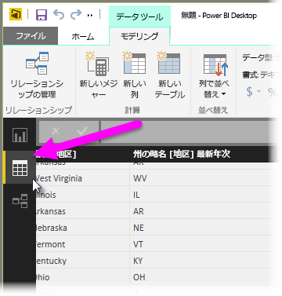
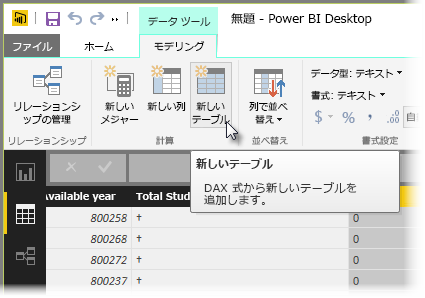

計算テーブルは、新しいモデリング機能の全範囲を表すことができる、DAX の 1 つの機能です。 たとえば、異なる種類のマージ結合を行う場合や、関数式の結果に基づいてその場で新しいテーブルを作成したりする場合は、計算テーブルを使用できます。

計算テーブルを作成するには、Power BI Desktop の**データ ビュー**を開きます。データ ビューは、レポート キャンバスの左側からアクティブ化できます。

[モデリング] タブの **[新しいテーブル]** を選択して、数式バーを開きます。

等号の左側に新しいテーブルの名前を入力し、右側にそのテーブルで使用する計算を入力します。 計算が完成すると、モデルの [フィールド] ウィンドウに新しいテーブルが表示されます。

作成した計算テーブルは、リレーションシップ、式、レポートで他のテーブルと同じように使用できます。

