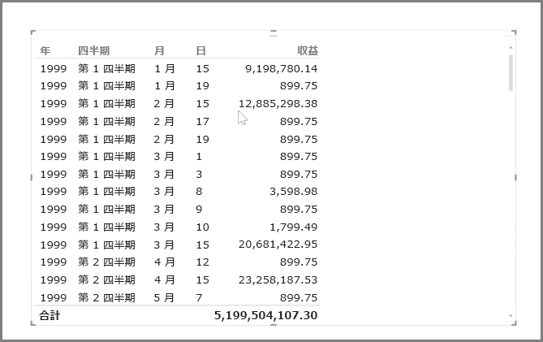
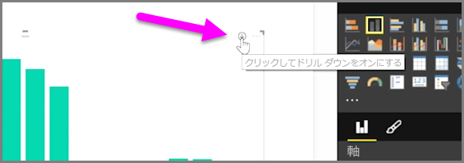
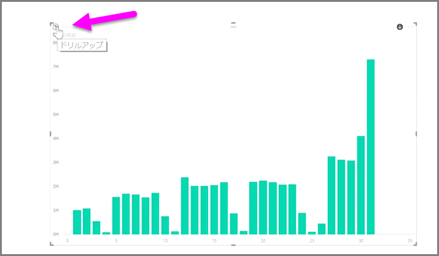
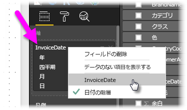

Power BI では、時間ベースのデータを簡単に分析できます。 Power BI Desktop のモデリング ツールでは生成されたフィールドが自動的に取り込まれるため、1 回クリックするだけで、年、四半期、月、および日にドリルダウンできます。  

日付フィールドを使用してレポートにテーブル視覚エフェクトを作成すると、Power BI Desktop によって期間別の分類が自動的に追加されます。 たとえば、**日付**テーブル内の 1 つの日付フィールドが、Power BI によって、次の図に示すように、年、四半期、月、日に自動的に分類されます。

視覚エフェクトではデータは既定で*年*レベルで表示されますが、ビジュアルの右上隅の **[ドリルダウン]** をオンにすることでこれを変更できます。

グラフの棒または線をクリックすると、時間階層の次のレベルまでドリルダウンします (たとえば、*年*から*四半期*)。 この操作を繰り返すことで、階層の最小レベルまでドリルダウンできます (この例では、*日*)。 時間階層の上のレベルに戻るには、ビジュアルの左上隅にある **[Drill Up (ドリル アップ)]** をクリックします。

選択した 1 つの期間ではなく、ビジュアルに表示されているすべてのデータにドリルダウンすることもできます。そのためには、ビジュアルの右上隅にある、二重の矢印で示された **[Drill All (すべてドリル)]** アイコンを使用します。

Power BI では、モデルに日付フィールドがあると時間階層ごとに異なるビューが自動的に生成されます。

日付階層を使わずに個別の日付に戻るには、**[フィールド]** ウェルで列の名前を右クリックし (次の図では、列の名前は *InvoiceDate* です)、表示されるメニューから **[日付の階層]** ではなく列名を選びます。 ビジュアルには、日付階層を使わずに、その列のデータに基づくデータが表示されます。 日付階層を使うように戻したい場合は、 再び右クリックして **[日付の階層]** を選ぶだけです。

## 次の手順
**お疲れ様でした。** Power BI の**ガイド付き学習**コースのこのセクションが完了しました。 データの*モデリング*について理解したところで、次の「**Visualizations (視覚エフェクト)**」セクションに進みましょう。

前述のとおり、このコースでは、Power BI の一般的なワークフローに従って、次の知識を習得します。

* **Power BI Desktop** にデータを取り込み、レポートを作成します。
* Power BI サービスに発行し、そこで新しい**視覚エフェクト**を作成したりダッシュボードを構築します。
* 他のユーザー、特に外出中のユーザーとダッシュボードを**共有**します。
* 共有したダッシュボードとレポートを、**Power BI Mobile** アプリで表示して操作します。

これらの作業をすべて自分で行うとは限りませんが、ダッシュボードの作成方法やデータへの接続方法について*理解*できます。また、このコースを修了すると、独自のダッシュボードを作成できるようになります。

次のセクションを参照してください。

