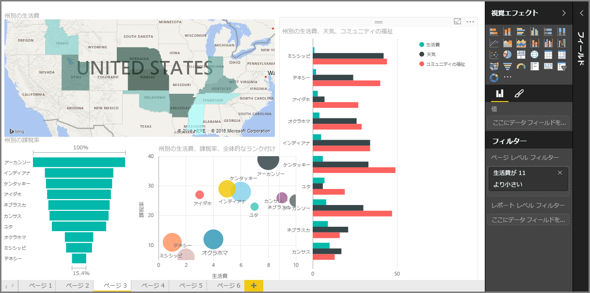

Power BI の**ガイド付き学習**コースの「**視覚化**」セクションへようこそ。 Power BI が提供する数多くの視覚エフェクトについての楽しく興味深い、有意義なツアーを始めましょう。 しかもこれがすべてではありません。視覚エフェクトは常に増え続けているのです。

もちろん、視覚エフェクトはすべてのビジネス インテリジェンス業務の最終結果です。 データを取得し、説得力と洞察に富んだ方法で提供し、何が際立っているのかを*表示*します。また、Power BI はさまざまな説得力のあるビジュアルを備えており、ほぼ無制限にカスタマイズできます。これは重要なセクションです。

このセクションに多くのトピックがあるように見えるかもしれませんが、心配は無用です。各トピックは簡潔で、お察しのとおりビジュアルに溢れ、簡単に学習できます。 このセクションを楽しみながら進み、これらのビジュアルを使ってどのように自分のデータを表示できるか想像することができます。

視覚化の柱である、なじみ深いシンプルな視覚エフェクトから始め、その詳細について学習します。 次に、より高度なもの、またはあまり一般的ではないものに進み、あなたのレポート作成ツールボックスの中身を増やしていきます。

豊富な学習内容をお楽しみください。

## Power BI での視覚化の概要
データの視覚化は Power BI の中核のひとつであり、このコースで以前定義したように基本的な構成要素です。視覚エフェクトの作成は、分析情報を取得して共有する最も簡単な方法です。

Power BI ではさまざまな視覚エフェクトが既定で利用可能です。単純な縦棒グラフから円グラフやマップ、さらにはウォーターフォール、じょうご、ゲージなど、より難解な種類の視覚エフェクトも利用できます。 また、Power BI Desktop では図形や画像などのページ書式設定ツールを幅広く提供しており、レポートを活性化させるのに役立ちます。

