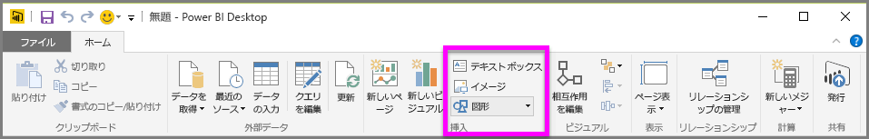
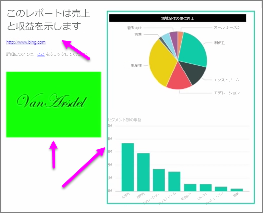

データ バインドされたビジュアルとともに、テキスト ボックス、画像、および図形などといった、レポートのビジュアル デザインを向上させるための静的な要素を追加することもできます。 視覚要素を追加するには、**[テキスト ボックス]**、**[画像]**、または **[ホーム]** タブから **[図形]** を選択します。

**テキスト ボックス** は、大きいタイトル、キャプション、または短い段落の情報を、ビジュアル化と共に表示するための最適な方法です。 テキスト ボックスにはリンクを含めることができます。このリンクは、書き込まれた URL を通して、またはアンカー語句を強調表示し、テキスト ボックスのオプション バーのリンク シンボルを選択することで含めることができます。 テキスト ボックスに URL を含めることができ、Power BI は自動的にリンクを検出し、ライブにします。

**[画像]** を選択すると、ファイル ブラウザーが開かれ、お使いのコンピューターまたは他のネットワークに接続されたソースから画像を選択できます。 既定では、レポート内の画像サイズを変更すると縦横比は維持されますが、ビジュアルの書式設定オプションで無効化にすることができます。

**図形** には、長方形や矢印を含む 5 つの異なる形式のオプションがあります。 図形は、非透過、または透過で色つきの枠のものがあります。 (後者は、視覚化のグループの周囲に罫線を作成するために便利です。)

